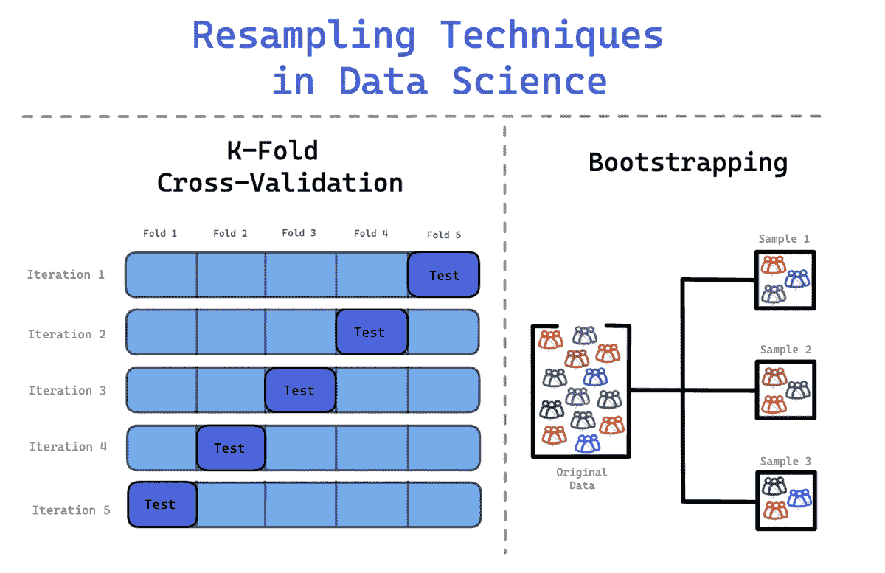

# 数据科学中重新抽样技术的作用

> 原文：[`www.kdnuggets.com/2023/02/role-resampling-techniques-data-science.html`](https://www.kdnuggets.com/2023/02/role-resampling-techniques-data-science.html)

作者提供的图片

在处理模型时，你需要记住不同的算法在接收数据时有不同的学习模式。这是一种直观的学习方式，帮助模型学习给定数据集中的模式，这称为训练模型。

* * *

## 我们的前三个课程推荐

 1\. [谷歌网络安全证书](https://www.kdnuggets.com/google-cybersecurity) - 快速进入网络安全职业道路。

 2\. [谷歌数据分析专业证书](https://www.kdnuggets.com/google-data-analytics) - 提升你的数据分析能力

 3\. [谷歌 IT 支持专业证书](https://www.kdnuggets.com/google-itsupport) - 支持你的组织 IT 部门

* * *

然后，模型将在测试数据集上进行测试，这是模型之前未见过的数据集。你希望达到一个最佳性能水平，使模型在训练数据集和测试数据集上都能产生准确的输出。

你可能也听说过验证集。这是一种将数据集分成两个部分的方法：训练数据集和测试数据集。数据的第一部分将用于训练模型，而第二部分将用于测试模型。

然而，验证集方法存在一些缺点。

模型将学习到训练数据集中的所有模式，但可能错过了测试数据集中相关的信息。这使得模型缺乏可以提高其整体性能的重要信息。

另一个缺点是训练数据集中可能存在异常值或数据错误，模型会学习到这些内容。这成为模型的知识库的一部分，并将在第二阶段测试时应用。

那我们可以做什么来改进这一点？重新抽样。

# 什么是重新抽样？

重新抽样是一种涉及反复从训练数据集中抽取样本的方法。这些样本随后被用来重新拟合特定的模型，以获取更多关于拟合模型的信息。目的是收集更多关于样本的信息，提高准确性并估计不确定性。

例如，如果你在查看线性回归拟合并希望检查其变异性，你将反复使用训练数据中的不同样本，并对每个样本进行线性回归拟合。这将允许你检查结果如何因不同样本而异，并获取新的信息。

重采样的显著优势在于，你可以反复从同一总体中抽取小样本，直到你的模型达到最佳性能。通过能够重复使用相同的数据集，而不必寻找新数据，你将节省大量时间和金钱。

## 欠采样和过采样

如果你处理的是高度不平衡的数据集，重采样是一种可以帮助你应对的方法。

+   欠采样是当你从多数类中删除样本，以提供更多平衡。

+   过采样是当你因为收集的数据不足而重复少数类的随机样本。

然而，这些方法也有其缺点。欠采样中的样本删除可能导致信息丢失，而少数类的随机样本重复可能导致过拟合。

在数据科学中，常用的两种重采样方法是：

1.  自助法

1.  交叉验证

## 自助法

你可能会遇到不符合典型正态分布的数据集。因此，可以应用自助法来检查数据集中的隐藏信息和分布。

使用自助法时，抽取的样本会被替换，而未包含在样本中的数据则用于测试模型。这是一种灵活的统计方法，可以帮助数据科学家和机器学习工程师量化不确定性。

该过程包括

1.  从数据集中反复抽取样本观察值

1.  替换这些样本以确保原始数据集保持相同的大小。

1.  一个观察值可以出现多次，也可以完全不出现。

你可能听说过集成技术——Bagging。它是 Bootstrap Aggregation 的缩写，将自助法和集成结合起来形成一个集成模型。它创建了多个原始训练数据集，然后将这些数据集汇总以得出最终预测。每个模型都学习前一个模型的错误。

自助法的一个优点是，与上述的训练-测试划分方法相比，它们的方差较低。

## 交叉验证

当你反复随机划分数据集时，样本可能会出现在训练集或测试集中。这可能不幸地对你的模型造成不平衡的影响，影响预测的准确性。

为了避免这种情况，你可以使用 K 折交叉验证来更有效地划分数据。在这个过程中，数据被分成 k 个相等的集合，其中一个集合定义为测试集，其余集合用于训练模型。这个过程将持续进行，直到每个集合都作为测试集并且所有集合都经过训练阶段。

该过程包括：

1.  数据被划分为 k 折。例如，将数据集划分为 10 折——10 个相等的集合。

1.  在第一次迭代中，模型在（k-1）个集合上进行训练，并在剩余的一个集合上进行测试。例如，模型在（10-1 = 9）个集合上进行训练，在剩下的 1 个集合上进行测试。

1.  这个过程会重复进行，直到所有的折叠都充当了测试阶段的剩余 1 组。

这使每个样本都能得到平衡的表示，确保所有数据都被用来改进模型的学习并测试模型的性能。

# 结论

在本文中，你将了解什么是重采样，以及如何通过三种不同的方式对数据集进行采样：训练-测试分割、自助法和交叉验证。

这些方法的总体目标是帮助模型以有效的方式吸收尽可能多的信息。确保模型成功学习的唯一方法是对数据集中各种数据点进行训练。

重采样是预测建模阶段的一个重要元素；确保输出准确、高性能的模型和有效的工作流程。

**[Nisha Arya](https://www.linkedin.com/in/nisha-arya-ahmed/)** 是一位数据科学家和自由技术写作人。她特别感兴趣于提供数据科学职业建议或教程，以及数据科学相关的理论知识。她还希望探索人工智能如何能够或正在促进人类生命的长寿。作为一名热心的学习者，她寻求拓宽自己的技术知识和写作技能，同时帮助指导他人。

### 更多相关话题

+   [改进数据可视化：掌握 Pandas 中的基于时间的重采样](https://www.kdnuggets.com/revamping-data-visualization-mastering-timebased-resampling-in-pandas)

+   [开源工具在加速数据科学进步中的作用](https://www.kdnuggets.com/2023/05/role-open-source-tools-accelerating-data-science-progress.html)

+   [获得数据工程师职位：免费课程和认证](https://www.kdnuggets.com/landing-a-data-engineer-role-free-courses-and-certifications)

+   [MLOps 工程师在组织中的角色](https://www.kdnuggets.com/2023/04/role-mlops-engineer-organization.html)

+   [人工智能在数字营销中的作用](https://www.kdnuggets.com/the-role-of-ai-in-digital-marketing)

+   [KDnuggets 新闻，8 月 31 日：完整的数据科学学习路线图……](https://www.kdnuggets.com/2022/n35.html)
