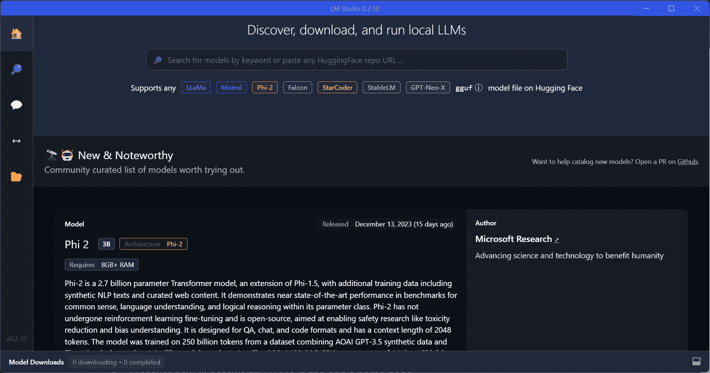
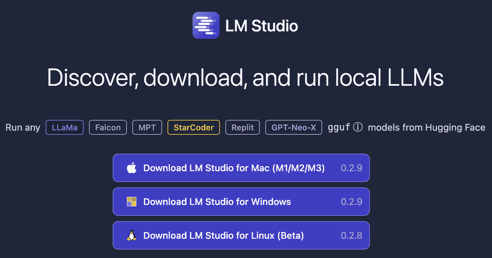
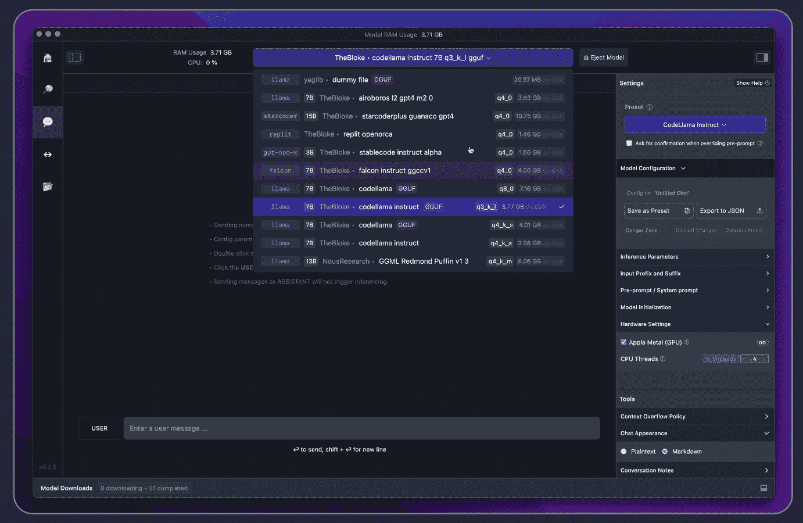
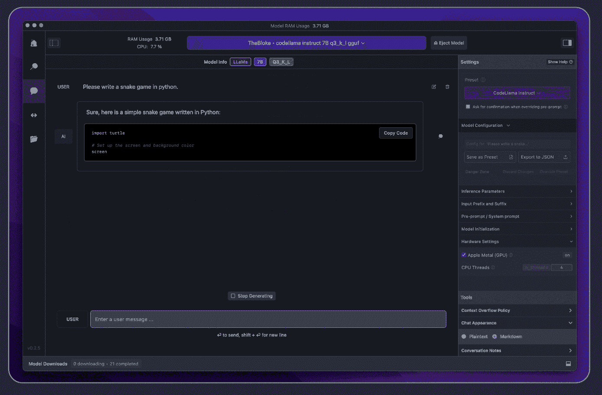

# 在 LM Studio 中本地运行 LLM

> 原文：[`www.kdnuggets.com/run-an-llm-locally-with-lm-studio`](https://www.kdnuggets.com/run-an-llm-locally-with-lm-studio)

编辑器截图

这已经是一个有趣的 12 个月。大型语言模型（LLMs）成为了所有技术相关事物的前沿。您可以拥有像 ChatGPT、Gemini 等 LLMs。

* * *

## 我们的 Top 3 课程推荐

 1\. [Google 网络安全证书](https://www.kdnuggets.com/google-cybersecurity) - 快速迈入网络安全职业快车道。

 2\. [Google 数据分析专业证书](https://www.kdnuggets.com/google-data-analytics) - 提升您的数据分析能力

 3\. [Google IT 支持专业证书](https://www.kdnuggets.com/google-itsupport) - 支持您的 IT 组织

* * *

这些 LLMs 目前在云端运行，这意味着它们在别人的计算机上运行。如果某物在别处运行，您可以想象它有多昂贵。因为如果便宜的话，为什么不在您自己的计算机上本地运行呢？

但现在情况已经完全改变。您现在可以使用[LM Studio](https://lmstudio.ai/)运行不同的 LLMs。

# LM Studio 是什么？

LM Studio 是一个工具，您可以用来在本地和开源 LLMs 上进行实验。您可以在笔记本电脑上运行这些 LLMs，完全脱机。有两种方式可以发现、下载和在本地运行这些 LLMs：

+   通过应用内的聊天界面

+   兼容 OpenAI 的本地服务器

您只需从[HuggingFace](https://huggingface.co/)仓库下载任何兼容的模型文件，一切搞定！

那么我该如何开始呢？

## LM Studio 要求

在您开始深入了解本地发现所有 LLMs 之前，您需要满足以下最低硬件/软件要求：

+   M1/M2/M3 Mac

+   Windows PC 需要支持 AVX2 的处理器（Linux 版本正在测试中）

+   建议使用 16GB 以上的 RAM

+   对于 PC，建议使用 6GB 以上的 VRAM

+   支持 NVIDIA/AMD GPU

如果您具备这些条件，您就可以开始了！

那么，具体步骤是什么？

# 如何使用 LM Studio

您的第一步是下载适用于 Mac、Windows 或 Linux 的 LM Studio，您可以在[这里](https://lmstudio.ai/)进行下载。该下载大约有 400MB，因此根据您的互联网连接速度，可能需要一段时间。

您的下一步是选择要下载的模型。一旦 LM Studio 启动，点击放大镜以浏览可用模型选项。再次注意，这些模型可能很大，因此下载可能需要一些时间。

下载模型后，点击左侧的气泡图标，选择你的模型以加载。

准备好闲聊了吗！

就是这样，本地设置 LLM 这么快且简单。如果你想加快响应时间，可以通过右侧启用 GPU 加速来实现。

# 总结一下

你看，这么快就完成了？很快吧。

如果你担心数据收集，值得知道的是，本地使用 LLM 的主要原因是隐私。因此，LM Studio 正是为了这一点而设计的！

尝试一下，并在评论中告诉我们你的想法！

****[Nisha Arya](https://www.linkedin.com/in/nisha-arya-ahmed/)**** 是一位数据科学家、自由技术撰稿人，以及 KDnuggets 的编辑和社区经理。她特别关注提供数据科学职业建议或教程及理论知识。Nisha 涉猎广泛，并希望探索人工智能如何有助于人类寿命的延长。作为一个热心的学习者，Nisha 希望拓宽她的技术知识和写作技能，同时帮助指导他人。

### 更多相关话题

+   [免费使用 Lightning AI Studio](https://www.kdnuggets.com/using-lightning-ai-studio-for-free)

+   [使用 Jupysql 和 GitHub Actions 安排和运行 ETL](https://www.kdnuggets.com/2023/05/schedule-run-etls-jupysql-github-actions.html)

+   [了解如何在设备上仅需几步即可运行 Alpaca-LoRA](https://www.kdnuggets.com/2023/05/learn-run-alpacalora-device-steps.html)

+   [使用 PyTest 入门：轻松编写和运行 Python 测试](https://www.kdnuggets.com/getting-started-with-pytest-effortlessly-write-and-run-tests-in-python)

+   [如何让 Python 代码运行得非常快](https://www.kdnuggets.com/2021/06/make-python-code-run-incredibly-fast.html)

+   [用 llamafile 在 5 个简单步骤中分发和运行 LLM](https://www.kdnuggets.com/distribute-and-run-llms-with-llamafile-in-5-simple-steps)
