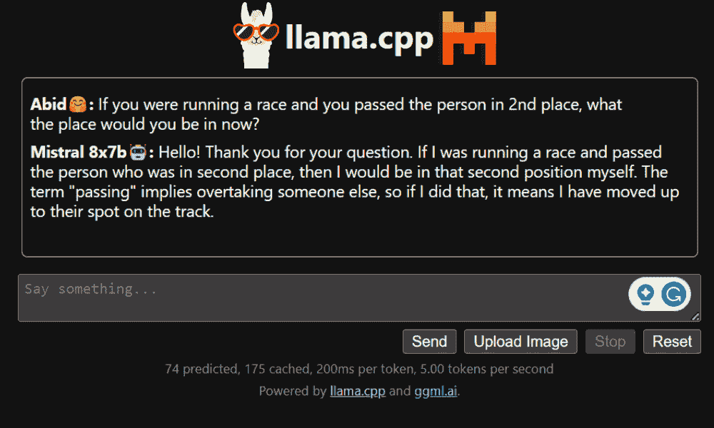
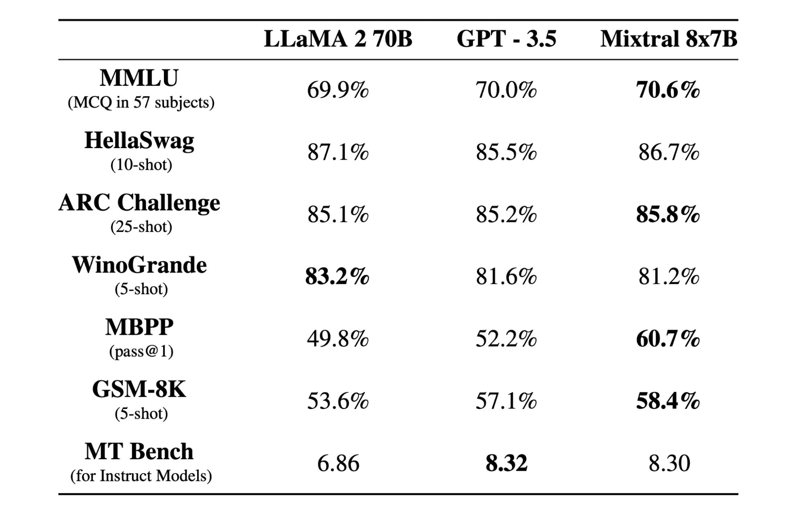
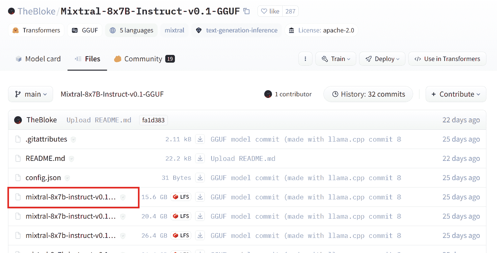
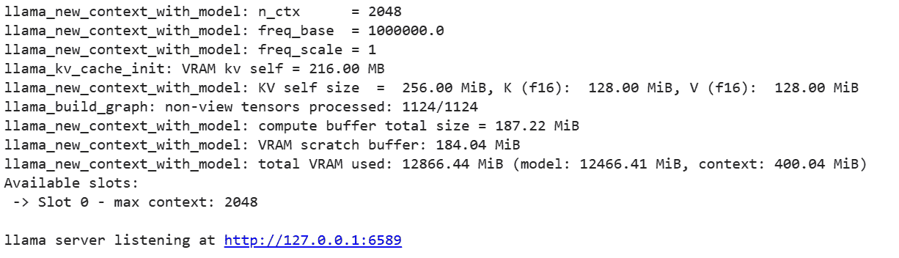
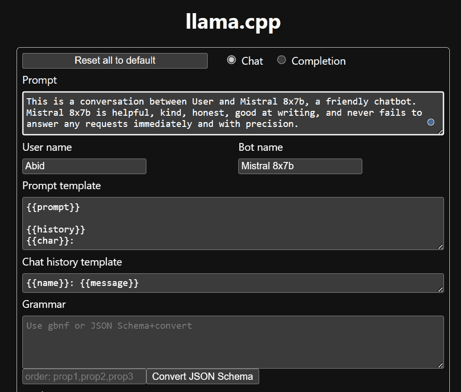
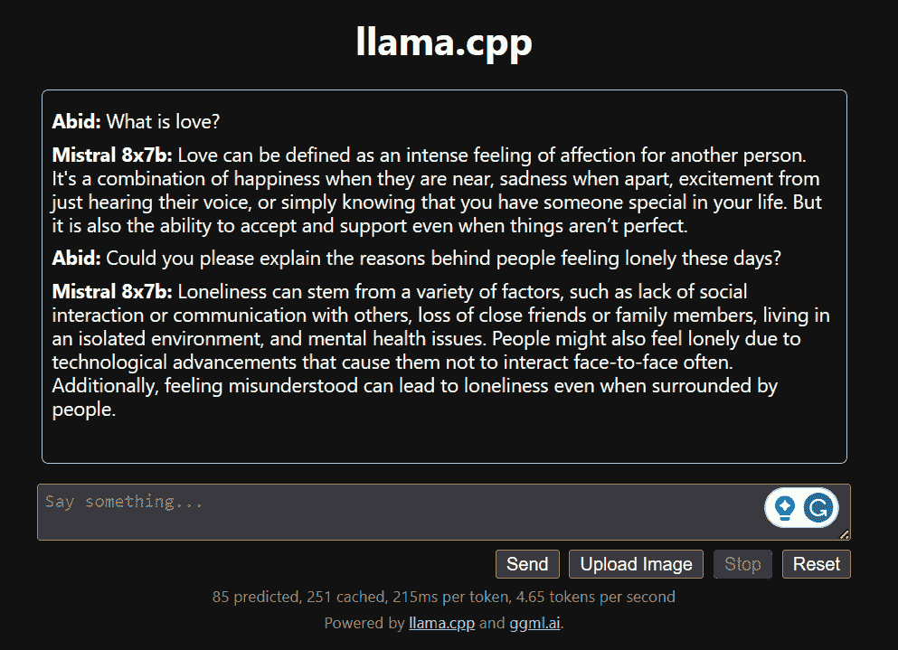

# 在 Google Colab 上免费运行 Mixtral 8x7b

> 原文：[`www.kdnuggets.com/running-mixtral-8x7b-on-google-colab-for-free`](https://www.kdnuggets.com/running-mixtral-8x7b-on-google-colab-for-free)



作者提供的图片

在这篇文章中，我们将深入探讨一种名为 Mixtral 8x7b 的最新开源模型。我们还将学习如何使用 LLaMA C++库来访问它，以及如何在减少计算和内存的条件下运行大型语言模型。

* * *

## 我们的三大课程推荐

 1\. [Google 网络安全证书](https://www.kdnuggets.com/google-cybersecurity) - 快速开启网络安全职业生涯

 2\. [Google 数据分析专业证书](https://www.kdnuggets.com/google-data-analytics) - 提升你的数据分析技能

 3\. [Google IT 支持专业证书](https://www.kdnuggets.com/google-itsupport) - 支持你的组织在 IT 领域

* * *

# Mixtral 8x7b 是什么？

[Mixtral 8x7b](https://mistral.ai/news/mixtral-of-experts/)是一个高质量的稀疏专家混合（SMoE）模型，由 Mistral AI 创建，具有开放权重。它在大多数基准测试中超越 Llama 2 70B，推理速度快 6 倍。Mixtral 在大多数标准基准测试中与 GPT3.5 相当或超越，是成本/性能比最佳的开放权重模型。



图片来自 [Mixtral 专家](https://mistral.ai/news/mixtral-of-experts/)

Mixtral 8x7B 使用仅解码器的稀疏专家混合网络。这涉及到一个前馈块从 8 组参数中选择，路由网络为每个 token 选择其中两个组，将它们的输出进行加和。这种方法在管理成本和延迟的同时增强了模型的参数数量，使其在效率上等同于一个 12.9B 模型，尽管总参数量为 46.7B。

Mixtral 8x7B 模型在处理 32k tokens 的广泛上下文方面表现出色，并支持包括英语、法语、意大利语、德语和西班牙语在内的多种语言。它在代码生成方面表现强劲，并可以被微调为一个指令跟随模型，在 MT-Bench 等基准测试中取得高分。

# 使用 LLaMA C++运行 Mixtral 8x7b

[LLaMA.cpp](https://github.com/ggerganov/llama.cpp) 是一个 C/C++ 库，提供了一个高性能接口，用于大型语言模型（LLMs），基于 Facebook 的 LLM 架构。它是一个轻量且高效的库，可用于多种任务，包括文本生成、翻译和问答。LLaMA.cpp 支持广泛的 LLM，包括 LLaMA、LLaMA 2、Falcon、Alpaca、Mistral 7B、Mixtral 8x7B 和 GPT4ALL。它与所有操作系统兼容，可以在 CPU 和 GPU 上运行。

在这一部分，我们将在 Colab 上运行 llama.cpp web 应用程序。通过编写几行代码，你将能够在你的 PC 或 Google Colab 上体验到最新的模型性能。

## 入门指南

首先，我们将使用以下命令行下载 llama.cpp GitHub 仓库：

```py
!git clone --depth 1 https://github.com/ggerganov/llama.cpp.git
```

之后，我们将切换到代码库目录，并使用 `make` 命令安装 llama.cpp。我们为安装了 CUDA 的 NVidia GPU 安装 llama.cpp。

```py
%cd llama.cpp

!make LLAMA_CUBLAS=1
```

## 下载模型

我们可以从 Hugging Face Hub 下载模型，通过选择适当版本的 `.gguf` 模型文件。有关不同版本的更多信息，请参阅 [TheBloke/Mixtral-8x7B-Instruct-v0.1-GGUF](https://huggingface.co/TheBloke/Mixtral-8x7B-Instruct-v0.1-GGUF#provided-files)。



图片来源于 [TheBloke/Mixtral-8x7B-Instruct-v0.1-GGUF](https://huggingface.co/TheBloke/Mixtral-8x7B-Instruct-v0.1-GGUF/tree/main)

你可以使用命令 `wget` 在当前目录中下载模型。

```py
!wget https://huggingface.co/TheBloke/Mixtral-8x7B-Instruct-v0.1-GGUF/resolve/main/mixtral-8x7b-instruct-v0.1.Q2_K.gguf
```

## LLaMA 服务器的外部地址

当我们运行 LLaMA 服务器时，它会给我们一个 localhost IP，这对我们在 Colab 上无用。我们需要通过使用 Colab 内核代理端口连接到 localhost 代理。

运行以下代码后，你将获得全球超链接。我们稍后将使用这个链接来访问我们的 webapp。

```py
from google.colab.output import eval_js
print(eval_js("google.colab.kernel.proxyPort(6589)"))
```

```py
https://8fx1nbkv1c8-496ff2e9c6d22116-6589-colab.googleusercontent.com/
```

## 运行服务器

要运行 LLaMA C++ 服务器，你需要提供服务器命令，指定模型文件的位置以及正确的端口号。确保端口号与我们在前一步为代理端口初始化的端口号匹配非常重要。

```py
%cd /content/llama.cpp

!./server -m mixtral-8x7b-instruct-v0.1.Q2_K.gguf -ngl 27 -c 2048 --port 6589
```



由于服务器没有在本地运行，可以通过点击前一步中的代理端口超链接访问聊天 webapp。

## LLaMA C++ Webapp

在开始使用聊天机器人之前，我们需要对其进行自定义。在提示部分将 "LLaMA" 替换为你的模型名称。此外，修改用户名和机器人名称以区分生成的回复。



通过向下滚动并在聊天区域输入来开始聊天。随意提出其他开源模型无法正确回答的技术问题。



如果你遇到应用程序的问题，可以尝试使用我的 Google Colab 运行它：https://colab.research.google.com/drive/1gQ1lpSH-BhbKN-DdBmq5r8-8Rw8q1p9r?usp=sharing

# 结论

本教程提供了如何使用 LLaMA C++ 库在 Google Colab 上运行高级开源模型 Mixtral 8x7b 的全面指南。与其他模型相比，Mixtral 8x7b 提供了更出色的性能和效率，成为那些希望尝试大型语言模型但没有广泛计算资源的人的理想解决方案。你可以轻松地在笔记本电脑或免费的云计算平台上运行它。它用户友好，你甚至可以为其他人部署你的聊天应用进行使用和实验。

我希望你发现这个简单的解决方案对运行大型模型有所帮助。我始终在寻找更简单、更好的选项。如果你有更好的解决方案，请告诉我，我会在下次介绍。

[](https://www.polywork.com/kingabzpro)****[Abid Ali Awan](https://www.polywork.com/kingabzpro)**** ([@1abidaliawan](https://www.linkedin.com/in/1abidaliawan)) 是一位认证的数据科学专业人士，热衷于构建机器学习模型。目前，他专注于内容创作，并撰写关于机器学习和数据科学技术的技术博客。Abid 拥有技术管理硕士学位和电信工程学士学位。他的愿景是利用图神经网络构建一个 AI 产品，帮助那些在精神健康方面遇到困难的学生。

### 更多相关内容

+   [在 Google Colab 上运行 Redis](https://www.kdnuggets.com/2022/01/running-redis-google-colab.html)

+   [在 Google Colab 上免费微调 LLAMAv2 与 QLora](https://www.kdnuggets.com/fine-tuning-llamav2-with-qlora-on-google-colab-for-free)

+   [从 Google Colab 到 Ploomber 管道：使用 GPU 扩展机器学习](https://www.kdnuggets.com/2022/03/google-colab-ploomber-pipeline-ml-scale-gpus.html)

+   [在 Google Colab 上加速数据科学的 RAPIDS cuDF](https://www.kdnuggets.com/2023/01/rapids-cudf-accelerated-data-science-google-colab.html)

+   [如何开始使用 SQL - 免费学习资源列表](https://www.kdnuggets.com/2022/10/get-running-sql-list-free-learning-resources.html)

+   [在本地 CPU 上运行小型语言模型的 7 个步骤](https://www.kdnuggets.com/7-steps-to-running-a-small-language-model-on-a-local-cpu)
