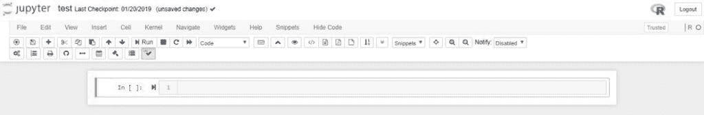
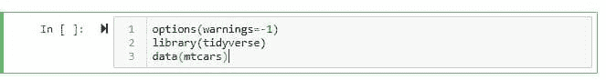
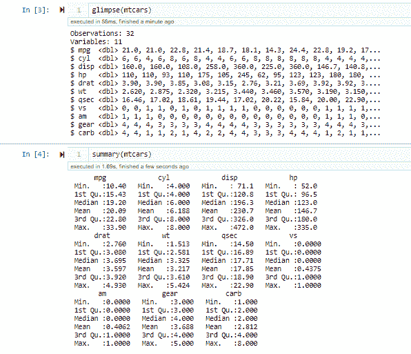
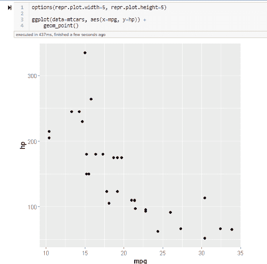
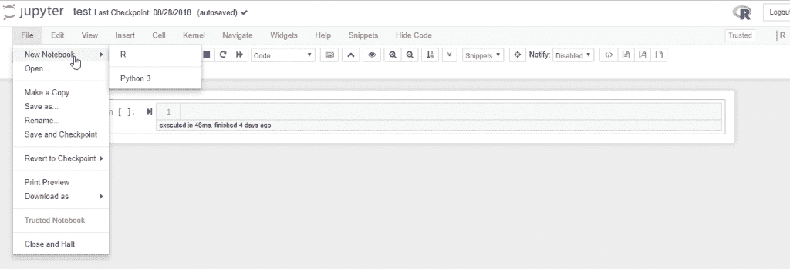
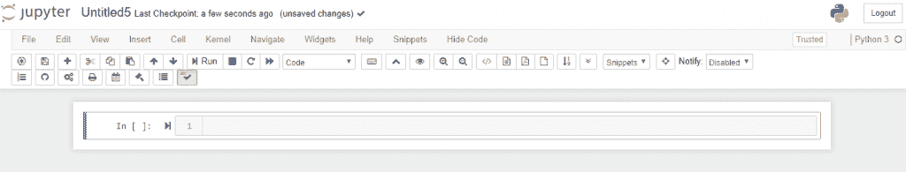

# 在 Jupyter 中运行 R 和 Python

> 原文：[`www.kdnuggets.com/2019/02/running-r-and-python-in-jupyter.html`](https://www.kdnuggets.com/2019/02/running-r-and-python-in-jupyter.html)

 评论

Jupyter 项目始于 2014 年，作为一种面向交互式和科学计算的倡议。

它包含一个 Python 内核，以便用户可以拥有一个新的交互式 IDE 来使用 Python。

* * *

## 我们的前三个课程推荐

 1\. [Google 网络安全证书](https://www.kdnuggets.com/google-cybersecurity) - 快速进入网络安全职业道路。

 2\. [Google 数据分析专业证书](https://www.kdnuggets.com/google-data-analytics) - 提升你的数据分析技能

 3\. [Google IT 支持专业证书](https://www.kdnuggets.com/google-itsupport) - 支持你的组织的 IT

* * *

它基于 IPython 计算环境。2015 年，IRkernel 也被添加了对 R 的支持。这使得用户可以使用 R 和 Python 运行内核。

### R 内核安装

如果你使用的是 Windows，下面的方法是可以的。如果你使用的是基于 Unix 的机器（OSX 或 Linux），**命令必须在终端中运行**。

最好的方法是安装 [Anaconda](https://www.anaconda.com/download/)，它会自动安装 Python、R 和 Jupyter Notebooks。

1.  在安装 Anaconda 后，打开 Anaconda 提示符并输入 `install.packages(c(repr, IRdisplay, evaluate, crayon, pbdZMQ, devtools, uuid, digest), type=source)`。***务必在终端中执行此命令，以便直接从 R 执行，而不是通过 IDE。***

1.  在步骤 1 后，运行 `devtools::install_github(IRkernel/IRkernel)`，最后运行 `IRkernel::installspec(user=FALSE)`。

1.  进入 Anaconda Navigator，打开 Jupyter Notebook，或者在 Anaconda 提示符中输入 `jupyter notebook`。在 *New* 下，你应该能找到 *R* 内核。点击它以在 Jupyter 环境中开始运行 R。

***需要注意的是，由于安装 Anaconda 是安装 Jupyter Notebook 的最简单和最快捷的方式，Anaconda 安装的 R 版本滞后于最新发布版本。你不能像从 R 网站单独安装时那样更新 Anaconda 中的 R。这是因为 Anaconda 中的所有程序都由 Conda 包管理器管理，Anaconda 需要更新其默认的 R 版本，然后用户才能安装。因此，在 Jupyter Notebooks 中运行 R 时，某些包可能由于包更新频率比 R 更新频率更高而无法正常工作（尽管这很少见）。***

### 在 Jupyter 中运行 R

现在我们已经在 Jupyter 中安装了 R，我们可以像在任何 R IDE 中一样开始使用 R 代码。

1.  在上述步骤 3 之后，您将被带到一个新标签页，R 内核已准备好：

    新的 R 内核

1.  接下来，为您的内核命名，以便以后能够识别它。只需点击显示“无标题”的地方，您就可以给它命名。之后，您就可以开始在 Jupyter 中使用 R 了。

1.  在第一个代码块中执行 `library(tidyverse), data(mtcars), options(warnings=-1).options(warnings=-1)` 将抑制任何警告信息，因此仅在运行代码块后使用它。按下 Windows 中的 Ctrl+Enter 或 Mac 中的 Cmd + Enter 来运行代码块。

    第一个代码块

1.  `glimpse(mtcars)` 提供数据集的概览，包括数据类型和维度，而 `summary(mtcars)` 生成数据集所有特征的总结统计。

    mtcars 的一瞥和总结

1.  `options(repr.plot.width=5, repr.plot.height=5) `设置全局选项，使绘图的大小按指定的尺寸。如果需要调整不同图的大小，可以将相同的代码行添加到不同的块中，这将导致从该块执行的图进行调整。

    Jupyter 中的 ggplot

### Python 内核

现在，Python 在 Jupyter 中变得更加直接。按照上述步骤安装 Anaconda 后，Python 内核是默认安装的。当您打开 Jupyter Notebook 时，转到 新建 --> Python，您将进入 Jupyter 中的 Python 环境。

如果您已经在 R 内核（或其他任何内核）中，请转到 文件 --> 新建笔记本 --> Python 3

切换到 Python 内核

这将带您到浏览器中的新标签页，Python 环境已准备好。现在，您可以同时在 Jupyter 中运行 R 和 Python。您可以同时运行它们，也可以一个接一个地运行（根据您的需求）。

Jupyter 中的 Python 内核

### 结论

这将帮助您开始在 Jupyter 中使用 R 和 Python。您可以像平常一样使用 R。在 Jupyter 中还有更多内容可以探索。即将推出的教程将重点介绍如何使用 Markdown 和 nb-extensions 在 Jupyter 中进行报告。

**相关：**

+   [使用笔记本进行数据科学的最佳实践](https://www.kdnuggets.com/2018/11/best-practices-notebooks-data-science.html)

+   [远程数据科学：如何从 Jupyter 笔记本向 SQL Server 发送 R 和 Python 执行](https://www.kdnuggets.com/2018/07/r-python-execution-sql-server-jupyter.html)

+   [Top 5 最佳 Jupyter Notebook 扩展](https://www.kdnuggets.com/2018/03/top-5-best-jupyter-notebook-extensions.html)

### 相关主题

+   [每个数据科学家都应该知道的三个 R 库（即使你使用 Python）](https://www.kdnuggets.com/2021/12/three-r-libraries-every-data-scientist-know-even-python.html)

+   [是什么让 Python 成为初创公司的理想编程语言](https://www.kdnuggets.com/2021/12/makes-python-ideal-programming-language-startups.html)

+   [停止学习数据科学以寻找目的，找到目的之后再……](https://www.kdnuggets.com/2021/12/stop-learning-data-science-find-purpose.html)

+   [一个 90 亿美元的 AI 失败案例分析](https://www.kdnuggets.com/2021/12/9b-ai-failure-examined.html)

+   [学习数据科学统计的顶级资源](https://www.kdnuggets.com/2021/12/springboard-top-resources-learn-data-science-statistics.html)

+   [成功数据科学家的 5 个特征](https://www.kdnuggets.com/2021/12/5-characteristics-successful-data-scientist.html)
