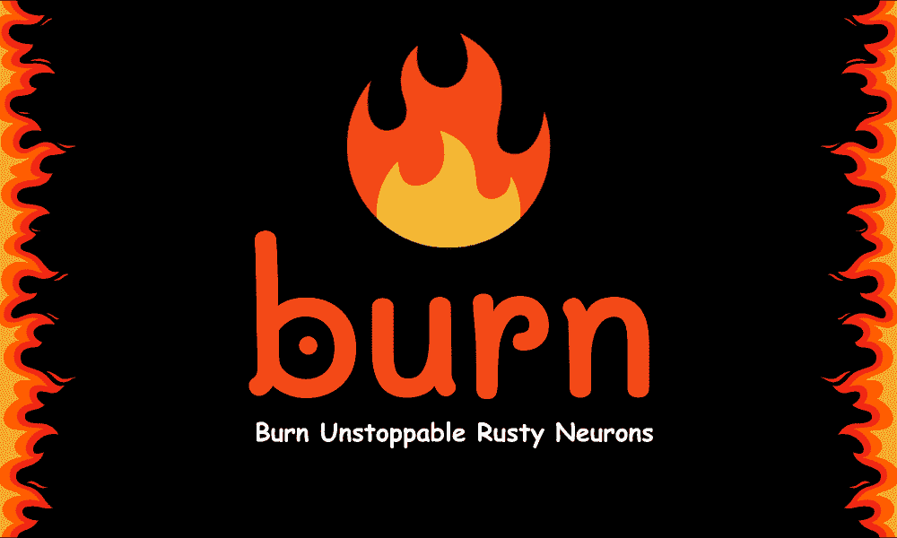
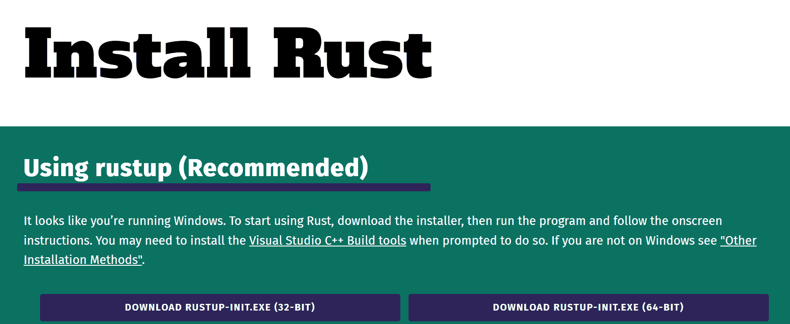

# Rust Burn 深度学习库

> 原文：[`www.kdnuggets.com/rust-burn-library-for-deep-learning`](https://www.kdnuggets.com/rust-burn-library-for-deep-learning)



图片由作者提供

# 什么是 Rust Burn？

* * *

## 我们的前三名课程推荐

 1\. [Google 网络安全证书](https://www.kdnuggets.com/google-cybersecurity) - 快速进入网络安全职业道路。

 2\. [Google 数据分析专业证书](https://www.kdnuggets.com/google-data-analytics) - 提升你的数据分析技能

 3\. [Google IT 支持专业证书](https://www.kdnuggets.com/google-itsupport) - 支持你的组织的 IT 工作

* * *

Rust Burn 是一个完全用 Rust 编程语言编写的新深度学习框架。创建一个新框架而不是使用现有的框架如 PyTorch 或 TensorFlow 的动机是构建一个多功能的框架，能够很好地服务于各种用户，包括研究人员、机器学习工程师和底层软件工程师。

Rust Burn 的关键设计原则是灵活性、性能和易用性。

**灵活性** 来自快速实现前沿研究思想和进行实验的能力。

**性能** 通过优化实现，例如利用 Nvidia GPU 上的 Tensor Cores 等硬件特性。

**易用性** 来自简化训练、部署和在生产中运行模型的工作流程。

**关键特性：**

+   灵活且动态的计算图

+   线程安全的数据结构

+   直观的抽象以简化开发过程

+   在训练和推理过程中具有极快的性能

+   支持多种后端实现，适用于 CPU 和 GPU

+   完全支持训练过程中的日志记录、度量和检查点

+   小而活跃的开发者社区

# 入门

## 安装 Rust

Burn 是一个强大的深度学习框架，基于 Rust 编程语言。它需要对 Rust 有基本了解，但一旦掌握，你将能够利用 Burn 提供的所有功能。

使用官方 [指南](https://www.rust-lang.org/tools/install) 安装它。你也可以查看 [GeeksforGeeks](https://www.geeksforgeeks.org/how-to-install-rust-on-windows-and-linux-operating-system/) 提供的安装 Rust 的指南，其中包括 Windows 和 Linux 的截图。



图片来源于 [安装 Rust](https://www.rust-lang.org/tools/install)

## 安装 Burn

要使用 Rust Burn，你首先需要在系统上安装 Rust。Rust 正确设置后，你可以使用 **cargo** 创建一个新的 Rust 应用程序，**cargo** 是 Rust 的包管理器。

在当前目录下运行以下命令：

```py
cargo new new_burn_app
```

进入这个新目录：

```py
cd new_burn_app
```

接下来，添加 Burn 作为依赖项，并包括启用 GPU 操作的 WGPU 后端功能：

```py
cargo add burn --features wgpu
```

最后，编译项目以安装 Burn：

```py
cargo build
```

这将安装 Burn 框架及其 WGPU 后端。WGPU 使 Burn 能够执行低级 GPU 操作。

# 示例代码

## 元素级加法

要运行以下代码，你必须打开并替换 `src/main.rs` 中的内容：

```py
use burn::tensor::Tensor;
use burn::backend::WgpuBackend;

// Type alias for the backend to use.
type Backend = WgpuBackend;

fn main() {
    // Creation of two tensors, the first with explicit values and the second one with ones, with the same shape as the first
    let tensor_1 = Tensor::<backend>::from_data([[2., 3.], [4., 5.]]);
    let tensor_2 = Tensor::<backend>::ones_like(&tensor_1);

    // Print the element-wise addition (done with the WGPU backend) of the two tensors.
    println!("{}", tensor_1 + tensor_2);
}</backend></backend>
```

在主函数中，我们创建了两个带 WGPU 后端的张量并执行了加法。

要执行代码，你必须在终端中运行 `cargo run`。

**输出：**

现在你应该能够查看添加的结果。

```py
Tensor {
  data: [[3.0, 4.0], [5.0, 6.0]],
  shape:  [2, 2],
  device:  BestAvailable,
  backend:  "wgpu",
  kind:  "Float",
  dtype:  "f32",
}
```

**注意：** 以下代码来自 Burn 书籍的示例：[入门指南](https://burn-rs.github.io/book/getting-started.html)。

## 位置-wise 前馈模块

这是一个展示如何轻松使用框架的例子。我们声明了一个位置-wise 前馈模块及其前向传递，使用了这个代码片段。

```py
use burn::nn;
use burn::module::Module;
use burn::tensor::backend::Backend;

#[derive(Module, Debug)]
pub struct PositionWiseFeedForward<B: Backend> {
    linear_inner: Linear<B>,
    linear_outer: Linear<B>,
    dropout: Dropout,
    gelu: GELU,
}

impl <b: backend="">PositionWiseFeedForward<B> {
    pub fn forward<const d:="" usize="">(&self, input: Tensor<B, D>) -> Tensor<B, D> {
        let x = self.linear_inner.forward(input);
        let x = self.gelu.forward(x);
        let x = self.dropout.forward(x);

        self.linear_outer.forward(x)
    }
}</const></b:>
```

上述代码来自 GitHub [仓库](https://github.com/burn-rs/burn)。

## 示例项目

要了解更多示例并运行它们，请克隆 [`github.com/burn-rs/burn`](https://github.com/burn-rs/burn) 仓库，并运行以下项目：

+   [MNIST](https://github.com/burn-rs/burn/tree/main/examples/mnist)：在 CPU 或 GPU 上使用各种后端训练模型。

+   [MNIST 推理网页](https://github.com/burn-rs/burn/tree/main/examples/mnist-inference-web)：在浏览器中进行模型推理。

+   [文本分类](https://github.com/burn-rs/burn/tree/main/examples/text-classification)：从头开始在 GPU 上训练一个变换器编码器。

+   [文本生成](https://github.com/burn-rs/burn/tree/main/examples/text-generation)：从头开始在 GPU 上构建和训练自回归变换器。

## 预训练模型

要构建你的 AI 应用程序，你可以使用以下预训练模型并用你的数据集进行微调。

+   SqueezeNet: [squeezenet-burn](https://github.com/burn-rs/models/blob/main/squeezenet-burn/README.md)

+   Llama 2: [Gadersd/llama2-burn](https://github.com/Gadersd/llama2-burn)

+   Whisper: [Gadersd/whisper-burn](https://github.com/Gadersd/whisper-burn)

+   稳定扩散 v1.4: [Gadersd/stable-diffusion-burn](https://github.com/Gadersd/stable-diffusion-burn)

# 结论

Rust Burn 代表了深度学习框架领域的一个激动人心的新选择。如果你已经是 Rust 开发者，你可以利用 Rust 的速度、安全性和并发性来推动深度学习研究和生产的可能性。Burn 旨在在灵活性、性能和可用性之间找到适当的妥协，以创建一个独特的、多用途的框架，适用于各种用例。

尽管仍处于早期阶段，Burn 显示出解决现有框架痛点和满足领域内各种从业者需求的潜力。随着框架的成熟和社区的扩展，它有可能成为一个与成熟选项并驾齐驱的生产级框架。其新颖的设计和语言选择为深度学习社区提供了新的可能性。

## 资源

+   **文档：** [`burn-rs.github.io/book/overview.html`](https://burn-rs.github.io/book/overview.html)

+   **网站：** [`burn-rs.github.io/`](https://burn-rs.github.io/)

+   **GitHub：** [`github.com/burn-rs/burn`](https://github.com/burn-rs/burn)

+   **演示：** [`burn-rs.github.io/demo`](https://burn-rs.github.io/demo)

[](https://www.polywork.com/kingabzpro)****[Abid Ali Awan](https://www.polywork.com/kingabzpro)**** ([@1abidaliawan](https://www.linkedin.com/in/1abidaliawan)) 是一位认证的数据科学专家，热爱构建机器学习模型。目前，他专注于内容创作和撰写关于机器学习和数据科学技术的技术博客。Abid 拥有技术管理硕士学位和电信工程学士学位。他的愿景是使用图神经网络构建一个 AI 产品，以帮助那些面临心理健康问题的学生。

### 更多相关信息

+   [使用 Datawig：AWS 深度学习库进行缺失值插补](https://www.kdnuggets.com/2021/12/datawig-aws-deep-learning-library-missing-value-imputation.html)

+   [skops：提升生产环境中 Scikit-learn 的新库](https://www.kdnuggets.com/2023/02/skops-new-library-improve-scikitlearn-production.html)

+   [介绍自然语言处理的测试库](https://www.kdnuggets.com/2023/04/introducing-testing-library-natural-language-processing.html)

+   [超越准确性：使用 NLP 测试库评估和改进模型](https://www.kdnuggets.com/2023/04/john-snow-beyond-accuracy-nlp-test-library.html)

+   [Pandas AI：生成型 AI Python 库](https://www.kdnuggets.com/2023/05/pandas-ai-generative-ai-python-library.html)

+   [介绍 OpenLLM：开源 LLM 库](https://www.kdnuggets.com/2023/07/introducing-openllm-open-source-library-llms.html)
