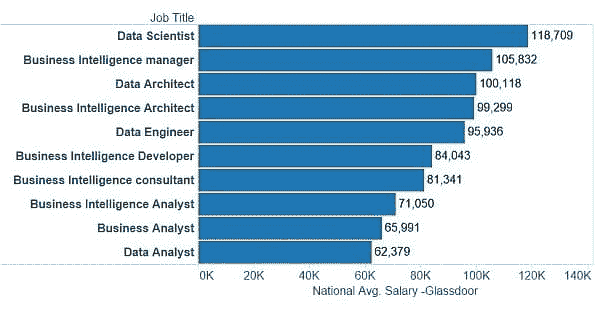

# 数据科学和商业智能中的职位薪资

> 原文：[`www.kdnuggets.com/2015/09/salaries-roles-data-science-business-intelligence.html`](https://www.kdnuggets.com/2015/09/salaries-roles-data-science-business-intelligence.html)

**[Geethika Bhavya Peddibhotla](https://www.kdnuggets.com/author/geethika "Geethika Bhavya Peddibhotla 的帖子")**，发表于 2015 年 9 月 9 日，来源于 [商业智能](https://www.kdnuggets.com/tag/business-intelligence)、[数据科学](https://www.kdnuggets.com/tag/data-science)、[数据科学技能](https://www.kdnuggets.com/tag/data-science-skills)、[数据科学家](https://www.kdnuggets.com/tag/data-scientist)、[薪资](https://www.kdnuggets.com/tag/salary)、[趋势](https://www.kdnuggets.com/tag/trends) 评论**By Bhavya Geethika & Shashank Iyer**.

根据 Glassdoor 的国家平均薪资数据，以下是分析职位进展、增长和技能的热门角色。[数据科学家](http://www.glassdoor.com/Salaries/data-scientist-salary-SRCH_KO0,14.htm) 排名第一。25 个数据科学与商业智能相关职位列表。

**数据科学与商业智能领域的热门职位按国家平均薪资（美元）** 

**职位进展 - 给定一个职位名称，那个职位的人会接下哪些其他职位？**

基于 Glassdoor API 的职位进展数据分析如下 - 它展示了中位薪资增长最高的前 3 个职位进展。Glassdoor API 职位进展目前仅支持美国数据。

下一个职位是指一个人在当前职位基础上可能会接下的角色。这里的职位数量指的是“下一个职位”在全国的职位数量。

方法：对于热门职位标题作为查询，Glassdoor API 将返回美国的相关职位，这些职位是该职位通常会接下的职位 - 基于频率百分比。我们通过先按频率筛选出最热门的职位，然后按中位薪资增长进行排序，从而汇总了这些数据。

**职位趋势：** Indeed.com 搜索了数百万个列在成千上万网站上的职位。下面的职位趋势图展示了 Indeed 找到的包含给定职位名称作为搜索词的职位百分比。

BI 开发人员和 BI 分析师的职位是过去几年中最常列出的职位，这一职位趋势似乎在 2015 年有所增加。

**图 3：Indeed.com BI 职位的年度百分比变化。**

数据分析师和数据架构师的职位在过去几年中列出的最多。数据科学家职位的发布量在过去四年中有所上升，这一趋势似乎在 2015 年将继续。

**图 4：Indeed.com 的数据科学职位年百分比变化。**

商业分析师职位的发布量相对较高，因此单独列出。

**图 5：Indeed.com 的商业分析师职位年百分比变化。**

**影响薪资的技能（payscale.com）：**

+   **数据科学家**：机器学习、软件开发、hadoop、java、数据挖掘/数据仓库、数据分析、python 和面向对象编程。查看：成为数据科学家需要掌握的 9 项技能

+   **商业智能经理**：SAP BI、人员管理、数据仓库、数据挖掘、Cognos、Microstrategy、BI、SQL、大数据分析、项目管理。

+   **数据架构师**：数据管理、Oracle DB、数据挖掘/数据仓库、BI 和数据建模。

+   **商业智能架构师**：SQL Server 报告服务（SSRS）、项目管理、数据建模、BusinessObjects、SQL Server 集成服务（SSIS）、商业智能、数据挖掘、数据仓库、Cognos、SQL、数据仓库

+   **商业智能开发人员**：数据建模、数据仓库、ETL（提取、转换、加载）、SQL、PL/SQL、Oracle、BI、Transact-SQL、BusinessObjects

+   **商业智能顾问**：项目管理、SAS、数据仓库、BusinessObjects、MicroStrategy、BI、Cognos、SQL

+   **商业智能分析师**：数据建模/数据仓库、项目管理、BusinessObjects、BI、Cognos、商业分析、数据挖掘、SQL。

+   **商业分析师**：需求分析、商业分析、项目管理、Oracle、Sharepoint Server

+   **数据分析师**：数据挖掘/数据仓库、数据建模、SAS、SQL、统计分析、数据库管理与报告、数据分析

**分享你对雇主在数据科学和商业智能职位中所寻求技能的看法。**

**相关：**

+   **2015 年分析和大数据的两个最重要趋势**

+   **真正的数据科学家请站出来！**

+   **50+ 数据科学和机器学习备忘单**

### 更多相关话题

+   [2022 年数据科学领域的顶级职位和薪资](https://www.kdnuggets.com/2022/05/top-jobs-salaries-data-science-2022.html)

+   [KDnuggets™ 新闻 22:n03, 1 月 19 日：深入了解 13 种数据…](https://www.kdnuggets.com/2022/n03.html)

+   [深入探讨 13 种数据科学家角色及其职责](https://www.kdnuggets.com/2022/01/deep-look-13-data-scientist-roles-responsibilities.html)

+   [AI 在亲密角色中的应用：女友与治疗师](https://www.kdnuggets.com/ai-in-intimate-roles-girlfriends-and-therapists)

+   [数据科学家职位薪资分析](https://www.kdnuggets.com/2023/04/data-scientist-job-salaries-analysis.html)

+   [2023 年数据科学家的薪资](https://www.kdnuggets.com/2023/07/2023-data-scientists-salaries.html)
