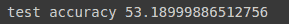

# 在 TensorFlow 中保存和加载模型——为什么这很重要以及如何做到

> 原文：[`www.kdnuggets.com/2021/02/saving-loading-models-tensorflow.html`](https://www.kdnuggets.com/2021/02/saving-loading-models-tensorflow.html)

评论


*照片由 [Nana Smirnova](https://unsplash.com/@nananadolgo?utm_source=medium&utm_medium=referral) 提供，来自 [Unsplash](https://unsplash.com/?utm_source=medium&utm_medium=referral)。*

* * *

## 我们的前三大课程推荐

 1\. [谷歌网络安全证书](https://www.kdnuggets.com/google-cybersecurity) - 快速进入网络安全职业

 2\. [谷歌数据分析专业证书](https://www.kdnuggets.com/google-data-analytics) - 提升你的数据分析技能

 3\. [谷歌 IT 支持专业证书](https://www.kdnuggets.com/google-itsupport) - 支持你组织的 IT

* * *

在本文中，我们将讨论以下主题

+   保存深度学习模型的重要性（一般而言，不限于 TensorFlow）。

+   如何在 TensorFlow 2 中保存深度学习模型，以及不同类型、类别和保存模型的技术。

+   在 TensorFlow 2 中加载保存的模型。

### 保存深度学习模型的重要性

记住，在梯度下降中，我们根据误差或损失函数更新权重和偏差。


现在想象一下，你训练了一个模型数千个周期，可能是几天、几周甚至几小时，并且得到了相当好的权重，这意味着你的模型表现非常好，然后当你关闭程序/Jupyter notebook 时丢失了所有权重。

当你想在另一个应用程序中重用该模型而没有保存进度时，这将变成一个更繁琐的问题。你必须从头开始训练，这可能浪费你几个小时或几天。

实际上，你可以想象这样一个场景：你已经编码了一个准确率超过 99%、精确度极高的面部识别模型应用，且训练该模型在大数据集上花费了大约 30 小时。现在，如果你没有保存模型，而你希望在任何应用程序中使用它，你将不得不重新训练整个模型 30 小时。

这就是为什么保存模型是一个非常重要的步骤，只需额外的几行代码就能节省大量时间和资源。

### 在 TensorFlow 2 中保存模型

在 TensorFlow 中保存模型权重有 2 种不同的格式。第一种是**TensorFlow 原生格式**，第二种是**hdf5** 格式，也称为**h5** 或**HDF** 格式。

另外，还有 2 种不同的保存模型的方法。

+   简单且不复杂的方法，但不提供自由度。

+   **使用回调**来保存模型，允许你进行很多自由操作，例如每个 epoch 保存，保存每隔 n 个示例后等。

我们将详细讨论这两种方法。

让我们首先加载重要的 Python 库和数据集。

```py
import tensorflow as tf
from tensorflow.keras.models import Sequential
from tensorflow.keras.layers import Dense, Flatten, Conv2D, MaxPooling2D
(x_train, y_train), (x_test, y_test) = tf.keras.datasets.cifar10.load_data() #cifar10 dataset
x_train = x_train / 255.0 #normalizing images
x_test = x_test / 255.0 

```

### 简单方法

在 TensorFlow 中保存模型的简单方法是使用 *Tensorflow.Keras.models* 的内置函数“模型保存与序列化 API”，即 *save_weights* 方法。

假设我们有一个 TensorFlow 中的顺序模型。

```py
model = Sequential([
    Conv2D(filters=16, input_shape=(32, 32, 3), kernel_size=(3, 3), activation='relu', name='conv_1'),
    MaxPooling2D(pool_size=(4, 4), name='pool_1'),
    tf.keras.layers.BatchNormalization(),
    Flatten(name='flatten'),
    Dense(units=32, activation='relu', name='dense_1'),
    tf.keras.layers.Dropout(0.5),
    Dense(units=10, activation='softmax', name='dense_2')
])
model.compile(optimizer='adam',
                  loss='sparse_categorical_crossentropy',
                  metrics=['accuracy'])

```

现在我们使用 *model.fit* 函数在 TensorFlow 中拟合模型。

```py
hist = model.fit(x_train,y_train,epochs=5, batch_size=512)

```

我们可以通过以下方式评估模型的性能，

```py
loss, acc = model.evaluate(x_test, y_test, verbose=0)
print(f"test accuracy {acc*100}")

```


现在，我们只需调用 *model.save* 函数并传入 *filepath* 作为参数，就可以保存模型。

+   模型架构

+   模型权重

+   模型优化器状态（以便你可以从中断处继续训练）

```py
model.save('myModel.h5')

```

现在添加扩展名很重要。如果你添加 *.h5* 作为扩展名，它会将模型保存为 *hdf5* 格式，如果没有提供扩展名，模型将以 TensorFlow 原生格式保存。

现在，当模型保存在当前目录中的 *myModel.h5* 文件时，你可以通过以下方式在新程序中或同一程序中作为不同模型加载它，

```py
new_model = tf.keras.models.load_model('my_model.h5') #same file path

```

我们可以通过以下方式检查新加载模型的准确率，

```py
loss, acc = new_model.evaluate(x_test, y_test, verbose=0)
print(f"test accuracy {acc*100}")

```



我们可以看到我们得到的准确率与旧模型完全相同。

我们可以通过检查模型摘要进一步确认。

```py
newmodel.summary()

```

新的摘要与我们原始模型的摘要完全相同。

```py
Model: "sequential"
_________________________________________________________________
Layer (type)                 Output Shape              Param #
=================================================================
conv_1 (Conv2D)              (None, 30, 30, 16)        448
_________________________________________________________________
pool_1 (MaxPooling2D)        (None, 7, 7, 16)          0
_________________________________________________________________ 
batch_normalization (BatchNo (None, 7, 7, 16)          64         
_________________________________________________________________ 
flatten (Flatten)            (None, 784)               0          
_________________________________________________________________ 
dense_1 (Dense)              (None, 32)                25120      
_________________________________________________________________ 
dropout (Dropout)            (None, 32)                0          
_________________________________________________________________ 
dense_2 (Dense)              (None, 10)                330        
================================================================= 
Total params: 25,962
Trainable params: 25,930
Non-trainable params: 32 
_________________________________________________________________

```

同样，我们可以通过以下方式以 TensorFlow 原生格式保存权重，

```py
new_model.save('newmodel')

```

看看我们在名称后没有添加任何文件格式。这会将我们的模型以 TensorFlow 原生格式保存在 *newmodel* 文件夹中。如果我们查看该文件夹，我们可以检查文件的

```py
!dir newmodel

```

这个命令只会在 jupyter notebook 中运行，因此你也可以打开文件夹查看文件。

你将始终有 1 个文件和 2 个文件夹，它们是：

+   assets (文件夹)

+   pb

+   variables (文件夹)

我们稍后会查看这些文件夹和文件是什么。但要简单地加载模型，我们只需提供用于保存模型的路径名，例如

```py
other_model = tf.keras.models.load_model('newmodel')

```

你可以通过检查其 *summary* 或评估结果来确认它是相同的模型。

现在以简单的方法仅保存 **权重**，你只需在模型上调用内置函数 *save_weights*。

让我们使用同一个旧模型，

```py
model = Sequential([
    Conv2D(filters=16, input_shape=(32, 32, 3), kernel_size=(3, 3), activation='relu', name='conv_1'),
    MaxPooling2D(pool_size=(4, 4), name='pool_1'),
    tf.keras.layers.BatchNormalization(),
    Flatten(name='flatten'),
    Dense(units=32, activation='relu', name='dense_1'),
    tf.keras.layers.Dropout(0.5),
    Dense(units=10, activation='softmax', name='dense_2')
])
model.compile(optimizer='adam',
                  loss='sparse_categorical_crossentropy',
                  metrics=['accuracy'])

```

并训练几个 epoch。

```py
model.fit(x_train,y_train,epochs=5, batch_size=512)

```

现在你可以简单地通过以下方式保存权重，

```py
path = 'weights_folder/my_weights'
model.save_weights(path)

```

这将创建一个名为 *weights_folder* 的文件夹，并将权重以 TensorFlow 原生格式保存，文件名为 *my_weights*。它将包含 3 个文件。

+   checkpoint

+   data-00000-of-00001

+   index

让我们看看这些文件。

1.  ****my_weights.**index**

这个文件告诉 TensorFlow 权重存储的位置。当在分布式系统上运行模型时，可能会有不同的 *分片*，这意味着整个模型可能需要从多个来源重新组合。在上一个笔记本中，你在一台机器上创建了一个单一模型，所以只有一个 *分片*，所有权重都存储在同一个地方。

1.  **my_weights.data-00000-of-00001**

该文件包含模型的实际权重。它是这三个文件中最大的。回想一下，你训练的模型有大约 14000 个参数，这意味着这个文件的大小大约是每个保存的权重 12 字节。

1.  **检查点**

这个文件是迄今为止最小的。实际上小到我们可以直接查看。它是一个人类可读的文件，包含以下文本，

```py
model_checkpoint_path: "my_weights"
all_model_checkpoint_paths: "my_weights"

```

现在，当你保存了权重后，你可以通过简单地调用来加载它们，

```py
model.load_weights(path)

```

这将会在特定路径加载该模型的权重。

或者，你可以仅通过 *hdf5* 格式保存权重，方法是，

```py
model.save_weights('my_weights.h5')

```

这将会在你的工作目录中创建一个 *my_weights.h5* 文件，你可以通过 *model.load_weights('my_weights.h5')* 轻松加载它们。

### 重要提示

当你为模型加载权重时，你需要有该模型的正确架构。

例如：

你不能将我们刚创建的 *模型* 的权重加载到具有 1 个 Dense 层的顺序模型中，因为两者不兼容。所以你可能会想，保存权重的用途是什么？

好吧，答案是，如果你在看一些大型的 SOTA 应用，比如 YOLO，或者类似的东西，它们会给你源代码。但是，在你的机器上训练它们是一项漫长的任务，所以它们也会给你在不同 epochs 上的预训练权重，例如，如果你想查看这个模型在 50 epochs 时的表现，那么你可以加载保存的 50 epochs 权重，以此类推。这样，你可以根据模型在 X 次训练 epochs 上的表现检查模型的性能，而无需明确训练它。

### TensorFlow 原生格式与 hdf5，什么时候使用哪一个？

你已经看到，使用 .h5 格式简单而干净，因为它只创建一个单一的文件，而使用 TensorFlow 原生格式会创建多个文件夹和文件，这样不易阅读。所以，你可能会想，为什么我们还要使用 TensorFlow 原生格式？答案是，在 TensorFlow 原生格式中，一切都是结构化的，并且组织得井井有条。例如，.pb 文件包含结构数据，可以被多种语言加载。TF 原生格式的一些优点列在下面。

**TensorFlow 原生格式的优点**

+   [TensorFlow’s Serving](https://www.tensorflow.org/tfx/guide/serving) 在你想将模型投入生产时使用它。

+   语言无关 — 二进制格式可以被多种语言读取（如 Java、Python、Objective-C 和 C++ 等）。

+   自 0 版以来建议使用，你可以查看 TensorFlow 的[官方序列化指南](https://www.tensorflow.org/guide/keras/save_and_serialize)，它推荐使用 TensorFlow 原生格式。

+   保存模型的各种元数据，如优化器信息、损失、学习率等，这些信息以后可能会有帮助。

**缺点**

+   SavedModel 在概念上比单个文件更难理解

+   创建一个单独的文件夹来存储权重。

**h5 的优势**

+   用于保存可能不是表格数据的大型数据。

+   常见的文件保存格式。

+   所有内容保存在一个文件中（权重、损失、使用的优化器）

**缺点**

+   不能与 TensorFlow Serving 一起使用，但你可以通过 experimental.export_saved_model(model, 'path_to_saved_model') 将其简单转换为 .pb 格式

**应该使用什么**

如果你在服务或部署模型时不打算使用 TensorFlow，为了简便起见，你可以使用 .hdf5 格式，但如果你打算使用 TensorFlow 服务，那么你应该使用 tensorflow 原生格式。

### 学习成果

在这篇文章中，你学到了

+   为什么你应该保存你的机器学习模型。

+   如何仅使用简单的方法保存模型权重。

+   如何使用简单的方法保存完整模型。

+   在 TensorFlow 原生格式或 HDF5 格式中保存。

+   TensorFlow 原生格式和 HDF5 格式的区别以及该使用什么。

欲了解更多详情，请查看：

+   [伦敦帝国学院的 TensorFlow 2 入门](https://www.coursera.org/learn/getting-started-with-tensor-flow2)

+   [h5 和 pb 的区别](https://stackoverflow.com/questions/62079274/difference-between-pb-and-h5)

**相关：**

+   [TensorFlow 2 入门](https://www.kdnuggets.com/2020/07/getting-started-tensorflow2.html)

+   [使用 TensorFlow Serving 部署训练好的模型](https://www.kdnuggets.com/2020/11/serving-tensorflow-models.html)

+   [使用 TensorFlow 数据集和 TensorBoard 的 TensorFlow 建模流程](https://www.kdnuggets.com/2020/06/tensorflow-modeling-pipeline-tensorflow-datasets-tensorboard.html)

### 更多相关主题

+   [大数据如何实时挽救生命：物联网数据分析帮助…](https://www.kdnuggets.com/how-big-data-is-saving-lives-in-real-time-iov-data-analytics-helps-prevent-accidents)

+   [什么是向量数据库，它们为何对 LLMs 重要？](https://www.kdnuggets.com/2023/06/vector-databases-important-llms.html)

+   [数据管理对数据科学为何如此重要？](https://www.kdnuggets.com/2022/08/data-management-important-data-science.html)

+   [什么是超级对齐及其重要性？](https://www.kdnuggets.com/2023/07/superalignment-important.html)

+   [如何使用 Hugging Face 的数据集库进行高效的数据加载](https://www.kdnuggets.com/how-to-use-hugging-faces-datasets-library-for-efficient-data-loading)

+   [领域知识对机器学习重要吗？](https://www.kdnuggets.com/2022/07/domain-knowledge-important-machine-learning.html)
