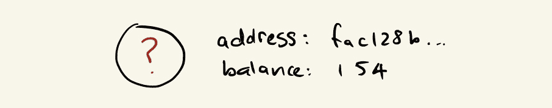
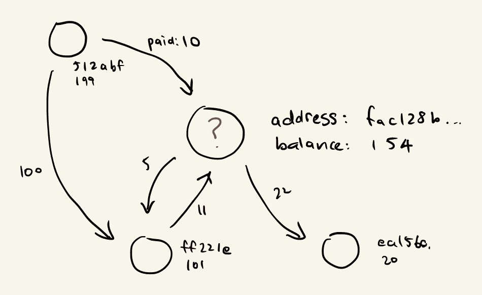
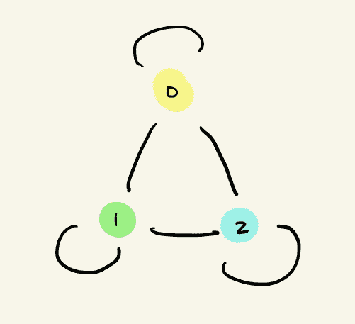
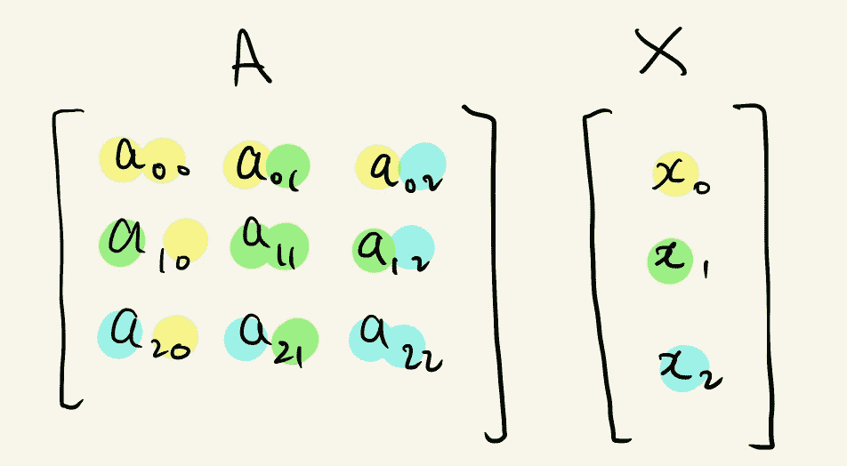
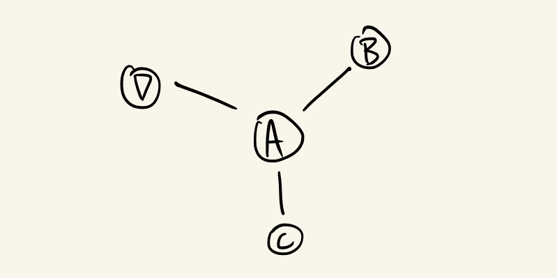
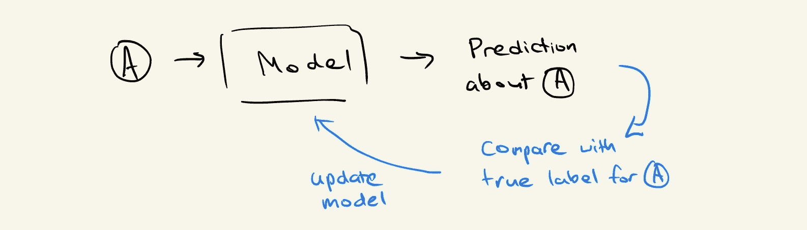
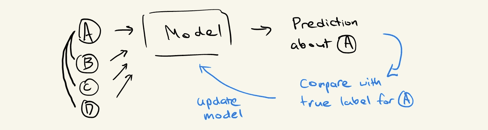
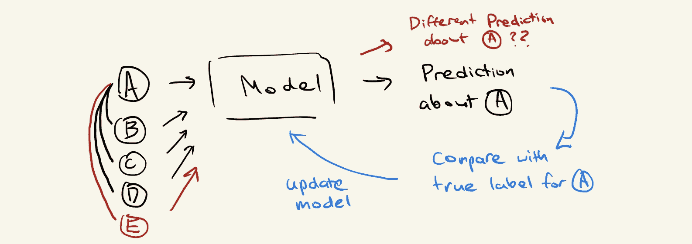
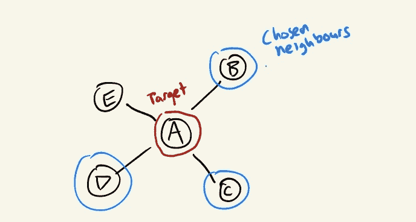
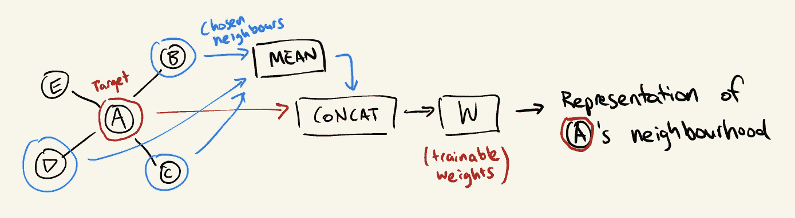

# 可扩展的图机器学习：我们能攀登的高峰？

> 原文：[`www.kdnuggets.com/2019/12/scalable-graph-machine-learning.html`](https://www.kdnuggets.com/2019/12/scalable-graph-machine-learning.html)

评论

**由[Kevin Jung](https://www.linkedin.com/in/kevin-jung-12a820106/)，CSIRO Data61 的软件工程师**。

图机器学习仍然是一个相对较新且正在发展的研究领域，带来了大量的复杂性和挑战。其中一个既让我们着迷又让我们感到愤怒的挑战就是——*扩展性*。

两种方法早期被确立为利用网络信息的标准方法：图卷积网络 [1]（用于图形的强大神经网络架构）和 Node2Vec [2]（用于图形的表示学习的算法框架）。这两种方法对于从高度连接的数据集中提取洞见非常有用。

但我亲身体验到，当尝试应用图机器学习技术来识别比特币区块链数据中的欺诈行为时，扩展性是最大的障碍。我们使用的比特币区块链图包含数百万个钱包（节点）和数十亿个交易（边），这使得大多数图机器学习方法不可行。

在这篇文章中，我们将更详细地探讨图机器学习方法的扩展性：它是什么，它为什么困难，以及一种试图直接应对这一挑战的方法示例。

### 什么是图机器学习？

首先，让我们确保我们对*图机器学习*的定义达成共识。

当我们说‘图’时，我们指的是一种将数据表示为具有连接的实体的方式。从数学的角度来看，我们称实体为节点或顶点，连接为边。一组顶点**V**和一组边**E**组成一个图**G = (V, E)**。

图机器学习是一种可以自然地从图结构数据中学习并进行预测的机器学习技术。我们可以将机器学习视为学习某种转换函数；**y = f(x)**，其中**x**是数据的一部分，而**y**是我们想要预测的东西。

比如我们以检测欺诈比特币地址为例，我们知道区块链上所有地址的账户余额。一个非常简单的模型可能会学到，如果一个地址的账户余额为零，则它不太可能是欺诈性的。换句话说，当**x**为零时，我们的函数**f(x)**表示一个接近零的值（即非欺诈性）：

我们可以同意，仅仅查看一个地址的账户余额并不足以解决这样的问题。因此，此时我们可以考虑如何工程化额外特征，以便为我们的模型提供更多关于每个地址行为的信息。

我们已经拥有了来自比特币付款人和收款人之间交易的丰富网络结构。通过设计一个利用这些信息的模型，我们将对结果更有信心：

我们希望对地址进行预测，不仅基于其账户余额，还基于与其他地址进行的交易。我们可以尝试将**f**公式化为**f(x, x’₀, x’₁, …)**，其中**x’ᵢ**是由我们的图结构定义的**x**的局部邻域中的其他数据点。

实现这一点的一种方法是利用邻接矩阵形式的图结构。将输入数据与邻接矩阵（或其某种规范化形式）相乘的效果是将数据点与其相邻点线性组合。

以下是一个有三个节点的图的邻接矩阵表示以及一组特征：

节点 0 的邻域可以被聚合为：

这是诸如图卷积网络等算法遵循的基本高层原理。一般而言，局部邻域信息的聚合是递归应用的，以增加汇集在一起进行节点预测的局部网络的规模。（阅读 StellarGraph 的文章[*了解你的邻居：图上的机器学习*](https://medium.com/stellargraph/knowing-your-neighbours-machine-learning-on-graphs-9b7c3d0d5896)以获得更彻底的概念介绍）。

### 什么是*可扩展的*？

一个[可扩展的](https://www.yourdictionary.com/scalable)山是一个人们可以攀登的山。一个可扩展的系统是一个能够处理不断增长的需求的系统。一个可扩展的图机器学习方法应该是一个能够处理不断增长的数据规模的方法……这也恰好是一座巨大的山。

在这里，我将争论简单地在节点邻域之间聚合的基本原理是*不可扩展的*，并描述算法必须解决的问题，以便被认为是可扩展的。

第一个问题源于一个节点可以任意连接到图中的许多其他节点——甚至是整个图。

在更传统的深度学习管道中，如果我们想要预测关于**x**的某些内容，我们只需**x**本身的信息。但考虑到图结构，为了预测关于**x**的某些内容，我们可能需要从整个数据集中聚合信息。随着数据集的不断增大，我们突然需要聚合 TB 级的数据才能对单个数据点进行预测。这听起来并不那么可扩展。

第二个问题的解释涉及理解传导算法和归纳算法之间的区别。

**归纳算法**尝试发现世界的一般规则。模型以数据为基础，对未见过的数据进行预测。

**传导算法**试图通过不泛化一个通用模型来为数据集中的未标记数据做出更好的预测。

当我们试图解决现实世界中的问题时，我们面临着数据不是静态的挑战。每天可能会出现数以千计的新数据，这就是为什么可扩展性如此重要的原因。但许多图机器学习方法由于从整个数据集中聚合信息的方式，天生具有**传导性**，而不是仅仅查看单一的数据实例。

让我们看一个更具体的示例来演示这个问题。考虑一个在图中与三个其他节点 B、C 和 D 相连的节点 A：

如果我们没有应用任何复杂的图方法，我们将简单地学习一个从 A 的特征到更有用的指标的映射；例如，我们想对节点做出的预测：

然而，由于我们希望利用图结构，我们最终将 B、C 和 D 的特征作为我们学习的函数的输入：

想象一下，当我们训练完模型后，未来某个时刻到达了一个新的数据点，它恰好与我们原始节点 A 相连。我们最终学习了一个没有考虑到这一连接的函数，因此我们陷入了一个不确定我们训练的模型是否对新数据集有效的情况。

*节点 E 和边 AE 被引入，导致模型在聚合邻域信息以对 A 进行新的预测时也带入了 E 的特征。*

到目前为止，我们对图算法的理解表明，它们通常不太具备良好的可扩展性，尤其是当算法具有传导性质时。接下来，我们将探讨一种试图解决这些挑战的算法。

### 引入 GraphSAGE

许多算法试图通过引入某种形式的采样来解决图机器学习中的可扩展性问题。在本节中我们将讨论的一种特定方法是邻居采样方法，它是由 GraphSAGE [3] 算法引入的。

GraphSAGE 中的 SAGE 代表采样和聚合，简单来说就是：“对于每个节点，从其局部邻域中取样节点，并聚合它们的特征。”

“取样其邻居”和“聚合特征”这两个概念听起来比较模糊，因此我们来探讨一下它们实际意味着什么。

GraphSAGE 规定我们对任何给定节点的局部邻域进行固定大小的采样。这立即解决了我们需要从整个数据集中汇总信息的第一个问题。但这样做我们牺牲了什么呢？

1.  首先最明显的一点是，进行采样意味着我们正在对邻域的实际情况进行近似。根据我们选择的样本大小，它可能对我们的目的足够好，但仍然是一种近似。

1.  我们放弃了模型从节点的连接程度中学习的机会。对于 GraphSAGE，拥有五个邻居的节点与拥有 50 个邻居的节点看起来完全相同，因为我们总是对每个节点采样相同数量的邻居。

1.  最终，我们可能会进入一个世界，在这个世界中，我们可以根据当时采样到的邻居做出不同的节点预测。

根据我们希望解决的问题和对数据的了解，我们可以尝试猜测这些问题可能如何影响我们的结果，并决定 GraphSAGE 是否适合特定的用例。

聚合特征可以通过多种不同的方式完成，但每种方式都可以描述为一个函数，该函数从采样的邻域中获取特征列表并输出一个“聚合”的特征向量。

例如，*均值聚合器*简单地对特征进行逐元素均值计算：

*GraphSAGE 平均聚合器。*

然后我们可以应用第二个聚合步骤，将节点自身及其聚合邻居的特征结合起来。上述演示的简单方法是将两个特征向量连接起来，并用一组可训练的权重进行乘法运算。

GraphSAGE 的局部采样特性为我们提供了归纳算法和扩展机制。我们还可以选择聚合方法，为模型提供一些灵活性。尽管这些好处有代价，我们需要牺牲模型性能来换取可扩展性。然而，就我们的目的而言，GraphSAGE 算法为在比特币数据集上扩展图机器学习提供了一个良好的方法。

### 成功，但不是没有挑战

GraphSAGE 提出了邻域采样的方法来克服一些扩展性挑战。具体而言，它：

+   **为我们提供了一个良好的近似，同时限制了进行预测时的输入大小**；并且

+   **允许使用归纳算法**。 

这是一个实质性的突破，但并未完全解决问题。

**1\. 高效采样仍然困难**

为了在不引入偏差的情况下对节点的邻居进行采样，你仍然需要遍历所有邻居。这意味着虽然 GraphSAGE 确实限制了神经网络的输入大小，但填充输入所需的步骤涉及浏览整个图，这可能是非常昂贵的。

**2\. 即使在采样的情况下，邻域聚合仍然聚合了大量数据**

即使在固定的邻域大小下，递归地应用这种方案意味着邻域大小会指数级增长。例如，如果我们每次选择 10 个随机邻居，但在三个递归步骤上应用聚合，这最终会导致邻域大小为 10³。

**3\. 分布式数据为基于图的方法引入了更多挑战**

大数据生态系统的很多部分围绕着分发数据以启用并行化的工作负载，并根据需求提供水平扩展的能力。然而，天真地分发图数据会引入一个重大问题，因为没有保证邻域聚合可以在没有网络通信的情况下完成。这使得基于图的方法处于一个需要付出在网络中传输数据成本或错过利用大数据技术来启用管道的价值的位置。

仍然有许多困难需要克服，以及更多探索需要进行，以使可扩展的图机器学习变得更加实用。我个人将密切关注这个领域的新进展。

如果你想了解更多关于图机器学习的信息，欢迎下载开源的[StellarGraph Python 库](https://github.com/stellargraph/stellargraph)或通过[stellargraph.io](http://stellargraph.io)联系我们。

*这项工作得到了 CSIRO 的 Data61 支持，这是澳大利亚领先的数字研究网络。*

### 参考文献

1.  图卷积网络（GCN）：具有图卷积网络的半监督分类。Thomas N. Kipf, Max Welling。国际学习表征会议（ICLR），2017 年

1.  Node2Vec：网络的可扩展特征学习。A. Grover, J. Leskovec。ACM SIGKDD 国际知识发现与数据挖掘会议（KDD），2016 年。

1.  大规模图的归纳表示学习。W.L. Hamilton, R. Ying, 和 J. Leskovec。神经信息处理系统（NIPS），2017 年。

[原文](https://medium.com/stellargraph/scalable-graph-machine-learning-a-mountain-we-can-climb-753dccc572f)。经许可转载。

**简介：** [Kevin Jung](https://www.linkedin.com/in/kevin-jung-12a820106/) 是 CSIRO Data61 团队中的一名软件工程师，该团队是澳大利亚领先的数字研究网络[StellarGraph](https://www.stellargraph.io/)。

**相关：**

+   [图机器学习能否识别在线社交网络中的仇恨言论？](https://www.kdnuggets.com/2019/09/graph-machine-learning-hate-speech-social-networks.html)

+   [认识你的邻居：图上的机器学习](https://www.kdnuggets.com/2019/08/neighbours-machine-learning-graphs.html)

+   [为什么组织在扩展 AI 和机器学习时失败](https://www.kdnuggets.com/2019/05/why-organizations-fail-scaling-ai-machine-learning.html)

* * *

## 我们的前三个课程推荐

 1\. [谷歌网络安全证书](https://www.kdnuggets.com/google-cybersecurity) - 快速进入网络安全职业生涯

 2\. [谷歌数据分析专业证书](https://www.kdnuggets.com/google-data-analytics) - 提升你的数据分析技能

 3\. [谷歌 IT 支持专业证书](https://www.kdnuggets.com/google-itsupport) - 支持你组织的 IT 需求

* * *

### 更多相关主题

+   [使用 SQL + Python 构建可扩展 ETL](https://www.kdnuggets.com/2022/04/building-scalable-etl-sql-python.html)

+   [广义和可扩展的最优稀疏决策树 (GOSDT)](https://www.kdnuggets.com/2023/02/generalized-scalable-optimal-sparse-decision-treesgosdt.html)

+   [如何使用 Apache Kafka 构建可扩展的数据架构](https://www.kdnuggets.com/2023/04/build-scalable-data-architecture-apache-kafka.html)

+   [梯度下降：山地旅行者的优化指南](https://www.kdnuggets.com/gradient-descent-the-mountain-trekker-guide-to-optimization-with-mathematics)

+   [机器学习如何惠及在线学习](https://www.kdnuggets.com/2022/12/machine-learning-benefit-online-learning.html)

+   [用 Python 图形库制作惊人的可视化](https://www.kdnuggets.com/2022/12/make-amazing-visualizations-python-graph-gallery.html)
