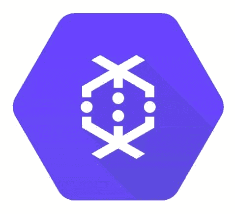
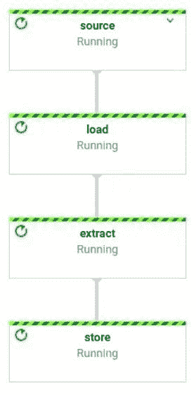

# 使用 Dataflow 扩展计算机视觉模型

> 原文：[`www.kdnuggets.com/2020/07/scaling-computer-vision-models-dataflow.html`](https://www.kdnuggets.com/2020/07/scaling-computer-vision-models-dataflow.html)

评论

**作者 [Pablo Soto](https://www.linkedin.com/in/psoto23/)，[Pento](https://pento.ai/) 的创始合伙人**



* * *

## 我们的前三个课程推荐

 1\. [谷歌网络安全证书](https://www.kdnuggets.com/google-cybersecurity) - 快速进入网络安全职业轨道。

 2\. [谷歌数据分析专业证书](https://www.kdnuggets.com/google-data-analytics) - 提升您的数据分析技能

 3\. [谷歌 IT 支持专业证书](https://www.kdnuggets.com/google-itsupport) - 支持您的组织的 IT

* * *

我们将简要介绍 Google Cloud 服务 [Dataflow](https://cloud.google.com/dataflow)，以及它如何以无服务器的方式运行数百万张图像的预测。无需创建集群，无需维护，您只需为您使用的部分付费。我们将首先提供一个背景，说明我们为什么认为这很重要，简要介绍几个概念，然后直接进入一个用例。

扩展机器学习模型是困难且昂贵的。主要有两个原因：基础设施成本高，以及您的实验管道缓慢，导致机器学习团队不断等待结果。

很容易低估拥有一个等待结果的机器学习团队的费用。这不仅仅是因为浪费的时间，还因为人们会感到沮丧并最终失去动力。

优化您的机器学习实验过程的一种方法是建立和管理自己的基础设施。这在大公司中很常见，但对于小公司来说，这往往代价高昂。

传统的软件开发几年前面临类似的挑战，企业需要扩展，这主要是由业务需求驱动的（服务/API/网站缓慢不适合扩展）。云服务提供商看到了提供服务的机会，这些服务允许公司在没有前期成本的情况下扩展。他们主要通过两种方式来解决这个问题：易于管理的服务和无服务器服务。后者对没有大规模 DevOps 团队或资金不足以支付自己基础设施的小公司尤其具有吸引力。

机器学习中也出现了类似的趋势。这次是由机器学习人才的稀缺和高成本驱动的。像软件一样，小公司无法投入大量资金创建定制的优化基础设施，这需要一支专家团队来构建和维护。

云服务提供商看到了通过提供无服务器解决方案来增加价值的机会。特别是 GCP 已经这样做了一段时间。GCP AI Platform 提供了 ML 项目每个阶段的不同服务。但他们也依靠其他服务来帮助解决 ML 挑战。

### Dataflow 是什么？

[Dataflow](https://cloud.google.com/dataflow) 是一个完全托管的处理服务，它使用 [Apache Beam](https://beam.apache.org/) 作为其编程模型来定义和执行管道。Dataflow 是 Beam 支持的 [许多运行器](https://beam.apache.org/documentation/runners/capability-matrix/) 之一。

> Apache Beam 提供了一个可移植的 API 层，用于构建复杂的数据并行处理管道，这些管道可以在多种执行引擎或运行器上执行。

Dataflow 特别有一些有趣的特性：

+   完全托管

+   自动缩放

+   简单实现

### 什么是 Apache Beam？

如上所述，Beam 是一个用于定义和执行处理管道的编程模型。它提供了一个接口来创建可以在多种环境（如 Spark、Hadoop、Dataflow）中执行的处理管道。

### 用例：使用预训练的 ResNet50 提取图像特征

作为计算机视觉工程师，我们经常需要使用 CNN 模型提取嵌入特征。在这里，我们将介绍如何构建一个数据流管道，该管道使用预训练的 ResNet50 生成图像特征嵌入。我们的管道将包括 3 个简单步骤：

1.  加载图像

1.  提取特征

1.  存储特征

为了实现我们的管道，我们将使用 Apache Beam Python SDK、Keras、Pillow 和 Click。由于我们将使用非 Python 依赖项，我们必须按照 [这里](https://beam.apache.org/documentation/sdks/python-pipeline-dependencies/#nonpython) 所述的方式来构建我们的代码。

我们需要做的第一件事是创建一个管道配置：

```py
if local:
    # Execute pipeline in your local machine.
    runner_options = {
        "runner": "DirectRunner",
    }
else:
    runner_options = {
        "runner": "DataflowRunner",
        "temp_location": "...",
        "staging_location.": "...",
        "max_num_workers": max_num_workers,
    }

options = PipelineOptions(
      project=project_id,
      job_name=job_name,
      region=region,
      **runner_options
  )

options.view_as(SetupOptions).save_main_session = True
options.view_as(SetupOptions).setup_file = os.path.join(
    pathlib.Path(__file__).parent.absolute(), "..", "setup.py") 
```

如你所见，根据我们是在本地执行管道还是在 Dataflow 上执行，选项会有所不同。

然后我们需要创建一个 [管道](https://beam.apache.org/documentation/programming-guide/#creating-a-pipeline)：

```py
with beam.Pipeline(options=options) as p:
        ... 
```

`p` 是我们的管道，向管道中添加新步骤时使用操作符 `|` ，如下所示：

```py
p = p | Task(); 
```

如果你想明确命名步骤，你可以使用操作符 `>>`：

```py
p = p | ("task_name" >> Task()); 
```

现在我们需要指定管道的步骤。有多种实现方式：

+   内置实现：BigQuery 连接器、ReadFile 等

+   自定义实现：Map、Filter、ParDo

```py
(p
 | "source" >> ReadFromText(input_path)
 | "load" >> beam.Map(load)
 | "extract" >> beam.Map(extract)
 | "store" >> beam.ParDo(store, output_path)) 
```

在这里你可以看到我们已经添加了上述三个步骤。我们从 Google Cloud 的 CSV 文件中加载图像路径，然后加载图像，提取它们的嵌入，并将它们存储在 Google Cloud Storage 中。

在我们管道中的所有步骤中，我们期望接收一个输入并返回一个输出。为了应用这些类型的步骤，我们必须使用方法 `beam.Map`。另外，如果你处理的是可能接收/返回零个或多个输入/输出的步骤，你可以使用 `beam.ParDo`。

现在管道已经定义，我们来看一下实现细节。

### 加载图像

在这一步中，我们需要从 GCS 下载图像，将其加载为 Pillow 图像，调整大小，并将其转换为 numpy 数组对象。之所以在一个步骤中下载和调整大小，是为了减少管道步骤之间的数据传输，从而降低成本。

```py
def load(path):
    """
    Receives an image path and returns a dictionary containing
    the image path and a resized version of the image as a np.array.
    """
    buf = GcsIO().open(path, mime_type="image/jpeg")
    img = Image.open(io.BytesIO(buf.read()))
    img = img.resize((IMAGE_HEIGHT, IMAGE_WIDTH), Image.ANTIALIAS)
    return {"path": path, "image": np.array(img)} 
```

Beam 提供了一组 [内置连接器](https://beam.apache.org/documentation/io/built-in/) 来处理 I/O。

### 提取特征

在这一步中，我们需要加载 ResNet 模型并运行预测。为了避免在同一工作节点上多次加载模型，`FeatureExtractor` 类中添加了一个单例包装器。一旦提取了嵌入，我们将其添加到项目字典中，由于不再需要将完整图像加载到内存中，我们将其从字典中删除。

```py
def singleton(cls):
    instances = {}

    def get_instance(*args, **kwargs):
        if cls not in instances:
            instances[cls] = cls(*args, **kwargs)
        return instances[cls]

    return get_instance

@singleton
class Extractor:
    """
    Extract image embeddings using a pre-trained ResNet50 model.
    """
    def __init__(self):
        self.model = ResNet50(
            input_shape=(IMAGE_WIDTH, IMAGE_HEIGHT, 3),
            include_top=False,
            weights="imagenet",
            pooling=None,
        )

    def extract(self, image):
        return self.model.predict(np.expand_dims(image, axis=0))[0]

def extract(item):
    """
    Extracts the feature embedding from item["image"].
    """
    extractor = Extractor()
    item["embedding"] = extractor.extract(item["image"])
    # We do not longer need the image, remove it from the dictonary to free memory.
    del item["image"]
    return item 
```

### 存储特征

现在我们有了嵌入，只需将其存储在 GCS 中即可。

```py
def store(item, output_path):
    """
    Store the image embeddings item["embedding"] in GCS.
    """
    name = item["path"].split("/")[-1].split(".")[0]
    path = os.path.join(output_path, f"{name}.npy")

    fin = io.BytesIO()
    np.save(fin, item["embedding"])

    fout = beam.io.gcp.gcsio.GcsIO().open(path, mode="w")
    fin.seek(0)
    fout.write(fin.read()) 
```

Dataflow 允许你指定机器类型、工作节点数量、目标等，提供了大量的灵活性来找到适合当前任务的配置。你可以在 [这里查看所有选项](https://cloud.google.com/dataflow/docs/guides/specifying-exec-params#setting-other-cloud-dataflow-pipeline-options)。

一旦你运行 Dataflow 管道，你将会在你的机器上看到关于执行状态的日志。另一种选择是使用 Dataflow Web UI。你可以在 [文档](https://cloud.google.com/dataflow/docs/guides/using-monitoring-intf) 中了解更多信息。



你可以在 [这里查看完整代码](https://github.com/pento-group/dataflow-demo)。

Apache Beam 还支持将管道分支。例如，如果你想创建嵌入的 2D 可视化，可以通过以下方式分支你的管道：

```py
p = (
   p
     | "source" >> ReadFromText(input_path)
     | "load" >> beam.Map(load)
     | "extract" >> beam.Map(extract)))

(p | "store" >> beam.ParDo(store, output_path))
(p | "reduce_dim" >> beam.ParDo(reduce_dim)) 
```

这允许 Beam 独立执行 `store` 和 `reduce_dim`，提供更多优化管道的灵活性，从而提高性能。

### 扩展

Dataflow 提供了 [多种配置](https://cloud.google.com/dataflow/docs/guides/specifying-exec-params#setting-other-cloud-dataflow-pipeline-options)，允许你以非常简单的方式自定义你希望的扩展方式。默认情况下，它会选择提升性能的值。在执行过程中，Dataflow 会更改配置以优化性能，例如调整工作节点的数量、机器类型等。

你可以让 Dataflow 每次运行管道时找到最佳配置。但如果你已经知道你的作业需要的资源，如内存量、是否 CPU 密集型、外部服务（即你的数据库或 API 容量）支持的最大吞吐量，最好直接指定这些信息。这将帮助 Dataflow 更快地收敛到正确的配置，加快执行速度并降低成本。

Dataflow 应足以满足大多数小型/中型公司扩展的需求。作为参考，Dataflow 能以每秒 5k 张图像的速度执行上述用例，最多使用 1k 名工人。这里是[Dataflow 配额](https://cloud.google.com/dataflow/quotas)的列表，主要限制为 1k 名工人。

### 摘要

Apache Beam 是一种简单的编程模型，允许你以结构化的方式执行 ML 步骤，并在不同环境中运行。其中之一是 Dataflow，Beam 执行引擎，它是完全托管的，支持自动扩展，并允许我们针对不同目标进行优化。

Dataflow 是一个优秀的工具，可以在大规模运行你的 ML 模型，而无需过多的前期投资或维护。它提供了一个简单的 API，并拥有一个活跃的开源社区。本文展示了如何使用 Apache Beam 构建图像嵌入提取器，并扩展到数百万张图像。这样，你可以在不担心基础设施的情况下节省数百美元，同时加速实验过程。

### 资源

+   [Dataflow 运行器文档](https://beam.apache.org/documentation/runners/dataflow/)

+   [Dataflow 中的动态工作重新平衡](https://cloud.google.com/blog/products/gcp/no-shard-left-behind-dynamic-work-rebalancing-in-google-cloud-dataflow)

+   [Apache Beam Python SDK 快速入门](https://beam.apache.org/get-started/quickstart-py/)

Python 示例:

+   [Apache Beam Python SDK 代码示例](https://github.com/apache/beam/tree/master/sdks/python/apache_beam/examples)

+   [GCP VisionML 集成用于 Apache Beam](https://github.com/apache/beam/blob/master/sdks/python/apache_beam/ml/gcp/visionml.py)

**简历: [帕布罗·索托](https://www.linkedin.com/in/psoto23/)** 是**[Pento](https://pento.ai/)** 的创始合伙人，专注于机器学习。

[原文](https://pento.ai/blog/scaling-computer-vision-dataflow). 经许可转载。

**相关:**

+   使用 Tensorflow.js 实现计算机视觉应用的 6 个简单步骤

+   使用机器学习和计算机视觉进行作物疾病检测

+   使用深度学习自动旋转图像

### 更多相关内容

+   [DINOv2: Meta AI 的自监督计算机视觉模型](https://www.kdnuggets.com/2023/05/dinov2-selfsupervised-computer-vision-models-meta-ai.html)

+   [TensorFlow 计算机视觉 - 轻松掌握迁移学习](https://www.kdnuggets.com/2022/01/tensorflow-computer-vision-transfer-learning-made-easy.html)

+   [探索计算机视觉的世界: 介绍 MLM 最新…](https://www.kdnuggets.com/2024/01/mlm-discover-the-world-of-computer-vision-ebook)

+   [计算机视觉的 5 个应用](https://www.kdnuggets.com/2022/03/5-applications-computer-vision.html)

+   [关于数据管理你需要知道的 6 件事及其重要性](https://www.kdnuggets.com/2022/05/6-things-need-know-data-management-matters-computer-vision.html)

+   [KDnuggets 新闻 2022 年 3 月 9 日：在 5 分钟内构建一个机器学习网络应用](https://www.kdnuggets.com/2022/n10.html)
