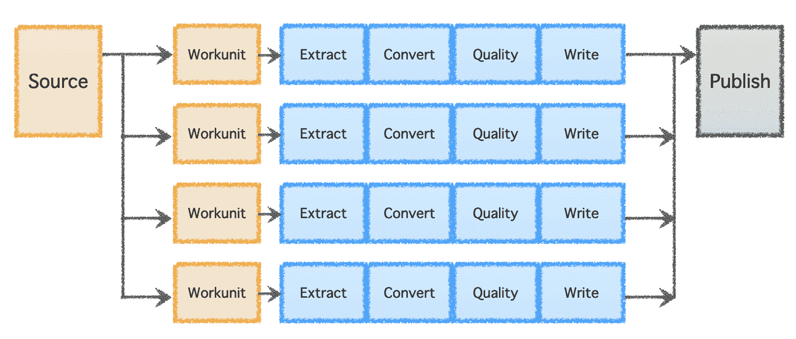
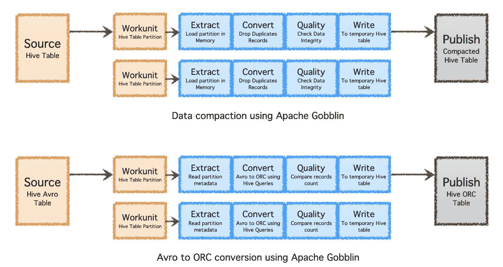
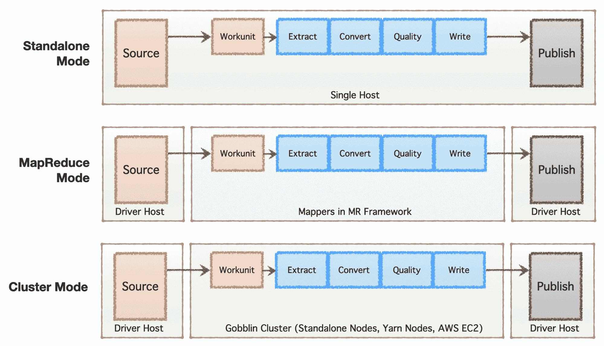
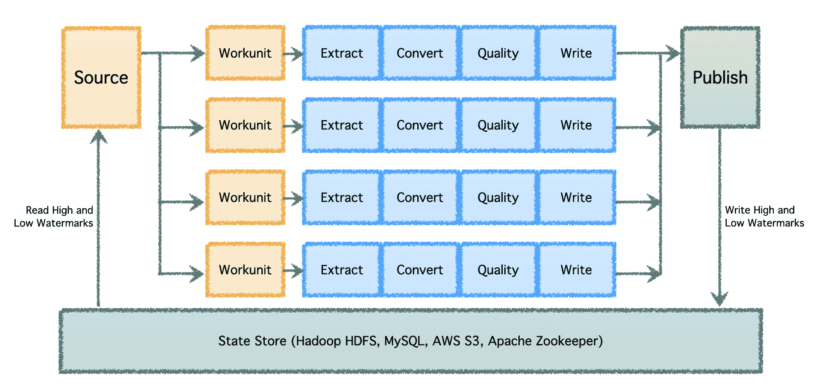

# 通过 Apache Gobblin 扩展数据管理

> 原文：[`www.kdnuggets.com/2023/01/scaling-data-management-apache-gobblin.html`](https://www.kdnuggets.com/2023/01/scaling-data-management-apache-gobblin.html)

# 大数据管理的挑战

* * *

## 我们的前三个课程推荐

 1\. [谷歌网络安全证书](https://www.kdnuggets.com/google-cybersecurity) - 快速进入网络安全职业

 2\. [谷歌数据分析专业证书](https://www.kdnuggets.com/google-data-analytics) - 提升你的数据分析能力

 3\. [谷歌 IT 支持专业证书](https://www.kdnuggets.com/google-itsupport) - 支持你的 IT 组织

* * *

在现代世界，大多数企业依赖大数据和分析的力量来推动其增长、战略投资和客户参与。大数据是目标广告、个性化营销、产品推荐、洞察生成、价格优化、情感分析、预测分析等的基础。

数据通常从多个来源收集，经过转换、存储，并在本地或云端的数据湖中处理。虽然数据的初步摄取相对简单，可以通过内部开发的自定义脚本或传统的 ETL（提取、转换、加载）工具实现，但问题很快会变得复杂且昂贵，公司必须：

1.  管理整个数据生命周期 - 以满足清理和合规要求

1.  优化存储 - 以减少相关成本

1.  简化架构 - 通过重用计算基础设施

1.  增量处理数据 - 通过强大的状态管理

1.  在批量和流数据上应用相同的政策 - 避免重复劳动

1.  在本地和云端之间迁移 - 以最小的努力

这就是[Apache Gobblin](https://gobblin.apache.org/)，一个开源的数据管理和集成系统的用武之地。Apache Gobblin 提供了无与伦比的功能，可以根据业务需求选择整体或部分使用。

# 使用 Gobblin 简化大数据管理

在本节中，我们将深入探讨 Apache Gobblin 的各种功能，帮助解决之前概述的挑战。

## 管理整个数据生命周期

Apache Gobblin 提供了一系列功能来构建数据管道，支持对数据集的所有生命周期操作。

1.  数据摄取 - 从多个来源到各种目的地，包括数据库、Rest API、FTP/SFTP 服务器、文件存储、如 Salesforce 和 Dynamics 等 CRM 系统，等等。

1.  复制数据 - 在多个数据湖之间，通过 Distcp-NG 为 Hadoop 分布式文件系统提供专门的功能。

1.  清理数据 - 使用基于时间的、新近 K、版本化或组合政策等保留政策。

Gobblin 的逻辑管道包括一个确定工作分配并创建“工作单元”（'Workunits'）的“源”（'Source'）。这些“工作单元”随后被提取执行为“任务”（'Tasks'），任务包括数据提取、转换、质量检查和写入目标。最后一步，“数据发布”（'Data Publish'），验证管道的成功执行，并在目标支持的情况下原子性地提交输出数据。

图片由作者提供

## 优化存储

Apache Gobblin 可以通过在数据摄取或复制后进行后处理（例如压缩或格式转换），帮助减少所需的存储量。

1.  压缩 - 对数据进行后处理，以基于所有字段或关键字段去重，修剪数据以保留具有最新时间戳的唯一记录。

1.  Avro 到 ORC - 作为一种专用格式转换机制，将流行的行基 Avro 格式转换为超优化的列基 ORC 格式。

图片由作者提供

## 简化架构

根据公司的阶段（从初创公司到企业）、规模需求及其各自的架构，公司倾向于建立或发展他们的数据基础设施。Apache Gobblin 非常灵活，支持多种执行模型。

1.  独立模式 - 作为单独进程在裸金属主机上运行，即单个主机，适用于简单用例和低需求情况。

1.  MapReduce 模式 - 作为一个 MapReduce 作业在 Hadoop 基础设施上运行，用于处理范围为 PB 规模的大数据集。

1.  集群模式：独立 - 作为一个集群运行，由 Apache Helix 和 Apache Zookeeper 支持，部署在一组裸金属机器或主机上，以处理大规模独立于 Hadoop MR 框架的工作负载。

1.  集群模式：Yarn - 作为一个集群在原生 Yarn 上运行，无需 Hadoop MR 框架。

1.  集群模式：AWS - 作为一个集群在亚马逊公共云服务（即 AWS）上运行，用于托管在 AWS 上的基础设施。

图片由作者提供

## 增量处理数据

在具有多个数据管道和高数据量的大规模环境下，数据需要批量处理并随时间处理。因此，需要进行检查点，以便数据管道能够从上次中断的地方恢复并继续进行。Apache Gobblin 支持低水位和高水位，并通过 HDFS、AWS S3、MySQL 等提供强大的状态管理语义。

图片由作者提供

## 批处理和流数据的相同策略

目前大多数数据管道需要编写两次，一次用于批量数据，一次用于近线或流数据。这会加倍工作量，并在应用于不同类型管道的策略和算法中引入不一致。**Apache Gobblin** 通过允许用户编写一次管道并在批量和流数据上运行来解决这个问题，如果在 Gobblin 集群模式、AWS 模式或 Yarn 模式中使用 Gobblin。

## 在本地和云之间迁移

由于其多功能模式可以在单台机器、节点集群或云上运行，**Apache Gobblin** 可以在本地和云上部署和使用。因此，用户可以根据具体需求，仅需编写一次数据管道，并与 Gobblin 部署一起轻松迁移本地和云之间。

由于其高度灵活的架构、强大的功能以及支持和处理极大数据量的能力，**Apache Gobblin** 被[主要技术公司](https://gobblin.apache.org/powers/) 用于生产基础设施，并且是今天任何大数据基础设施部署的必备工具。

有关 Apache Gobblin 及其使用方式的更多细节可以在 [`gobblin.apache.org`](https://gobblin.apache.org/) 找到。

**[Abhishek Tiwari](https://www.linkedin.com/in/findabti/)** 是 LinkedIn 的高级经理，负责领导公司的大数据管道组织。他还是 Apache 软件基金会的 Apache Gobblin 副总裁以及英国计算机学会的会员。

### 更多相关话题

+   [使用 Python 扩展数据规模](https://www.kdnuggets.com/2023/07/data-scaling-python.html)

+   [扩展 Web 数据驱动产品时应了解的事项](https://www.kdnuggets.com/2023/08/things-know-scaling-web-datadriven-product.html)

+   [数据讲故事——通过数据讲述故事的艺术](https://www.kdnuggets.com/2023/07/manning-data-storytelling-the-art-telling-stories-data.html)

+   [探索思维树提示：AI 如何通过搜索学习推理…](https://www.kdnuggets.com/2023/07/exploring-tree-of-thought-prompting-ai-learn-reason-through-search.html)

+   [通过验证链解锁可靠生成：一个…](https://www.kdnuggets.com/unlocking-reliable-generations-through-chain-of-verification)

+   [如何使用 Apache Kafka 构建可扩展的数据架构](https://www.kdnuggets.com/2023/04/build-scalable-data-architecture-apache-kafka.html)
