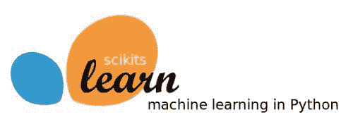
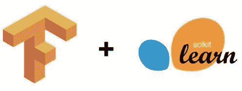

# Scikit Flow: 使用 TensorFlow 和 Scikit-learn 轻松进行深度学习

> 原文：[`www.kdnuggets.com/2016/02/scikit-flow-easy-deep-learning-tensorflow-scikit-learn.html`](https://www.kdnuggets.com/2016/02/scikit-flow-easy-deep-learning-tensorflow-scikit-learn.html)

 评论

Google 的 [TensorFlow](https://github.com/tensorflow/tensorflow) 自 2015 年 11 月起公开发布，毫无疑问，在短短几个月内，它对机器学习以及深度学习产生了影响。通过博客文章、学术论文和各种网络教程，有广泛的接受证据。

当然，估计真正的采纳率是困难的，但 TensorFlow 的 Github 仓库有 [几乎是两倍的星标数量](https://github.com/showcases/machine-learning) 比下一个最多星标的机器学习项目 [Scikit-learn](https://github.com/scikit-learn/scikit-learn) 和最接近的深度学习项目 Berkeley Vision and Learning Center 的 [Caffe](https://github.com/BVLC/caffe)。虽然这不能具体指示 TensorFlow 已经成为该领域的领导者，但可以相当容易地推测，鉴于其相对较新的发布，Google 的深度学习库引起了相当大的兴趣和使用。

* * *

## 我们的前三大课程推荐

 1\. [Google 网络安全证书](https://www.kdnuggets.com/google-cybersecurity) - 快速进入网络安全职业

 2\. [Google 数据分析专业证书](https://www.kdnuggets.com/google-data-analytics) - 提升您的数据分析技能

 3\. [Google IT 支持专业证书](https://www.kdnuggets.com/google-itsupport) - 支持您的组织的 IT

* * *


大多数情况下，TensorFlow 相对简单易用，没有使用该库经验的神经网络爱好者可以查看给定网络的代码并直观地理解其内容。语法**可能**会更加直接和简洁，而不使用任何包装器，但显然有原因不这样做。从技术上讲，TensorFlow 是“一个用于数据流图的数值计算的开源软件库”，虽然它（主要）用于机器学习和深度学习研究（及生产），但该系统足够通用，可以应用于广泛的其他领域。如果 TensorFlow 更加深度学习友好，这种特性可能会削弱其在其他潜在领域的适用性。

```py
# A simple Hello World! using TensorFlow
import tensorflow as tf

hello = tf.constant('Hello, TensorFlow!')
sess = tf.Session()
sess.run(hello)

# -> Hello, TensorFlow!

```

然而，许多机器学习研究人员和从业者使用 Python 的原因之一，是因为其快速原型设计能力。TensorFlow 本身并不一定禁止这种快速周转，但确实存在某种学习曲线，特别是如果你对其他类似的库，如 Theano，不熟悉的话。

但如果你可以快速上手 TensorFlow 并几乎立即开始训练神经网络，而不需要学习额外的语法或配置怎么办？这正是 Scikit Flow 的作用。然而，我会稍微偏离一下话题。

### Scikit-learn + TensorFlow = Scikit Flow

Scikit-learn 作为 *事实* 上的官方 Python 通用机器学习框架，拥有丰富的历史。虽然我相信这句话会（并且可以）引起争议，也许它有点强烈，但不可否认的是，Scikit-learn 在 Python 机器学习生态系统中占据了重要地位，并且在机器学习领域也如此。



其易用性和标准化接口与此有关。例如，Scikit-learn 利用简单的 **fit/predict** 工作流模型 [来实现其分类算法](https://github.com/mmmayo13/scikit-learn-classifiers/blob/master/sklearn-classifiers-tutorial.ipynb)。这使得构建、训练和测试模型变得非常简单。一个典型逻辑回归模型的测试/训练相关代码可能看起来像这样：

```py
from sklearn.linear_model import LogisticRegression
from sklearn import datasets, metrics

iris = datasets.load_iris()
classifier = LogisticRegression()
classifier.fit(iris.data, iris.target)
score = metrics.accuracy_score(iris.target, classifier.predict(iris.data))
print("Accuracy: %f" % score)

```

想尝试一个朴素贝叶斯分类器？这不需要太多更改：

```py
from sklearn.naive_bayes import GaussianNB
from sklearn import datasets, metrics

iris = datasets.load_iris()
classifier = GaussianNB()
classifier.fit(iris.data, iris.target)
score = metrics.accuracy_score(iris.target, classifier.predict(iris.data))
print("Accuracy: %f" % score)

```

唯一的变化是在第一行的导入语句和分类器实例化语句。鉴于此，我们可以轻松看到 Scikit 模型接口的一致性和简洁性。即使在阅读之前你对此一无所知，你也已经明白了，因为它很简单。尽管当然，机器学习管道的内容远不止于上述的 7 行代码，但这 7 行涵盖了一个重要且广泛的方面，并且无论分类器如何都一样。

现在回到 [Scikit Flow (skflow)](https://github.com/tensorflow/skflow)：既然（几乎）每个 Python 机器学习生态系统中的人都对 Scikit-learn 有一定了解，那么如果你能立即利用 TensorFlow 的建模能力，同时保留 Scikit-learn 的语法简洁性呢？Scikit Flow（名字本身就暗示了这种利用和引导）官方的介绍如下：

> 这是 TensorFlow 的简化接口，用于让人们开始进行预测分析和数据挖掘。

实际上，更明确地说，Scikit Flow 是 TensorFlow 深度学习库的高级封装器，它允许使用简洁、熟悉的 Scikit-learn 方法来训练和拟合神经网络。

为了回答“为什么选择 Scikit Flow？”的问题，它的仓库 README 解释了：

> 为了使从 Scikit Learn 的单行机器学习世界过渡到更开放的构建不同形状的 ML 模型的世界变得更加顺畅，你可以从使用 fit/predict 开始，随着你逐渐适应，再逐步过渡到 TensorFlow APIs。



重要的是，Scikit Flow 是 Google 推出的官方 TensorFlow 项目；这不是一个被破解的第三方解决方案……并不是说这样做有什么问题。完全没有。但 Google 开发、发布并支持这个项目的事实，应该能给你足够的信心，**它**确实会使这两个库按承诺协同工作。它也很受欢迎；在写这篇文章时，Scikit Flow 的仓库拥有近 1700 个星标。

### 讨论

现在我们将查看几个示例。如果你想在家尝试，请确保你已安装以下内容：

+   Python: 2.7, 3.4+

+   Scikit learn: 0.16, 0.17, 0.18+

+   Tensorflow: 0.6+

Scikit Flow 可以使用 `pip` 通过以下一行代码轻松安装：

```py
>>> pip install git+git://github.com/tensorflow/skflow.git

```

首先，我们将查看在 Scikit Flow 中实现通用线性分类器的方法。

```py
import skflow
from sklearn import datasets, metrics

iris = datasets.load_iris()
classifier = skflow.TensorFlowLinearClassifier(n_classes=3)
classifier.fit(iris.data, iris.target)
score = metrics.accuracy_score(iris.target, classifier.predict(iris.data))
print("Accuracy: %f" % score)

```

如上所示，上述示例遵循了 Scikit-learn 的类似 **fit/predict** 模型。如果你查看早期的 Scikit-learn 模型，你会发现它们与上述示例的相似性。

但这只是一个线性分类器，并不是真正的深度学习。真正展现 Scikit Flow 强大功能的是深度神经网络。一个通用的三层神经网络，具有 10、20 和 10 个隐藏节点，可以通过如下代码轻松实现：

```py
import skflow
from sklearn import datasets, metrics

iris = datasets.load_iris()
classifier = skflow.TensorFlowDNNClassifier(hidden_units=[10, 20, 10], n_classes=3)
classifier.fit(iris.data, iris.target)
score = metrics.accuracy_score(iris.target, classifier.predict(iris.data))
print("Accuracy: %f" % score)

```

再次强调，变化非常小。我们没有使用前一个示例中的 TensorFlowLinearClassifier，而是使用了 TensorFlowDNNClassifier，这使我们能够在 7 行（大量辅助）代码中构建、训练和测试一个深度神经分类器。我们仅明确指定了节点数和隐藏层数。Scikit Flow 还提供了一个标准的递归神经网络，一些额外的分类器，作为一个早期的工作和官方 TensorFlow 项目之一，可以认为将很快增加其他标准架构和分类器。

若要进行几乎完全相同的比较，请查看 [Scikit Flow](https://github.com/tensorflow/skflow/blob/master/examples/mnist.py) 和“原始” [TensorFlow](https://www.tensorflow.org/versions/0.6.0/tutorials/mnist/pros/index.html) 对 MNIST 图像分类器的实现。Github 仓库中还有 [更多示例](https://github.com/tensorflow/skflow/tree/master/examples)（包括一个有趣的示例，它与 [Dask](https://github.com/blaze/dask) 并行处理引擎接口，用于核心外数据分类）。

Scikit Flow 也允许在低级 TensorFlow 之间进行混合交互。对于那些有兴趣在较低级别创建架构，然后通过高级接口进行训练和测试的人来说，Scikit Flow 可能是一个不错的选择。它也可能有助于深度架构的分布性；当共享在较低级别创建的架构时，为其他人提供熟悉的 Scikit-learn 接口进行训练和测试可能不是一个坏主意，当然，这取决于具体情况。

### 结论

虽然 skflow 可能没有“原始” TensorFlow 的灵活性，但高级抽象允许快速原型设计神经网络。它还使深度学习和 TensorFlow 的新手几乎可以立即变得高效。考虑到 TensorFlow 代码仍然可以与之并行编写，在需要时有机会混合代码并提供更大的灵活性。

Scikit Flow 可能会在其他情况下找到市场，比如模型共享或管理较低级别网络的训练和测试，看来谷歌确实推出了一个设计良好的 TensorFlow 附加组件，这个附加组件肯定不会阻碍其进一步的采用。

*更新*：来自 Scikit Flow 开发者的 [新 Reddit 帖子](https://www.reddit.com/r/MachineLearning/comments/457az3/what_do_you_want_to_see_next_in_tensorflowskflow/) 正在征求添加功能的意见。有什么想法吗？可以在那儿留言。

**简介：[Matthew Mayo](https://twitter.com/mattmayo13)** 是一名计算机科学研究生，目前正在撰写关于并行化机器学习算法的论文。他还是数据挖掘的学生、数据爱好者和有志于成为机器学习科学家的人。

**相关：**

+   TensorFlow 令人失望 – 谷歌深度学习表现平平

+   微软深度学习带来创新功能 – CNTK 显示出潜力

+   7 步理解深度学习

### 更多相关话题

+   [建立一个强大的数据团队](https://www.kdnuggets.com/2021/12/build-solid-data-team.html)

+   [使用管道编写干净的 Python 代码](https://www.kdnuggets.com/2021/12/write-clean-python-code-pipes.html)

+   [停止学习数据科学以寻找目标，并寻找目标以…](https://www.kdnuggets.com/2021/12/stop-learning-data-science-find-purpose.html)

+   [学习数据科学的顶级统计资源](https://www.kdnuggets.com/2021/12/springboard-top-resources-learn-data-science-statistics.html)

+   [一项 90 亿美元的人工智能失败，探讨](https://www.kdnuggets.com/2021/12/9b-ai-failure-examined.html)

+   [成功数据科学家的 5 个特征](https://www.kdnuggets.com/2021/12/5-characteristics-successful-data-scientist.html)
