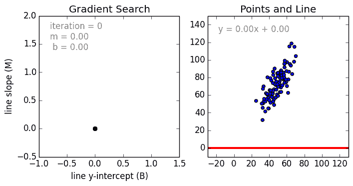
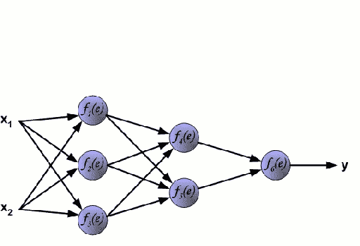
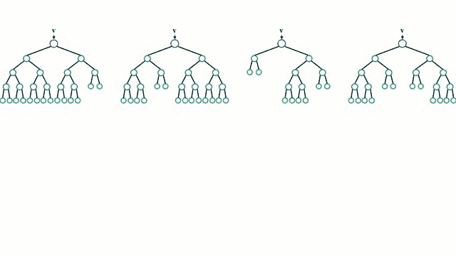

# 选择最佳机器学习算法以解决回归问题

> 原文：[`www.kdnuggets.com/2018/08/selecting-best-machine-learning-algorithm-regression-problem.html`](https://www.kdnuggets.com/2018/08/selecting-best-machine-learning-algorithm-regression-problem.html)

 评论

在处理任何类型的机器学习（ML）问题时，有许多不同的算法可供选择。在机器学习中，有一个称为“无免费午餐”定理的理论，该定理基本上表示没有一种 ML 算法对所有问题都最好。不同 ML 算法的性能很大程度上依赖于数据的大小和结构。因此，正确的算法选择通常不明确，除非我们通过简单的试验和错误直接测试算法。

但是，每种机器学习（ML）算法都有其优缺点，我们可以以此作为指导。虽然一种算法并不总是优于另一种，但每种算法都有一些特性，我们可以利用这些特性快速选择合适的算法并调整超参数。我们将查看一些针对回归问题的突出的机器学习算法，并根据它们的优缺点制定使用指南。本文将作为选择最佳机器学习算法以解决回归问题的一个很好的参考！

### **线性和多项式回归**

线性回归

从简单的情况开始，单变量线性回归是一种用于建模单个输入自变量（特征变量）与输出因变量之间关系的技术，即使用线性模型（即一条直线）。更一般的情况是多变量线性回归，其中创建一个模型来表示多个自变量（特征变量）与输出因变量之间的关系。模型仍然是线性的，即输出是输入变量的线性组合。

还有一种第三种更一般的情况叫做多项式回归，其中模型变成了特征变量的非线性组合，即可能包含指数变量、正弦和余弦等。这需要了解数据如何与输出相关。回归模型可以使用随机梯度下降（SGD）进行训练。

**优点：**

+   模型建立快速，特别适用于需要建模的关系不非常复杂且数据量不大的情况。

+   线性回归容易理解，这对商业决策非常有价值。

**缺点：**

+   对于非线性数据，多项式回归的设计可能非常具有挑战性，因为必须对数据的结构和特征变量之间的关系有一些了解。

+   由于上述原因，这些模型在处理高度复杂的数据时不如其他模型。

### **神经网络**

神经网络

神经网络由一组互相连接的节点组成，这些节点称为神经元。数据中的输入特征变量作为多变量线性组合传递给这些神经元，其中每个特征变量乘以的值称为权重。然后，对这个线性组合应用非线性，使神经网络能够建模复杂的非线性关系。神经网络可以拥有多个层，其中一层的输出以相同的方式传递给下一层。在输出处，通常不应用非线性。神经网络使用随机梯度下降（SGD）和反向传播算法（在上面的 GIF 中显示）进行训练。

**优点：**

+   由于神经网络可以拥有许多层（因此有多个参数）和非线性，它们在建模高度复杂的非线性关系方面非常有效。

+   我们通常不必担心数据的结构，因为神经网络在学习几乎任何类型的特征变量关系时都非常灵活。

+   研究一致表明，只要给网络更多的训练数据，无论是全新的还是通过增强原始数据集得到的，都能提升网络的性能。

**缺点：**

+   由于这些模型的复杂性，它们不容易解释和理解。

+   它们的训练可能非常具有挑战性且计算密集，需要仔细调整超参数和设置学习率计划。

+   它们需要大量数据才能达到高性能，且在“小数据”情况下通常被其他机器学习算法超越。

### ****回归树和随机森林****

随机森林

从基础情况开始，决策树是一个直观的模型，在这个模型中，人们沿着树的分支向下遍历，并根据节点的决策选择下一个要进入的分支。树的归纳任务是将一组训练实例作为输入，决定最适合拆分的属性，拆分数据集，然后对结果拆分的数据集进行递归，直到所有训练实例都被分类。在构建树时，目标是基于属性进行拆分，以创建尽可能纯净的子节点，这将使分类数据集中的所有实例所需的拆分次数最小化。纯度通过信息增益的概念来衡量，这与需要了解多少关于一个先前未见的实例以便正确分类有关。在实践中，通过比较熵，即分类当前数据集分区中的单个实例所需的信息量，与如果对当前数据集分区进行进一步拆分的情况下分类单个实例所需的信息量来进行测量。

随机森林仅仅是决策树的集成。输入向量通过多个决策树进行计算。对于回归，所有树的输出值取平均；对于分类，使用投票机制来确定最终类别。

**优点：**

+   擅长学习复杂的、高度非线性的关系。它们通常能够实现相当高的性能，优于多项式回归，并且通常与神经网络相当。

+   非常容易解释和理解。尽管最终训练的模型可以学习复杂的关系，但在训练过程中建立的决策边界容易理解且实用。

**缺点：**

+   由于决策树训练的性质，它们可能容易出现严重的过拟合。一个完成的决策树模型可能过于复杂，并包含不必要的结构。尽管通过适当的树修剪和更大的随机森林集成可以在一定程度上缓解这个问题。

+   使用更大的随机森林集成来实现更高的性能有其缺点，包括速度较慢和需要更多的内存。

### **结论**

哇！这就是你的优缺点！在下一篇文章中，我们将探讨不同分类模型的优缺点。希望你喜欢这篇文章并学到了一些新知识。如果有收获，欢迎点赞。

**简介： [George Seif](https://towardsdatascience.com/@george.seif94)** 是一名认证的极客和人工智能/机器学习工程师。

[原文](https://towardsdatascience.com/selecting-the-best-machine-learning-algorithm-for-your-regression-problem-20c330bad4ef)。经许可转载。

**相关：**

+   接收器操作特性曲线揭秘（Python 版）

+   Python 中的 5 个快速简单的数据可视化示例（附代码）

+   数据科学家需要了解的 5 种聚类算法

* * *

## 我们的前三个课程推荐

 1\. [Google 网络安全证书](https://www.kdnuggets.com/google-cybersecurity) - 快速进入网络安全职业道路。

 2\. [Google 数据分析专业证书](https://www.kdnuggets.com/google-data-analytics) - 提升你的数据分析技能。

 3\. [Google IT 支持专业证书](https://www.kdnuggets.com/google-itsupport) - 支持你的组织的 IT 需求。

* * *

### 更多相关内容

+   [在选择下一个数据科学职位前需考虑的 5 个要点](https://www.kdnuggets.com/2022/01/5-things-keep-mind-selecting-next-job.html)

+   [解决下一个数据科学问题的 5 步蓝图](https://www.kdnuggets.com/5-step-blueprint-to-your-next-data-science-problem)

+   [现实世界中的 NLP 应用范围：一种不同的…](https://www.kdnuggets.com/2022/03/different-solution-problem-range-nlp-applications-real-world.html)

+   [Python 中的遗传编程：背包问题](https://www.kdnuggets.com/2023/01/knapsack-problem-genetic-programming-python.html)

+   [梯度消失问题：原因、后果及解决方案](https://www.kdnuggets.com/2022/02/vanishing-gradient-problem.html)

+   [今天 90% 的代码是为了防止失败而编写的，这确实是个问题](https://www.kdnuggets.com/2022/07/90-today-code-written-prevent-failure-problem.html)
