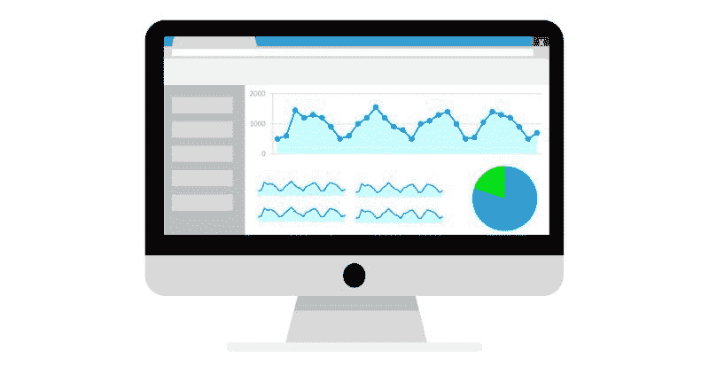

# 如何说服你的老板数据分析的必要性

> 原文：[`www.kdnuggets.com/2019/08/sell-boss-need-data-analytics.html`](https://www.kdnuggets.com/2019/08/sell-boss-need-data-analytics.html)

 评论

数据分析相对较新，但有许多应用场景。公司已经收集信息好几代了。然而，最近技术工具让他们能够评估这些信息，并根据其指示做出明智的决策。由于数据科学是一个新兴领域，一些商业领袖对采纳它有所犹豫，或者希望以令人沮丧的慢速推进。

* * *

## 我们的前 3 个课程推荐

 1\. [Google 网络安全证书](https://www.kdnuggets.com/google-cybersecurity) - 快速进入网络安全职业的快车道。

 2\. [Google 数据分析专业证书](https://www.kdnuggets.com/google-data-analytics) - 提升你的数据分析能力

 3\. [Google IT 支持专业证书](https://www.kdnuggets.com/google-itsupport) - 支持你组织的 IT

* * *

如果你是一名数据科学专业人士，发现自己处于这种情况可能会特别限制你的发展。以下是一些你可以向老板说明为何分析投资对公司来说是明智之举的方法。

### 1\. 使用易懂的语言

首先要做的是抵制用高深语言堆砌你的推介的冲动。许多你能熟练说出的“大数据”定义对你的老板来说可能就像外语一样。想好要说什么时，尽量将你的词汇和语气保持朴实。

你甚至可以在接触你的老板之前，将你的信息传达给一个对数据分析完全陌生的朋友。问问他们是否理解了你说的内容，以及在任何时候是否感到困惑。还可以征求他们对如何使演示更适合没有广泛数据分析知识的人的意见。

### 2\. 专注于竞争优势

竞争是商业领袖们非常了解的话题。他们知道，无法竞争通常会导致公司倒闭或在市场上遭遇激烈的困境。

因此，值得向你的老板提及，许多商业领袖认识到大数据投资与竞争力提升之间的关系。NewVantage Partners 发布了其 [2019 年大数据与人工智能执行调查](https://newvantage.com/wp-content/uploads/2018/12/Big-Data-Executive-Survey-2019-Findings-Updated-010219-1.pdf) 以了解这些技术相关的投资模式。调查显示，超过 91% 的受访者加快了他们在大数据和人工智能（AI）方面的投资步伐。

此外，大约相同比例的人提到他们认为技术投资对于转型成为敏捷和竞争力强的企业是必要的。来自福特汽车、Capital One 和 Aetna 的代表是提供反馈的品牌之一。像这样知名品牌看到竞争与大数据投资之间的联系，可能会鼓励你的老板效仿。

### 3\. 理解你老板的动机

[向高层管理人员推销创意](https://blog.pipelinedeals.com/how-to-sell-to-c-level-executives/)与对待其他职位的人的方法不同。公司领导无需像低层员工那样通过层级批准事务。

这意味着整体决策过程变得更短。你可以通过借鉴销售人员的方法来促进事情的发展——并增加老板决定支持你的可能性。花时间了解权威人物的动机。换句话说，考虑一下他们在批准大数据投资后最可能想要达成的目标。

利润当然是其中的一部分，但你可能需要更深入地了解你老板的关切所在。例如，大数据可能解决哪些问题，从而影响盈利能力？

在一个案例中，Georgia-Pacific 希望采取更先进的方法来处理数据，并使用了亚马逊网络服务（AWS）来帮助。该公司知道一些机械的停机可能每年使公司损失数百万美元。它利用数据分析帮助预测一些设备故障[提前三个月](https://aws.amazon.com/solutions/case-studies/georgia-pacific/)。花时间思考公司中现有的痛点，大数据可能解决这些问题。然后，在你的陈述中留出一些时间，强调为什么分析可能提供如此有前景的可能性。

### 4\. 强调分析工具可以使数据对所有人更加可及

你的老板可能担心增加公司的投资会使数据科学家提取更多的洞见，而让其他人知之甚少。然而，一些公司利用分析的方式打破了信息可能带来的障碍。

在一个[数据科学成功案例](https://www.cio.com/article/3221621/6-data-analytics-success-stories-an-inside-look.html)中，TD 银行希望使分析师更容易利用公司的信息，而无需过多依赖数据科学家。最终，这使得数据集对所有需要使用的人更加可用。TD 银行还花时间评估哪些工具可以帮助实现这个目标。

如果你的老板觉得分析会使公司的信息仅对数据专家开放，积极主动地缓解这种担忧。你可以建议老板制定数据分析工具的必备功能清单，然后提出花时间研究哪些软件具备这些功能。

### 5\. 尽可能引用统计数据

除了提到使用数据分析并获得令人满意结果的公司外，尽量在向老板推销时包括统计数据。如果你能找到与节省资金、提高生产力或改善客户互动相关的信息，那是最理想的。

如果你能提到你所在行业的一家公司在将预算更多地分配到数据科学后一年获得了 72%的成本节省，而不是仅仅说它取得了显著增长，那会更有影响力。尽可能具体地描述你老板可能在引入数据科学后看到的好处。

### 6\. 讨论你的老板可能在没有分析的情况下错过的事情

数据分析软件的一个主要优势是它能从大量信息中提取结果，所需时间远少于人工。你可以在讨论未引入数据科学可能导致公司信息不足时牢记这一点。

例如，数据分析可能显示千禧一代对某个营销活动反应不佳，但 40-50 岁的人群最喜欢它。这可能表明某个城市是新分支机构的理想位置，基于来自希望在那里开设分支的客户的呼叫数量。

角度要明确，让人清楚数据分析投资在当今时代越来越必要。它们使人们比没有这种技术时了解更多信息。

### 耐心和自信有很大作用

除了记住这些建议外，还要记住，可能需要与老板进行多次严肃的谈话，才能说服他们批准数据分析。如果你对自己所说的内容充满信心，也会有所帮助。

如果你的老板问你无法回答的问题，说明你会找出他们需要了解的内容并反馈给他们。采取这种方式表明你既细心又坚持不懈。

**个人简介: [凯拉·马修斯](http://productivitybytes.com/subscribe-to-productivity-bytes/)** 在《The Week》、《The Data Center Journal》和《VentureBeat》等出版物上讨论技术和大数据，已经写作超过五年。要阅读凯拉更多的文章，[**订阅她的博客 Productivity Bytes**](http://productivitybytes.com/subscribe-to-productivity-bytes/)。

**相关：**

+   为什么数据专业人士应当谈判每一个工作机会

+   如何展示你的数据科学工作的影响

+   6 个逐渐热衷于预测分析和预测的行业

### 了解更多相关话题

+   [如何像老板一样进行 MLOps：无泪机器学习指南](https://www.kdnuggets.com/2023/06/mlops-like-boss-guide-machine-learning-without-tears.html)

+   [我们不需要数据科学家，我们需要数据工程师](https://www.kdnuggets.com/2021/02/dont-need-data-scientists-need-data-engineers.html)

+   [构建供应链管道所需的 6 种数据科学技术](https://www.kdnuggets.com/2022/01/6-data-science-technologies-need-build-supply-chain-pipeline.html)

+   [想利用你的数据技能解决全球问题？请看这里……](https://www.kdnuggets.com/2022/04/jhu-want-data-skills-solve-global-problems.html)

+   [你晋升所需的数据分析师技能](https://www.kdnuggets.com/2022/09/data-analyst-skills-need-next-promotion.html)

+   [提升你的数据科学技能：你需要的关键 SQL 认证](https://www.kdnuggets.com/boost-your-data-science-skills-the-essential-sql-certifications-you-need)
