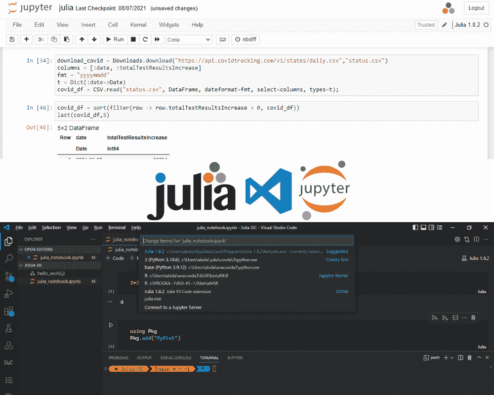
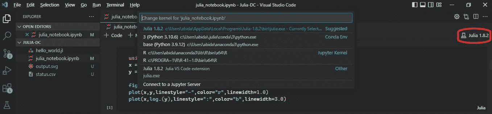
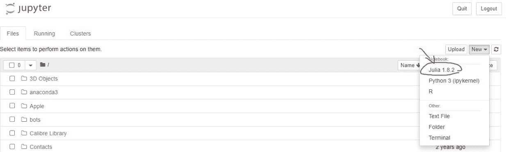
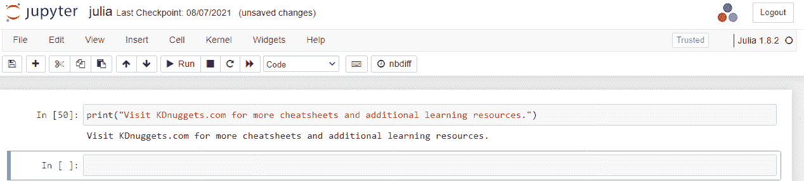
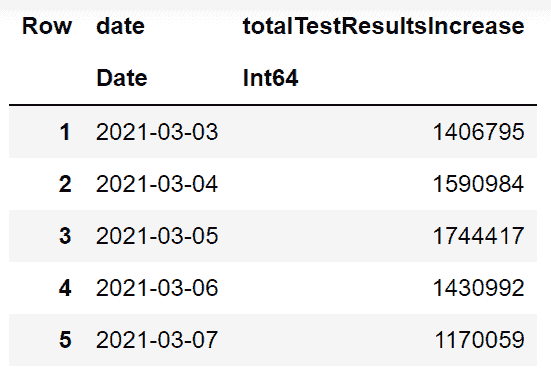
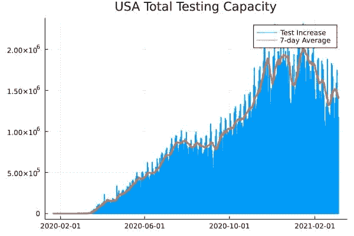

# 如何在 Jupyter Notebook 上设置 Julia

> 原文：[`www.kdnuggets.com/2022/11/setup-julia-jupyter-notebook.html`](https://www.kdnuggets.com/2022/11/setup-julia-jupyter-notebook.html)



图片由作者提供

Julia 是一种高级通用语言，旨在进行高性能计算。由于自然语言语法、更快的代码执行速度和强大的机器学习生态系统，它在数据社区和研究人员中越来越受欢迎。

* * *

## 我们的前三大课程推荐

 1\. [Google 网络安全证书](https://www.kdnuggets.com/google-cybersecurity) - 快速进入网络安全职业。

 2\. [Google 数据分析专业证书](https://www.kdnuggets.com/google-data-analytics) - 提升你的数据分析技能

 3\. [Google IT 支持专业证书](https://www.kdnuggets.com/google-itsupport) - 支持你的组织的 IT 工作

* * *

由于集成笔记本的普及，数据科学家和研究人员现在在 Jupyter Notebook 上运行 Python、R、Bash、Scala、Ruby 和 SQL。现在，我们将学习如何安装 Julia 并将其配置到 Jupyter notebook 中。此外，我们将加载 CSV 文件并执行时间序列数据可视化。

# 在 Jupyter Notebook 上设置 Julia

Julia 可以通过在 REPL 中运行代码或执行 `.jl` 文件来使用，但在 Jupyter notebook 中运行代码可以给我们更多的实验控制权。你可以在笔记本中进行数据分析、训练机器学习模型，甚至创建一个 Julia 软件包。

## 步骤 1：下载并安装软件包

你可以通过访问官方[网站](https://julialang.org/downloads/)下载并安装当前稳定版的 Julia。稳定版可用于 Windows、Linux 和 macOS。

我花了几分钟下载并安装了适用于 Windows 的 Julia。要运行 Julia REPL，你可以在 PowerShell、终端或 Bash 中输入“**julia**”。你也可以在开始菜单中找到 Julia 图标并点击它以启动 REPL。

## 步骤 2：安装 IJulia

要将 Julia 与 Jupyter Notebook 集成，你需要安装**Ijulia**软件包。

**在 Julia REPL 中，输入：**

```py
using Pkg
Pkg.add("IJulia")
```



图片由作者提供 | Julia REPL

你也可以通过输入“]”进入包菜单来安装 Julia 软件包。之后输入 `add Ijulia` 来安装该软件包。


图片由作者提供 | 安装 Ijulia

## 步骤 3：在 Jupyter Notebook 中运行 Julia

我们现在准备使用 Jupyter Notebook。启动 Jupyter notebook，点击**新建**按钮并选择**Julia**环境。



作者提供的图像 | Jupyter Notebook

对于 VSCode，创建一个新的 Jupyter Notebook 文件，并通过点击内核名称将内核从 Python 更改为 Julia，如下所示。

现在我们有 R、Python 和 Julia 环境。你可以根据需求在它们之间切换。


作者提供的图像 | VScode Jupyter Notebook

# 开始使用 Julia

安装 Julia 后，我们来写一个简单的代码来打印文本。与 Python 一样，它顺利执行了命令。



作者提供的图像 | Jupyter Notebook 上的代码执行

```py
print("Visit KDnuggets.com for more cheat sheets and additional learning resources.")

>>> Visit KDnuggets.com for more cheat sheets and additional learning resources.
```

## 安装包

你可以在 Jupyter 单元格中通过输入 `using Pkg` 和 `Pkg.add(<Package Name>)` 来安装任何 Julia 包。

我们将安装 DataFrame、CSV、Plots、PyPlot 和 RollingFunctions。

```py
using Pkg

Pkg.add("DataFrames")
Pkg.add("CSV")
Pkg.add("Plots")
Pkg.add("PyPlot")
Pkg.add("RollingFunctions")
```

## 读取 CSV 文件

要访问包，你需要输入 `**using**` 然后输入所有包名，包名之间用逗号“**,**”分隔。

接下来，我们将下载美国 COVID 跟踪数据，并将 CSV 文件保存为“covid_us.csv”。

然后，我们将使用 `CSV.read` 来读取 CSV 文件并将其转换为 DataFrame。我们将选择“date”和“totalTestResultsIncrease”两个列，并更改日期格式。

最后，我们将：

1.  过滤结果以移除负值

1.  将 dataframe 按升序排序

1.  显示最后 5 行。

```py
using Downloads, DataFrames, CSV, Plots, Dates

download_covid = Downloads.download("https://api.covidtracking.com/v1/us/daily.csv",
                                    "covid_us.csv")
columns = [:date, :totalTestResultsIncrease]
fmt = "yyyymmdd"
t = Dict(:date=>Date)

covid_df = CSV.read("covid_us.csv",
                    DataFrame,
                    dateformat=fmt,
                    select=columns,
                    types=t)

covid_df = sort(filter(row -> row.totalTestResultsIncrease > 0, covid_df))
last(covid_df,5)
```



## 数据可视化与 Plot 和 RollingFunctions

我已修改 [Jonathan Dinu](https://jonathandinu.com/blog/julia-data-visualization/) 的代码，以显示美国总测试能力的条形图。

我们将使用 Plot.jl 显示条形图，并使用 RollingFunctions.jl 获取 7 天的总测试结果平均值。

```py
using RollingFunctions

# plot daily test increase as sticks
Plots.plot(covid_df.date,
    covid_df.totalTestResultsIncrease,
    seriestype=:sticks,
    label="Test Increase",
    title = "USA Total Testing Capacity",
    lw = 2)

# 7-day average using rolling mean
window = 7
average = rollmean(covid_df.totalTestResultsIncrease, window)

# we mutate the existing plot
Plots.plot!(covid_df.date,
    cat(zeros(window - 1), average, dims=1),
    label="7-day Average",
    lw=3)
```



这太棒了。

你可以通过访问 [Julia Packages](https://juliapackages.com/) 网页，轻松找到在 Julia 中的替代 Python 和 R 数据分析包。

# 结论

Julia 易于使用，且代码执行速度比 Python 快。如果你正在从 R 和 Matlab 过渡到 Julia，语法和包生态系统将让你感觉自然。

这是一种通用语言，最近由于完全基于 Julia 构建的本地包提供了更快的训练和推理时间，开始吸引机器学习社区。

如果你有任何关于 Julia 的问题，可以在评论中问我。你还可以加入 Julia 社区，使用 Slack、Discord 和 Discourse 了解最新动态。

**[Abid Ali Awan](https://www.polywork.com/kingabzpro)** ([@1abidaliawan](https://twitter.com/1abidaliawan)) 是一位认证数据科学专家，热衷于构建机器学习模型。目前，他专注于内容创作和撰写有关机器学习和数据科学技术的技术博客。Abid 拥有技术管理硕士学位和电信工程学士学位。他的愿景是利用图神经网络构建一个人工智能产品，帮助那些面临心理健康困扰的学生。

### 了解更多此主题

+   [数据科学家的 10 个 Jupyter Notebook 小贴士和技巧](https://www.kdnuggets.com/2023/06/10-jupyter-notebook-tips-tricks-data-scientists.html)

+   [Jupyter Notebook 魔法方法备忘单](https://www.kdnuggets.com/jupyter-notebook-magic-methods-cheat-sheet)

+   [Python 在金融中的应用：在 Jupyter Notebook 中实时数据流](https://www.kdnuggets.com/python-in-finance-real-time-data-streaming-within-jupyter-notebook)

+   [Jupyter Notebook 上的数据科学项目 5 个免费模板](https://www.kdnuggets.com/5-free-templates-for-data-science-projects-on-jupyter-notebook)

+   [在 AWS EC2 上设置和使用 JupyterHub (TLJH)](https://www.kdnuggets.com/2023/01/setup-jupyterhub-tljh-aws-ec2.html)

+   [我应该学习 Julia 吗？](https://www.kdnuggets.com/2022/11/learn-julia.html)
