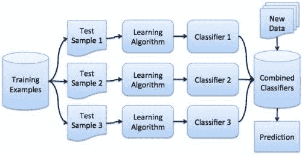
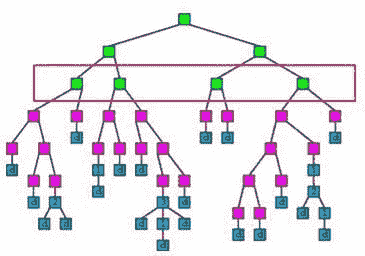
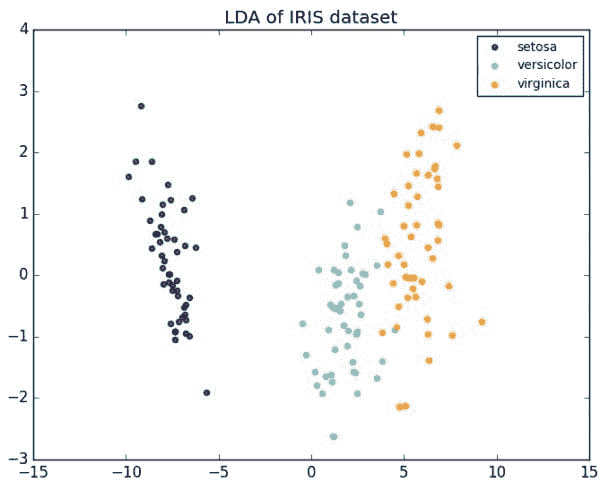
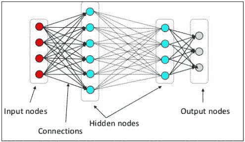

# 掌握 Python 机器学习的 7 个步骤

> 原文：[`www.kdnuggets.com/2017/03/seven-more-steps-machine-learning-python.html/2`](https://www.kdnuggets.com/2017/03/seven-more-steps-machine-learning-python.html/2)

### 第 4 步：更多集成方法

第一篇文章仅涉及单一的集成方法：随机森林（RF）。多年来，RF 作为一种顶级分类器取得了巨大成功，但它肯定不是唯一的集成分类器。我们将查看 bagging、boosting 和 voting。

给我一个提升。

* * *

## 我们的前三个课程推荐

 1\. [谷歌网络安全证书](https://www.kdnuggets.com/google-cybersecurity) - 快速进入网络安全职业轨道。

 2\. [谷歌数据分析专业证书](https://www.kdnuggets.com/google-data-analytics) - 提升你的数据分析能力

 3\. [谷歌 IT 支持专业证书](https://www.kdnuggets.com/google-itsupport) - 支持组织的 IT 需求

* * *

首先，阅读这两个集成学习者的概述，第一个是一般性的，第二个是与 Scikit-learn 相关的：

+   集成学习者简介，作者：Matthew Mayo

+   [Scikit-learn 中的集成方法](http://scikit-learn.org/stable/modules/ensemble.html)，Scikit-learn 文档

然后，在转向新的集成方法之前，先通过这里的新教程重新熟悉随机森林：

+   Python 中的随机森林，来自 Yhat

Bagging、boosting 和 voting 都是不同形式的集成分类器。它们都涉及构建多个模型；然而，**算法**、**数据**和最终如何**组合**结果在这些方案中有所不同。

+   **Bagging** 从相同的分类算法构建多个模型，同时使用来自训练集的不同（独立）数据样本 -- Scikit-learn 实现了 BaggingClassifier

+   **Boosting** 从相同的分类算法构建多个模型，将模型一个接一个地串联，以提升每个后续模型的学习效果 -- Scikit-learn 实现了 AdaBoost

+   **Voting** 从不同的分类算法构建多个模型，并使用标准来确定如何最好地组合这些模型 -- Scikit-learn 实现了 VotingClassifier

那么，为什么要组合模型？从一个具体的角度来看，以下是 偏差-方差权衡 的概述，特别是与提升（boosting）相关的内容，来自 Scikit-learn 文档：

+   [单一估计器与自助法：偏差-方差分解](http://scikit-learn.org/stable/auto_examples/ensemble/plot_bias_variance.html)，Scikit-learn 文档

现在你已经阅读了一些关于集成学习的一般介绍材料，并对几个具体的集成分类器有了基本的了解，请跟随这个介绍，学习如何使用 Scikit-learn 在 Python 中实现集成分类器，参考 Machine Learning Mastery 的内容：

+   [Python 中的集成机器学习算法与 scikit-learn](http://machinelearningmastery.com/ensemble-machine-learning-algorithms-python-scikit-learn/)，作者：Jason Brownlee

### 第 5 步：梯度提升

我们的下一步仍然在集成分类器的领域，重点关注当代最受欢迎的机器学习算法之一。梯度提升在最近的机器学习中产生了显著影响，成为（值得注意的）Kaggle 竞赛中最常用和成功的算法之一。

给我一个梯度提升。

首先，阅读梯度提升的概述：

+   [维基百科上的梯度提升](https://en.wikipedia.org/wiki/Gradient_boosting)

接下来，了解为什么梯度提升是 Kaggle 竞赛中“最成功”的方法：

+   [为什么梯度提升对许多 Kaggle 问题效果这么好？在 Quora 上](https://www.quora.com/Why-does-Gradient-boosting-work-so-well-for-so-many-Kaggle-problems)

+   [一位 Kaggle 大师解释梯度提升](https://blog.kaggle.com/2017/01/23/a-kaggle-master-explains-gradient-boosting/)，作者：Ben Gorman

尽管 Scikit-learn 自带梯度提升实现，我们将有所不同，使用 [XGBoost 库](https://github.com/dmlc/xgboost)，因为 [它被指出](http://www.jmlr.org/proceedings/papers/v42/chen14.pdf)是更快速的实现。

以下链接提供了有关 XGBoost 库以及梯度提升的一些额外信息（出于必要）：

+   [XGBoost 在维基百科上的介绍](https://en.wikipedia.org/wiki/Xgboost)

+   [Github 上的 XGBoost 库](https://github.com/dmlc/xgboost)

+   [XGBoost 文档](https://xgboost.readthedocs.io/en/latest/model.html)

现在，跟随这个教程，将所有内容汇总在一起：

+   [使用 Python 的 XGBoost 梯度提升树指南](https://jessesw.com/XG-Boost/)，作者：Jesse Steinweg-Woods

你还可以跟随这些更简洁的示例进行巩固：

+   [XGBoost 示例（Python）在 Kaggle 上](https://www.kaggle.com/cbrogan/titanic/xgboost-example-python)

+   [鸢尾数据集和 XGBoost 简单教程](http://ieva.rocks/2016/08/25/iris_dataset_and_xgboost_simple_tutorial/)，作者：Ieva Zarina

### 第 6 步：更多降维

[降维](https://en.wikipedia.org/wiki/Dimensionality_reduction)是通过利用过程将用于模型构建的变量从初始数量减少到减少后的数量，以获得一组**主变量**。

降维有 2 种主要形式：

1.  [特征选择](https://en.wikipedia.org/wiki/Feature_selection) - 选择相关特征的子集

1.  [特征提取](https://en.wikipedia.org/wiki/Feature_extraction) - 构建一个信息丰富且不冗余的派生特征值集

以下是对一对常见特征提取方法的介绍。

Iris 数据集的 LDA。

> [**主成分分析（PCA）**](https://en.wikipedia.org/wiki/Principal_component_analysis) 是一种统计程序，使用正交变换将可能相关变量的观测集转换为称为主成分的线性无关变量集。主成分的数量小于或等于原始变量的数量。该变换被定义为使第一个主成分具有最大的可能方差（即解释数据中尽可能多的变异）[.] 

上述定义来自 [PCA 维基百科条目](https://en.wikipedia.org/wiki/Principal_component_analysis)，如果感兴趣，可以进一步阅读。然而，以下概述式教程非常全面：

+   [3 个简单步骤中的主成分分析](http://sebastianraschka.com/Articles/2015_pca_in_3_steps.html)，作者：Sebastian Raschka

> [**线性判别分析（LDA）**](https://en.wikipedia.org/wiki/Linear_discriminant_analysis) 是费舍尔线性判别的推广，这是一种用于统计学、模式识别和机器学习的方法，旨在找到特征的线性组合，以表征或区分两个或多个类别的对象或事件。得到的组合可以用作线性分类器，或者更常见的是，在后续分类之前用于降维。
> 
> LDA 与方差分析（ANOVA）和回归分析密切相关，这些方法也试图将一个因变量表示为其他特征或测量的线性组合。然而，ANOVA 使用分类的自变量和连续的因变量，而判别分析具有连续的自变量和分类的因变量（即类别标签）。

上述定义也来自维基百科。此外，以下内容的阅读也很全面：

+   [线性判别分析 – 一步步详解](http://sebastianraschka.com/Articles/2014_python_lda.html)，作者：Sebastian Raschka

对于降维，您是否对 PCA 和 LDA 之间的实际区别感到困惑？[Sebastian Raschka 阐明了](http://sebastianraschka.com/Articles/2014_python_lda.html)：

> 线性判别分析（LDA）和主成分分析（PCA）都是常用于降维的线性变换技术。PCA 可以被描述为一种“无监督”算法，因为它“忽略”了类别标签，其目标是找到最大化数据集方差的方向（即所谓的主成分）。与 PCA 相对，LDA 是“有监督”的，它计算出“线性判别”方向，这些方向表示最大化多个类别间隔的轴。

关于这一点的简要阐述，请阅读以下内容：

+   [LDA 和 PCA 在降维中的区别是什么？](https://sebastianraschka.com/faq/docs/lda-vs-pca.html)，作者：Sebastian Raschka

### 第 7 步：更多深度学习

原始的 7 步骤... 文章提供了神经网络和深度学习的入门点。如果你已经顺利完成了前面的内容，并希望巩固对神经网络的理解，并练习实现一些常见的神经网络模型，那么继续学习毫无疑问是有意义的。

深度神经网络的许多层。

首先，查看一些深度学习基础材料：

+   深度学习关键术语解析，作者：Matthew Mayo

+   理解深度学习的 7 个步骤，作者：Matthew Mayo

接下来，尝试一些关于 [TensorFlow](https://www.tensorflow.org/) 的入门概述教程，Google 的“开源机器智能软件库”，实际上是一个深度学习框架，并且几乎是当代*事实上的*首选神经网络工具：

+   Tensorflow 最温和的介绍 – 第一部分，作者：Soon Hin Khor

+   Tensorflow 最温和的介绍 – 第二部分，作者：Soon Hin Khor

+   Tensorflow 最温和的介绍 – 第三部分，作者：Soon Hin Khor

+   Tensorflow 最温和的介绍 – 第四部分，作者：Soon Hin Khor

最后，尝试直接从 TensorFlow 网站上的这些教程中动手实践，这些教程实现了一些最流行和常见的神经网络模型：

+   [递归神经网络](https://www.tensorflow.org/tutorials/recurrent)，Google TensorFlow 教程

+   [卷积神经网络](https://www.tensorflow.org/tutorials/deep_cnn)，Google TensorFlow 教程

此外，一篇专注于深度学习的 7 步骤... 文章目前正在制作中，将重点讨论使用位于 TensorFlow 之上的高级 API 来提高实践者实现模型的便捷性和灵活性。完成后，我也会在这里添加一个链接。

**相关**：

+   进入机器学习职业前阅读的 5 本电子书

+   理解深度学习的 7 个步骤

+   机器学习关键术语解释

### 更多相关话题

+   [使用管道编写清晰的 Python 代码](https://www.kdnuggets.com/2021/12/write-clean-python-code-pipes.html)

+   [建立一个稳固的数据团队](https://www.kdnuggets.com/2021/12/build-solid-data-team.html)

+   [是什么让 Python 成为初创公司的理想编程语言](https://www.kdnuggets.com/2021/12/makes-python-ideal-programming-language-startups.html)

+   [每个数据科学家都应该知道的三个 R 库（即使你使用 Python）](https://www.kdnuggets.com/2021/12/three-r-libraries-every-data-scientist-know-even-python.html)

+   [停止学习数据科学以寻找目标，并找到目标……](https://www.kdnuggets.com/2021/12/stop-learning-data-science-find-purpose.html)

+   [学习数据科学统计的最佳资源](https://www.kdnuggets.com/2021/12/springboard-top-resources-learn-data-science-statistics.html)
