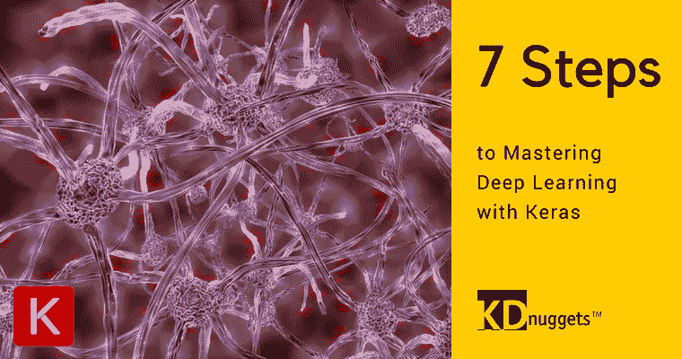

# 7 步掌握 Keras 深度学习

> 原文：[`www.kdnuggets.com/2017/10/seven-steps-deep-learning-keras.html`](https://www.kdnuggets.com/2017/10/seven-steps-deep-learning-keras.html)

神经网络框架、库和 API 的选择并不缺乏，对于任何有兴趣开始深度学习的人来说都是如此。那么... **为什么选择 Keras？**

Keras 是一个高级神经网络 API，帮助引领深度学习和人工智能的商品化。它运行在许多低级库之上，作为后端使用，包括 TensorFlow、Theano、CNTK 和 [PlaidML](http://vertex.ai/blog/announcing-plaidml)。Keras 代码是可移植的，这意味着你可以使用 Theano 作为后端在 Keras 中实现一个神经网络，然后指定后端为 TensorFlow，代码无需进一步更改。数据科学家和机器学习专家 [Charles Martin](https://www.linkedin.com/in/charlesmartin14/) 总结了 [这句话](https://www.linkedin.com/feed/update/urn:li:activity:6248837318694760448/)（在回应该帖子时）：

> 我们已经可以使用这些算法超过 10 年了。虽然不是很容易获得，但对于一个优秀的黑客来说还是可以访问的。在我看来，最重要的进展来自 Google Keras，它将非常强大、现代的 AI 算法商品化，而这些算法之前不仅无法获得，还被认为是不可用的。

Keras 是一个易于使用的神经网络库，促进了简单而直观的语法。它还面向神经网络技术的**使用者**而非开发者，至少在某种程度上是这样。这两个群体之间的界限并不十分明确；到底什么构成了机器学习算法的设计与实现，什么又算是修改已经准备好的算法呢？这有点像“先有鸡还是先有蛋”的问题，并不适合在这里讨论。然而，我会主张，或许比其他任何已建立的主流神经网络库更适合于**数据科学实践**的是 Keras。事实上，我认为 Keras 是任何使用神经网络的数据科学家工具箱中的一个重要工具。

本教程旨在让你尽快熟悉 Keras，使你能够迅速上手。如果你已经熟悉神经网络，这并不是特别困难的任务。为此，理解神经网络是首选——尽管第一步中会简要介绍——以及对其他机器学习框架的一些经验。除此之外，不需要对 Keras 有特定的经验。

### [步骤 1: 神经网络基础](https://www.kdnuggets.com/2017/10/neural-networks-step-1.html)

本文汇集了一些神经网络“入门”资源。

### 步骤 2: Keras 基础

首先，Keras 到底是什么？为何不直接从项目网站了解？阅读整个主页（这只需几分钟），特别注意“30 秒了解 Keras”，这应该足以让你了解 Keras 的简单易用。

+   [Keras：Python 深度学习库](https://keras.io/)

当前主要版本的 Keras 发布说明（写作时的版本）可以在这里找到。花几分钟时间阅读它们：

+   [介绍 Keras 2](https://blog.keras.io/introducing-keras-2.html)

DataCamp 的 Karlijn Willems 创建了一个方便的 Keras 备忘单，我推荐你下载并随时查阅。即使有些内容可能现在还不太明白，但很快你就会明白，这个参考资料无疑会很有用。我桌上就有一份打印版。

+   [Keras 备忘单](https://www.datacamp.com/community/blog/keras-cheat-sheet#gs.0X64hsc)，作者：Karlijn Willems

最后也是最重要的，要熟悉 Keras 文档，它非常优秀并且解释了所有内容。请将其收藏。

+   [Keras 文档](https://keras.io/)

### 第三步：Keras 概述

Valerio Maggio 在 2017 年 PyData 伦敦大会上做了一个精彩的教程演讲，标题为“十步走向 Keras”。要深入了解 Keras 是什么、它与其他库的比较，以及如何使用它来完成任务，请花 90 分钟观看这个视频。绝对值得花时间来全面了解 Keras。

然后查看以下几页文档，以了解 Keras 如何进行模型实现。

+   [关于 Keras 模型](https://keras.io/models/about-keras-models/)

+   [开始使用 Keras Sequential 模型](https://keras.io/getting-started/sequential-model-guide/)

+   [开始使用 Keras 功能 API](https://keras.io/getting-started/functional-api-guide/)

如果你仍然对为何选择 Keras 而非 TensorFlow 存有疑问（你没有观看视频，对吧？），请阅读此文：

+   [TensorFlow 还是 Keras？我应该学习哪个？](https://medium.com/implodinggradients/tensorflow-or-keras-which-one-should-i-learn-5dd7fa3f9ca0)，作者：Aakash Nain

[在继续之前，请确保已安装 Keras](https://keras.io/#installation)。

最后，关于如何更改 Keras 后端的信息，请参阅以下文档页面：

+   [Keras 后端](https://keras.io/backend/)

### 第四步：Keras 的初步操作

让我们做一件每个人在开始使用新的深度学习库时都会做的事情：实现一个简单的逻辑回归模型。

如果你在前一步中观看了 Valerio 的视频，那么你可能已经获得了所需的信息。如果没有，请参考他在讲座中的笔记本。理想情况下，你应阅读整篇内容，以获得 TensorFlow、Theano 和 Keras 的实现代码的优秀比较。然而，如果你只对 Keras 代码感兴趣，可以跳到大约中间部分。

+   [多层全连接网络](https://github.com/leriomaggio/deep-learning-keras-tensorflow/blob/euroscipy2017/1%20Multi-layer%20Fully%20Connected%20Networks.ipynb)，由 Valerio Maggio

下面展示的 Keras 代码（直接取自 Maggio 的笔记本）完成任务的美感应该是显而易见的。注意，此时数据预处理已经完成。

实现逻辑回归，如上所述，是一件事，但现在让我们尝试一些更值得称之为神经网络的东西，带有一个隐藏层。

首先，确保你查看了以下 Keras 文档页面，描述了 Sequenial 模型（如上所述）和 Layers。

+   [开始使用 Keras Sequential 模型](https://keras.io/getting-started/sequential-model-guide/)

+   [关于 Keras 层](https://keras.io/layers/about-keras-layers/)

+   [Keras 核心层](https://keras.io/layers/core/)

现在，跟随这个基本的神经网络实现，它学习一些关于井字棋游戏结果的内容。

+   Keras 教程：用神经网络识别井字棋赢家，由 Matthew Mayo

完成这些步骤后，你应该准备好实现一些更复杂的架构。

### 第 5 步：实现卷积神经网络

要在 Keras 中实现卷积神经网络（CNN），首先阅读其卷积层的文档：

+   [Keras 卷积层](https://keras.io/layers/convolutional/)

之后，查看以下两个关于 Keras 中的 CNN 的教程。第一个教程速度较慢，涵盖了你现在应该知道的大部分内容，而第二个则涉及了一些额外的话题，如避免过拟合。这不一定是非此即彼的方法；你可能会在两个写作中找到有价值的内容：

+   [Keras 教程：Python 深度学习的终极初学者指南](https://elitedatascience.com/keras-tutorial-deep-learning-in-python)，由 Elite Data Science

+   [卷积神经网络简介](https://sempwn.github.io/blog/2017/04/06/conv_net_intro)，由 Mike Irvine

要了解更多关于卷积神经网络的一般知识，可以尝试 Brandon Rohrer 的视频：

阅读[配套博客文章](https://www.kdnuggets.com/2016/08/brohrer-convolutional-neural-networks-explanation.html)。

### 第 6 步：实现递归神经网络

要在 Keras 中实现递归神经网络（RNN），首先阅读其递归层的文档：

+   [Keras 递归层](https://keras.io/layers/recurrent/)

之后，尝试 Chris Albon 的这个教程，实施长短期记忆（LSTM）网络——一种主流的 RNN 类型——用于文本分类：

+   [LSTM 递归神经网络](https://chrisalbon.com/deep_learning/keras/lstm_recurrent_neural_network/)

要了解更多关于递归神经网络的一般知识，可以尝试 Brandon Rohrer 的视频：

阅读 [配套幻灯片](https://docs.google.com/presentation/d/1hqYB3LRwg_-ntptHxH18W1ax9kBwkaZ1Pa_s3L7R-2Y/edit)。

### 第七步：下一步是什么？

到现在为止，你应该对 Keras 有了扎实的理解，包括为什么使用它、在某些情况下它相比其他库的优势，以及如何使用它来实现各种网络架构。你现在是专家了，对吧？

好吧，可能不是。但希望你已经掌握了基础。当你想要超越基础时，下一步最好的选择可能是 Keras 的官方教程：

+   [Keras 教程](https://blog.keras.io/category/tutorials.html)

之后，查看 Keras 示例目录，其中包括视觉模型示例、文本与序列示例、生成模型示例等。

+   [Keras 示例目录](https://github.com/fchollet/keras/tree/master/examples)

另外，如何挑战自己来微调一下你在前面的步骤中实现的一些模型呢？改变优化器，添加另一层，尝试不同的激活函数。或者使用一些 Keras 评估指标来回顾并评估你的模型性能。Keras 文档是一个很好的起点：

+   [Keras 评估指标](https://keras.io/metrics/)

+   [Keras FAQ: 常见 Keras 问题](https://keras.io/getting-started/faq/)

祝你使用 Keras 顺利。

**相关：**

+   掌握数据准备的 7 个步骤

+   掌握 Python 机器学习的 7 个步骤

+   掌握 Python 机器学习的更多 7 个步骤

* * *

## 我们的前三个课程推荐

 1\. [谷歌网络安全证书](https://www.kdnuggets.com/google-cybersecurity) - 快速进入网络安全职业轨道。

 2\. [谷歌数据分析专业证书](https://www.kdnuggets.com/google-data-analytics) - 提升你的数据分析技能

 3\. [谷歌 IT 支持专业证书](https://www.kdnuggets.com/google-itsupport) - 支持你的组织的 IT

* * *

### 更多相关话题

+   [停止学习数据科学，找到目标，并找到目标来……](https://www.kdnuggets.com/2021/12/stop-learning-data-science-find-purpose.html)

+   [数据科学统计学习的最佳资源](https://www.kdnuggets.com/2021/12/springboard-top-resources-learn-data-science-statistics.html)

+   [一个 90 亿美元的 AI 失败案例分析](https://www.kdnuggets.com/2021/12/9b-ai-failure-examined.html)

+   [成功数据科学家的 5 个特征](https://www.kdnuggets.com/2021/12/5-characteristics-successful-data-scientist.html)

+   [是什么让 Python 成为初创公司理想的编程语言](https://www.kdnuggets.com/2021/12/makes-python-ideal-programming-language-startups.html)

+   [每位数据科学家都应该知道的三个 R 库（即使你使用 Python）](https://www.kdnuggets.com/2021/12/three-r-libraries-every-data-scientist-know-even-python.html)
