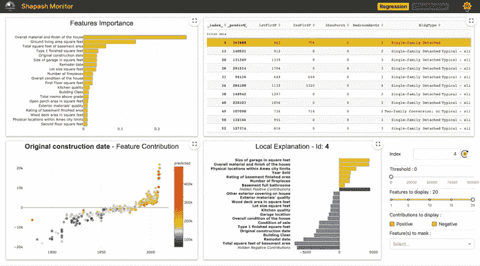
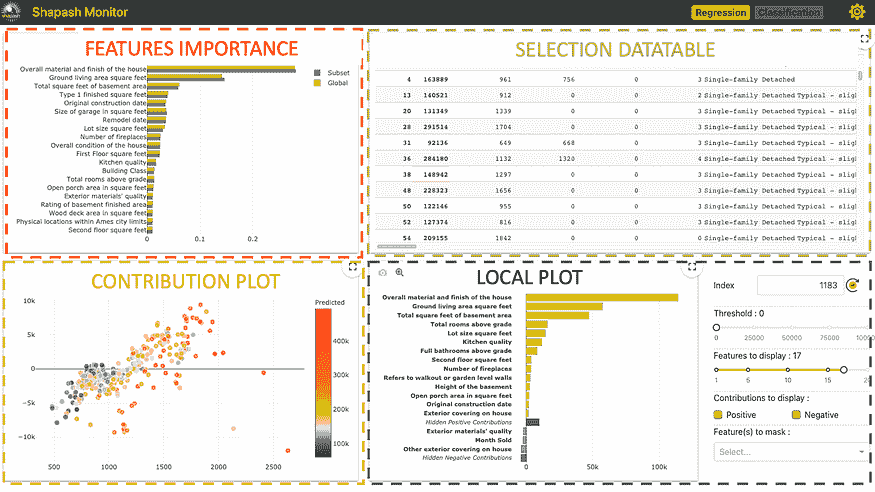
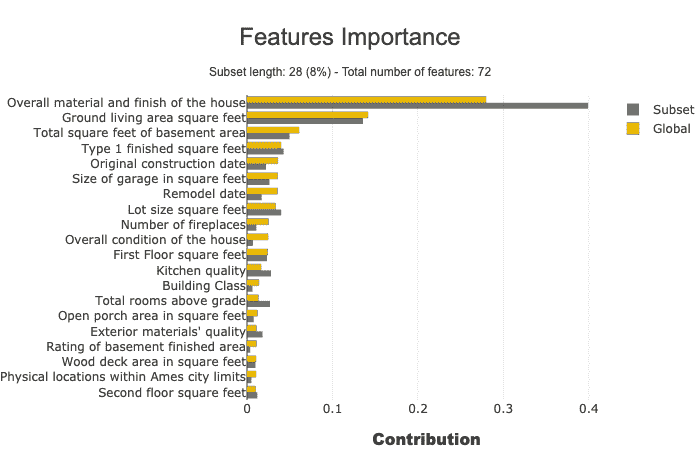
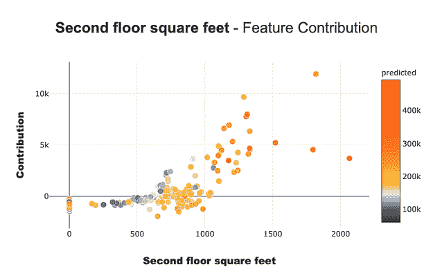
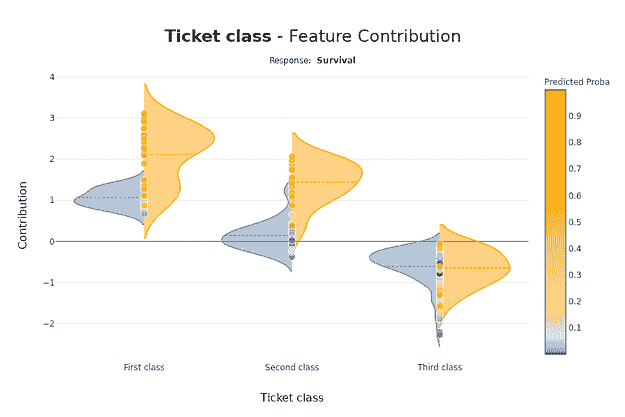
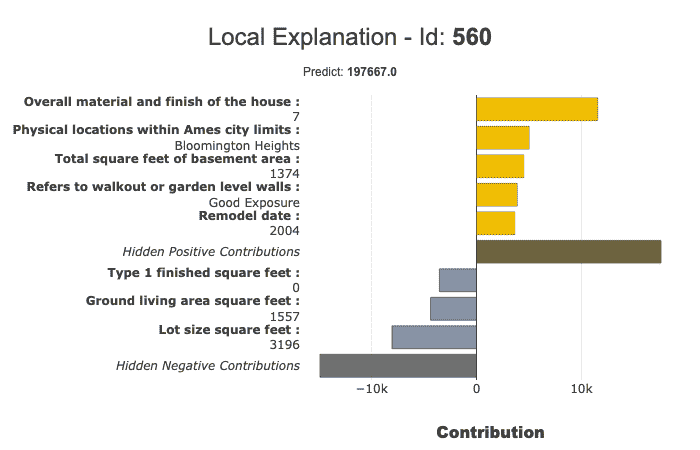
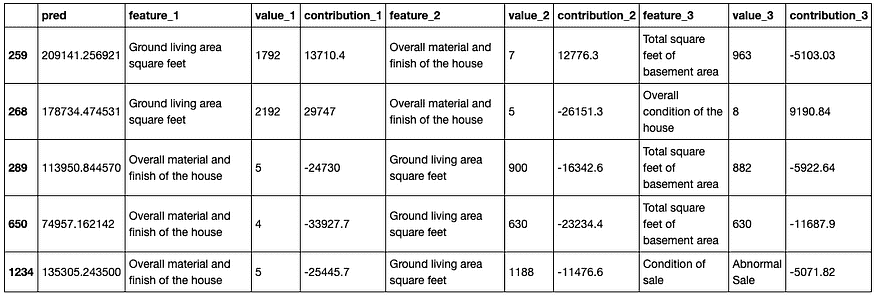
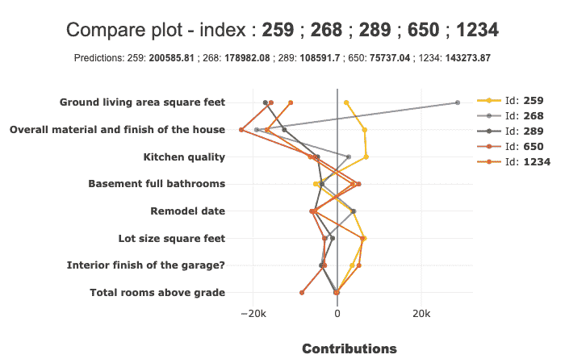

# Shapash：使机器学习模型可理解

> 原文：[`www.kdnuggets.com/2021/04/shapash-machine-learning-models-understandable.html`](https://www.kdnuggets.com/2021/04/shapash-machine-learning-models-understandable.html)

评论

**由[Yann Golhen](https://twitter.com/GolhenY)，MAIF，首席数据科学家**。



*[Shapash Web 应用程序演示](https://shapash-demo.ossbymaif.fr/)*

[Shapash](https://github.com/MAIF/shapash)由[MAIF](https://www.maif.fr/)提供，是一个 Python 工具包，旨在帮助数据科学家理解机器学习模型。它使得与非数据专家（如业务分析师、经理和最终用户）分享和讨论模型可解释性变得更加容易。

具体来说，Shapash 提供易于阅读的可视化和一个[Web 应用程序](https://shapash-demo.ossbymaif.fr/)。Shapash 使用适当的措辞（预处理逆/后处理）展示结果。在操作环境中，Shapash 非常有用，因为它使数据科学家能够从探索到生产中使用可解释性：你可以轻松地在生产中部署局部可解释性，为每个预测/推荐附上局部可解释性的摘要。

在这篇文章中，我们将介绍 Shapash 的主要特性以及它的运作方式。我们将通过一个具体的案例来说明这个库的实现。

### 背景元素

模型的可解释性和可理解性是热点话题。关于这些话题有很多文章、出版物和开源贡献。所有这些贡献并不涉及相同的问题和挑战。

大多数数据科学家使用这些技术有很多原因：更好地理解他们的模型，检查模型的一致性和公正性，以及进行调试。

然而，这里还有更多内容：

> *可理解性对教育目的很重要。可理解的机器学习模型可以与非数据专家进行讨论：业务分析师、最终用户等。*

具体来说，我们的数据科学项目中涉及非专业人员的两个步骤：

**探索性步骤 & 模型拟合**

在这一步骤中，数据科学家和业务分析师讨论所面临的关键问题，并定义他们将整合到项目中的核心数据。这需要对主题和我们建模的问题的主要驱动因素有深入的理解。

为此，数据科学家研究全局可解释性、特征重要性以及模型的主要特征所扮演的角色。他们还可以局部查看一些个体，特别是异常值。在这个阶段，Web 应用程序很有趣，因为他们需要查看可视化和图形。与业务分析师讨论这些结果是有意义的，因为这有助于挑战方法并验证模型。

**在生产环境中部署模型**

就是这样！模型已验证、部署并为最终用户提供预测。局部可解释性能为他们带来很大价值，前提是能够提供一个良好、有用且易于理解的总结。这对他们有两个原因：

+   透明性带来信任：用户会信任模型，如果他们理解模型。

+   人类保持控制：没有模型是 100%可靠的。当用户可以理解算法的输出时，如果他们认为算法建议基于不正确的数据，他们可以推翻这些建议。

Shapash 已被开发用来帮助数据科学家满足这些需求。


### Shapash 的关键特性

+   易于阅读的可视化，适合所有人。

+   一个网页应用：要理解模型的工作原理，你需要查看多个图表、特征重要性和特征对模型的全局贡献。网页应用是一个有用的工具。

+   多种方法展示结果并使用适当的措辞（预处理逆转，后处理）。你可以轻松添加数据字典，*category-encoders*对象，或 sklearn *ColumnTransformer*以获得更明确的输出。

+   函数可以轻松保存*Pickle*文件并将结果导出为表格。

+   可解释性总结：总结是可配置的，以适应你的需求并关注局部可解释性的关键点。

+   能够轻松部署到生产环境中，并为每个操作应用（批处理或 API）提供局部可解释性总结。

+   Shapash 有多种使用方式：它可以用来轻松访问结果或改进措辞。显示结果只需很少的参数。但是，你对数据集进行清理和文档记录的工作越多，结果对最终用户就会越清晰。

Shapash 适用于回归、二分类或多分类问题。它兼容许多模型：*Catboost*、*Xgboost*、*LightGBM*、*Sklearn Ensemble*、*线性模型*、*SVM*。

Shapash 基于使用 Shap（Shapley 值）、Lime 或任何允许计算可加局部贡献的技术的局部贡献。

### 安装

你可以通过 pip 安装这个包：

```py
$pip install shapash

```

### Shapash 演示

让我们在一个具体的数据集上使用 Shapash。在本文的其余部分，我们将展示 Shapash 如何探索模型。

我们将使用来自[Kaggle](https://www.kaggle.com/c/house-prices-advanced-regression-techniques)的著名“房价”数据集来拟合回归模型并预测房价！让我们开始加载数据集：

```py
import pandas as pd
from shapash.data.data_loader import data_loading

house_df, house_dict = data_loading('house_prices')
y_df=house_df['SalePrice'].to_frame()
X_df=house_df[house_df.columns.difference(['SalePrice'])]
house_df.head(3)

```


编码分类特征：

```py
from category_encoders import OrdinalEncoder

categorical_features = [col for col in X_df.columns if X_df[col].dtype == 'object']
encoder = OrdinalEncoder(cols=categorical_features).fit(X_df)
X_df=encoder.transform(X_df)

```

训练、测试拆分和模型拟合：

```py
from sklearn.model_selection import train_test_split
from sklearn.ensemble import RandomForestRegressor

Xtrain, Xtest, ytrain, ytest = train_test_split(X_df, y_df, train_size=0.75)
reg = RandomForestRegressor(n_estimators=200, min_samples_leaf=2).fit(Xtrain,ytrain)

```

并预测测试数据：

```py
y_pred = pd.DataFrame(reg.predict(Xtest), columns=['pred'], index=Xtest.index)

```

### 让我们发现并使用 Shapash SmartExplainer。

*第 1 步 — 导入*

```py
from shapash.explainer.smart_explainer import SmartExplainer

```

*第 2 步 — 初始化 SmartExplainer 对象*

```py
xpl = SmartExplainer(features_dict=house_dict) # Optional parameter 

```

+   features_dict：字典，指定 x pd.DataFrame 中每个列名的含义。

*第 3 步 — 编译*

```py
xpl.compile(
    x=Xtest,
    model=regressor,
    preprocessing=encoder,# Optional: use inverse_transform method
    y_pred=y_pred # Optional
)

```

编译方法允许使用另一个可选参数：*后处理*。它提供了应用新函数的可能性，以便更好地措辞（正则表达式、映射字典等）。

现在，我们可以显示结果并了解回归模型是如何工作的！

*步骤 4 — 启动 Web 应用*

```py
app = xpl.run_app()

```

Web 应用链接出现在 Jupyter 输出中（访问演示 [这里](https://shapash-demo.ossbymaif.fr/)）。

**这个 Web 应用有四个部分:**



每个图表都可以帮助轻松探索模型。

***特征重要性***: 你可以点击每个特征来更新下面的贡献图。

***贡献图***: 特征如何影响预测？显示每个特征的本地贡献的提琴图或散点图。

***本地图:***

+   本地解释：哪些特征对预测值贡献最大。

+   你可以使用多个按钮/滑块/列表来配置本地可解释性的摘要。我们将在下面描述使用*过滤器*方法可以操作的不同参数。

+   这个 Web 应用是一个有用的工具，可以与业务分析师讨论总结可解释性的最佳方法，以满足操作需求。

***选择表格:*** 允许 Web 应用用户选择：

+   一个子集，用于集中探索此子集

+   显示与之关联的本地解释的单行

如何使用数据表来选择子集？在表格顶部，位于你想用来过滤的列名称下方，指定：

+   *=值, >值, <值*

+   *如果你想选择包含特定单词的每一行，只需输入那个单词而不带“=”*

这个 Web 应用提供了一些选项（右上角按钮）。最重要的选项可能是样本的大小（默认：1000）。为了避免延迟，Web 应用依赖于样本来显示结果。使用此选项来修改样本大小。

结束应用程序：

```py
app.kill()

```

*步骤 5 — 图表*

所有图表都可以在 jupyter notebooks 中查看，下面的段落描述了每个图表的关键点。

**特征重要性**

该参数允许比较子集中特征的重要性。它有助于检测子集中的特定行为。

```py
subset = [ 168, 54, 995, 799, 310, 322, 1374,
          1106, 232, 645, 1170, 1229, 703, 66,  
          886, 160, 191, 1183, 1037, 991, 482,  
          725, 410, 59, 28, 719, 337, 36 ]
xpl.plot.features_importance(selection=subset)

```



**贡献图**

贡献图用于回答如下问题：

特征如何影响我的预测？它是否有正面贡献？特征的贡献是增加的还是减少的？是否存在阈值效应？对于分类变量，每种模态的贡献如何？此图完成了特征重要性对于可解释性的展示，使得模型对特征影响的全球理解更加清晰。

此图表上有几个参数。请注意，显示的图表会根据您对分类变量还是连续变量（小提琴图或散点图）以及您处理的用例类型（回归、分类）进行调整。

```py
xpl.plot.contribution_plot("OverallQual")

```


应用于连续特征的贡献图。

分类案例：泰坦尼克号分类器——应用于分类特征的贡献图。





**局部图**

您可以使用局部图来进行模型的局部解释。

*filter()*和*local_plot()*方法允许您测试和选择总结模型所捕捉信号的最佳方式。您可以在探索阶段使用它。然后，您可以在生产环境中部署此总结，使最终用户能够在几秒钟内了解每个推荐的最有影响力的标准。

我们将发布第二篇文章，解释如何在生产中部署局部解释性。

**结合 filter 和 local_plot 方法**

使用*filter*方法来指定如何总结局部解释性。您有四个参数可以配置您的总结：

+   max_contrib: 显示的标准最大数量

+   threshold: 显示标准所需的贡献的最小值（绝对值）

+   positive: 仅显示正贡献？负贡献？（默认 None）

+   features_to_hide: 不想显示的特征列表

在定义了这些参数后，我们可以使用*local_plot()*方法显示结果，或使用*to_pandas()*方法导出结果。

```py
xpl.filter(max_contrib=8,threshold=100)
xpl.plot.local_plot(index=560)

```



导出到 pandas DataFrame：

```py
xpl.filter(max_contrib=3,threshold=1000)
summary_df = xpl.to_pandas()
summary_df.head()

```



**比较图**

使用*compare_plot()*方法，SmartExplainer 对象使得理解为什么两个或更多个体的预测值不同成为可能。最具决定性的标准出现在图表的顶部。

```py
xpl.plot.compare_plot(row_num=[0, 1, 2, 3, 4], max_features=8)

```



我们希望 Shapash 在建立对人工智能的信任方面有所帮助。感谢所有给予反馈和建议的人……Shapash 是开源的！欢迎通过评论此帖或直接在[GitHub 讨论](https://github.com/MAIF/shapash/discussions)中贡献。

[原文](https://pub.towardsai.net/shapash-making-ml-models-understandable-by-everyone-8f96ad469eb3)。经许可转载。

**相关：**

+   [白箱人工智能介绍：可解释性的概念](https://www.kdnuggets.com/2021/03/introduction-white-box-ai-interpretability.html)

+   [深度学习不必是黑箱](https://www.kdnuggets.com/2021/02/deep-learning-not-black-box.html)

+   [解释可解释的人工智能：2 阶段方法](https://www.kdnuggets.com/2020/10/explaining-explainable-ai.html)

* * *

## 我们的前三大课程推荐

 1\. [Google 网络安全证书](https://www.kdnuggets.com/google-cybersecurity) - 快速进入网络安全职业轨道。

 2\. [Google 数据分析专业证书](https://www.kdnuggets.com/google-data-analytics) - 提升你的数据分析技能

 3\. [Google IT 支持专业证书](https://www.kdnuggets.com/google-itsupport) - 支持你的组织的 IT 工作

* * *

### 更多相关话题

+   [每个初学者数据科学家应掌握的 6 种预测模型](https://www.kdnuggets.com/2021/12/6-predictive-models-every-beginner-data-scientist-master.html)

+   [成为优秀数据科学家所需的 5 项关键技能](https://www.kdnuggets.com/2021/12/5-key-skills-needed-become-great-data-scientist.html)

+   [2021 年最佳 ETL 工具](https://www.kdnuggets.com/2021/12/mozart-best-etl-tools-2021.html)

+   [停止学习数据科学以寻找目标，并找到目标去……](https://www.kdnuggets.com/2021/12/stop-learning-data-science-find-purpose.html)

+   [数据科学学习统计的最佳资源](https://www.kdnuggets.com/2021/12/springboard-top-resources-learn-data-science-statistics.html)

+   [成功数据科学家的 5 个特征](https://www.kdnuggets.com/2021/12/5-characteristics-successful-data-scientist.html)
