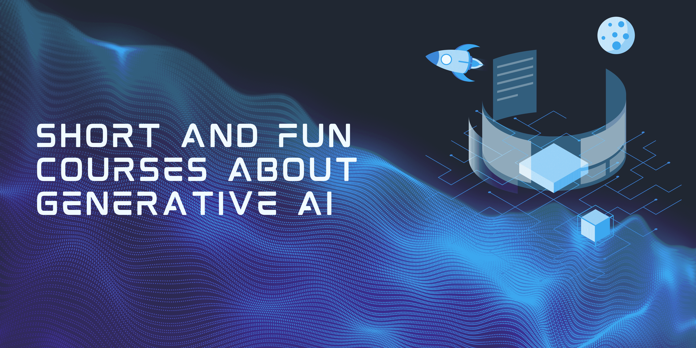

# 短期有趣课程助你迅速掌握生成式 AI

> 原文：[`www.kdnuggets.com/short-and-fun-courses-to-get-you-up-to-speed-about-generative-ai`](https://www.kdnuggets.com/short-and-fun-courses-to-get-you-up-to-speed-about-generative-ai)

图片由作者提供

如果你不是技术专业人士，或者你想进入技术行业，你可能已经听说了很多关于生成式 AI 的事情。每个人都在谈论它，各种组织也在争取一份蛋糕，这其中有很多钱。

但它是什么，在哪里可以学习到呢？

幸运的是，你来对地方了。

在这篇文章中，我将介绍一些短小有趣的课程，让你快速了解生成式 AI。

## 生成式 AI 概念

链接：[DataCamps 生成式 AI 概念](https://datacamp.pxf.io/5gJOyb)

这是理解生成式 AI、其基本概念及其对当今社会影响的第一步。生成式 AI 是一种能够创建新内容的 AI 模型，例如 ChatGPT，也能执行其他任务。在这门面向初学者的生成式 AI 课程中，你将学习这项新兴技术如何塑造我们的未来。了解生成式 AI 如何工作、伦理考虑，以及如何最大化利用这些工具！

## 每个人的生成式 AI

链接：[DeepLearning.AI 每个人的生成式 AI](https://imp.i384100.net/1rAEyD)

在仅仅 5 小时内，你可以了解生成式 AI 是什么、如何工作、它的常见用例，以及这项技术能做什么和不能做什么。你还将深入了解如何思考生成式 AI 项目的生命周期，从构想到发布，包括如何构建有效的提示。还将了解生成式 AI 技术对个人、企业和社会带来的潜在机会和风险。

## 生成式 AI 营销专业化

链接：[生成式 AI 营销专业化](https://imp.i384100.net/badRPg)

也许你是一名营销人员，你想知道如何在日常工作中利用生成式 AI，以及如何改善你的工作流程并实现目标。

在 1 个月内，你可以学习生成式 AI 的基础知识，实践创建标志、营销内容和服务。你还将学习如何审查和部署营销及客户服务的聊天机器人，以及如何实施 AI 营销策略，以应对各种战略内部和外部的考虑。

## 高管和商业领袖的生成式 AI

链接：[高管和商业领袖的生成式 AI](https://imp.i384100.net/q4drmb)

你是经理、商业高管，还是行业领袖，并且你想了解更多关于生成式 AI 的知识？我假设你是，因为你希望在市场中保持竞争力。

在本课程中，你将了解生成式 AI 在商业中的历史和影响，数据在商业 AI 中的重要性，以及信任、透明度和治理的重要性。通过你所学的内容，你可以将生成式 AI 应用到客户服务和应用程序现代化等关键用例中。

## 总结

生成式 AI 不仅仅意味着技术专业人士可以利用它。它是塑造所有其他行业和我们未来的科技行业的重要组成部分。了解它及其如何融入你的战略将使你保持领先！

****[Nisha Arya](https://www.linkedin.com/in/nisha-arya-ahmed/)**** 是一位数据科学家、自由技术作家，以及 KDnuggets 的编辑和社区经理。她特别关注提供数据科学职业建议或教程和理论知识。Nisha 涵盖了广泛的主题，并希望探索人工智能如何有助于人类生命的持久性。作为一名热衷学习者，Nisha 寻求扩展她的技术知识和写作技能，同时帮助指导他人。

### 相关主题

+   [使用 tqdm 在 Python 中创建进度条以获得乐趣和利润](https://www.kdnuggets.com/2022/09/progress-bars-python-tqdm-fun-profit.html)

+   [适合初学者的有趣 Python 项目！](https://www.kdnuggets.com/2022/10/beginner-friendly-python-projects-fun.html)

+   [谁负责让生成式 AI 变得正确？](https://www.kdnuggets.com/2023/08/whose-responsibility-get-generative-ai-right.html)

+   [数据科学家如何赢得 CFO 的关注（以及你为何需要）](https://www.kdnuggets.com/2021/12/data-scientists-get-ear-cfos-want.html)

+   [10 个免费的必修数据科学课程入门](https://www.kdnuggets.com/10-free-must-take-data-science-courses-to-get-started)

+   [25 门免费课程掌握数据科学、数据工程、机器学习……](https://www.kdnuggets.com/25-free-courses-to-master-data-science-data-engineering-machine-learning-mlops-and-generative-ai)
