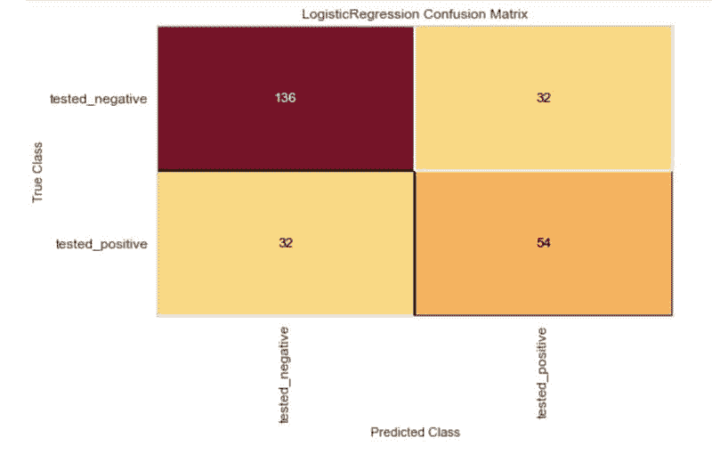
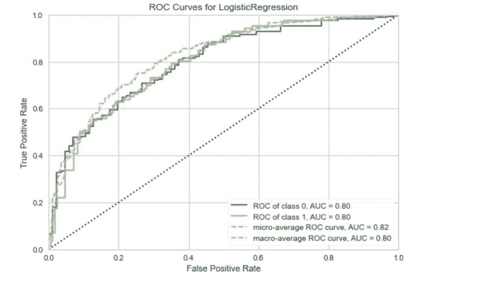
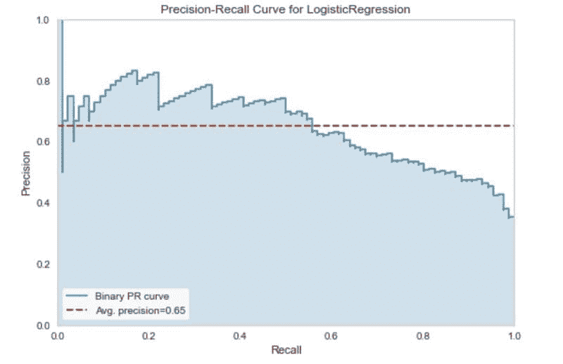
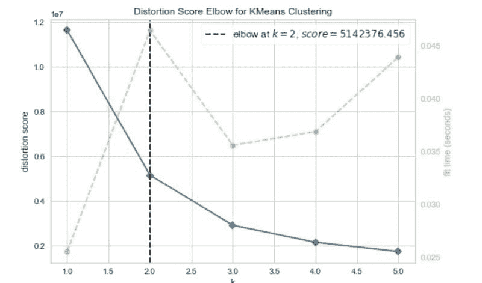
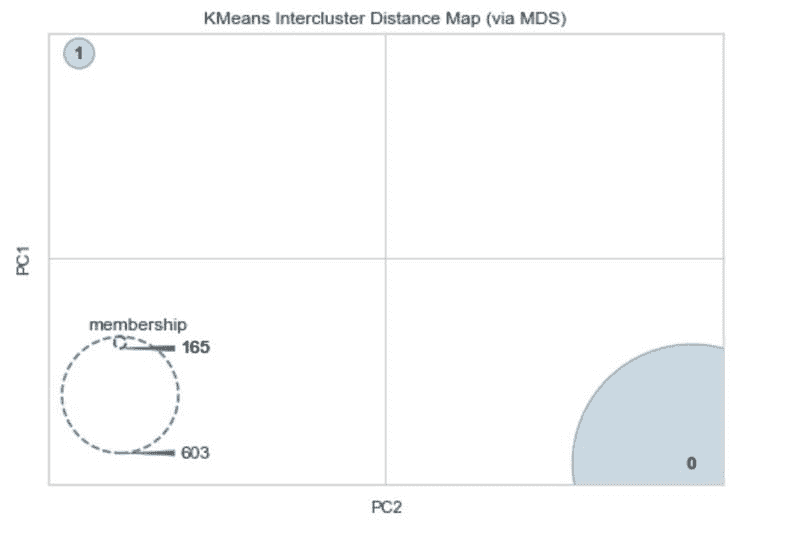
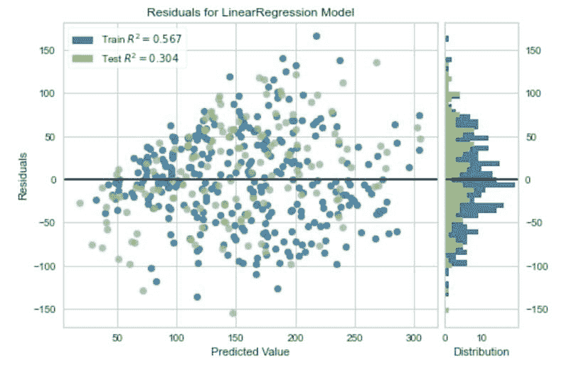

# 机器学习可视化简易指南

> 原文：[`www.kdnuggets.com/2022/04/simple-guide-machine-learning-visualisations.html`](https://www.kdnuggets.com/2022/04/simple-guide-machine-learning-visualisations.html)

残差图。图像由作者提供。

在开发机器学习模型时，一个重要的步骤是评估性能。根据你处理的机器学习问题类型，一般有多种度量标准可以选择来执行这一步骤。

* * *

## 我们的前三大课程推荐

 1\. [谷歌网络安全证书](https://www.kdnuggets.com/google-cybersecurity) - 快速进入网络安全职业生涯。

 2\. [谷歌数据分析专业证书](https://www.kdnuggets.com/google-data-analytics) - 提升你的数据分析技能

 3\. [谷歌 IT 支持专业证书](https://www.kdnuggets.com/google-itsupport) - 支持你的组织的 IT 工作

* * *

然而，单独查看一两个数字并不能总是帮助我们做出正确的模型选择。例如，一个单一的错误度量并不能告诉我们错误的分布情况。它不能回答像模型在少数几次情况下错误很大，还是产生了许多较小错误这样的问题？

也必须以可视化方式检查模型性能，因为图表或图形可以揭示我们可能从单一度量中遗漏的信息。

[Yellowbrick](https://www.scikit-yb.org/en/latest/) 是一个 Python 库，致力于简化创建丰富的机器学习模型可视化的过程，这些模型是使用 [Scikit-learn](https://scikit-learn.org/stable/) 开发的。

在接下来的文章中，我将介绍这个便捷的机器学习工具，并提供代码示例，创建一些最常见的机器学习可视化。

# 混淆矩阵

混淆矩阵是一种简单的方式，用于直观地评估分类器的预测正确频率。

为了说明混淆矩阵，我使用了一个称为“糖尿病”的数据集。该数据集包含患者的一些特征，如体重指数、2 小时血清胰岛素测量值和年龄，并有一列指示患者是否被检测出糖尿病。目标是利用这些数据构建一个可以预测糖尿病阳性结果的模型。

以下代码通过 Scikit-learn API 导入该数据集。

在二分类问题中，模型预测可能有四种潜在的结果。

**真正例：** 模型**正确地**预测了正面的结果，例如患者的糖尿病测试结果为阳性，模型预测结果也是阳性。

**假阳性：** 模型**错误地**预测了正结果，例如，患者的糖尿病测试结果为阴性，但模型预测为阳性。

**真阴性：** 模型**正确地**预测了负结果，例如，患者的糖尿病测试结果为阴性，且模型预测为阴性。

**假阴性：** 模型**错误地**预测了负结果，例如，患者的糖尿病测试结果为阳性，但模型预测为阴性。

混淆矩阵在网格中可视化了这些可能结果的计数。下面的代码使用 Yellowbrick ConfusionMatrix 可视化工具生成模型的混淆矩阵。

混淆矩阵。图片由作者提供。

# ROC 曲线

分类器的初始输出不是标签，而是某个观察值属于某个类别的概率。

然后，这个概率被转换为一个类别，通过选择一个阈值。例如，我们可能会说，如果患者测试为阳性的概率超过 0.5，我们就赋予正标签。

根据模型、数据和使用场景，我们可能会选择一个阈值来优化特定的结果。在糖尿病示例中，漏掉一个正结果可能会有生命危险，因此我们希望最小化假阴性。调整分类器的阈值是一种优化结果的方法，ROC 曲线是可视化这种权衡的一种方式。

下面的代码使用 Yellowbrick 构建 ROC 曲线。

ROC 曲线。图片由作者提供。

ROC 曲线将真正例率与假阳性率进行绘制。通过这个，我们可以评估降低或提高分类阈值的影响。

# 精确度-召回率曲线

ROC 曲线并不总是评估分类器的最佳方法。如果类别不平衡（一个类别的观测值远多于另一个类别），ROC 曲线的结果可能会产生误导。

在这些情况下，精确度-召回率曲线通常是更好的选择。

让我们快速回顾一下精确度和召回率的定义。

**精确度** 衡量模型在正确识别正类方面的表现。换句话说，在所有正类的预测中，有多少实际上是正确的？

**召回率** 告诉我们模型在正确预测数据集中**所有**正观察值方面的表现如何。

精确度和召回率之间通常存在权衡。例如，您可能会为了提高精确度而牺牲召回率。

精确度-召回率曲线显示了在不同分类阈值下的权衡。

下面的代码使用 Yellowbrick 库生成糖尿病分类器的精确度-召回率曲线。

精确率-召回率曲线。图像由作者提供。

# 集群间距离

Yellowbrick 库还包含了一组用于分析聚类算法的可视化工具。评估聚类模型性能的常见方式是使用集群间距离图。

集群间距离图绘制了每个集群中心的嵌入，并可视化了集群间的距离及基于会员分布的每个集群的相对大小。

我们可以通过仅使用特征（X）将糖尿病数据集转化为聚类问题。

在对数据进行聚类之前，我们可以使用流行的肘部法来找到最佳的集群数目。Yellowbrick 为此提供了方法。

肘部法。图像由作者提供。

肘部曲线表明两个集群是最佳的。

现在让我们为数据集绘制集群间图，选择两个集群。

集群间距离图。图像由作者提供。

从中我们可以看到两个集群之间有很大的分离。会员分布表明一个集群有 165 个观测值，而另一个有 603 个。这与糖尿病数据集中两个类别的平衡相近，分别为 268 和 500 个观测值。

# 残差图

基于回归的机器学习模型有其独特的可视化方式。Yellowbrick 也对此提供了支持。

为了说明回归问题的可视化，我们将使用糖尿病数据集的一个变体，该数据集可以通过 Scikit-learn API 获得。这个数据集与本文早期使用的那个数据集具有相似的特征，但目标是基线后一年疾病进展的定量测量。

在回归中，视觉化残差是一种分析模型性能的方法。残差是观察值与模型预测值之间的差异。它们是量化回归模型误差的一种方式。

下面的代码生成一个简单回归模型的残差图。

残差图。图像由作者提供。

Yellowbrick 库提供的基于回归的模型的其他可用可视化包括：

+   预测误差图。

+   Alpha 选择。

+   Cook's 距离。

Yellowbrick Python 库提供了快速创建机器学习可视化的方法，适用于使用 Scikit-learn 开发的模型。除了评估模型性能的可视化外，Yellowbrick 还提供了[工具](https://www.scikit-yb.org/en/latest/api/model_selection/index.html)来可视化交叉验证、学习曲线和特征重要性。此外，还提供了[文本建模](https://www.scikit-yb.org/en/latest/api/text/index.html)可视化的功能。

正如文章中所述，单一评估指标模型可能有用，在某些情况下，如果你有一个简单的问题并且在比较不同的模型，这可能是足够的。然而，更多的时候，为模型性能创建可视化是获得对机器学习模型有效性真正理解的重要补充步骤。

如果你想了解更多关于单一评估指标的内容，我以前写过一篇文章涵盖了分类评估指标，还有一篇关于回归的文章。

***   [衡量分类性能的 8 个指标](https://towardsdatascience.com/8-metrics-to-measure-classification-performance-984d9d7fd7aa)

+   [回归的 3 个评估指标](https://towardsdatascience.com/3-evaluation-metrics-for-regression-80cb34cee0e8)

**[丽贝卡·维克里](https://www.linkedin.com/in/rebecca-vickery/)** 是一位数据科学家，拥有丰富的数据分析、机器学习和数据工程经验。12 年的 SQL 经验，4 年以上的 Python、R、Apache Airflow 和 Google Analytics 经验。

[原文](https://towardsdatascience.com/a-simple-guide-to-machine-learning-visualisations-6c808ac925dd)。经许可转载。

### 更多相关内容

+   [2022 年技术专家薪资简易指南](https://www.kdnuggets.com/2022/07/simple-salary-guide-tech-experts-2022.html)

+   [个性化 AI 简化指南：无需编码的 GPT 调整指南](https://www.kdnuggets.com/personalized-ai-made-simple-your-no-code-guide-to-adapting-gpts)

+   [本地运行 LlaMA 2 的简易指南](https://www.kdnuggets.com/a-simple-guide-to-running-llama-2-locally)

+   [机器学习项目的简单快速数据流](https://www.kdnuggets.com/2022/11/simple-fast-data-streaming-machine-learning-projects.html)

+   [使用 BigQuery ML 简化数据分析师的机器学习](https://www.kdnuggets.com/machine-learning-made-simple-for-data-analysts-with-bigquery-ml)

+   [神经网络前尝试的 10 个简单方法](https://www.kdnuggets.com/2021/12/10-simple-things-try-neural-networks.html)**
