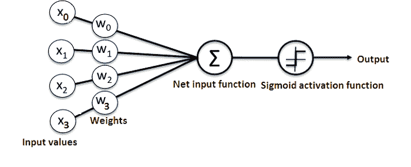
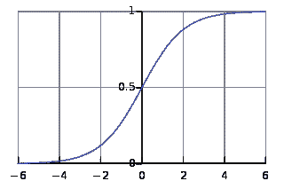
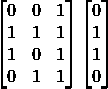
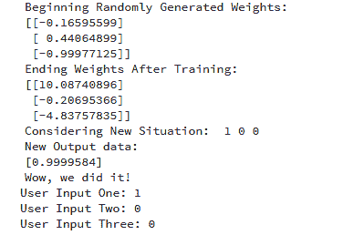

# 如何在 Python 中创建一个简单的神经网络

> 原文：[`www.kdnuggets.com/2018/10/simple-neural-network-python.html`](https://www.kdnuggets.com/2018/10/simple-neural-network-python.html)

评论

**由 [迈克尔·J·加尔巴德博士](https://www.linkedin.com/in/garbade) 提供**

神经网络（NN），也称为人工神经网络（ANN），是机器学习领域中一种学习算法的子集，松散地基于生物神经网络的概念。

* * *

## 我们的前三大课程推荐

 1\. [Google 网络安全证书](https://www.kdnuggets.com/google-cybersecurity) - 快速开启网络安全职业生涯。

 2\. [Google 数据分析专业证书](https://www.kdnuggets.com/google-data-analytics) - 提升你的数据分析技能

 3\. [Google IT 支持专业证书](https://www.kdnuggets.com/google-itsupport) - 支持您的组织进行 IT 管理

* * *

[安德雷·布列祖克](https://www.liveedu.tv/andreybu/REaxr-machine-learning-model-python-sklearn-kera/oPGdP-machine-learning-model-python-sklearn-kera/)，一位在德国工作的机器学习专家，拥有超过五年的经验，他表示：“神经网络正在彻底改变机器学习，因为它们能够高效地建模广泛领域和行业中的复杂抽象。”

基本上，人工神经网络包括以下组件：

+   一个接收数据并传递数据的输入层

+   隐藏层

+   一个输出层

+   层间权重

+   为每个隐藏层使用特定的激活函数。在这个简单的神经网络 Python 教程中，我们将使用 Sigmoid 激活函数。

神经网络有多种类型。在这个项目中，我们将创建前馈神经网络或感知神经网络。这种类型的人工神经网络直接从前到后传递数据。

训练前馈神经元通常需要反向传播，这为网络提供了相应的输入和输出集。当输入数据传递到神经元时，它会被处理并生成输出。

下面是一个展示简单神经网络结构的图示：



而且，理解神经网络如何工作的最佳方法是从头开始学习如何构建一个（不使用任何库）。

在本文中，我们将演示如何使用 Python 编程语言创建一个简单的神经网络。

### **问题**

下面是一个展示问题的表格。

|  | 输入 |  | 输出 |
| --- | --- | --- | --- |
| **训练数据 1** | 0 | 0 | 1 | 0 |
| **训练数据 2** | 1 | 1 | 1 | 1 |
| **训练数据 3** | 1 | 0 | 1 | 1 |
| **训练数据 4** | 0 | 1 | 1 | 0 |
|  |
| **新情况** | 1 | 0 | 0 | **?** |

我们将训练神经网络，使其在提供新的数据集时能够预测正确的输出值。

如表中所示，输出的值总是等于输入部分的第一个值。因此，我们期望输出值 (**?**) 为 1。

让我们看看是否可以使用一些 Python 代码来获得相同的结果（在继续阅读之前，您可以在本文末尾查看这个项目的代码）。

### **创建 NeuralNetwork 类**

我们将在 Python 中创建一个 **NeuralNetwork** 类，以训练神经元以给出准确的预测。该类还将具有其他辅助函数。

尽管在这个简单的神经网络示例中我们不会使用神经网络库，但我们将导入**numpy**库以协助计算。

该库提供了以下四个重要方法：

1.  **exp**—用于生成自然指数

1.  **数组**—用于生成矩阵

1.  **点积**—用于矩阵乘法

1.  **随机**—用于生成随机数。请注意，我们将对随机数进行种子设置，以确保其有效分布。

+   **应用 Sigmoid 函数**

我们将使用 [Sigmoid 函数](https://en.wikipedia.org/wiki/Sigmoid_function)，它绘制了一个典型的“S”形曲线，作为神经网络的激活函数。



该函数可以将任何值映射到 0 到 1 的范围内。它将帮助我们标准化输入的加权和。

之后，我们将创建 Sigmoid 函数的导数，以帮助计算对权重的必要调整。

Sigmoid 函数的输出可以用来生成其导数。例如，如果输出变量为“x”，则其导数为 x * (1-x)。

+   **训练模型**

这是我们将教神经网络进行准确预测的阶段。每个输入都会有一个权重—正的或负的。

这意味着输入具有大正权重或大负权重会对结果输出产生更大影响。

记住，我们最初开始时将每个权重分配给一个随机数。

这是我们在这个神经网络示例问题中使用的训练过程步骤：

1.  我们从训练数据集中获取输入，根据其权重进行了一些调整，并通过计算 ANN 输出的方法将其转移。

1.  我们计算了反向传播的错误率。在这种情况下，它是神经元预测输出与训练数据集预期输出之间的差异。

1.  根据获得的错误程度，我们使用 [错误加权导数公式](https://en.wikipedia.org/wiki/Backpropagation#Finding_the_derivative_of_the_error) 进行了一些微调。

1.  我们将这个过程迭代了任意次数，共 15,000 次。在每次迭代中，整个训练集会同时处理。

我们使用了“.T”函数将矩阵从水平位置转置到垂直位置。因此，数字将以这种方式存储：



最终，神经元的权重将针对提供的训练数据进行优化。因此，如果神经元被要求处理一个新的情况，而这个情况与之前的情况相同，它可以做出准确的预测。这就是反向传播的过程。

### **总结**

最后，我们初始化了 NeuralNetwork 类并运行了代码。

这是有关如何在 Python 项目中创建神经网络的完整代码：

```py

import numpy as np

class NeuralNetwork():

    def __init__(self):
        # seeding for random number generation
        np.random.seed(1)

        #converting weights to a 3 by 1 matrix with values from -1 to 1 and mean of 0
        self.synaptic_weights = 2 * np.random.random((3, 1)) - 1

    def sigmoid(self, x):
        #applying the sigmoid function
        return 1 / (1 + np.exp(-x))

    def sigmoid_derivative(self, x):
        #computing derivative to the Sigmoid function
        return x * (1 - x)

    def train(self, training_inputs, training_outputs, training_iterations):

        #training the model to make accurate predictions while adjusting weights continually
        for iteration in range(training_iterations):
            #siphon the training data via  the neuron
            output = self.think(training_inputs)

            #computing error rate for back-propagation
            error = training_outputs - output

            #performing weight adjustments
            adjustments = np.dot(training_inputs.T, error * self.sigmoid_derivative(output))

            self.synaptic_weights += adjustments

    def think(self, inputs):
        #passing the inputs via the neuron to get output   
        #converting values to floats

        inputs = inputs.astype(float)
        output = self.sigmoid(np.dot(inputs, self.synaptic_weights))
        return output

if __name__ == "__main__":

    #initializing the neuron class
    neural_network = NeuralNetwork()

    print("Beginning Randomly Generated Weights: ")
    print(neural_network.synaptic_weights)

    #training data consisting of 4 examples--3 input values and 1 output
    training_inputs = np.array([[0,0,1],
                                [1,1,1],
                                [1,0,1],
                                [0,1,1]])

    training_outputs = np.array([[0,1,1,0]]).T

    #training taking place
    neural_network.train(training_inputs, training_outputs, 15000)

    print("Ending Weights After Training: ")
    print(neural_network.synaptic_weights)

    user_input_one = str(input("User Input One: "))
    user_input_two = str(input("User Input Two: "))
    user_input_three = str(input("User Input Three: "))

    print("Considering New Situation: ", user_input_one, user_input_two, user_input_three)
    print("New Output data: ")
    print(neural_network.think(np.array([user_input_one, user_input_two, user_input_three])))
    print("Wow, we did it!")

```

这是运行代码后的输出：



我们成功创建了一个简单的神经网络。

神经元首先分配了一些随机权重。之后，它使用训练样本进行自我训练。

因此，如果它被展示了一个新的情况 [1,0,0]，它给出了 0.9999584 的值。

你记得我们想要的正确答案是 1 吗？

那么，这非常接近——考虑到 Sigmoid 函数的输出值在 0 和 1 之间。

当然，我们仅使用了一个神经元网络来完成这个简单的任务。如果我们将几千个这样的人工神经网络连接在一起呢？我们是否能够 100% 模拟人类大脑的工作方式？

你有任何问题或评论吗？

请在下面提供它们。

**个人简介**：[Michael J. Garbade 博士](https://www.linkedin.com/in/garbade) 是位于洛杉矶的区块链教育公司 [LiveEdu](https://www.liveedu.tv/) 的创始人兼首席执行官。这是世界领先的平台，致力于为人们提供在未来技术领域（包括机器学习）中创建完整产品的实用技能。

**相关内容：**

+   [更有效的 NLP 转移学习](https://www.kdnuggets.com/2018/10/more-effective-transfer-learning-nlp.html)

+   [深度学习介绍](https://www.kdnuggets.com/2018/09/introduction-deep-learning.html)

+   [使用 Python 进行基本图像数据分析 – 第三部分](https://www.kdnuggets.com/2018/09/image-data-analysis-python-p3.html)

### 更多相关主题

+   [成为优秀数据科学家所需的 5 项关键技能](https://www.kdnuggets.com/2021/12/5-key-skills-needed-become-great-data-scientist.html)

+   [每个初学者数据科学家都应该掌握的 6 种预测模型](https://www.kdnuggets.com/2021/12/6-predictive-models-every-beginner-data-scientist-master.html)

+   [2021 年最佳 ETL 工具](https://www.kdnuggets.com/2021/12/mozart-best-etl-tools-2021.html)

+   [使用管道编写干净的 Python 代码](https://www.kdnuggets.com/2021/12/write-clean-python-code-pipes.html)

+   [为什么 Python 是初创公司的理想编程语言](https://www.kdnuggets.com/2021/12/makes-python-ideal-programming-language-startups.html)

+   [每个数据科学家都应该知道的三个 R 库（即使你使用 Python）](https://www.kdnuggets.com/2021/12/three-r-libraries-every-data-scientist-know-even-python.html)
