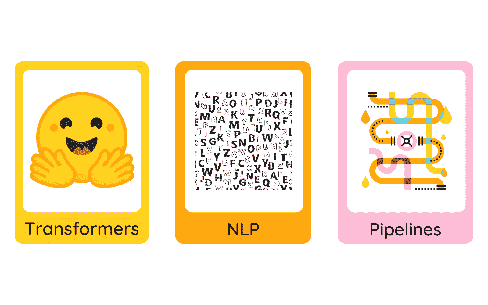

# 使用 HuggingFace Transformers 的简单 NLP 管道

> 原文：[`www.kdnuggets.com/2023/02/simple-nlp-pipelines-huggingface-transformers.html`](https://www.kdnuggets.com/2023/02/simple-nlp-pipelines-huggingface-transformers.html)



图片来源：编辑

HuggingFace 的 transformers 是一个提供 API 和用户友好工具的广泛软件包，用于处理最先进的预训练模型，涵盖语言、视觉、音频和多模态领域。它包含超过 170 个预训练模型，并支持 PyTorch、TensorFlow 和 JAX 等框架，并能够在这些框架之间进行互操作。该库也友好于部署，因为它允许将模型转换为 ONNX 和 TorchScript 格式。

* * *

## 我们的前三个课程推荐

 1\. [Google 网络安全证书](https://www.kdnuggets.com/google-cybersecurity) - 快速开启网络安全职业生涯。

 2\. [Google 数据分析专业证书](https://www.kdnuggets.com/google-data-analytics) - 提升您的数据分析技能

 3\. [Google IT 支持专业证书](https://www.kdnuggets.com/google-itsupport) - 支持您的组织的 IT

* * *

在这篇博客中，我们将特别探讨 transformers 的 `pipelines` 功能，该功能可以轻松用于推理。管道提供了复杂代码的抽象，并提供简单的 API，用于执行多个任务，例如文本摘要、问答、命名实体识别、文本生成和文本分类等。最棒的是，这些 API 允许从预处理到模型评估的所有任务，只需几行代码，而无需大量计算资源。

现在，让我们直接深入吧！

第一步是使用以下命令安装 transformers 包 -

```py
!pip install transformers
```

接下来，我们将使用 `pipeline` 结构来实现不同的任务。

```py
from transformers import pipeline
```

该管道允许指定多个参数，如 `task`、`model`、`device`、`batch size` 以及其他特定任务的参数。

让我们从第一个任务开始。

# 1\. 文本摘要

该任务的输入是一个文本语料库，模型将根据参数中提到的期望长度输出摘要。在这里，我们将最小长度设置为 5，最大长度设置为 30。

```py
summarizer = pipeline(
    "summarization", model="t5-base", tokenizer="t5-base", framework="tf"
)

input = "Parents need to know that Top Gun is a blockbuster 1980s action thriller starring Tom Cruise that's chock full of narrow escapes, chases, and battles. But there are also violent and upsetting scenes, particularly the death of a main character, which make it too intense for younger kids. There's also one graphic-for-its-time sex scene (though no explicit nudity) and quite a few shirtless men in locker rooms and, in one iconic sequence, on a beach volleyball court. Winning is the most important thing to all the pilots, who try to intimidate one another with plenty of posturing and banter -- though when push comes to shove, loyalty and friendship have important roles to play, too. While sexism is noticeable and almost all characters are men, two strong women help keep some of the objectification in check."

summarizer(input, min_length=5, max_length=30) 
```

输出：

```py
[
    {
        "summary_text": "1980s action thriller starring Tom Cruise is chock-full of escapes, chases, battles "
    }
] 
```

还可以从其他为摘要任务微调的模型中选择，如 `bart-large-cnn`、`t5-small`、`t5-large`、`t5-3b`、`t5-11b`。你可以在 [这里](https://huggingface.co/models?pipeline_tag=summarization&sort=downloads) 查看可用模型的完整列表。

# 2\. 问答

在此任务中，我们提供一个问题和一个上下文。模型将根据最高概率分数从上下文中选择答案。它还提供了文本的起始和结束位置。

```py
qa_pipeline = pipeline(model="deepset/roberta-base-squad2")

qa_pipeline(
    question="Where do I work?",
    context="I work as a Data Scientist at a lab in University of Montreal. I like to develop my own algorithms.",
) 
```

输出：

```py
{
    "score": 0.6422629356384277,
    "start": 39,
    "end": 61,
    "answer": "University of Montreal",
} 
```

参考[这里](https://huggingface.co/models?pipeline_tag=question-answering)查看问答任务的可用模型的完整列表。

# 3\. 命名实体识别

命名实体识别涉及根据人名、组织名、地点名等来识别和分类单词。输入基本上是一个句子，模型将确定命名实体及其类别以及在文本中的相应位置。

```py
ner_classifier = pipeline(
    model="dslim/bert-base-NER-uncased", aggregation_strategy="simple"
)
sentence = "I like to travel in Montreal."
entity = ner_classifier(sentence)
print(entity) 
```

输出：

```py
[
    {
        "entity_group": "LOC",
        "score": 0.9976745,
        "word": "montreal",
        "start": 20,
        "end": 28,
    }
] 
```

查阅[这里](https://huggingface.co/models?pipeline_tag=token-classification&sort=downloads)了解其他可用模型的选项。

# 4\. 词性标注

词性标注对于对文本进行分类以及提供相关的词性（例如一个词是否是名词、代词、动词等）非常有用。模型返回标注了词性的单词及其概率分数和相应的位置。

```py
pos_tagger = pipeline(
    model="vblagoje/bert-english-uncased-finetuned-pos",
    aggregation_strategy="simple",
)
pos_tagger("I am an artist and I live in Dublin") 
```

输出：

```py
[
    {
        "entity_group": "PRON",
        "score": 0.9994804,
        "word": "i",
        "start": 0,
        "end": 1,
    },
    {
        "entity_group": "VERB",
        "score": 0.9970591,
        "word": "live",
        "start": 2,
        "end": 6,
    },
    {
        "entity_group": "ADP",
        "score": 0.9993111,
        "word": "in",
        "start": 7,
        "end": 9,
    },
    {
        "entity_group": "PROPN",
        "score": 0.99831414,
        "word": "dublin",
        "start": 10,
        "end": 16,
    },
] 
```

# 5\. 文本分类

我们将进行情感分析并根据语气对文本进行分类。

```py
text_classifier = pipeline(
    model="distilbert-base-uncased-finetuned-sst-2-english"
)
text_classifier("This movie is horrible!") 
```

输出：

```py
[{'label': 'NEGATIVE', 'score': 0.9997865557670593}]
```

让我们再尝试几个例子。

```py
text_classifier("I loved the narration of the movie!")
```

输出：

```py
[{'label': 'POSITIVE', 'score': 0.9998612403869629}] 
```

文本分类模型的完整列表可以在[这里](https://huggingface.co/models?filter=text-classification)找到。

# 6\. 文本生成：

```py
text_generator = pipeline(model="gpt2")
text_generator("If it is sunny today then ", do_sample=False)
```

输出：

```py
[
    {
        "generated_text": "If it is sunny today then \xa0it will be cloudy tomorrow."
    }
] 
```

访问[这里](https://huggingface.co/models?filter=text-generation)获取文本生成模型的完整列表。

# 7\. 文本翻译：

在这里，我们将把文本的语言从一种语言翻译成另一种语言。例如，我们选择了从英语到法语的翻译。我们使用了基础的 t5-small 模型，但你可以在[这里](https://huggingface.co/models?pipeline_tag=translation)访问其他高级模型。

```py
en_fr_translator = pipeline("translation_en_to_fr", model='t5-small')
en_fr_translator("Hi, How are you?")
```

输出：

```py
[{'translation_text': 'Bonjour, Comment êtes-vous ?'}]
```

# 结论

你已经到达了最后，真棒！如果你跟随了整个过程，你学习了如何使用 Transformers 创建基础的 NLP 管道。参考 HuggingFace 的[官方文档](https://huggingface.co/docs/transformers/main_classes/pipelines#natural-language-processing)以查看 NLP 中的其他有趣应用，如零样本文本分类或表格问答。要处理你自己的数据集或实现其他领域（如视觉、音频或多模态）的模型，请查看[这里](https://huggingface.co/docs/transformers/pipeline_tutorial#pipelines-for-inference)。

**[Yesha Shastri](https://www.linkedin.com/in/yeshashastri/)** 是一位热情的 AI 开发者和作家，正在蒙特利尔大学攻读机器学习硕士学位。Yesha 对探索负责任的 AI 技术以解决对社会有益的挑战充满兴趣，并与社区分享她的学习成果。

### 更多相关内容

+   [使用 HuggingFace Pipelines 和 Streamlit 回答问题](https://www.kdnuggets.com/2021/10/simple-question-answering-web-app-hugging-face-pipelines.html)

+   [一个简单易实施的端到端项目与 HuggingFace](https://www.kdnuggets.com/a-simple-to-implement-end-to-end-project-with-huggingface)

+   [使用 HuggingFace 微调 BERT 进行推文分类](https://www.kdnuggets.com/2022/01/finetuning-bert-tweets-classification-ft-hugging-face.html)

+   [HuggingFace 推出了免费的深度强化学习课程](https://www.kdnuggets.com/2022/05/huggingface-launched-free-deep-reinforcement-learning-course.html)

+   [超越管道：作为 Scikit-Learn 元估计器的图形](https://www.kdnuggets.com/2022/09/graphs-scikitlearn-metaestimators.html)

+   [通过特征/训练/推理管道统一批处理和 ML 系统](https://www.kdnuggets.com/2023/09/hopsworks-unify-batch-ml-systems-feature-training-inference-pipelines)
