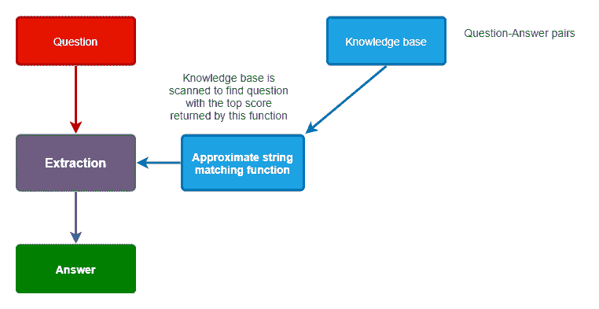

# 使用 Python 进行文本相似性检测的简单问答（QA）系统

> 原文：[`www.kdnuggets.com/2020/04/simple-question-answering-systems-text-similarity-python.html`](https://www.kdnuggets.com/2020/04/simple-question-answering-systems-text-similarity-python.html)

评论

**由 [Andrew Zola](https://www.linkedin.com/in/andrew-zola/)，Artmotion 的内容经理**

人工智能（AI）不再是一个唤起科幻电影画面的抽象概念。今天，AI 已经有了显著的进展，现在能够识别语音、做出决策，并与人类一起完成更大规模的任务。

* * *

## 我们的前三大课程推荐

 1\. [谷歌网络安全证书](https://www.kdnuggets.com/google-cybersecurity) - 快速进入网络安全职业生涯。

 2\. [谷歌数据分析专业证书](https://www.kdnuggets.com/google-data-analytics) - 提升您的数据分析技能

 3\. [谷歌 IT 支持专业证书](https://www.kdnuggets.com/google-itsupport) - 支持您的组织的 IT 工作

* * *

所以，与其担心试图征服地球的机器人，我们更应该关注像 Alexa、Siri 或客服聊天机器人这样的智能算法。这些智能算法究竟是如何像人类一样与我们互动和沟通的呢？

答案在于 [问答（QA）系统](https://hub.packtpub.com/google-open-sources-active-question-answering-activeqa-a-reinforcement-learning-based-qa-system/) 的基础上构建，这些系统基于机器学习（ML）和 [自然语言处理（NLP）](https://hub.packtpub.com/spam-filtering-natural-language-processing-approach/)。

### **什么是 QA 系统？**

QA 系统可以被描述为 [一种提供正确简短回答的技术，而不是给出可能答案的列表](https://intersog.com/blog/the-basics-of-qa-systems-from-a-single-function-to-a-pre-trained-nlp-model-using-python/)。在这种情况下，QA 系统被设计为对文本相似性保持警觉，并回答以自然语言提出的问题。

但有些系统还通过图像来获取信息以回答问题。例如，当你点击图像框以证明你不是机器人时，实际上是在教导智能算法有关特定图像中的内容。

这只有得益于像谷歌的 [双向编码器表示（BERT）](https://arxiv.org/abs/1810.04805) 等 NLP 技术。任何想要构建 QA 系统的人都可以利用 NLP 和训练机器学习算法，以回答特定领域（或定义集合）或通用（开放式）问题。

网上有大量的数据集和资源，因此你可以迅速开始训练智能算法，以学习和处理海量的人类语言数据。

为了提高效率和准确性，NLP 程序还使用推理和概率来猜测正确答案。随着时间的推移，它们在这方面变得非常擅长！

对于企业来说，部署 QA 系统的好处在于它们非常用户友好。一旦企业 QA 系统构建完成，任何人都可以使用。实际上，如果你曾经与 Alexa 互动或使用过 Google Translate，你就体验过 NLP 的实际应用。

在企业环境中，它们可以用于远超聊天机器人和语音助手的功能。例如，可以训练智能算法执行以下任务：

+   **管理**（查找并将信息上下文化，以自动化搜索、修改和管理文档的过程）

+   **客户服务**（利用聊天机器人与客户互动，同时通过分析个人资料、短语和其他数据来识别潜在的新客户）

+   **市场营销**（通过关注在线对公司或品牌的提及）

但回到当前话题，让我们看看它是如何工作的。

### **如何构建一个可靠的 QA 系统？**

为了以技术性和易于理解的方式回答问题，我将向你展示如何基于字符串相似度测量构建一个简单的 QA 系统，并使用封闭域进行数据源。

以下示例基于 Ojokoh 和 Ayokunle 的研究，[基于模糊的答案排名在问答社区](https://www.researchgate.net/publication/272093801_Fuzzy-Based_Answer_Ranking_in_Question_Answering_Communities)。

具有近似匹配功能的 QA 系统很简单，如下：



在这种情况下，我们将使用一个包含问题-答案对的小数据集，存储在一个[CSV 文件](https://github.com/jupyter/notebook)中。在实际应用中，企业将使用[高度专业化的数据库](https://leaderboard.techqa.us-east.containers.appdomain.cloud)，其中包含数十万个样本。

### **先决条件**

要运行这些示例，你需要 [Python 3](https://www.python.org/)，[Jupyter Lab](https://jupyter.org/install) 和 [python-Levenshtein](https://github.com/ztane/python-Levenshtein) 模块。

首先加载数据：

```py` ``` import pandas as pd  data = pd.read_csv('qa.csv')  *# 此函数用于获取可打印的结果*  def getResults(questions, fn):      def getResult(q):          answer, score, prediction = fn(q)          return [q, prediction, answer, score]      return pd.DataFrame(list(map(getResult, questions)), columns=["Q", "Prediction", "A", "Score"])  test_data = [      "埃及的人口是多少？",      "埃及的人口是多少",      "美洲豹的尾巴有多长？",      "你知道美洲豹尾巴的长度吗？",      "北极熊什么时候可以隐身？",      "我能看到北极动物吗？",      "芬兰的某个城市"  ]  data ```py ````

| **问题** | **答案** |
| --- | --- |
| 谁确定了沸点的依赖性？ | 安德斯·摄尔修斯 |
| 甲虫是昆虫吗？ | 是的 |
| 加拿大的两种官方语言是英语和法语吗？ | 是的 |
| 埃及的人口是多少？ | 超过 7800 万 |
| 芬兰最大城市是什么？ | 大赫尔辛基 |
| 列支敦士登的国家货币是什么？ | 瑞士法郎 |
| 北极熊能在红外摄影下被看到吗？ | 北极熊在红外线下几乎不可见 |
| 特斯拉什么时候演示了无线通信... | 1893 |
| 小提琴是用什么材料制成的？ | 不同类型的木材 |
| 豹子的尾巴有多长？ | 60 到 110 厘米 |

在最简单的形式下，QA 系统只能在问题和答案完全匹配时回答问题。

```py` ``` 导入 re  定义 getNaiveAnswer(q):      *# 正则表达式帮助处理一些标点符号*      row = data.loc[data['Question'].str.contains(re.sub(r"[^\w'\s)]+", "", q),case=False)]      如果 len(row) > 0:          返回 row["Answer"].values[0], 1, row["Question"].values[0]      返回 "对不起，我没听懂你说的。", 0, ""  getResults(test_data, getNaiveAnswer) ```py ````

|  | **Q** | **预测** | **A** | **分数** |
| --- | --- | --- | --- | --- |
| 1 | 埃及的人口是多少？ | 埃及的人口是多少？ | 超过 7800 万 | 1 |
| 2 | 埃及的人口是多少 |  | 对不起，我没听懂你说的。 | 0 |
| 3 | 豹子的尾巴有多长？ | 豹子的尾巴有多长？ | 60 到 110 厘米 | 1 |
| 4 | 你知道豹子的尾巴有多长吗？ |  | 对不起，我没听懂你说的。 | 0 |
| 5 | 北极熊什么时候可以隐形？ |  | 对不起，我没听懂你说的。 | 0 |
| 6 | 我可以看到北极动物吗？ |  | 对不起，我没听懂你说的。 | 0 |
| 7 | 芬兰的某个城市 |  | 对不起，我没听懂你说的。 | 0 |

如上所示，一个小小的语法错误可以迅速破坏整个过程。如果使用源文本和查询文本的字符串预处理，例如去除标点符号、转换为小写等，也会得到相同的结果。

那我们如何改善我们的结果呢？

为了改善结果，让我们稍微改变一下，使用[近似字符串匹配](https://github.com/topics/approximate-string-matching)。在这种情况下，我们的系统将能够接受语法错误和文本中的细微差别。

部署近似字符串匹配协议有很多方法，但在我们的示例中，我们将使用一种被称为莱文斯坦距离的字符串度量实现。在这种情况下，两个词之间的距离是将一个词改变为另一个词所需的最少单字符编辑（插入、删除或替换）次数。

让我们在系统上部署[莱文斯坦 Python 模块](https://github.com/ztane/python-Levenshtein)。它包含一组我们可以进行实验的近似字符串匹配函数。

```py` ``` 从 Levenshtein 导入 ratio  def getApproximateAnswer(q):      max_score = 0      answer = ""      prediction = ""      for idx, row in data.iterrows():          score = ratio(row["Question"], q)          if score >= 0.9: *# 我确定，停在这里*              return row["Answer"], score, row["Question"]          elif score > max_score: *# 我不确定，继续*              max_score = score              answer = row["Answer"]              prediction = row["Question"]      if max_score > 0.8:          return answer, max_score, prediction      return "对不起，我没听懂。", max_score, prediction  getResults(test_data, getApproximateAnswer) ```py ````

|  | **Q** | **预测** | **A** | **得分** |
| --- | --- | --- | --- | --- |
| 1 | 埃及的人口是多少？ | 埃及的人口是多少？ | 超过 7800 万 | 1.000000 |
| 2 | 埃及的人口是多少 | 埃及的人口是多少？ | 超过 7800 万 | 0.935484 |
| 3 | 豹子的尾巴有多长？ | 豹子的尾巴有多长？ | 60 到 110 厘米 | 1.000000 |
| 4 | 你知道豹子的尾巴长吗？ | 豹子的尾巴有多长？ | 对不起，我没听懂。 | 0.657143 |
| 5 | 北极熊什么时候会变得隐形？ | 北极熊在红外线摄影下能否被看到... | 对不起，我没听懂。 | 0.517647 |
| 6 | 我能看到北极动物吗？ | 芬兰的哪个城市最大？ | 对不起，我没听懂。 | 0.426230 |
| 7 | 芬兰的哪个城市最大？ | 对不起，我没听懂。 | 0.642857 |

从上述内容可以看出，即使是小的语法错误也能生成正确的答案（得分低于 1.0 也是完全可以接受的）。

为了使我们的 QA 系统更好，继续调整我们函数的 max_score 系数以便更具包容性。

```py` ``` 从 Levenshtein 导入 ratio  def getApproximateAnswer2(q):      max_score = 0      answer = ""      prediction = ""      for idx, row in data.iterrows():          score = ratio(row["Question"], q)          if score >= 0.9: *# 我确定，停在这里*              return row["Answer"], score, row["Question"]          elif score > max_score: *# 我不确定，继续*              max_score = score              answer = row["Answer"]              prediction = row["Question"]      if max_score > 0.3: *# 阈值降低*          return answer, max_score, prediction      return "对不起，我没听懂。", max_score, prediction  getResults(test_data, getApproximateAnswer2) ```py ````

|  | **Q** | **预测** | **A** | **得分** |
| --- | --- | --- | --- | --- |
| **0** | 埃及的人口是多少？ | 埃及的人口是多少？ | 超过 7800 万 | 1.000000 |
| **1** | 埃及的人口是多少 | 埃及的人口是多少？ | 超过 7800 万 | 0.935484 |
| **2** | 豹子的尾巴有多长？ | 豹子的尾巴有多长？ | 60 到 110 厘米 | 1.000000 |
| **3** | 你知道豹子的尾巴长吗？ | 豹子的尾巴有多长？ | 60 到 110 厘米 | 0.657143 |
| **4** | 北极熊何时可以隐形？ | 北极熊在红外摄影下是否能被看到... | 北极熊在红外线下几乎看不见... | 0.517647 |
| **5** | 我能看到北极动物吗？ | 芬兰最大的城市是什么？ | 大赫尔辛基 | 0.426230 |
| **6** | 芬兰的某个城市 | 芬兰最大的城市是什么？ | 大赫尔辛基 | 0.642857 |

上述结果表明，即使使用不同的词汇，系统也能给出正确的答案。但如果你仔细查看，第五个结果看起来像是一个假阳性。

这意味着我们必须提升到一个新水平，并利用像 Facebook 和 Google 这样的公司提供的先进库来克服这些挑战。

上面的例子是如何工作的一个简单演示。代码相当简单，不适合处理大规模数据集上的大量数据和迭代。

由 Google 开发的知名[ BERT 库](https://en.wikipedia.org/wiki/BERT_(language_model))更适合企业任务。你已经接触过的 AI 驱动的 QA 系统使用了更先进的数据库，并进行持续的机器学习。

你在构建企业 QA 系统方面有什么经验？你遇到了哪些挑战？你是如何克服它们的？在下面的**评论**部分分享你的想法和经验。

这篇文章的源代码可以在[这里](https://intersog.com/question-answering-system)找到。

**个人简介： [Andrew Zola](https://www.linkedin.com/in/andrew-zola/)** (**[@DrewZola](https://twitter.com/DrewZola)**) 是 Artmotion 的内容经理：一个为你的数据提供银行服务的公司。他有很多兴趣爱好，但主要是写关于技术的文章。此外，学习新事物和与不同观众建立联系一直让 Andrew 感到惊讶和兴奋。

**相关：**

+   这款微软神经网络能以最少的训练回答有关风景图片的问题

+   Salesforce 开源一个使用 Wikipedia 进行开放域问答的框架

+   为什么你不应该使用 MS MARCO 来评估语义搜索

### 更多相关话题

+   [使用 HuggingFace Pipelines 和 Streamlit 回答问题](https://www.kdnuggets.com/2021/10/simple-question-answering-web-app-hugging-face-pipelines.html)

+   [GPT-4 后：回答关于 AI 的最常见问题](https://www.kdnuggets.com/2023/04/post-gpt4-answering-asked-questions-ai.html)

+   [评估计算文档相似度的方法](https://www.kdnuggets.com/evaluating-methods-for-calculating-document-similarity)

+   [使用 Hugging Face Transformers 进行文本情感检测](https://www.kdnuggets.com/using-hugging-face-transformers-for-emotion-detection-in-text)

+   [如何使用 NumPy 求解非线性方程组](https://www.kdnuggets.com/how-to-use-numpy-to-solve-systems-of-nonlinear-equations)

+   [如何使用 ChatGPT 将文本转换为 PowerPoint 演示文稿](https://www.kdnuggets.com/2023/08/chatgpt-convert-text-powerpoint-presentation.html)
