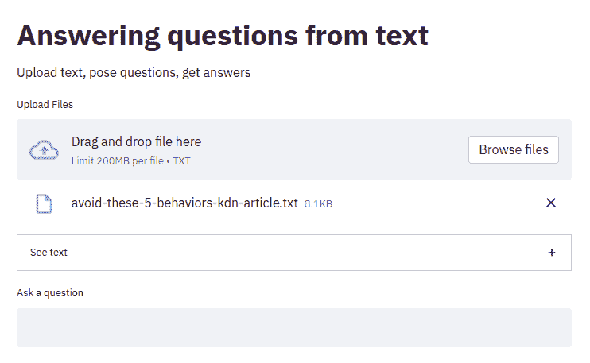

# 使用 HuggingFace Pipelines 和 Streamlit 回答问题

> 原文：[`www.kdnuggets.com/2021/10/simple-question-answering-web-app-hugging-face-pipelines.html`](https://www.kdnuggets.com/2021/10/simple-question-answering-web-app-hugging-face-pipelines.html)


图片由 [Arek Socha](https://pixabay.com/users/qimono-1962238/?utm_source=link-attribution&utm_medium=referral&utm_campaign=image&utm_content=2492009) 提供，来源于 [Pixabay](https://pixabay.com/?utm_source=link-attribution&utm_medium=referral&utm_campaign=image&utm_content=2492009)

当你将几个突出的数据科学库、一些好主意和 Python 结合在一起时，有很多项目可能性。本文将展示这有多么简单，以及实现有趣内容所需的代码行数。

* * *

## 我们的前三个课程推荐

 1\. [Google 网络安全证书](https://www.kdnuggets.com/google-cybersecurity) - 快速进入网络安全职业生涯

 2\. [Google 数据分析专业证书](https://www.kdnuggets.com/google-data-analytics) - 提升你的数据分析技能

 3\. [Google IT 支持专业证书](https://www.kdnuggets.com/google-itsupport) - 支持你的组织的 IT

* * *

HuggingFace 的 [Transformers](https://huggingface.co/transformers/) 库充满了可以开箱即用的 SOTA NLP 模型，也可以针对特定用途和高性能进行微调。该库的管道可以总结为：

> 这些管道是使用模型进行推理的绝佳简便方式。这些管道是抽象了库中大部分复杂代码的对象，提供了一个简单的 API，专注于多个任务，包括命名实体识别、掩码语言建模、情感分析、特征提取和问答。

我们在这里不会进一步解释 Transformer 管道，但你可以阅读 这篇文章，了解如何创建一个简单的情感分析 API 应用，利用 HuggingFace 的库来实现。

如果你还不了解 [Streamlit](https://streamlit.io/)，这是一个 30,000 英尺的概述：

> Streamlit 可以将数据脚本转化为可共享的网页应用，仅需几分钟。全部使用 Python，完全免费，无需前端经验。

你可以在 这里 阅读更深入的介绍，了解如何使用 Streamlit 实现一个项目。

Streamlit 和 Transformer 库的管道可以帮助简化数据科学项目的实施。将两者结合，这种实施的便捷性更为显著。

让我们来看一下创建一个功能性 web 应用程序所需的完整代码。下面这个简洁的脚本完成了创建问答应用程序所需的一切。

```py
import streamlit as st
from transformers import pipeline

def load_file():
    """Load text from file"""
    uploaded_file = st.file_uploader("Upload Files",type=['txt'])

    if uploaded_file is not None:
        if uploaded_file.type == "text/plain":
            raw_text = str(uploaded_file.read(),"utf-8")
        return raw_text

if __name__ == "__main__":

    # App title and description
    st.title("Answering questions from text")
    st.write("Upload text, pose questions, get answers")

    # Load file
    raw_text = load_file()
    if raw_text != None and raw_text != '':

        # Display text
        with st.expander("See text"):
            st.write(raw_text)

        # Perform question answering
        question_answerer = pipeline('question-answering')

        answer = ''
        question = st.text_input('Ask a question')

        if question != '' and raw_text != '':
            answer = question_answerer({
                'question': question,
                'context': raw_text
            })

        st.write(answer)
```

现在让我们让 web 应用程序启动并运行。假设你已经将上述脚本保存为 `nlp_question_answering.py`，下面的代码将完成这项工作：

```py
streamlit run nlp_question_answering.py
```

这应该会打开你的浏览器和网络应用程序。为了演示，我将点击“浏览文件”按钮并选择一篇最近的热门 KDnuggets 文章，“避免这些让你看起来像数据新手的五种行为”，这篇文章我已经复制并清除了所有非必要的文本。一旦完成，Transformer 问答管道将会建立，因此应用程序将运行几秒钟。



如果你对这个话题感兴趣，可以阅读整篇文章（非常好）；否则，以下是相关摘录：

`除非是一个代表你客户群的焦点小组（我甚至对焦点小组的调查结果有疑虑，但那是另一个话题），30 个数据点通常不会给你任何可靠的见解。`

现在让我们使用“提问”字段提一个问题，并检查响应：

```py
What usually won’t give you any robust insights?
```

```py
{
  "score":0.9823936820030212
  "start":1891
  "end":1905
  "answer":"30 data points"
}
```

我们对第一个问题有一个相当有信心的答案。太好了！

现在来看一下这个摘录：

`尝试这个：在构建任何数据产品之前与利益相关者沟通。理解当前阶段的业务需求：如果是初创公司，我敢打赌你的利益相关者不会太在意你构建的数据可视化的格式和颜色，而是更关注数据的准确性及其背后的见解。同样，真正理解受众和使用场景；例如，如果数据产品是为了让非技术受众定期使用，你应该花更多时间在一个精致且简单的用户界面上。`

让我们提出几个与第二个摘录相关的问题，并查看回应。

```py
Who should you talk to before you start building any data products?
```

```py
{
  "score":0.7892400026321411
  "start":6930
  "end":6947
  "answer":"your stakeholders"
}
```

`利益相关者会想要关注什么？`

```py
{
  "score":0.3485959768295288
  "start":7195
  "end":7264
  "answer":"accuracy of the data behind the visualizations and insights from them"
}
```

`你应该真正理解什么？`

```py
{
  "score":0.599153995513916
  "start":7294
  "end":7319
  "answer":"the audience and use case"
}
```

你可以看到我们提出的问题的不同答案的置信度评分。自己尝试一下这个应用程序，看看当你问它没有答案的问题时会发生什么。

我希望这能对你演示如何将 Python 库与一些好主意结合起来的过程有所帮助。通过添加一些复杂的层次，这样的项目可以成为分享给其他数据科学家或潜在雇主的项目组合中的有用补充。

**[Matthew Mayo](https://www.linkedin.com/in/mattmayo13/)** ([**@mattmayo13**](https://twitter.com/mattmayo13)) 是一名数据科学家，同时也是 KDnuggets 的总编辑，该网站是开创性的在线数据科学和机器学习资源。他的兴趣包括自然语言处理、算法设计与优化、无监督学习、神经网络以及机器学习的自动化方法。Matthew 拥有计算机科学硕士学位和数据挖掘研究生文凭。他可以通过 editor1 at kdnuggets[dot]com 联系到。

### 更多相关主题

+   [GPT-4 后：回答关于 AI 的最常见问题](https://www.kdnuggets.com/2023/04/post-gpt4-answering-asked-questions-ai.html)

+   [使用 HuggingFace Transformers 的简单 NLP 管道](https://www.kdnuggets.com/2023/02/simple-nlp-pipelines-huggingface-transformers.html)

+   [使用 HuggingFace 微调 BERT 进行推文分类](https://www.kdnuggets.com/2022/01/finetuning-bert-tweets-classification-ft-hugging-face.html)

+   [一个简单易实现的 HuggingFace 端到端项目](https://www.kdnuggets.com/a-simple-to-implement-end-to-end-project-with-huggingface)

+   [HuggingFace 推出了免费的深度强化学习课程](https://www.kdnuggets.com/2022/05/huggingface-launched-free-deep-reinforcement-learning-course.html)

+   [使用 Streamlit 进行 DIY 自动化机器学习](https://www.kdnuggets.com/2021/11/diy-automated-machine-learning-app.html)
