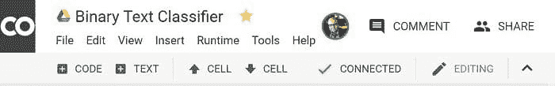

# 使用谷歌 CoLaboratory 创建一个简单的文本分类器

> 原文：[`www.kdnuggets.com/2018/03/simple-text-classifier-google-colaboratory.html`](https://www.kdnuggets.com/2018/03/simple-text-classifier-google-colaboratory.html)

 评论

**由 [Sudipto Dasgupta](https://www.linkedin.com/in/dsudipto/), Flipkart.**

**平台**：谷歌凭借 CoLaboratory 这一内部数据科学平台再次取得成功，该平台对任何人免费开放。它提供了 Jupyter 的几个好处，包括免费的 GPU 时间、便捷的代码共享和存储、不需要安装软件、使用 Chrome 浏览器编码，并兼容 Python 语言和访问 scikit-learn 等模块。这是在使人工智能和数据对所有人可及方面迈出的真正伟大的一步。

**背景**：我在一家电子商务公司工作，在业务中误发货是普遍现象。当系统收到关于误发货的信息时，一组专家会阅读客户对每个案件生成的评论，以确定如何调查。由于开放文本字段难以控制，客户可以自由发布可能无法采取行动或有时甚至无法理解的消息。阅读评论需要相当长的时间，鉴于以前的标记信息，垃圾评论可以通过文本分类算法轻松标记。以下是一个简单的分类器，它可以在有足够的训练数据和均衡标签分布的情况下生成高准确度的标签。



**加载语料库**：训练数据包括两列，第一列包含评论，第二列包含标签（0 和 1）。首先，我们使用以下代码将数据加载到 colab 环境中 -

**从** google**.**colab **导入** files

**导入** pandas **作为** pd

**导入** io

uploaded = files.upload()

df = pd.read_csv(io.StringIO(uploaded['data_train.csv'].decode('utf-8')),header=None)

执行此代码块（在 colab 中称为单元格）会生成一个上传小部件，通过它需要上传训练数据。操作完成后，列将被赋予名称引用 –

raw_text = df[0]

y = df[1]

**预处理**：

尽管有几种不同的方法进行分类，但我使用的方法涉及 NLTK python 包。

词干提取涉及将派生词还原为其基本形式。例如，‘fish’是‘fishing’、‘fished’和‘fisher’等词的词根。Martin Porter 的算法是一个流行的词干提取工具，可以在 NLTK 中找到。停用词是从特征提取角度来看，对句子意义贡献不大的词。像‘after’、‘few’、‘right’等词经常被搜索引擎忽略。常见停用词的列表可以在[此处](https://www.webconfs.com/stop-words.php)找到。我通过以下命令从 NLTK 导入了‘PorterStemmer’和‘Stopwords’。

**import** nltk

nltk**.**download**(**'stopwords'**),**nltk**.**download**(**'porter_test'**)**

另一个预处理步骤是使用[正则表达式](https://docs.python.org/3/howto/regex.html)或‘re’模块。这包括去除空格、制表符、标点符号，最后将所有文本转换为小写。此步骤通常称为规范化。创建了一个名为‘pre_process’的函数来将所有这些步骤实现为一行代码，适用于任何文本或文本块。

```py

#Text PreProcessing Function Creation

stop_words = nltk.corpus.stopwords.words('english')
ps = nltk.PorterStemmer()

import re
def pre_process(txt):
    z = re.sub("[^a-zA-Z]",  " ",  str(txt))
    z = re.sub(r'[^\w\d\s]', ' ', z)
    z = re.sub(r'\s+', ' ', z)
    z = re.sub(r'^\s+|\s+?$', '', z.lower())
    return ' '.join(ps.stem(term) 
        for term in z.split()
        if term not in set(stop_words)
    )

```

现在让我们看看这个函数对文本的作用，使用代码对语料库中的前 5 条评论进行处理。

```py

##Testing whether processing works
processed = raw_text.apply(pre_process)
print('Original Comment\n',raw_text.head(10),'\n\nTransformed Comment\n',processed.head())

```

运行单元格会生成以下输出，你可以比较这些行以查看预处理步骤的综合效果。

##原始评论###

项目与显示的图片不符

cmbissue :- 客户打电话要求退货和...

不同的项目

表盘颜色是白色，我订购的是黑色项目...

质量问题且价格标签缺失

###转换后的评论###

显示的项目图片

cmbissucust call return refund due discript ...

不同的项目

dial color white order blackitem receivvari...

issuqualiti price tag miss

**分词：** 让我们考虑句子——‘你好吗？’。显然，程序无法理解单词，它们只理解字符。因此，如果采用词袋模型，句子‘你好吗？’和‘好吗 你’是相同的。然而，句子的二元组将会不同。二元组是 n-grams 的子集，n-grams 是由基本对、音节或单词组成的集合。n-grams 在自然语言处理和其他领域如 DNA 测序中都非常流行！二元组是：

‘你好吗？’ ---- ‘你好吗’ , ‘好吗 你’

‘你好吗？’ ---- ‘你好吗’ , ‘好吗 你’

二元组生成代码是：

# 创建单字法和二字法向量

**from** sklearn**.**feature_extraction**.**text **import** TfidfVectorizer

vectorizer **=**TfidfVectorizer**(**ngram_range**=(**1**,**2**))**

X_ngrams**=**vectorizer**.**fit_transform**(**processed**)**

词频（tf）衡量每个 n-gram 在每个训练示例中的出现次数。这个值会通过逆文档频率（idf）进行加权，以确保对每个类别具有独特性的词或词对具有更高的权重，而常见的 n-grams 具有较低的权重。

**创建分类器**：一旦特征由前一段代码生成，下一步就是使用数据拟合模型。数据按 80/20 的比例分割，并使用（二元）逻辑回归进行建模。

# 训练/测试拆分

**from** sklearn**.**model_selection **import** train_test_split

X_train**,**X_test**,**y_train**,**y_test**=**train_test_split**(**X_ngrams**,**y**,**test_size**=**0.2**,**stratify**=**y**)**

# 运行分类器

**from** sklearn**.**linear_model **import** 逻辑回归

clf**=**逻辑回归**()**

clf**.**fit**(**X_train**,**y_train**)**

在这一点上，可以使用如 F1 分数这样的指标来评估模型性能。

机器已经学会了！


接下来，我们需要一个包装函数来将珍珠与垃圾分开。

**def** pearl_or_junk**(**message**):**# 包装函数

**if** clf**.**predict**(**vectorizer**.**transform**([**pre_process**(**message**)])):**

**return** '珍珠'

**else****:**

**return** '垃圾'

就这样！包装函数可以处理评论列，以分类评论是否有用。可以使用以下代码传递示例文件：

上传 **=**文件**.**upload**()**

测试数据**=**pd**.**read_csv**(**io**.**StringIO**(**uploaded**[**'test_file.csv'**].**decode**(**'utf-8'**)),**header**=****None****)**

测试数据**[**1**]=**测试数据**[**0**].**apply**(**pearl_or_junk**)**

测试数据**.**to_csv**(**'newfile.csv'**,** index **=****None****,** header **=****False****)**

文件**.**下载**(**'newfile.csv'**)**

该代码将为每行评论创建一个带有‘珍珠’和‘垃圾’标签的列，您会在名为‘newfile’的文件中找到这些列，该文件将自动下载到您的系统中。

**接下来做什么？** 如我之前所述，这是一段简单的代码，还有很多改进的空间。如果训练数据中存在类别不平衡，该模型将预测占主导地位的类别，为了解决这个问题，可能需要使用如 SMOTE 这样的重采样技术。

有几种 NLP 技术如词形还原，可以提升预处理效果。通常，将 n-gram 增加到 3 或 4 的组合会增加机器的负担，而在我的情况下，它只是给了我一个信息，说它太累了，无法处理如此复杂的内容。仅供参考，二元组在稀疏矩阵中生成了超过 36,000 个特征。想象一下，如果你增加 N 会发生什么。

建模非常简单。模型堆叠可能有助于提高准确性，而 Naïve Bayes 或 SVC 等其他算法在处理这些问题时表现更好。我没有尝试神经网络，但如果训练数据足够大，它也可能给出更好的结果。谷歌 Colab 也提供了免费的 GPU，所以值得一试。


尽管我在 Jupyter 中创建了这段代码，但将其迁移到 Colaboratory 是非常轻松的。感谢你，谷歌！

标签：NLP；机器学习；回归；

简介：

**Sudipto Dasgupta** 目前在 Flipkart India Pvt. Ltd. 担任流程设计专员，这是印度最大的电子商务组织。他在软件、市场研究、教育和供应链等领域有超过 15 年的业务分析经验。他是经验丰富的六西格玛大师黑带和项目管理专业人士（PMP），拥有数学和统计学的教育背景。他对数据科学有着积极的兴趣。

**相关：**

+   [3 个必备的 Google Colaboratory 小贴士](https://www.kdnuggets.com/2018/02/essential-google-colaboratory-tips-tricks.html)

+   [使用机器学习进行自动化文本分类](https://www.kdnuggets.com/2018/01/automated-text-classification-machine-learning.html)

+   [使用 Google Colab、TensorFlow、Keras 和 PyTorch 进行深度学习开发](https://www.kdnuggets.com/2018/02/google-colab-free-gpu-tutorial-tensorflow-keras-pytorch.html)

* * *

## 我们的前三个课程推荐

 1\. [Google 网络安全证书](https://www.kdnuggets.com/google-cybersecurity) - 快速进入网络安全职业的快车道。

 2\. [Google 数据分析专业证书](https://www.kdnuggets.com/google-data-analytics) - 提升您的数据分析能力

 3\. [Google IT 支持专业证书](https://www.kdnuggets.com/google-itsupport) - 支持您所在组织的 IT 工作

* * *

### 相关主题

+   [创建一个简单的 Docker 数据科学镜像](https://www.kdnuggets.com/2023/08/simple-docker-data-science-image.html)

+   [从理论到实践：构建 k-近邻分类器](https://www.kdnuggets.com/2023/06/theory-practice-building-knearest-neighbors-classifier.html)

+   [使用 Google MusicLM 从文本生成音乐](https://www.kdnuggets.com/2023/06/generate-music-text-google-musiclm.html)

+   [5 个简单步骤系列：掌握 Python、SQL、Scikit-learn、PyTorch 和…](https://www.kdnuggets.com/5-simple-steps-series-master-python-sql-scikit-learn-pytorch-google-cloud)

+   [赢得房间：创建和呈现有效的数据驱动…](https://www.kdnuggets.com/2022/04/franks-winning-room-creating-delivering-effective-data-driven-presentation.html)

+   [创建特定领域 AI 模型的最佳实践](https://www.kdnuggets.com/2022/07/best-practices-creating-domainspecific-ai-models.html)
