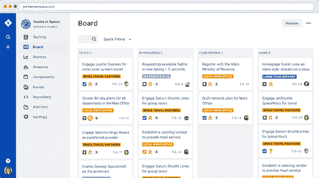
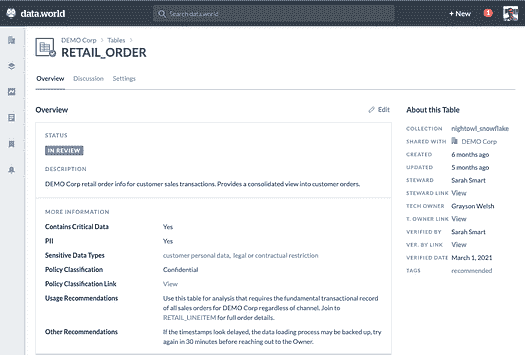

# 你需要从敏捷中借鉴的两个简单技巧

> 原文：[`www.kdnuggets.com/2021/11/simple-things-steal-agile-data-science-analytics.html`](https://www.kdnuggets.com/2021/11/simple-things-steal-agile-data-science-analytics.html)

comments

**由 [Jon Loyens](https://www.linkedin.com/in/jonloyens/)， [data.world](https://data.world/) 的首席产品官和联合创始人**

照片由 [Murilo Viviani](https://unsplash.com/@mviviani?utm_source=unsplash&utm_medium=referral&utm_content=creditCopyText) 提供，发布在 [Unsplash](https://unsplash.com/s/photos/dog-training?utm_source=unsplash&utm_medium=referral&utm_content=creditCopyText)

* * *

## 我们的前三大课程推荐

 1\. [Google 网络安全证书](https://www.kdnuggets.com/google-cybersecurity) - 快速进入网络安全领域的职业道路。

 2\. [Google 数据分析专业证书](https://www.kdnuggets.com/google-data-analytics) - 提升你的数据分析能力

 3\. [Google IT 支持专业证书](https://www.kdnuggets.com/google-itsupport) - 支持你组织的 IT 部门

* * *

将软件开发生命周期的各个方面应用于数据科学、工程和分析现在非常流行——这是一件好事。无论是讨论 [将数据转换视为代码](https://blog.getdbt.com/analytics-engineers-operate-with-leverage/)， [采纳 DataOps](https://www.datakitchen.io/what-is-dataops/) 和敏捷数据治理实践， [将数据视为产品](https://medium.com/@itunpredictable/data-as-a-product-vs-data-as-a-service-d9f7e622dc55)，还是考虑 [数据网格](https://medium.com/agile-lab-engineering/data-mesh-explanation-a207fac61341) 架构（本质上是将微服务基础应用于数据和分析堆栈），世界正在逐渐*最终* 视数据和分析为团队运动。但如果你想赢得这场比赛，你需要找到让玩家互动和协作的方式，捕捉知识，并使更多人能够参与进来。

现在有一股疯狂的潮流，借鉴软件开发社区的成功，特别是在促进数据科学和分析方面的更好协作和团队合作。伟大的艺术家会借鉴，而作为一个经常谈论 [敏捷数据治理](https://data.world/resources/what-is-data-governance/) 的人，我也会这样做！

但并不是每个人都支持这样一种观点：如果我们都像软件工程师和产品经理那样做就能得救。人们指出了有关数据隐私、偏见、有效性和其他问题的非常有效的问题，这使得分析和数据科学的输出比典型的敏捷软件项目要敏感得多。还很明显，涉及数据和分析的工作通常会涉及比典型软件项目更广泛的相关方，最终导致关键决策。

从积极的方面来看，包容性、迭代性强且真正涉及所有相关方的敏捷实践有可能将数据生产者（数据工程师和管理员）与数据消费者（数据科学家和分析师）以真正有意义的方式结合起来。这可以促进强大的数据驱动文化和大大提高数据素养。

在我的日常工作中，我们构建了一个[data catalog](https://data.world/blog/what-is-a-data-catalog/)平台，企业如世界上最大的物流房地产公司 Prologis 正在使用它。通过使用案例驱动的敏捷方法开发其分析和数据治理实践，Prologis 能够以真正具有变革性的方式部署它。

> 历史上，我们组织采用了自上而下的‘煮海’方法进行数据治理，这对我们不起作用。我们知道必须通过关注用户体验到的最大痛苦和烦恼来彻底改变我们的方法。然后，我们让这些实际数据驱动我们的数据治理计划扩展。简而言之，通过根据业务用例优先级迭代地部署数据目录是重新激发员工对我们治理计划兴趣的关键。”
> 
> — Luke Slotwinski，Prologis IT 数据与分析副总裁

执行数据目录化计划可能还不适合你，但如果我告诉你，有两个简单的敏捷理念你可以立即实施，它们将大大提高你的数据和分析工作质量，并开始促进共享理解和数据素养，你会如何？这两个理念是同行评审和完成定义。

## 同行评审

在软件开发中，代码（或同行）审查的理念远早于著名的 Github “Pull Request” 功能，后者允许工程师在代码发布前对彼此的工作进行评论。我第一次在 Steve McConnell 的 [Code Complete](https://www.amazon.com/Code-Complete-Practical-Handbook-Construction/dp/0735619670/ref=sr_1_1?dchild=1&keywords=code+complete&qid=1631031686&sr=8-1) 一书中读到这一技术——该书最初出版于 1992 年！让队友对你的工作进行复查并提出你可能遗漏的建议，具有简单的力量和美感。对于特别复杂的代码，两位工程师可能会逐行审查，作者实时向审查者解释代码的工作原理。这还有助于重要的知识传递，确保团队中不止一个人了解代码的工作方式，避免了可怕的“公交车因素 1”。

将这种审查方式作为流程的一部分是非常有影响力的。另一个好处（特别是因为我们现在几乎都生活在远程世界中）是，这些审查中捕获的评论可以在几乎没有额外努力的情况下大幅改善你的数据和分析文档工作。不过需要注意的是，审查应集中在同行数据科学家或分析师如何完成分析上，无论是逐行代码还是逐步说明可视化的创建过程。这不是利益相关者或最终用户验收测试。（在软件中，类比就像让用户点击原型并认为完成了）。

这一点不能被过分强调：同行审查者会发现你的技术中的错误，或提出商业利益相关者无法提供的建议（尤其是当分析恰好确认了某种信念或先入为主的偏见时）。在流程中增加这一步骤将积极影响跨部门协作、整体数据素养，并对分析质量或交付的数据模型产生巨大的影响。我建议你 Google [“Good Code Read Practices”](https://www.google.com/search?q=how+to+run+a+code+review) 以获取大量关于如何做好这件事的文章，并考虑如何将其适应你公司内的数据和分析最佳实践。

## 完成的定义

在同行评审会议中真正能产生差异的，是拥有一个优秀的“完成定义”。“[完成定义](https://www.agilealliance.org/glossary/definition-of-done/)”这一概念源于软件开发领域的 Scrum 方法论，其核心思想是，当用户故事完成时，应有一个简单而明确的检查清单，以确保作为工程师（以及审阅者），你已达标。拥有一个所有数据科学家、分析师和工程师同意使用的简单清单，以签署工作，可以显著提升数据工作的质量和一致性。

然而，对于分析和数据工程工作的完成定义，你可能需要为分析工作和数据建模工作分别制定定义。我们使用了一些定义，这些可能也是你组织的良好起点：

## 数据科学和分析的完成定义

+   假设已明确阐述

+   方法已审查偏差

+   数据源已明确

+   新数据源/建模已提交给数据工程

+   方法已阅读并可在同行环境中重复使用

+   轴、特征、领域定义明确

+   结论和行动步骤已记录

+   审查合规性

+   公开征求意见或重用

## 数据建模的完成定义

+   数据字典已编写

+   现有业务术语和相关指标已链接

+   新业务术语已提交

+   转换代码已审查

+   遵循数据架构风格（Kimball、Data vault 等）

+   遵循“不要重复自己”原则

+   测试已编写，数据概况已充分记录/理解

+   审查合规性

+   公开征求意见或重用

当我们在 data.world 采用了[dbt](https://www.getdbt.com/)来建模我们的内部数据和分析时，拥有这些完成定义（特别是针对数据建模的定义）对于建立我们完成分析工程工作的基线至关重要。它确保了即使在学习新工具时，我们在审查彼此的工作时也保持一致。这使得我们在迁移到 Snowflake 时，将新数据模型导入数据仓库的效率翻倍。

## 采用此实践

每当你采纳像同行评审或拥有“完成定义”这样的新实践时，将它们纳入你今天使用的项目管理工具中是很重要的——你甚至不需要任何新的数据或分析基础设施来做到这一点。通常，只需将像 JIRA 这样的软件过程工具适应到你的数据和分析实践中即可满足要求。如果你围绕用户故事组织分析工作，将“同行评审”步骤添加到像 JIRA 这样的工具中是非常简单的。使用 JIRA 的敏捷看板也很简单，已经包含了审查步骤：

图片作者提供

如果你实际上拥有数据目录，为数据资产添加“审核中”标志也是非常有帮助的，并且可以与项目管理工具同步。这些标志可以用来分配审阅者，或者让使用者知道资产是否已经准备好使用。

作者提供的图片

## 在数据和分析中赢得胜利与敏捷

在这篇文章的开头，我提到我曾从敏捷软件开发原则中汲取灵感，并将其应用于数据和分析工作。你知道吗？我将继续从敏捷中汲取灵感，因为我相信创建协作的、数据驱动的文化，在这种文化中，数据和分析的透明性和信任至关重要。同行评审和遵循对数据和分析工作有明确理解的完成定义是非常有价值且简单的想法，你今天就可以采纳。没有比这更容易实施的变化，也没有比这对数据质量和组织内的共享理解产生更大积极影响的变化了。

我很乐意听听任何在数据和分析流程或治理工作流中采纳这些或其他敏捷方法的人的意见！

**简介： [Jon Loyens](https://www.linkedin.com/in/jonloyens/)** 是 [**data.world**](https://data.world/) 的首席产品官和联合创始人，data.world 是现代数据栈的数据目录。他是推动数据驱动文化的热情倡导者，根植于开放性和透明性。在过去的职业生涯中，Jon 曾担任 HomeAway 的旅行产品工程副总裁和 Bazaarvoice 的工程副总裁。作为一位长期的奥斯汀科技高管，他经历了数据和分析作为民主化力量的趋势的崛起。Jon 将 A/B 测试和数据驱动的产品管理引入 Bazaarvoice，并大幅扩展了 HomeAway 的数据项目。

[原文](https://towardsdatascience.com/two-simple-things-you-need-to-steal-from-agile-for-data-and-analytics-work-d3130050f0e5)。转载已获许可。

**相关：**

+   数据科学可以敏捷吗？将最佳敏捷实践应用于你的数据科学流程

+   敏捷数据标注：它是什么以及你为什么需要它

+   如何让敏捷团队为大数据分析发挥作用

### 更多相关主题

+   [黑客如何利用数据科学窃取数十亿美元的 4 种方式](https://www.kdnuggets.com/2022/02/4-ways-hackers-data-science-steal-billions.html)

+   [你需要知道的关于数据管理的 6 件事以及它为何重要…](https://www.kdnuggets.com/2022/05/6-things-need-know-data-management-matters-computer-vision.html)

+   [构建 LLM 应用程序时你需要知道的 5 件事](https://www.kdnuggets.com/2023/08/5-things-need-know-building-llm-applications.html)

+   [掌握数据科学项目管理的 7 个步骤与敏捷](https://www.kdnuggets.com/2023/07/7-steps-mastering-data-science-project-management-agile.html)

+   [神经网络之前可以尝试的 10 件简单事](https://www.kdnuggets.com/2021/12/10-simple-things-try-neural-networks.html)

+   [你不知道的低代码工具的 7 件事](https://www.kdnuggets.com/2022/09/7-things-didnt-know-could-low-code-tool.html)
