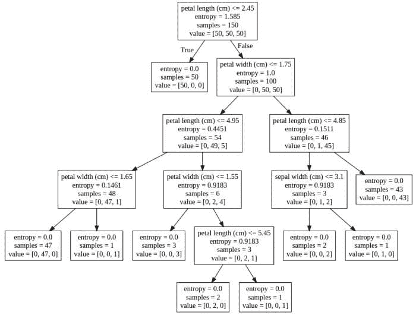

# 使用 Python 和 Scikit-learn 简化决策树的可解释性

> 原文：[`www.kdnuggets.com/2017/05/simplifying-decision-tree-interpretation-decision-rules-python.html`](https://www.kdnuggets.com/2017/05/simplifying-decision-tree-interpretation-decision-rules-python.html)

在讨论分类器时，与许多更复杂的分类器（尤其是黑箱类型的分类器）相比，决策树通常被认为是容易解释的模型。这通常是正确的。

这**尤其**适用于从简单数据中创建的相对简单的模型。对于从大量（高维）数据中构建的复杂决策树，这一点就不那么适用了。即使是其他看似简单但深度和/或宽度较大的决策树，重分支的情况也可能很难追踪。

* * *

## 我们的前三个课程推荐

 1\. [Google 网络安全证书](https://www.kdnuggets.com/google-cybersecurity) - 快速进入网络安全职业生涯。

 2\. [Google 数据分析专业证书](https://www.kdnuggets.com/google-data-analytics) - 提升你的数据分析技能

 3\. [Google IT 支持专业证书](https://www.kdnuggets.com/google-itsupport) - 支持你在 IT 领域的组织

* * *

简洁的文本表示可以很好地总结决策树模型。此外，某些文本表示的功能超出了总结能力。例如，自动生成能够通过传递实例对未来数据进行分类的函数，在特定情况下可能会有所帮助。但我们不要偏离主题——可解释性是我们在这里讨论的目标。

本文将探讨几种简化决策树表示及其最终可解释性的方法。所有代码均为 Python，决策树建模使用 Scikit-learn。

# 构建分类器

首先，让我们使用我最喜欢的数据集，通过使用[Scikit-learn 的决策树分类器](http://scikit-learn.org/stable/modules/generated/sklearn.tree.DecisionTreeClassifier.html)在 Python 中构建一个简单的决策树，指定信息增益作为标准，其余则使用默认设置。由于在这篇文章中我们不关注对未见实例的分类，因此我们不会拆分数据，而是直接使用整个数据集来构建分类器。

```py
import numpy as np
from sklearn import datasets
from sklearn import tree

# Load iris
iris = datasets.load_iris()
X = iris.data
y = iris.target

# Build decision tree classifier
dt = tree.DecisionTreeClassifier(criterion='entropy')
dt.fit(X, y)
```

# 视觉化模型的表示

解释决策树的最简单方法之一是通过视觉效果，这可以通过 Scikit-learn 和这几行代码实现：

```py
dotfile = open("dt.dot", 'w')
tree.export_graphviz(dt, out_file=dotfile, feature_names=iris.feature_names)
dotfile.close()
```

将创建的文件（在我们的示例中为'dt.dot'）的内容复制到[graphviz 渲染工具](http://webgraphviz.com/)，我们可以得到以下决策树表示：



使用[graphviz 渲染代理](http://webgraphviz.com/)的决策树的可视化表示

# 将模型表示为一个函数

如本文开头所述，我们将探讨几种文本表示决策树的不同方法。

第一个是将决策树模型[表示为一个函数](http://stackoverflow.com/questions/20224526/how-to-extract-the-decision-rules-from-scikit-learn-decision-tree)。

```py
from sklearn.tree import _tree

def tree_to_code(tree, feature_names):
	"""
	Outputs a decision tree model as a Python function

	Parameters:
	-----------
	tree: decision tree model
		The decision tree to represent as a function
	feature_names: list
		The feature names of the dataset used for building the decision tree
	"""

	tree_ = tree.tree_
	feature_name = [
		feature_names[i] if i != _tree.TREE_UNDEFINED else "undefined!"
		for i in tree_.feature
	]
	print("def tree({}):".format(", ".join(feature_names)))

	def recurse(node, depth):
		indent = "  " * depth
		if tree_.feature[node] != _tree.TREE_UNDEFINED:
			name = feature_name[node]
			threshold = tree_.threshold[node]
			print("{}if {} <= {}:".format(indent, name, threshold))
			recurse(tree_.children_left[node], depth + 1)
			print("{}else:  # if {} > {}".format(indent, name, threshold))
			recurse(tree_.children_right[node], depth + 1)
		else:
			print("{}return {}".format(indent, tree_.value[node]))

	recurse(0, 1)
```

让我们调用这个函数并查看结果：

```py
tree_to_code(dt, list(iris.feature_names))
```

```py
def tree(sepal length (cm), sepal width (cm), petal length (cm), petal width (cm)):
  if petal length (cm) <= 2.45000004768:
    return [[ 50\.   0\.   0.]]
  else:  # if petal length (cm) > 2.45000004768
    if petal width (cm) <= 1.75:
      if petal length (cm) <= 4.94999980927:
        if petal width (cm) <= 1.65000009537:
          return [[  0\.  47\.   0.]]
        else:  # if petal width (cm) > 1.65000009537
          return [[ 0\.  0\.  1.]]
      else:  # if petal length (cm) > 4.94999980927
        if petal width (cm) <= 1.54999995232:
          return [[ 0\.  0\.  3.]]
        else:  # if petal width (cm) > 1.54999995232
          if petal length (cm) <= 5.44999980927:
            return [[ 0\.  2\.  0.]]
          else:  # if petal length (cm) > 5.44999980927
            return [[ 0\.  0\.  1.]]
    else:  # if petal width (cm) > 1.75
      if petal length (cm) <= 4.85000038147:
        if sepal length (cm) <= 5.94999980927:
          return [[ 0\.  1\.  0.]]
        else:  # if sepal length (cm) > 5.94999980927
          return [[ 0\.  0\.  2.]]
      else:  # if petal length (cm) > 4.85000038147
        return [[  0\.   0\.  43.]]
```

有趣。让我们看看通过剥离一些“不必要的功能”是否可以提高可解释性，前提是这些功能不是必需的。

# 将模型表示为伪代码

接下来，[对上述代码的轻微修改](http://stackoverflow.com/questions/20224526/how-to-extract-the-decision-rules-from-scikit-learn-decision-tree)实现了本文标题所承诺的目标：一组用于表示决策树的决策规则，以略微少一点 Python 风格的伪代码形式。

```py
def tree_to_pseudo(tree, feature_names):
	"""
	Outputs a decision tree model as if/then pseudocode

	Parameters:
	-----------
	tree: decision tree model
		The decision tree to represent as pseudocode
	feature_names: list
		The feature names of the dataset used for building the decision tree
	"""

	left = tree.tree_.children_left
	right = tree.tree_.children_right
	threshold = tree.tree_.threshold
	features = [feature_names[i] for i in tree.tree_.feature]
	value = tree.tree_.value

	def recurse(left, right, threshold, features, node, depth=0):
		indent = "  " * depth
		if (threshold[node] != -2):
			print(indent,"if ( " + features[node] + " <= " + str(threshold[node]) + " ) {")
			if left[node] != -1:
				recurse (left, right, threshold, features, left[node], depth+1)
				print(indent,"} else {")
				if right[node] != -1:
					recurse (left, right, threshold, features, right[node], depth+1)
				print(indent,"}")
		else:
			print(indent,"return " + str(value[node]))

	recurse(left, right, threshold, features, 0)
```

让我们测试这个函数：

```py
tree_to_pseudo(dt, list(iris.feature_names))
```

```py
 if ( petal length (cm) <= 2.45000004768 ) {
   return [[ 50\.   0\.   0.]]
 } else {
   if ( petal width (cm) <= 1.75 ) {
     if ( petal length (cm) <= 4.94999980927 ) {
       if ( petal width (cm) <= 1.65000009537 ) {
         return [[  0\.  47\.   0.]]
       } else {
         return [[ 0\.  0\.  1.]]
       }
     } else {
       if ( petal width (cm) <= 1.54999995232 ) {
         return [[ 0\.  0\.  3.]]
       } else {
         if ( petal length (cm) <= 5.44999980927 ) {
           return [[ 0\.  2\.  0.]]
         } else {
           return [[ 0\.  0\.  1.]]
         }
       }
     }
   } else {
     if ( petal length (cm) <= 4.85000038147 ) {
       if ( sepal length (cm) <= 5.94999980927 ) {
         return [[ 0\.  1\.  0.]]
       } else {
         return [[ 0\.  0\.  2.]]
       }
     } else {
       return [[  0\.   0\.  43.]]
     }
   }
 }

```

这看起来也不错，在我计算机科学训练的思维中，使用恰当的 C 风格大括号使得代码比之前的尝试更具可读性。

这些珍宝让我想修改代码以获得真正的决策规则，我计划在完成本文后进行尝试。如果有任何值得注意的进展，我会回来在这里发布我的发现。

**[马修·梅奥](https://www.linkedin.com/in/mattmayo13/)** （[**@mattmayo13**](https://twitter.com/mattmayo13)）是一名数据科学家，也是 KDnuggets 的主编，这是一个开创性的在线数据科学和机器学习资源。他的兴趣包括自然语言处理、算法设计与优化、无监督学习、神经网络和自动化机器学习方法。马修拥有计算机科学硕士学位和数据挖掘研究生文凭。他可以通过 editor1 at kdnuggets[dot]com 联系。

### 了解更多相关内容

+   [决策树算法解析](https://www.kdnuggets.com/2020/01/decision-tree-algorithm-explained.html)

+   [通过实现理解: 决策树](https://www.kdnuggets.com/2023/02/understanding-implementing-decision-tree.html)

+   [讲述一个精彩的数据故事: 可视化决策树](https://www.kdnuggets.com/2021/02/telling-great-data-story-visualization-decision-tree.html)

+   [随机森林与决策树: 关键区别](https://www.kdnuggets.com/2022/02/random-forest-decision-tree-key-differences.html)

+   [KDnuggets™ 新闻 22:n09, 3 月 2 日: 讲述一个精彩的数据故事: A…](https://www.kdnuggets.com/2022/n09.html)

+   [决策树软件完整指南](https://www.kdnuggets.com/2022/08/complete-guide-decision-tree-software.html)
