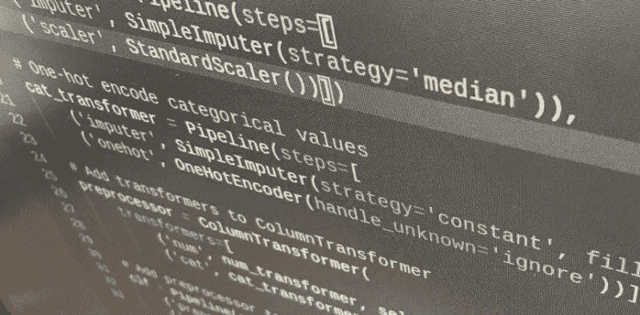
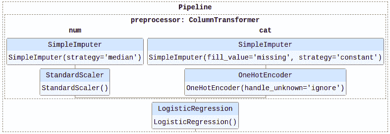

# 使用管道在 Scikit-Learn 中简化混合特征类型预处理

> 原文：[`www.kdnuggets.com/2020/06/simplifying-mixed-feature-type-preprocessing-scikit-learn-pipelines.html`](https://www.kdnuggets.com/2020/06/simplifying-mixed-feature-type-preprocessing-scikit-learn-pipelines.html)

评论

假设我们要在 Python 中执行混合特征类型的预处理。为了我们的目的，假设这包括：

+   *缩放*数值型值

+   *将*分类值转换为独热编码

+   *填充*所有缺失值

进一步说，我们希望这尽可能地无痛、自动化，并集成到我们的机器学习工作流中。

* * *

## 我们的前三个课程推荐

 1\. [Google 网络安全证书](https://www.kdnuggets.com/google-cybersecurity) - 快速进入网络安全职业生涯。

 2\. [Google 数据分析专业证书](https://www.kdnuggets.com/google-data-analytics) - 提升你的数据分析技能

 3\. [Google IT 支持专业证书](https://www.kdnuggets.com/google-itsupport) - 在 IT 方面支持你的组织

* * *

在 Python 机器学习生态系统中，以前可能通过直接操作 Pandas DataFrames 和/或使用 Numpy ndarray 操作，可能还结合一些 Scikit-learn 模块来实现，根据个人的偏好。虽然这些方法仍然完全可以接受，但现在所有这些操作也可以仅通过 Scikit-learn 完成。采用这种方法，它几乎可以完全自动化，并可以集成到 Scikit-learn 管道中，实现无缝实施和更容易的重现性。

所以让我们看看如何利用 Scikit-learn 轻松完成上述所有操作。



首先，导入我们在整个过程中所需的一切：

```py
from sklearn.datasets import fetch_openml
from sklearn.impute import SimpleImputer
from sklearn.preprocessing import StandardScaler, OneHotEncoder
from sklearn.compose import ColumnTransformer
from sklearn.pipeline import Pipeline
from sklearn.compose import make_column_selector as selector

```

为了演示，我们使用泰坦尼克号数据集。我知道，我知道……很无聊。但它混合了数值型和分类变量，易于理解，而且大多数人对它有一定的熟悉度。所以让我们获取数据，读取它，并快速查看一下，以理解我们的特征预处理如何与特定数据相关。

```py
# Fetch Titanic dataset
titanic = fetch_openml('titanic', version=1, as_frame=True) X = titanic.frame.drop('survived', axis=1)
y = titanic.frame['survived'] 
```

让我们回顾一下特征数据类型。

```py
X.dtypes

```

```py
name           object
address        float64
sex          category
age           float64
sibsp         float64
parch         float64
ticket         object
fare          float64
cabin          object
embarked     category
boat           object
body          float64
home.dest      object
dtype: object
```

注意数值型和非数值型特征类型。我们将以无缝且有些自动化的方式对这些不同类型进行预处理。

在 0.20 版本中引入的[ColumnTransformer](https://scikit-learn.org/stable/modules/generated/sklearn.compose.ColumnTransformer.html)旨在将 Scikit-learn 的变换器应用于单个数据集列，无论该列位于 Numpy 数组还是 Pandas DataFrame 中。

> 该估算器允许对输入的不同列或列子集进行单独变换，每个变换器生成的特征将被连接成一个单一的特征空间。这对于异质数据或列数据很有用，以将多个特征提取机制或变换合并为一个变换器。

这意味着你能够将单独的变换器应用于单独的列。这可能意味着，对于 Titanic 数据集，我们可能想要缩放数值列，并对分类列进行独热编码。也可能需要用列的中位数填补缺失的数值，并在特征缩放和编码之前用常数填补缺失的分类值。

为此，让我们创建一对`Pipeline`对象，分别用于上述的数值和分类变换。

```py
# Scale numeric values
num_transformer = Pipeline(steps=[
    ('imputer', SimpleImputer(strategy='median')),
    ('scaler', StandardScaler())])

# One-hot encode categorical values
cat_transformer = Pipeline(steps=[
    ('imputer', SimpleImputer(strategy='constant', fill_value='missing')),
    ('onehot', OneHotEncoder(handle_unknown='ignore'))])

```

现在让我们将这些变换器添加到`ColumnTransfer`对象中。我们可以指定具体应用这些变换的列，也可以使用列选择器来自动化这个过程。注意这一行

`from sklearn.compose import make_column_selector as selector`

从上述导入中。在下面的代码中，我们创建了一个`num_transformer`和一个`cat_transformer`，并将它们分别应用于所有`float64`类型的列和所有`category`类型的列。

```py
preprocessor = ColumnTransformer(
    transformers=[
        ('num', num_transformer, selector(dtype_include='float64')),
        ('cat', cat_transformer, selector(dtype_include='category'))])

```

如果你想将这添加到一个更完整的机器学习管道中，包括一个分类器，可以尝试如下：

```py
clf = Pipeline(steps=[
    ('preprocessor', preprocessor),
    ('classifier', LogisticRegression())])

```



就这样。通过最小的努力，自动化预处理包括特征缩放、独热编码和缺失值插补，成为 Scikit-learn 管道的一部分。我将实际的变换和分类器的训练（如果你愿意的话，就是管道执行）留给读者作为练习。

除了更容易的可重复性、自动化的预处理应用于训练和随后测试数据的正确方式以及管道集成外，这种方法还允许轻松调整和修改预处理，而无需完全重做任务的早期部分。

这不会否定对特征选择、提取和工程的深思熟虑的必要性，但列变换器和列选择器的组合可以帮助轻松自动化一些数据预处理任务中更为单调的方面。

你可以在[这里找到更多信息](https://scikit-learn.org/stable/auto_examples/compose/plot_column_transformer_mixed_types.html)。

**相关**：

+   特征预处理笔记：什么，为什么，以及怎么做

+   Python 中的数据集拆分最佳实践

+   k-means 聚类的质心初始化方法

### 更多相关内容

+   [I 型和 II 型错误：有什么区别？](https://www.kdnuggets.com/2022/08/type-type-ii-errors-difference.html)

+   [欧洲人工智能法案：简化版解析](https://www.kdnuggets.com/2022/06/european-ai-act-simplified-breakdown.html)

+   [SQL 简化版：使用 CTE 编写模块化且易于理解的查询](https://www.kdnuggets.com/sql-simplified-crafting-modular-and-understandable-queries-with-ctes)

+   [用特征/训练/推断管道统一批处理和机器学习系统](https://www.kdnuggets.com/2023/09/hopsworks-unify-batch-ml-systems-feature-training-inference-pipelines)

+   [特征存储峰会 2022：关于特征工程的免费会议](https://www.kdnuggets.com/2022/10/hopsworks-feature-store-summit-2022-free-conference-feature-engineering.html)

+   [Python 数据预处理简单指南](https://www.kdnuggets.com/2020/07/easy-guide-data-preprocessing-python.html)
