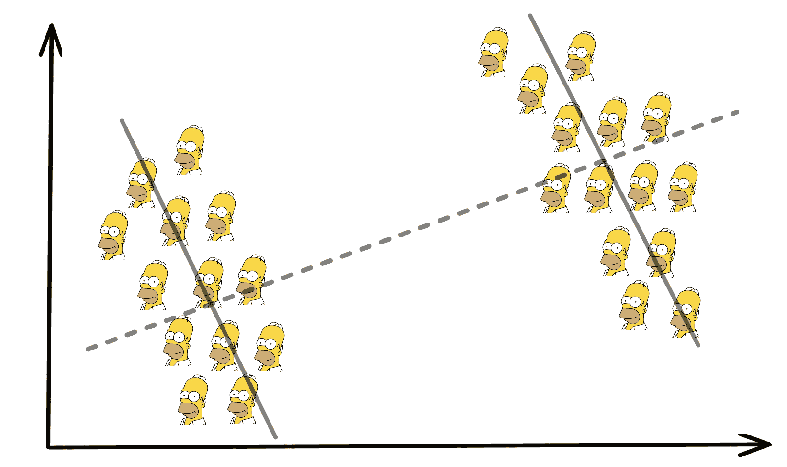
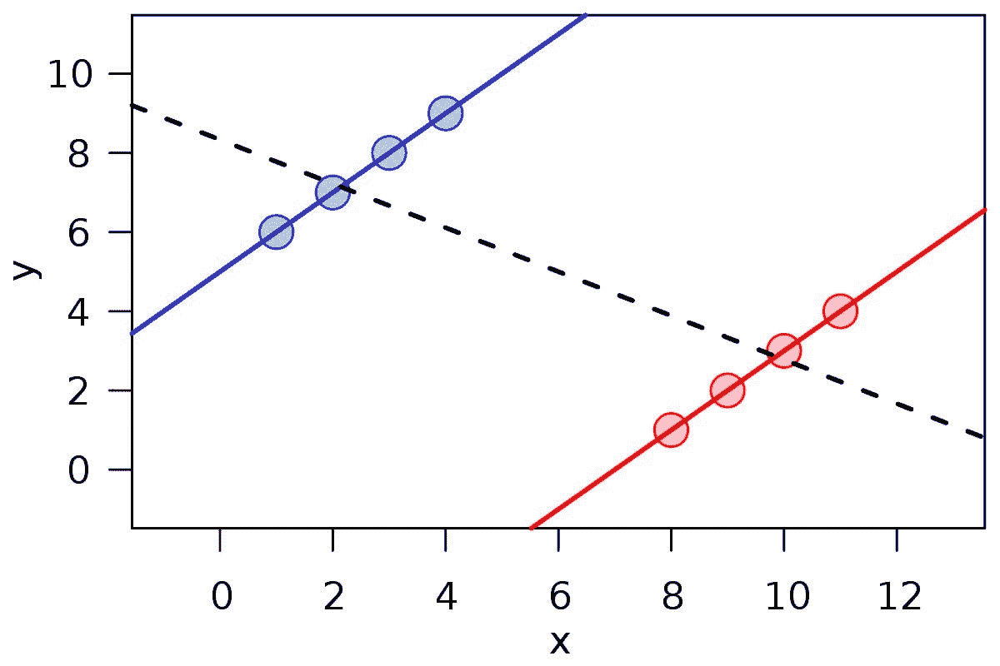

# **辛普森悖论**及其在数据科学中的影响

> 原文：[`www.kdnuggets.com/2023/03/simpson-paradox-implications-data-science.html`](https://www.kdnuggets.com/2023/03/simpson-paradox-implications-data-science.html)

作者提供的图片

数据科学家、数据工程师和机器学习工程师大部分时间都在分析数据，并从中得出统计结论。然而，对于这些专业人员及任何查看数据的人来说，具备对真实世界的良好直觉是一项重要的技能。

* * *

## 我们的前三大课程推荐

 1\. [谷歌网络安全证书](https://www.kdnuggets.com/google-cybersecurity) - 快速进入网络安全职业生涯。

 2\. [谷歌数据分析专业证书](https://www.kdnuggets.com/google-data-analytics) - 提升你的数据分析技能

 3\. [谷歌 IT 支持专业证书](https://www.kdnuggets.com/google-itsupport) - 支持你的组织 IT

* * *

数据包含了几个变量，你可以考虑这些变量，但值得注意的是，它产生了有限维度的表示。在这里，你需要超越数据，发现隐藏的现实，以及如何将其应用到数据集中。

辛普森悖论向我们证明了在解释数据时保持怀疑的必要性，并确保我们应用真实世界的观点——不要仅仅从数据的角度看待问题。

# 什么是辛普森悖论？

1972 年，**科林·R·布莱斯**引入了“辛普森悖论”这一名称，也称为辛普森反转、尤尔-辛普森效应、合并悖论或反转悖论。

**辛普森悖论**指的是，当数据被分组时，某个趋势或结果出现，但当数据合并时，该趋势或结果会反转或消失。这是一个统计学悖论，根据数据如何分组，它可以从相同的数据得出两个相反的结论。

## 加州大学伯克利分校与辛普森悖论

辛普森悖论的一个经典例子是加州大学伯克利分校关于研究生招生性别偏见的研究。1973 年，在学年开始时，加州大学伯克利分校的研究生院录取了约 44%的男性申请者和 35%的女性申请者。学校担心可能会面临诉讼，因此请统计学家**彼得·比克尔**查看数据。

研究发现，在 6 个部门中，有 4 个部门存在显著的性别偏见，偏向女性，而在剩余的 2 个部门中没有显著的性别偏见。团队的发现显示，女性申请的是整体申请者比例较小的部门。

在辛普森悖论中，你需要考虑现实世界中的场景和可能隐藏的变量，这些变量不容易通过数据解释。在这个例子中，隐藏变量是更多女性申请了特定部门。这影响了被接受申请者的总体百分比，从而展示出数据最初存在的反向趋势。

团队随后得出结论，当他们考虑将学校划分为不同部门时，数据输出发生了变化。

下图解释了数据分组时趋势如何反转：

图片来自 [维基百科](https://en.wikipedia.org/wiki/Simpson%27s_paradox)

辛普森悖论使得数据处理变得更加复杂，并使决策过程变得更加困难。

如果你开始以不同的方式重新抽样数据，你会得出不同的结论。这自然会使你更难选择一个特定的准确结论来进一步深入。这意味着团队将不得不找到一个公平代表数据的最佳结论。

# 为什么辛普森悖论在数据科学中很重要？

在处理与数据相关的项目时，我们通常专注于数据并试图解释其想要传达的故事。但如果我们应用现实世界的知识，它会告诉我们一个完全不同的故事。

理解这一点的重要性为我们提供了更多机会，深入分析数据，帮助决策过程。辛普森悖论关注于分析洞察不足和项目知识整体缺乏如何误导我们并做出错误决策。

例如，我们看到实时数据分析的使用正在增加。越来越多的团队正在实施这一技术，以帮助检测模式，并利用这些洞察在短时间内做出决策。在关注如何基于当前实时数据改进公司时，实时数据分析是有效的。然而，这些短时间内的分析可能会导致误导性的信息，并掩盖数据展示的整体真实趋势。

错误的数据分析可能会阻碍公司发展。我们都知道，错误的决策总是会阻碍公司。因此，考虑辛普森悖论可以帮助公司理解数据的局限性、数据驱动因素和不同变量，并保持偏差低。

辛普森悖论帮助提醒数据工作者了解数据的重要性及其数据直觉水平。这时，许多数据专业人员的软技能将会显现，如批判性思维。

目标是寻找数据中存在的隐藏偏差和变量，这些可能在初次观察或高水平分析时不易发现。

# 结论

关于辛普森悖论需要考虑的一点是，过度的数据聚合可能很快变得无用，并开始引入偏差。另一方面，如果我们不聚合数据，数据可能会在信息和潜在模式上受到限制。

为了避免辛普森悖论，你需要彻底审查你的数据，并确保对当前的业务问题有良好的理解。

**[Nisha Arya](https://www.linkedin.com/in/nisha-arya-ahmed/)** 是 KDnuggets 的数据科学家、自由撰稿人和社区经理。她特别感兴趣于提供数据科学职业建议或教程，以及围绕数据科学的理论知识。她还希望探索人工智能在延长人类寿命方面的不同方式。作为一个热心学习者，她寻求拓宽技术知识和写作技能，同时帮助指导他人。

### 更多相关内容

+   [Berkson-Jekel 悖论及其对数据科学的重要性](https://www.kdnuggets.com/2023/03/berksonjekel-paradox-importance-data-science.html)

+   [解析量子计算：对数据科学和人工智能的影响](https://www.kdnuggets.com/breaking-down-quantum-computing-implications-for-data-science-and-ai)

+   [生成式人工智能的新伦理含义](https://www.kdnuggets.com/the-new-ethical-implications-of-generative-artificial-intelligence)

+   [基准率谬误及其对数据科学的影响](https://www.kdnuggets.com/2023/04/base-rate-fallacy-impact-data-science.html)

+   [停止在 ChatGPT 上做这些事情，领先于 99% 的用户](https://www.kdnuggets.com/2023/05/stop-chatgpt-get-ahead-99-users.html)

+   [什么是 K-Means 聚类及其算法如何工作？](https://www.kdnuggets.com/2023/05/kmeans-clustering-algorithm-work.html)
