# 一个简化使用 Keras 进行图像分类的单一函数

> 原文：[`www.kdnuggets.com/2019/09/single-function-streamline-image-classification-keras.html`](https://www.kdnuggets.com/2019/09/single-function-streamline-image-classification-keras.html)

评论

### 介绍

关于深度学习框架，如[Keras](https://towardsdatascience.com/introduction-to-deep-learning-with-keras-17c09e4f0eb2)和[PyTorch](https://www.analyticsvidhya.com/blog/2018/02/pytorch-tutorial/)，以及它们是如何[强大且易于使用](https://towardsdatascience.com/keras-vs-pytorch-for-deep-learning-a013cb63870d)来构建和操作优秀的深度学习模型，已经有很多文章进行了讨论。

已经有很多教程/文章讨论了模型架构和优化器——例如[卷积、最大池化、优化器](http://papers.nips.cc/paper/4824-imagenet-classification-with-deep-convolutional-neural-networks.pdf)如[ADAM](https://machinelearningmastery.com/adam-optimization-algorithm-for-deep-learning/)或[RMSprop](https://towardsdatascience.com/a-look-at-gradient-descent-and-rmsprop-optimizers-f77d483ef08b)。

> 如果你只想要一个功能，能够自动从磁盘上的指定目录中提取图片，并返回一个完全训练好的神经网络模型，随时可以用于预测，这该怎么办？

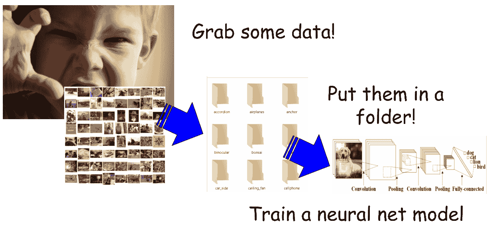

因此，在本文中，**我们专注于如何使用 Keras（TensorFlow）API 中的几个实用方法来简化此类模型的训练**（特别是用于分类任务），并进行适当的数据预处理。

基本上，我们想要的是，

+   获取一些数据

+   将它们放入按类别排列的目录/文件夹中

+   使用最少的代码/麻烦训练神经网络模型

> 最终，我们的目标是编写**一个实用工具函数**，它只需输入存放训练图片的文件夹名称，就可以返回一个完全训练好的 CNN 模型。

### 数据集

我们在这个演示中使用了一个包含 4000 多张花卉图片的数据集。该数据集可以通过[从 Kaggle 网站下载](https://www.kaggle.com/alxmamaev/flowers-recognition)。

数据收集基于 Flickr、Google 图片、Yandex 图片。这些图片被分成五个类别，

+   雏菊，

+   郁金香，

+   玫瑰，

+   向日葵，

+   蒲公英。

每个类别大约有 800 张照片。照片分辨率不高，大约为 320 x 240 像素。照片的大小不一致，具有不同的比例。

然而，它们**已经整齐地组织在五个目录中，并以相应的类别标签命名**。我们可以利用这种组织方式，应用 Keras 方法来简化我们卷积网络的训练。

### 代码仓库

完整的 Jupyter notebook 见[**我的 GitHub 仓库中的这里**](https://github.com/tirthajyoti/Deep-learning-with-Python/blob/master/Notebooks/Keras_flow_from_directory.ipynb)。如果你喜欢，可以随意 Fork 并扩展它，并给它一个星标。

我们将在本文中使用代码的部分片段来展示重要的部分以作说明。

### 是否应该使用 GPU？

推荐在 GPU 上运行此脚本（使用 `TensorFlow-GPU`），因为我们将构建一个具有五个卷积层的 CNN，因此如果不使用某种 GPU，处理成千上万张图片的训练过程可能会计算密集且较慢。

对于 Flowers 数据集，在我那台配置较低的笔记本电脑上（配有 NVidia GTX 1060 Ti GPU（6 GB 视频 RAM）、Core i-7 8770 CPU、16 GB DDR4 RAM），单个 epoch 大约需要 1 分钟。

或者，你可以利用[Google Colab](https://colab.research.google.com/notebooks/basic_features_overview.ipynb)，但[加载和预处理数据集](https://stackoverflow.com/questions/46986398/import-data-into-google-colaboratory) 可能会有些麻烦。

### 数据预处理

### 家务工作和显示图像

请注意，笔记本代码数据预处理部分的第一部分对于神经网络的训练不是必需的。这段代码仅用于说明目的，并展示一些训练图像作为示例。

在我的笔记本电脑上，数据存储在比我的笔记本文件夹高一级的文件夹中。这里是组织结构，

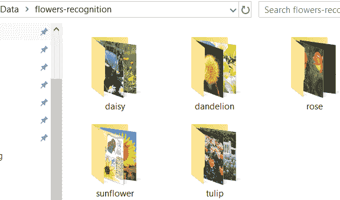

使用一些基本的 Python 代码，我们可以遍历子目录，计算图像数量，并展示其中的一些示例。

一些雏菊的图片，

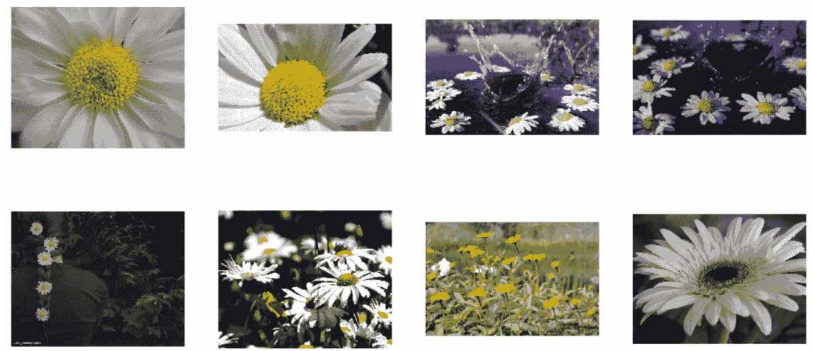

还有一些美丽的玫瑰，


请注意，图片的大小和纵横比各不相同。

### 构建 `ImageDataGenerator` 对象

这就是实际魔法发生的地方。

`ImageDataGenerator` 类的[官方描述](https://keras.io/preprocessing/image/) 说 "*生成带有实时数据增强的张量图像数据批次。这些数据将被循环处理（以批次形式）。*"

基本上，它可以用来 **增强图像数据，提供大量内置的预处理功能，如缩放、平移、旋转、噪声、去白化等**。现在，我们只使用 `rescale` 属性将图像张量值缩放到 0 和 1 之间。

这里有一篇关于该类的有用文章。

[使用 Keras ImageDataGenerator 进行图像增强](https://medium.com/@arindambaidya168/https-medium-com-arindambaidya168-using-keras-imagedatagenerator-b94a87cdefad?source=post_page-----bd04f5cfe6df----------------------)

一个关于将我们自定义生成器与 Keras 的 ImageDataGenerator 结合使用以执行各种操作的博客…

但对于当前演示来说，这个类的真正实用性在于超实用的方法 `flow_from_directory`，它可以 **一个接一个地从指定目录中提取图像文件**。

请注意，**这个目录必须是所有单独类的子目录可以单独存储的顶级目录**。`flow_from_directory`方法会自动扫描所有子目录，并获取带有适当标签的图像。

我们可以指定类名（就像我们在这里使用`classes`参数一样），但这是可选的。不过，稍后我们会看到，这对于**从大量数据中选择性训练**是多么有用。

另一个有用的参数是`target_size`，它**使我们能够将源图像调整为统一的 200 x 200 尺寸，无论原始图像的大小如何**。这是一种通过简单函数参数进行的酷炫图像处理。

我们还指定了批量大小。如果你不指定`batch_size`，默认情况下将设置为 32。

我们选择`class_mode`为`categorical`，因为我们在这里进行的是多类分类。

当你运行这段代码时，Keras 函数会扫描顶级目录，找到所有图像文件，并自动用正确的类标签（基于它们所在的子目录）对它们进行标记。

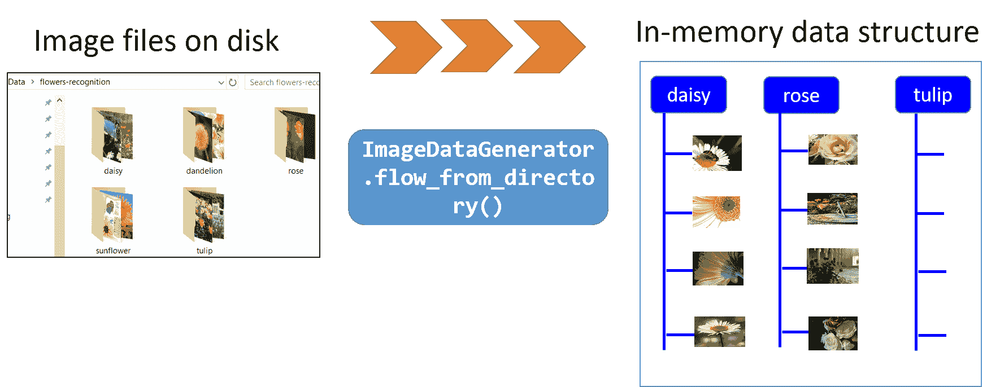

这不是很酷吗？

但等等，还有更多。这是一个[**Python 生成器对象**](https://realpython.com/introduction-to-python-generators/)，这意味着它将用于在训练过程中‘***逐一产生数据***’。这大大减少了处理非常大数据集的问题，这些数据集的内容无法一次性装入内存。查看这篇文章以更好地理解，

[Python 的生成器表达式：将大型数据集适配到内存中](https://towardsdatascience.com/pythons-list-generators-what-when-how-and-why-2a560abd3879?source=post_page-----bd04f5cfe6df----------------------)

生成器表达式是 Python 中的一个有趣特性，它允许我们创建惰性生成的可迭代对象…

### 构建卷积网络模型

正如承诺的，我们不会花时间或精力分析 CNN 模型背后的代码。简而言之，它由五个卷积层/最大池化层和最后的 128 个神经元组成，随后是一个 5 神经元的输出层，并使用 softmax 激活进行多类分类。

我们使用 RMSprop，初始学习率为 0.001。

[这是代码再现](https://github.com/tirthajyoti/Deep-learning-with-Python/blob/master/Notebooks/Keras_flow_from_directory.ipynb)。随意尝试网络架构和优化器。

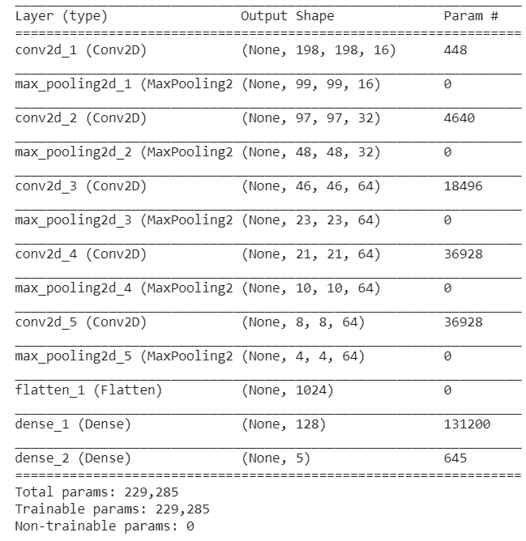

### 使用‘*fit_generator*’方法进行训练

我们之前讨论了`train_generator`对象在`flow_from_directory`方法及其参数下所做的酷炫事情。

现在，我们在上面定义的 CNN 模型的`fit_generator`方法中使用这个对象。

注意 `steps_per_epoch` 参数的设置，因为 `train_generator` 是一个通用的 [Python 生成器](https://realpython.com/introduction-to-python-generators/)，它不会停止，因此 `fit_generator` 无法知道特定的轮次何时结束以及下一轮次何时开始。**我们必须让它知道一个轮次中的步骤数**。在大多数情况下，这是总训练样本长度除以批量大小。

在上一节中，我们找出了总样本量为 `total_sample`。因此，在这种情况下，`steps_per_epoch` 设置为 `int(total_sample/batch_size)` 即 `34`。因此，你将在下面的训练日志中看到每轮 34 个步骤。

部分训练日志…

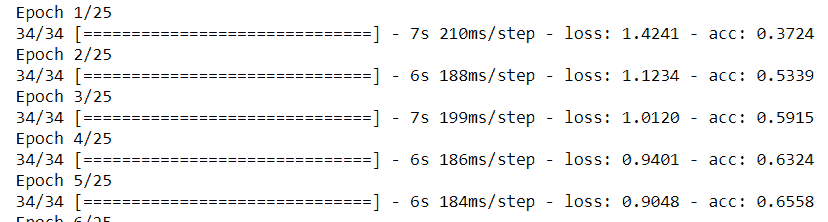

我们可以使用常见的绘图代码检查准确率/损失。

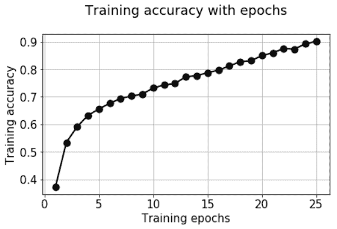

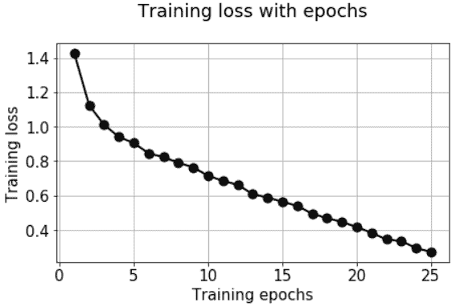

> 好的，我们到目前为止完成了什么？

我们已经能够利用 Keras `ImageDataGenerator` 和 `fit_generator` 方法从单个目录自动提取图像，对其进行标记、调整大小和缩放，并逐个（以批次）流动用于训练神经网络。

> 我们可以将这些都封装在一个函数中吗？

### 将这些都封装在一个函数中吗？

制作有用的软件/计算系统的核心目标之一是 [**抽象**](https://en.wikipedia.org/wiki/Abstraction_(computer_science))**，即隐藏内部计算和数据操作的详细信息，并向用户呈现一个简单直观的工作接口/API**。

作为实现目标的一个练习，我们可以尝试将我们上面遵循的过程封装在一个函数中。以下是思路，

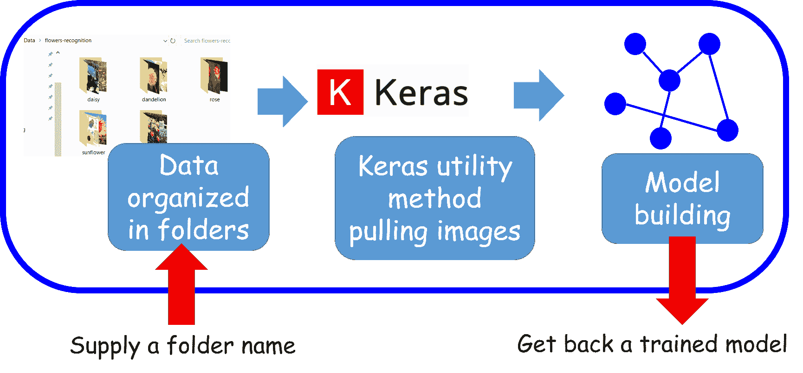

### 目标是提供一个灵活的 API，并具有有用的参数

当你设计高层 API 时，**为什么不考虑比这次特定的花卉数据集演示所需的更通用的方案**？考虑到这一点，我们可以想到为这个函数提供额外的参数，使其适用于其他图像分类场景（我们将很快看到一个示例）。

具体来说，我们在函数中提供以下参数，

+   `train_directory`: 存储训练图像的目录，图像按照类别分开存放。这些文件夹应该按照类别命名。

+   `target_size`: 训练图像的目标大小。例如 (200,200) 的元组

+   `classes`: 包含要进行训练的类别的 Python 列表。这会强制生成器从 `train_directory` 中选择特定文件，而不是查看所有数据。

+   `batch_size`: 训练的批量大小

+   `num_epochs`: 训练的轮数

+   `num_classes`: 输出类别的数量

+   `verbose`: 训练的详细程度，传递给 `fit_generator` 方法

当然，我们可以提供额外的参数以对应整个模型架构或优化器设置。本文不集中于这些问题，因此我们保持其简洁。

再次说明，完整代码在 Github 仓库中。以下，我们只展示了文档字符串部分以强调将其做成灵活 API 的重点，

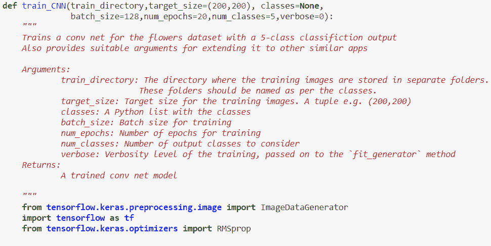

### 测试我们的实用函数

现在我们通过简单地提供一个文件夹/目录名称并获得一个可以用于预测的训练模型来测试我们的 `train_CNN` 函数！

让我们假设现在只想训练“雏菊”、“玫瑰”和“郁金香”，忽略其他两种花的数据。我们只需将一个列表传递给 `classes` 参数。在这种情况下，不要忘记将 `num_classes` 参数设置为 3。你会注意到，由于训练样本数量少于上述情况，每个 epoch 的步骤自动减少为 20。

同样，请注意，`verbose` 在上述函数中默认设置为 0，因此如果你希望监控训练的进度，你需要明确指定 `verbose=1`！

基本上，我们现在只用两行代码就能获得一个完全训练好的 CNN 模型！

### 该函数对另一个数据集是否有用？

这是对该函数实用性的严格测试。

> 我们能否直接应用于另一个数据集而无需太多修改？

### Caltech-101

一个丰富而又易于管理的图像分类数据集是 Caltech-101。通过*易于管理*的意思是，它不如 ImageNet 数据库庞大，这需要大规模的硬件基础设施来训练，因此，在你的笔记本电脑上快速测试酷点子超出范围，但它足够多样化，可以练习和学习卷积神经网络的技巧。

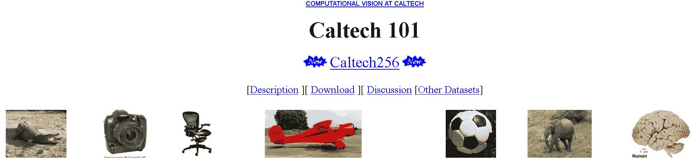

Caltech-101 是一个包含 101 类物体的图像数据集。每个类别大约有 40 到 800 张图像。大多数类别有约 50 张图像。每张图像的大小大约为 300 x 200 像素。

该数据集由**费菲·李**教授及其同事（Marco Andreetto 和 Marc ‘Aurelio Ranzato）于 2003 年在加州理工学院建立，当时她还是一名研究生。因此，我们可以推测，Caltech-101 是她在 ImageNet 上工作的直接前身。

### 用两行代码训练 Caltech-101

我们下载了数据集并将其解压缩到与之前相同的 Data 文件夹中。目录如下所示，

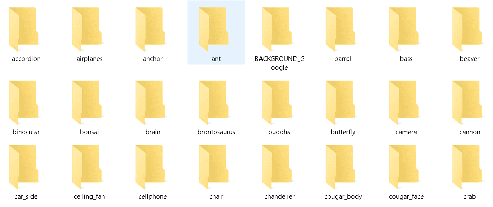

所以，我们得到了我们想要的——一个包含训练图像的顶级目录及其子目录。

然后，和之前一样的两行代码，

**我们所做的只是将该目录的地址传递给函数，并选择我们希望训练模型的图像类别**。假设我们想训练模型以区分***‘杯子’***和***‘螃蟹’***。我们可以像之前一样将它们的名称作为列表传递给`classes`参数。

此外，请注意，由于训练图像的总数比 Flowers 数据集要少得多，我们可能需要显著减少`batch_size`，如果`batch_size`高于总样本数，则`steps_per_epoch`将等于 0，这会在训练过程中产生错误。

太棒了！函数找到了相关的图像（总共 130 张），并训练了模型，每批 4 张图像，即每个周期 33 步。

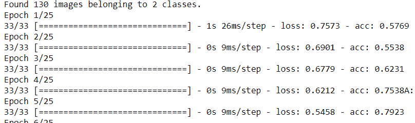

### 测试我们的模型

如我们所见，只需将训练图像的目录地址传递给函数，即可训练一个 CNN 模型，并使用我们选择的类别。

**模型效果如何？**让我们通过用从互联网上下载的随机图片测试它来找出答案。

请记住，Caltech-101 数据集是由 Fei Fei Li 和同事们于 2003 年创建的。因此，互联网上任何较新的图像都不太可能出现在数据集中。

我们下载了以下‘螃蟹’和‘杯子’的随机图片。

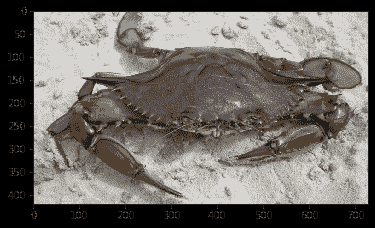

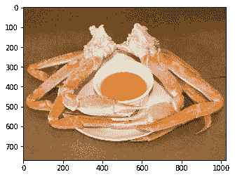

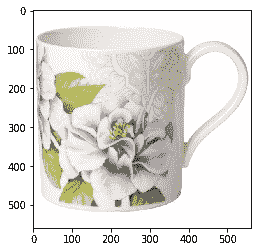

在进行了一些基本的图像处理（调整大小和扩展维度以匹配模型）后，我们得到了以下结果，

```py
model_caltech101.predict(img_crab)>> array([[1., 0.]], dtype=float32)
```

模型正确预测了螃蟹测试图像的类别。

```py
model_caltech101.predict(img_cup)>> array([[0., 1.]], dtype=float32)
```

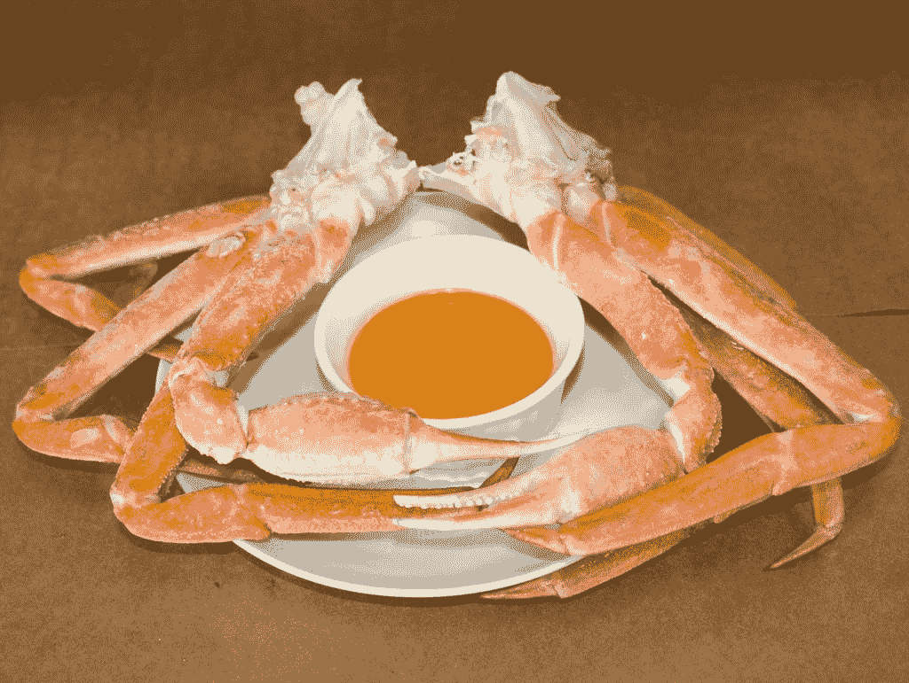

模型正确预测了杯子测试图像的类别。

那这个怎么办？

```py
model_caltech101.predict(img_crab_cup)>> array([[0., 1.]], dtype=float32)
```

因此，模型将测试图像预测为杯子。几乎公平，不是吗？

### 验证集及其他扩展

到目前为止，在`fit_generator`中我们只有一个`train_generator`对象用于训练。但验证集怎么办？它遵循与`train_generator`完全相同的概念。您可以从训练图像中随机分割出一个验证集，将其放在一个单独的目录中（与训练目录相同的子目录结构），然后您应该能够将其传递给`fit_generator`函数。

`ImageDataGenerator`类中甚至有一个`flow_from_dataframe`方法，您可以将图像文件的名称作为 Pandas DataFrame 中的内容传递，训练即可进行。

欢迎随意尝试这些扩展功能。

### 总结

在本文中，我们介绍了几个 Keras 的实用方法，可以帮助我们构建一个紧凑的实用函数，以高效地训练一个用于图像分类任务的 CNN 模型。如果我们可以将训练图像组织在一个共同目录下的子目录中，那么这个函数可能只需几行代码即可训练模型。

这样做是有道理的，因为与其使用其他库（如 PIL 或 Scikit-image）单独抓取和预处理图像，不如利用这些内置的类/方法和我们的实用函数，我们可以将代码/数据流程完全保持在 Keras 内部，以紧凑的方式训练 CNN 模型。

如果你有任何问题或想法要分享，请通过 [**tirthajyoti[AT]gmail.com**](mailto:tirthajyoti@gmail.com) 联系作者。此外，你还可以查看作者的 [**GitHub**](https://github.com/tirthajyoti?tab=repositories)** 仓库 **，获取其他有趣的 Python、R 和机器学习资源代码片段。如果你像我一样，对机器学习/数据科学充满热情，请随时 [在 LinkedIn 上添加我](https://www.linkedin.com/in/tirthajyoti-sarkar-2127aa7/) 或 [在 Twitter 上关注我](https://twitter.com/tirthajyotiS)。

[原文](https://towardsdatascience.com/a-single-function-to-streamline-image-classification-with-keras-bd04f5cfe6df)。经许可转载。

**相关：**

+   面向数据科学家的面向对象编程：构建你的机器学习估计器

+   简单的面向对象编程如何提升你的深度学习原型

+   本福特定律是什么？它为何对数据科学如此重要？

* * *

## 我们的三大课程推荐

 1\. [Google 网络安全证书](https://www.kdnuggets.com/google-cybersecurity) - 快速进入网络安全职业生涯。

 2\. [Google 数据分析专业证书](https://www.kdnuggets.com/google-data-analytics) - 提升你的数据分析技能

 3\. [Google IT 支持专业证书](https://www.kdnuggets.com/google-itsupport) - 支持你的组织 IT

* * *

### 更多相关话题

+   [使用 Scikit-learn 管道简化机器学习工作流程](https://www.kdnuggets.com/streamline-your-machine-learning-workflow-with-scikit-learn-pipelines)

+   [使用卷积神经网络（CNNs）进行图像分类](https://www.kdnuggets.com/2022/05/image-classification-convolutional-neural-networks-cnns.html)

+   [使用 Tensorflow 训练图像分类模型指南](https://www.kdnuggets.com/2022/12/guide-train-image-classification-model-tensorflow.html)

+   [关于梯度下降和成本函数你应该知道的 5 个概念](https://www.kdnuggets.com/2020/05/5-concepts-gradient-descent-cost-function.html)

+   [什么是函数？](https://www.kdnuggets.com/2022/11/function.html)

+   [数据科学中的 3 个 SQL 聚合函数面试问题](https://www.kdnuggets.com/2023/01/3-sql-aggregate-function-interview-questions-data-science.html)
