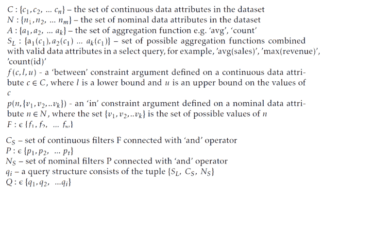
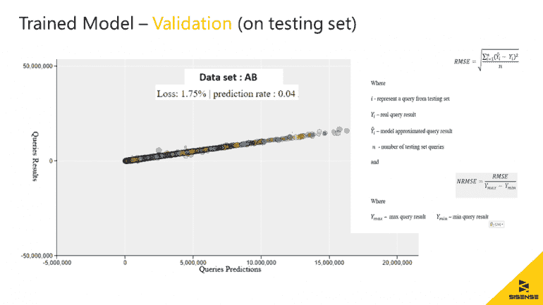

# 培训冠军：构建深度神经网络以进行大数据分析

> 原文：[`www.kdnuggets.com/2019/04/sisense-deep-neural-nets-big-data-analytics.html`](https://www.kdnuggets.com/2019/04/sisense-deep-neural-nets-big-data-analytics.html)

赞助文章。

**作者：Nir Regev, Sisense**。

数据的世界现在就是大数据的世界。魔 genie 已经释放，再也无法回到过去。我们每天都在生成越来越多的数据，而生成的数据集也变得越来越复杂。传统上，处理这些数据集的方法是扩展计算资源以处理更大的数据集。然而，这在全球范围内长期来看并不可行，对于资源有限的小型组织来说，短期内也难以维持。

* * *

## 我们的前三名课程推荐

 1\. [谷歌网络安全证书](https://www.kdnuggets.com/google-cybersecurity) - 快速开启网络安全职业之路。

 2\. [谷歌数据分析专业证书](https://www.kdnuggets.com/google-data-analytics) - 提升你的数据分析能力

 3\. [谷歌 IT 支持专业证书](https://www.kdnuggets.com/google-itsupport) - 支持你的组织进行 IT

* * *

更复杂的是，为了实现与大数据集的真正互动，用户查询需要接近实时的响应速度。这对最强大的大规模系统来说也是一项挑战。近似查询处理（AQP）消除了查询整个大数据集的需求，并能够迅速提供可用的结果。

### Sisense Hunch™

[Sisense Hunch™](https://www.sisense.com/blog/sisense-hunch-leadership-through-radical-innovation/) 是一种处理大数据集的新方法，利用 AQP 技术构建深度神经网络（DNNs），这些网络经过训练以学习查询与结果之间的关系。这为用户提供了一个快速、可扩展的推理层，用户可以在此交互式查询以获得可操作的洞察。大型数据批次可以由 DNN 近似处理，DNN 利用图形处理单元（GPU）进行并行处理。此外，由于 Hunch 的 DNN 通常在 Mb 级别，因此可以轻松部署和分发给数千个用户或物联网设备，将极其快速的大数据分析几乎放置在任何地方。在边缘或用户可以从中受益的任何地方嵌入大数据分析，对于处理这些庞大数据集来说是一个巨大的飞跃。Sisense Hunch 平衡了速度、资源消耗和准确性，并为用户提供了无与伦比的灵活性，以决定将这些洞察应用于何处。

Hunch 系统的强大之处在于 DNN 训练过程，最终生成查询近似模型。该过程分为三个阶段：生成人工[SQL 查询](https://www.sisense.com/blog/8-ways-fine-tune-sql-queries-production-databases/)，获取训练集的标签（即在数据库上执行查询），最后使用实时生成的查询编码器将查询编码为数字张量。一旦创建了这个训练集，Hunch 使用有监督的方法来学习如何近似训练集查询。

### 训练过程

**生成 SQL 查询**

为了近似一个给定数据集可能出现的各种查询，Hunch 自主生成了一套强大的查询集。

这是正式的查询结构描述：

一个 Hunch 生成的查询示例是：

“从表中选择 AVG(sales) 其中 store_type 为 (‘online’) 且 computer_type 为 (‘Mac’) 且小时在 20 到 23 之间，hdisk_tb_size 在 1 和 5 之间”

这个阶段的最终目标是生成一个大规模的代表性聚合 SQL 查询集，以覆盖原始数据的许多（用户导向）方面。为了实现这一点，系统首先从原始数据中提取统计值（数据分布）。

对于每一列具有连续数字值的列，算法计算四分位数分布（最小值、25%、中位数、75%、最大值）。然后，使用这些信息从适合列数值边界的均匀分布中抽取值。系统还执行“Group By”查询，这加速了训练集的生成，主要是因为所有名义列值的排列组合可以在一条数据路径中获得。此外，在我们方法支持的查询格式中，“WHERE”子句语句通过“AND”运算符连接，因此语句的顺序并不重要。为了确保 DNN 不学习特定语句的顺序，我们的方法在构建查询之前会随机打乱语句。这是故意为之，以迫使 DNN 学习近似具有不同“WHERE”子句顺序的语义相同的查询。

**标记训练集**

为了训练深度神经网络（DNN），构建一个有监督的数据集需要真实的查询结果。为此，我们的方法对数据集执行生成的查询集。由于 DNN 需要相对大量的训练样本，系统使用并发技术生成并执行数十万条查询，以优化成本。然而，这个过程对于每个数据集仅执行**一次**。当新数据到达，需要生成新查询时，Hunch 使用增量（迁移）学习（稍后会详细介绍）。这种方法在训练集生成阶段和 DNN 训练阶段都节省了时间、精力和成本。

**编码查询**

由于 DNN 只能处理数字输入，我们开发了一个编码模型，将查询编码为数字矩阵。这个目标通过一个在生成 SQL 查询时动态构建的编码器模型来实现，利用了向量嵌入技术。

编码器的设计目的是通过利用专有嵌入技术，将拥有数百万个不同值的数据集压缩为轻量级内存占用的数字张量。

**通过增量学习应对新数据**

当新数据被添加到数据集中时，Hunch 需要调整 DNN 以根据新数据近似查询。基于之前的学习过程，Hunch 利用迁移学习，这意味着 DNN 将从其最后的权重状态开始训练，对抗一个新的训练集，该训练集是使用先前的 DNN 和新数据生成的。

**评估与分发**

一旦训练完成，我们使用一组准确性指标来评估模型的近似度。我们使用标准化均方根误差（NRMSE）来测量模型在保留测试集上的准确性。当 NRMSE 收敛到一个阈值以下时，Hunch 将围绕 DNN 发布一个云 API 端点。然后，用户或 IoT 设备可以发送查询请求。最终用户可以从快速响应和固定查询延迟（与原始数据大小无关！）以及在各种环境中处理大数据时的互动性中获益。

### 结论

仅仅因为我们现在生活在一个大数据的世界中，并不意味着我们需要放弃与数据互动和真正理解它的能力。[深度神经网络](https://internetofthingsagenda.techtarget.com/blog/IoT-Agenda/Data-cognition-engines-can-save-millions-in-big-data-costs) 使用近似查询处理为用户提供了一种处理这些庞大数据集、提取强大见解并将这些见解应用于 IoT 和人类使用的方式——这一切都不需要巨大的技术投资或成本。尽管大数据将继续增长，但像 Hunch 这样的技术将帮助人类保持主导地位。

**图表 A：1,000,000,000 行、250GB 数据集的查询结果和预测**

[原文](https://www.sisense.com/blog/training-a-champion-building-deep-neural-nets-for-big-data-analytics/)。经许可转载。

### 更多相关话题

+   [使用 TensorFlow 和 Keras 构建和训练你的第一个神经网络](https://www.kdnuggets.com/2023/05/building-training-first-neural-network-tensorflow-keras.html)

+   [通过构建 2022 年 15 个神经网络项目来学习深度学习](https://www.kdnuggets.com/2022/01/15-neural-network-projects-build-2022.html)

+   [使用 PyTorch 构建卷积神经网络](https://www.kdnuggets.com/building-a-convolutional-neural-network-with-pytorch)

+   [深度神经网络不会引领我们走向 AGI](https://www.kdnuggets.com/2021/12/deep-neural-networks-not-toward-agi.html)

+   [最先进的深度学习可解释预测与即时预测](https://www.kdnuggets.com/2021/12/sota-explainable-forecasting-and-nowcasting.html)

+   [《神经网络与深度学习：教材（第 2 版）》](https://www.kdnuggets.com/2023/07/aggarwal-neural-networks-deep-learning-textbook-2nd-edition.html)
