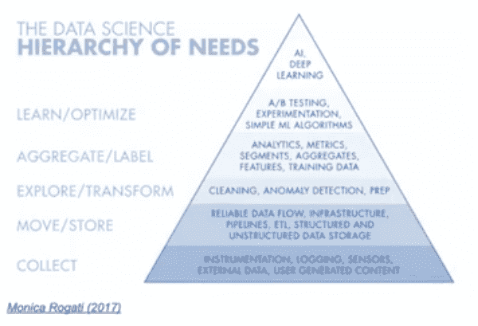

# 在小公司建立数据科学团队的六个建议

> 原文：[`www.kdnuggets.com/2021/01/six-tips-building-data-science-team-small-company.html`](https://www.kdnuggets.com/2021/01/six-tips-building-data-science-team-small-company.html)

评论

**作者 [Zoe Zbar](https://www.linkedin.com/in/zoezbar/)，NYCDSA 市场推广员 & [Raul Vallejo](https://www.linkedin.com/in/raul-vallejo/)，ION 信用总监**

* * *

## 我们的前三名课程推荐

 1\. [Google 网络安全证书](https://www.kdnuggets.com/google-cybersecurity) - 快速进入网络安全职业生涯。

 2\. [Google 数据分析专业证书](https://www.kdnuggets.com/google-data-analytics) - 提升你的数据分析技能

 3\. [Google IT 支持专业证书](https://www.kdnuggets.com/google-itsupport) - 支持你在 IT 方面的组织

* * *

当一家公司决定首次利用其数据时，这可能是一项艰巨的任务。许多企业并不完全了解建立数据科学部门所需的全部内容。如果你是被聘用来实现这一目标的数据科学家，我们有一些建议可以帮助你直面这个任务。

### **提示 #1: 分解公司中最重要的交付成果。**

成为公司唯一的数据科学家是很棘手的。你可能被期望在所有与数据或代码相关的事务上都是专家。一个好的起点是分解公司中最重要的交付成果。了解这些交付成果并将其拆解，直到你能够列出最重要的数据源和处理步骤，对于理解公司需要完成的任务至关重要。

### **提示 #2: 利用项目规划实践**

保持组织性是建立成功团队的最重要方面之一，但你不必重新发明轮子。有许多项目规划实践可以帮助为你的数据流程提供结构。例如，《数据科学需求层次结构》是一个很好的资源，有助于在规划过程中保持正轨和有序。

立刻为公司提供 AI 解决方案是很好的，但在现实中，这之前需要建立许多基础。《数据科学需求层次结构》及其他类似的项目规划工具可以帮助你为公司的数据科学目标制定一个合理、可持续的路径。

### **提示 #3: 及时报告成功**

作为首位数据科学家，你可以现实地预期你的非技术同事不会理解你的工作及其所投入的努力。因此，你需要在部署你的第一个数据模型的过程中报告进展。这将确保你的公司跟上你的进展，并建立对你构建和交付能力的信任。

例如，可靠的数据流将成为任何数据团队生产力的基石。它是金字塔的基础部分，它将使你能够迅速解决各种问题。虽然你公司的非技术决策者主要关注的是你从可靠数据流中最终得出的分析结果，但设置数据流并非易事，这是获得这些结果的重要一步。你应该花时间向团队报告这一步，并让他们理解其在整个过程中的重要性。

这样做，你会向你的团队证明你可以持续朝着目标取得进展。

### **提示 #4: 利用数据可视化方法**

数据可视化常常被忽视。它将成为你数据科学工具包中最重要的工具之一。良好的数据可视化全靠实践。

在与利益相关者开会前，进行一个练习，绘制一些图表并自问可能会在观众中出现的问题。之后，调整图表，然后再次自问，查看图表是否解决了问题。

这看起来简单直接，但往往被忽视。它在准备过程中很重要，当你对所有问题都有扎实的回答时，你的老板会对此印象深刻。

把数据可视化视为传达你工作的价值的工具。它对非技术人员理解你要传达的内容有巨大的帮助。*最终*，它对于在团队之外沟通和推销你的工作至关重要。

### **提示 #5: 从一个愚蠢的模型开始你的机器学习**

在机器学习方面，虽然一开始可能不是优先事项，但始终从一个简单的模型开始。所谓“简单模型”就是一个基本的模型，只要能够端到端地运行。

从那里开始，你可以进行调优和改进，一旦你有了一个可以工作的模型，这个过程会变得容易得多。

你会发现，解决了 80-90%的问题后，大部分解决方案就可以部署。花时间和资源来解决最后的 10%问题将不再是数据科学问题，而是管理问题。

### **提示 #6: 像魔术师一样管理期望**

许多人认为数据科学就像魔法，你是魔术师。你需要管理这些高期望，以便按时交付，避免陷入工作负担和拖延截止日期的困境。

通过提前计划、保持专注，并始终记住最终目标，你可以管理期望。这样做并保持有序，将确保你的上司始终对你的工作印象深刻。

创建数据科学部门是一项大任务，但虽然它很庞大，却也充满了回报和满足感。

在最近的一次 [**网络研讨会**](https://www.youtube.com/watch?v=Kzi8oXyHMA0&feature=youtu.be)中，NYCDSA Bootcamp 校友劳尔·巴列霍详细讲述了他如何在一家小公司建立数据科学部门。通过此讲座，他提供了来自第一手经验的洞见性建议并回答了观众的问题。

**[佐伊·兹巴尔](https://www.linkedin.com/in/zoezbar/)** 是 NYCDSA 的市场营销研究员。

**[劳尔·巴列霍](https://www.linkedin.com/in/raul-vallejo/)** 是 ION 的信贷总监。

[原文](https://nycdatascience.com/blog/student-works/six-tips-on-building-a-data-science-team-at-a-small-company/)。已获得许可转载。

**相关：**

+   [数据科学家缺失的团队](https://www.kdnuggets.com/2020/11/missing-teams-data-scientists.html)

+   [你的数据科学团队所需的马斯洛需求层次](https://www.kdnuggets.com/2020/09/domino-leader-forrester-paml-data-science-team.html)

+   如何使远程工作对数据科学团队有效

### 更多相关话题

+   [我的数据科学六个月成功故事](https://www.kdnuggets.com/2023/04/data-science-six-months-success-story.html)

+   [建立一个稳固的数据团队](https://www.kdnuggets.com/2021/12/build-solid-data-team.html)

+   [我作为数据科学家的前六个月](https://www.kdnuggets.com/2021/12/first-six-months-data-scientist.html)

+   [为什么单独使用 LLMs 不能满足公司预测需求](https://www.kdnuggets.com/2024/01/pecan-llms-used-alone-cant-address-companys-predictive-needs)

+   [如何建立数据科学赋能团队：完整指南](https://www.kdnuggets.com/2022/10/build-data-science-enablement-team-complete-guide.html)

+   [数据科学团队协作的 5 个最佳实践](https://www.kdnuggets.com/2023/06/5-best-practices-data-science-team-collaboration.html)
