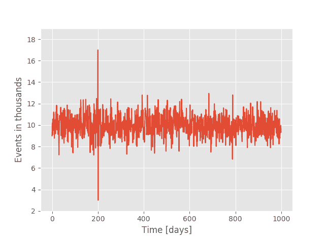
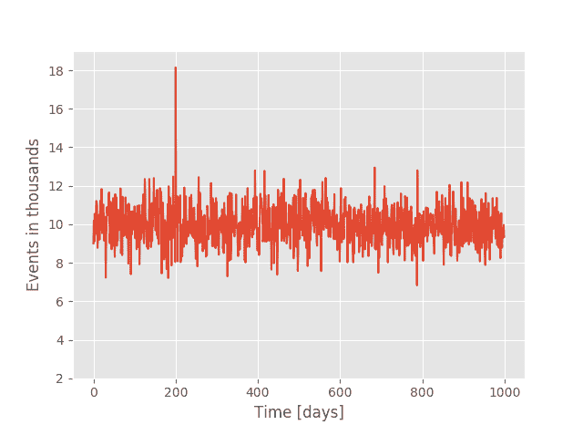
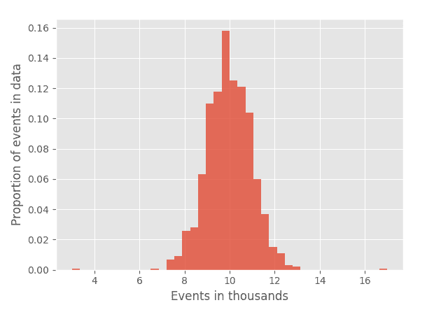
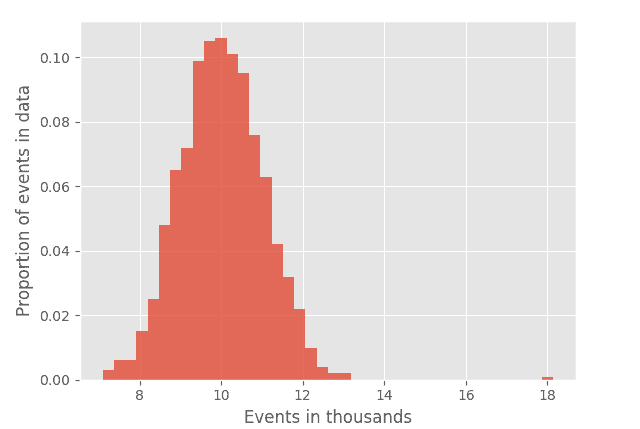
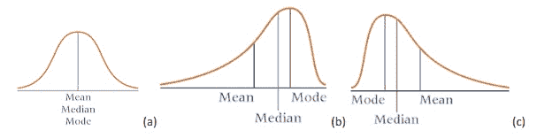

# 偏度与峰度——强健的组合

> 原文：[`www.kdnuggets.com/2018/05/skewness-vs-kurtosis-robust-duo.html`](https://www.kdnuggets.com/2018/05/skewness-vs-kurtosis-robust-duo.html)

 评论

**由 [Pawel Rzeszucinski](https://www.linkedin.com/in/pawelrzeszucinski/)，[Codewise.com](http://www.codewise.com/) 提供**

* * *

## 我们的前三大课程推荐

 1\. [谷歌网络安全证书](https://www.kdnuggets.com/google-cybersecurity) - 快速进入网络安全职业生涯。

 2\. [谷歌数据分析专业证书](https://www.kdnuggets.com/google-data-analytics) - 提升你的数据分析技能

 3\. [谷歌 IT 支持专业证书](https://www.kdnuggets.com/google-itsupport) - 支持你的组织的 IT 工作

* * *

描述性统计可以提供大量的数据洞察，但它常常给我们带来有趣的陷阱，有时会导致结果的误解。减轻这种风险的一种方法是使用多种技术的组合，以达成明确的结论。今天，我们将看到如何通过偏度来补充峰度的输出，以应对一个非常有趣的挑战。

### 介绍

在我之前的帖子中，我们看到峰度（Kurtosis）作为一种强健的度量标准，用于检测数据中的冲动内容。然而，“冲动”可能有多种表现形式，峰度并不总是能够描绘出完整的图像。在下面描述的案例研究中，我将展示如何在图像绘制过程中添加一个额外的“刷子”，即偏度（Skewness）。

### 案例研究

场景如下——一个商店记录了随着时间推移销售商品的数量，并尝试自动检测任何异常需求的存在。

在去年（上一篇帖子），峰度被成功用于检测冲动。图 1 显示了峰度值为 6.227 的数据——明显高于 3 这个高斯噪声的默认值。冲动内容被检测到了，太好了！然而，过了一段时间，一位好奇的业务分析师发现了一个令人困惑的案例，如图 2 所示。尽管信号的性质发生了显著变化——冲动只包含向上的部分，但峰度返回的值依然是 6.227（实际上我尝试了六次才合成出这样的信号）。

*图 1* 

*图 2*

图 1 和图 2 所示的信号的幅度分布分别见于图 3 和图 4。可以看到有显著的变化。图 3 显示了几乎完全对称的分布，而图 4 显示了一个向图表左侧倾斜的形状。附注：尽管向左侧倾斜，这种分布形状仍被称为右偏分布，因为我们真正关心的是均值值的相对移动。在我们的案例中，由于显著冲击的存在，它确实向右侧移动。

起初感到震惊，业务分析师很快发现了问题所在。他参考了峰度的公式（见于公式 1），并注意到方程中的所有幂都是偶数，因此峰度可能对‘均值以上’和‘均值以下’的值之间的差异视而不见。仅在一个方向上的显著冲击（如图 2 所示）可能会与对称冲击（图 1）产生相同的结果。

*图 3* 

*图 4*

这就是偏度发挥作用的地方。其公式见于公式 1 [1]：

其中 n 是数据中样本的总数，xi 是数据中的第 i 个样本，x 是数据的样本均值。

偏度公式与峰度公式几乎相同，除了分子和分母中的幂，并且现在‘均值以上’和‘均值以下’的值之间的区别变得可能。偏度输出值对于对称分布的信号接近 0，对于右偏（即正偏）信号介于 0 和 1 之间，对于左偏（即负偏）信号介于 0 和 -1 之间。图 5 展示了这些分布的形状及其与均值、中位数和众数的关系（摘自[2]）。当应用于图 1 和图 2 的信号时，偏度值分别为 0.06 和 0.58。此时，业务分析师将始终将峰度与偏度值结合使用，以不仅检测冲击的存在，还确定其攻击方向。

*图 5 摘自 [2]*

**参考文献：**

[1] Ben Klemens, 《数据建模：科学计算的工具和技术》，普林斯顿大学出版社，2008 年

[2] Ken Black, 《商业统计：现代决策制定》，约翰·威利父子公司，2009 年

**个人简介：[Pawel Rzeszucinski](https://www.linkedin.com/in/pawelrzeszucinski/)** 获得了克兰菲尔德大学计算机科学硕士学位以及弗罗茨瓦夫理工大学电子学硕士学位。他随后前往曼彻斯特大学，获得了由 QinetiQ 资助的关于直升机齿轮箱诊断的数据分析项目的博士学位。回到波兰后，他曾在 ABB 企业研究中心担任高级科学家，并在汇丰银行的战略分析部门担任高级风险建模师。目前，他在 Codewise 担任数据科学家。

**相关：**

+   描述性统计学：数据科学中的强大矮人

+   描述性统计学：数据科学中的强大矮人 – 峰值因子

+   描述性统计学关键术语解释
