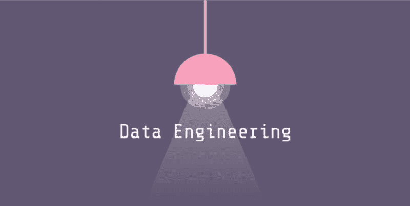

# 数据工程所需的技能

> 原文：[`www.kdnuggets.com/2020/06/skills-build-data-engineering.html`](https://www.kdnuggets.com/2020/06/skills-build-data-engineering.html)

评论

**由 [Mohammed M Jubapu](https://www.linkedin.com/in/mjubapu/)，解决方案架构师兼数据工程师**

* * *

## 我们的三大课程推荐

 1\. [Google 网络安全证书](https://www.kdnuggets.com/google-cybersecurity) - 快速进入网络安全职业道路。

 2\. [Google 数据分析专业证书](https://www.kdnuggets.com/google-data-analytics) - 提升你的数据分析水平

 3\. [Google IT 支持专业证书](https://www.kdnuggets.com/google-itsupport) - 支持你所在组织的 IT

* * *

数据工程是目前市场上最受追捧的职位之一。数据无处不在，被认为是新时代的石油。公司从不同来源生成大量数据，而数据工程师的任务是组织数据的收集、处理和存储。然而，要成为数据工程师，你需要具备一些出色的技能，如数据库、大数据、ETL 和数据仓库、云计算以及编程语言。但问题是，你是想具备所有这些技能，还是希望在使用所有这些工具时有所经验？特别是在有许多工具可以完成工作的技术领域，这是最大的困境。

好吧，为了简化这一点，让我们来一杯咖啡，直接深入了解数据工程职位市场中的最新技能观察，这些技能无疑可以提升你现有的职业生涯，或帮助你启动数据工程的旅程。

### **1-  精通一种编程语言**

是的，编程语言是数据工程所必需的技能。大多数职位要求至少熟练掌握一种编程语言。这些语言用于编写 ETL 或数据管道框架。常见的编程语言是掌握数据工程和管道所需的核心编程技能。除了其他方面，Java 和 Scala 用于在 Hadoop 上编写 MapReduce 作业；Python 是数据分析和管道的热门选择，Ruby 也是一种广泛使用的应用程序连接语言。

### **2-  Python 是列出最多的技能**

Python! Python! Python! 是的，大约 70%的职位要求具备 Python 技能，其次是 SQL、Java、Scala 以及其他编程技能，如 R、.Net、Perl、Shell 脚本等。

### **3-  Apache Spark 在数据处理层中表现突出**

数据处理是将数据收集并转化为可用且期望的形式。Apache Spark 排在数据处理层的首位，其次是 AWS Lambda、Elasticsearch、MapReduce、Oozie、Pig、AWS EMR 等。Apache Spark 是一个强大的开源框架，提供交互式处理、实时流处理、批处理和高速的内存处理，具有标准接口和易用性。

### **4- Rest APIs 常用于数据收集**

对于任何需要分析或处理的数据，首先需要将其收集或导入到数据管道中。Rest APIs 是常用的工具，其次是 Sqoop、Nifi、Azure Data Factory、Flume、Hue 等。

### **5- 数据缓冲在 Apache Kafka 中很常见**

数据缓冲在数据工程框架中是一个关键环节，其中数据需要在从一个地方移动到另一个地方时被暂时存储，以应对高容量。Apache Kafka 是一个常用的分布式数据存储，优化了实时数据流的摄取和处理。流数据是由成千上万的数据源持续生成的数据，这些源通常同时发送数据记录。流处理平台需要处理这种持续不断的数据流，并顺序和增量地处理数据。该类别中的其他工具有 Kinesis、Redis Cache、GCP Pub/Sub 等。

### **6- 存储你的数据 – SQL 或 NoSQL**

数据需要存储以便处理、分析或可视化，从而生成有价值的洞察。数据存储可以是数据仓库、Hadoop、数据库（包括 RDBMS 和 NoSQL）、数据集市等形式。SQL 技能最为受欢迎，其次是 Hive、AWS Redshift、MongoDB、AWS S3、Cassandra、GCP BigQuery 等。

### **7- 使用 Tableau 或 PowerBI 进行数据可视化**

数据可视化是以图形、图表或其他视觉格式呈现数据或信息。它通过图像传达数据之间的关系。Tableau 和 PowerBI 领先于其他工具，其次是 SAP Business Objects、Qlik、SPSS、QuickSight、MicroStrategy 等。

### **8- 数据工程云平台**

有多种基于云或本地的 платформ可以用于不同的数据工程工具集。列出的典型平台有 Hadoop、Google Cloud Platform、AWS、Azure 和 Apprenda。

嗯，人们不可能精通所有技能和工具，也绝不是必须掌握所有这些技能。但通常需要在每个数据管道框架类别中至少对其中之一有较强的掌握，例如 GCP 用于云平台、Python 用于开发、Apache Spark 用于处理、Rest APIs 用于数据收集、Apache Kafka 用于数据缓冲、Hive 用于数据存储和 PowerBI 用于数据可视化。

学习、提升技能，助力你的职业发展！祝好运，数据工程愉快！

**简历： [Mohammed M Jubapu](https://www.linkedin.com/in/mjubapu/)** 是位于阿布扎比 Cleveland Clinic Abu Dhabi 的解决方案架构师和数据工程师。

[原文](https://www.linkedin.com/pulse/skills-build-data-engineering-mohammed-m-jubapu/)。经许可转载。

**相关：**

+   五个有趣的数据工程项目

+   为什么以及如何使用 Dask 处理大数据

+   数据工程的可观察性

### 更多相关话题

+   [停止学习数据科学以寻找目标，并找到目标来…](https://www.kdnuggets.com/2021/12/stop-learning-data-science-find-purpose.html)

+   [学习数据科学统计的顶级资源](https://www.kdnuggets.com/2021/12/springboard-top-resources-learn-data-science-statistics.html)

+   [成功数据科学家的 5 个特征](https://www.kdnuggets.com/2021/12/5-characteristics-successful-data-scientist.html)

+   [每个数据科学家都应该了解的三个 R 语言库（即使你使用 Python）](https://www.kdnuggets.com/2021/12/three-r-libraries-every-data-scientist-know-even-python.html)

+   [一个 $9B 的 AI 失败案例分析](https://www.kdnuggets.com/2021/12/9b-ai-failure-examined.html)

+   [是什么让 Python 成为初创企业理想的编程语言](https://www.kdnuggets.com/2021/12/makes-python-ideal-programming-language-startups.html)
