# Django 框架中的社交用户认证

> 原文：[`www.kdnuggets.com/2023/01/social-user-authentication-django-framework.html`](https://www.kdnuggets.com/2023/01/social-user-authentication-django-framework.html)

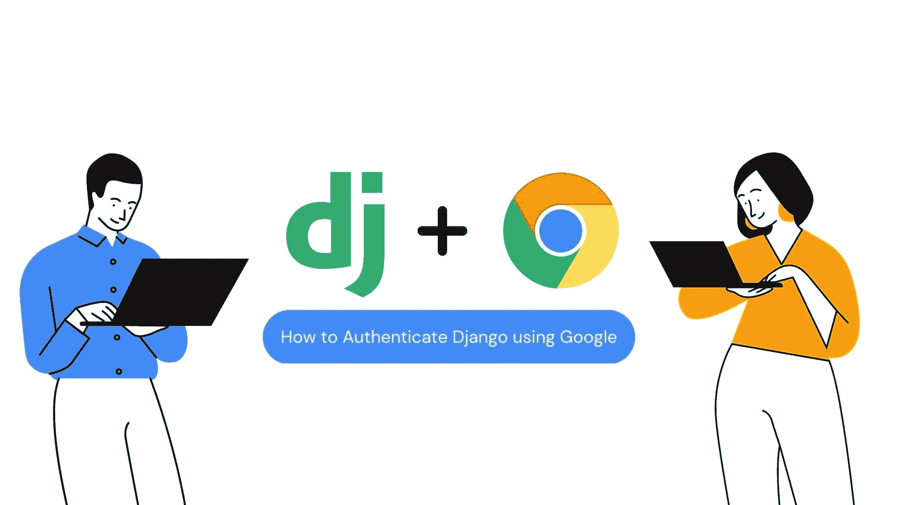

图片由作者提供

# 介绍

* * *

## 我们的三大课程推荐

 1\. [Google 网络安全证书](https://www.kdnuggets.com/google-cybersecurity) - 快速进入网络安全职业生涯。

 2\. [Google 数据分析专业证书](https://www.kdnuggets.com/google-data-analytics) - 提升你的数据分析技能

 3\. [Google IT 支持专业证书](https://www.kdnuggets.com/google-itsupport) - 支持你的组织的 IT

* * *

Django 是一个免费的开源 Python 网络框架。它遵循模型-视图-控制器架构模式，并提供内置的管理界面、对象关系映射（ORM）和模板引擎等功能。Django 的主要目标是通过提供一套高水平、可重用的组件来简化开发者构建和维护网络应用程序的过程，处理如用户认证、创建和管理数据库、处理 HTTP 请求和响应等日常任务。

本文将讨论如何在 Django 应用中使用 Google 执行社交认证。社交认证，也称为社交登录或登录，是一种使用现有社交媒体账户（如 Facebook、Google 或 Twitter）进行用户认证的方法，而不是为网站或应用程序专门创建新账户。

使用社交认证相较于传统认证系统的好处在于，它消除了用户需要创建和记住另一个用户名和密码的需求，减少了摩擦，提高了用户注册网站或应用的可能性。此外，它通过允许用户使用现有社交媒体账户登录，提升了用户体验。社交认证提供了更流畅和熟悉的用户体验。

# 从 Google 控制台获取客户端 ID 和客户端密钥

1.  登录 Google 控制台平台。你可以使用这个 [链接](https://console.cloud.google.com/projectselector2/apis/dashboard?supportedpurview=project) 登录。

1.  如果你还没有项目，请创建一个新的项目。

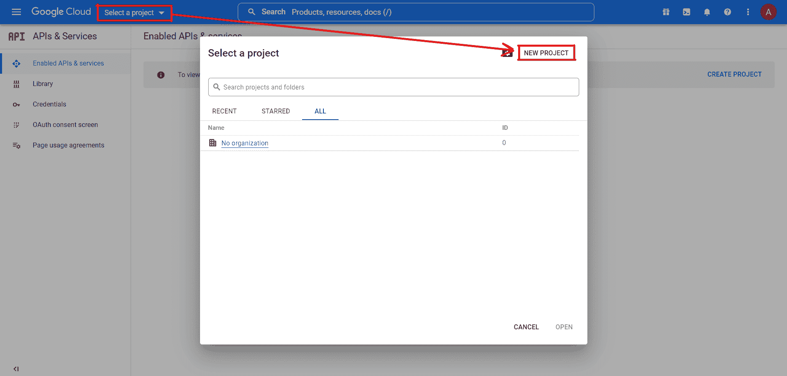

图片由作者提供

1.  创建项目后，我们需要配置 OAuth 屏幕。这个屏幕在客户端尝试使用 Google Auth 认证你的网站时显示。它包含你的应用程序的摘要以及所有必需的政策。

1.  点击下面所示的按钮。

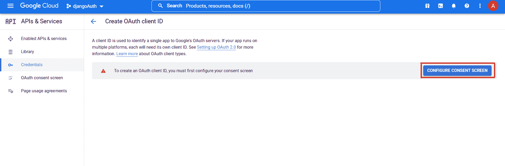

图片来源：作者

1.  选择用户类型为外部并点击“创建”按钮。

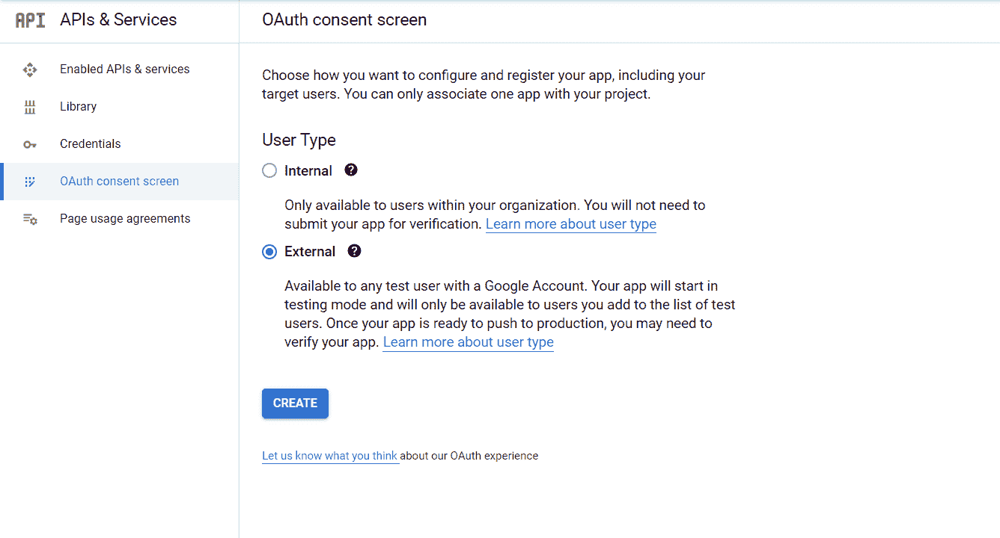

图片来源：作者

1.  填写所有必要的详细信息并继续。

1.  将授权域名部分留空，因为我们当前在本地服务器上测试我们的应用。如果你使用了一个合适的域名托管你的网站，那么你需要在这里输入你网站的域名。

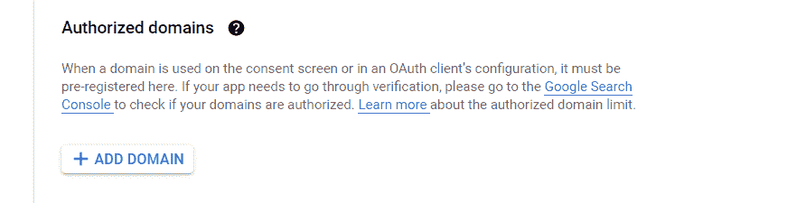

图片来源：作者

1.  其他步骤，如 Scopes 和测试用户，保持为空。

1.  在配置 OAuth 屏幕后，导航到 `**凭证 << 创建凭证 << OAuth 客户端 ID**`

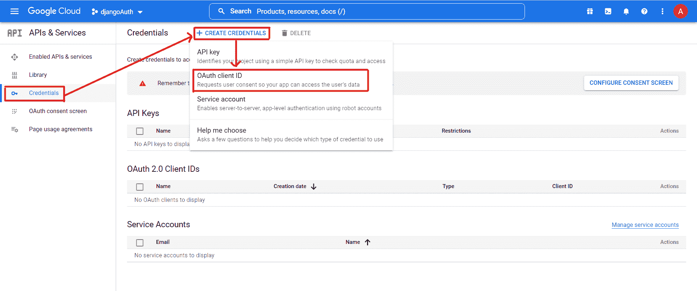

图片来源：作者

1.  选择应用程序类型为 **Web 应用程序**。

1.  填写所有必需的信息并点击“创建”按钮。

> **注意：** 添加授权重定向 URL，因为我们目前在本地主机上运行我们的应用。你可以根据你的域名更改重定向 URL。

[`127.0.0.1:8000/accounts/google/login/callback/`](http://127.0.0.1:8000/accounts/google/login/callback/)

[`localhost:8000/accounts/google/login/callback/`](http://localhost:8000/accounts/google/login/callback/)

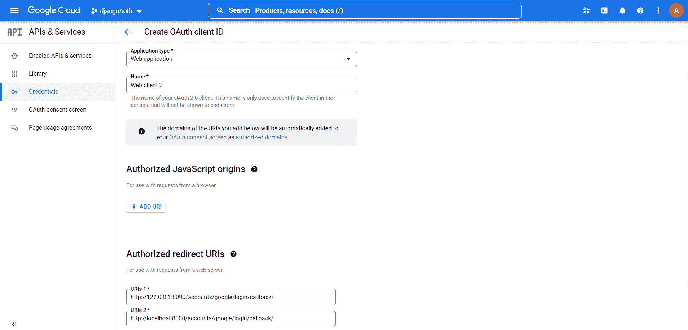

图片来源：作者

1.  现在，你将获得你的客户端 ID 和客户端密钥，我们将在我们的 Django 应用中使用它们。

> **注意：** 请不要与任何人分享这些凭证。

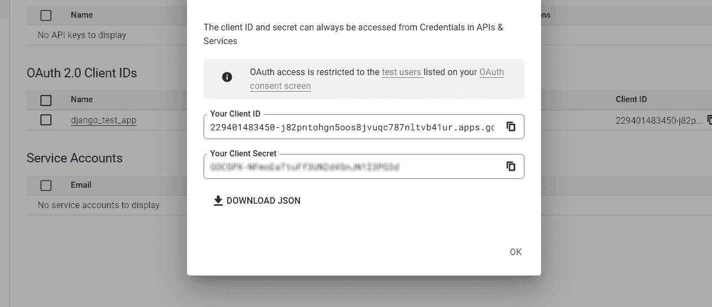

图片来源：作者

你将在 **凭证部分** 中找到你创建的凭证。

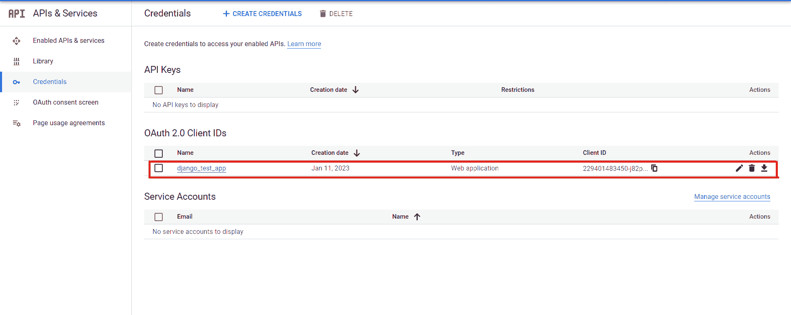

图片来源：作者

# 创建 Django 应用

在本节中，我们将讨论如何创建 Django 应用程序以及如何使用社交用户认证。如果你是 Django 新手，也完全没问题。我会详细解释每一步。

> **注意：** 本教程将使用 Windows 机器。

1.  创建虚拟环境

```py
$ py -m venv <venv_name>          // Command to create venv
$ <venv_name>\Scripts\activate   // Command to activate venv</venv_name></venv_name>
```

> **注意：** 总是建议创建一个虚拟环境。这将帮助你更好地管理你的库/依赖。

1.  安装所需的库：

```py
$ pip install django
$ pip install django-allauth
```

## 什么是 Django-allauth？

Django-allauth 是一个用于 Django 网络框架的库，提供了一套一体化的认证视图和表单，统一了各种第三方（社交）账户提供商如 Google、Facebook 等的用户注册和认证过程。它允许开发人员快速、轻松地将认证和注册功能添加到 Django 项目中。它还支持 OAuth 和 OpenID Connect。

1.  创建 Django 项目

```py
$ django-admin startproject <project_name>//socialauthapp</project_name> 
```

1.  进入项目目录

```py
$ cd <project_directory>//socialauthapp</project_directory> 
```

1.  将应用添加到`settings.py`文件中的 INSTALLED_APPS 列表中。

```py
INSTALLED_APPS = [
    "django.contrib.admin",
    "django.contrib.auth",
    "django.contrib.contenttypes",
    "django.contrib.sessions",
    "django.contrib.messages",
    "django.contrib.staticfiles",
    "allauth",
    "allauth.account",
    "allauth.socialaccount",
    "allauth.socialaccount.providers.google",
]
```

1.  在同一个`settings.py`文件中，添加以下身份验证后端。

```py
AUTHENTICATION_BACKENDS = (
    "django.contrib.auth.backends.ModelBackend",
    "allauth.account.auth_backends.AuthenticationBackend",
)
```

1.  现在我们需要在主项目目录中的`urls.py`文件中添加 allauth 的 URL。添加 URL 后，你的`urls.py`文件看起来是这样的。

```py
from django.contrib import admin
from django.urls import path
from django.urls import include, re_path

urlpatterns = [
    path("admin/", admin.site.urls),
    re_path("accounts/", include("allauth.urls")),
]
```

1.  执行所有必要的迁移。

```py
$ python manage.py makemigrations
$ python manage.py migrate
```

1.  现在，我们将创建一个超级用户（这是一个具有所有权限/访问权限的管理员用户）。

```py
$ python manage.py createsuperuser
```

1.  最后，我们将运行服务器。

```py
$ python manage.py runserver
```

1.  通过访问这个 URL（[`localhost:8000/accounts/login/`](http://localhost:8000/accounts/login/)），你将能够看到登录表单。


作者提供的图片

我们的 Django 应用现在已经创建完成。如果你在运行服务器时遇到任何错误，请再次检查所有步骤。如果你能看到上述登录页面，你的应用运行正常。

# 在 Django 应用中添加 Client ID 和 Client Secret

在这一部分，我们将把**Client ID**和**Client Secret**添加到我们在 Google 控制台创建的应用中。

1.  打开 Django 管理员面板。([`localhost:8000/admin/login/?next=/admin/`](http://localhost:8000/admin/login/?next=/admin/))

1.  输入在创建超级用户时设置的用户名和密码。

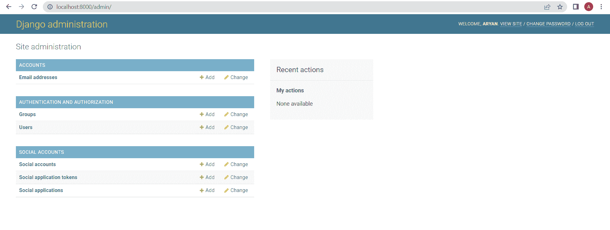

作者提供的图片

1.  点击**社交应用**，然后点击**添加社交应用**。

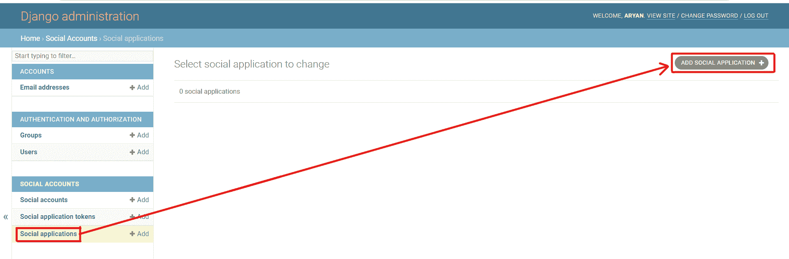

作者提供的图片

1.  选择提供者为 Google，并输入你的 Client ID 和 Client Secret。然后，点击保存按钮。

1.  现在从管理员面板登出，你就完成了。

## 登录步骤

访问这个 URL（[`localhost:8000/accounts/google/login/?process=login`](http://localhost:8000/accounts/google/login/?process=login)）以通过 Google 登录你的应用。

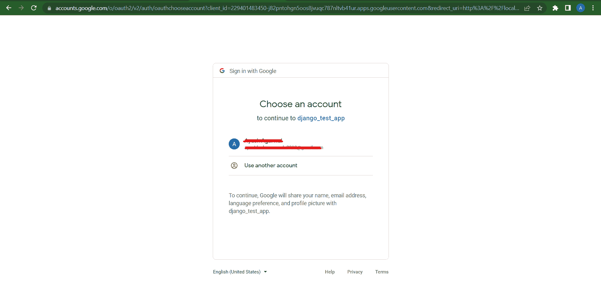

作者提供的图片

> **注意：** 登录后，你将自动重定向到个人资料页面（即，[`localhost:8000/accounts/profile/`](http://localhost:8000/accounts/profile/)）。

## 更改重定向 URL

你可以通过在`settings.py`文件中指定特定的重定向 URL 来更改默认的重定向 URL。

例如，

```py
LOGIN_REDIRECT_URL = "/"  # This will redirect to your homepage
LOGOUT_REDIRECT_URL = "/"
```

## 登出

你可以通过访问这个 URL（[`localhost:8000/accounts/logout/`](http://localhost:8000/accounts/logout/)）来登出应用。

# 结论

在本文中，我们采用了逐步的方法来展示如何将 Google 身份验证集成到 Django web 应用中。首先，我们在 Google 控制台创建了一个服务并获得了必要的 Client ID 和 Client Secret。然后，在创建应用后，我们在管理员门户中输入了秘密密钥，并成功地通过 Google 身份验证登录了应用。

值得注意的是，我们可以用相同的流程来验证使用**Facebook**或**Github**的用户。通过从各自的管理门户创建秘密密钥并将其输入到 Django 应用程序的管理门户中，你还可以启用通过这些提供商的身份验证。

总之，希望你喜欢这篇文章，并觉得它有帮助。如果你有任何建议或反馈，请通过 LinkedIn 与我联系。

祝你有美好的一天????。

**[Aryan Garg](https://www.linkedin.com/in/aryan-garg-1bbb791a3/)** 是一名电气工程学士生，目前正在完成本科的最后一年。他对网页开发和机器学习领域感兴趣，并已经追求了这个兴趣，期待在这些方向上进一步工作。

### 更多关于这个话题

+   [如何构建模型以找到用户旅程中最有影响力的路径](https://www.kdnuggets.com/2022/09/objectiv-build-model-impactful-paths-user-journeys.html)

+   [AI/ML 模型的风险管理框架](https://www.kdnuggets.com/2022/03/risk-management-framework-aiml-models.html)

+   [适用于所有用途的唯一提示框架](https://www.kdnuggets.com/the-only-prompting-framework-for-every-use)
