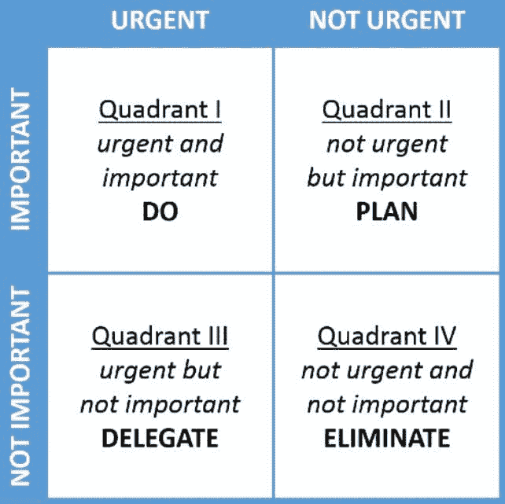

# 这些软技能可以决定你数据科学职业的成败

> 原文：[`www.kdnuggets.com/2021/05/soft-skills-data-science-career.html`](https://www.kdnuggets.com/2021/05/soft-skills-data-science-career.html)

评论

**作者 [Stefan Maraj](https://www.linkedin.com/in/stefan-maraj-86b0961bb)，网络安全顾问**

作为数据科学家，我们有时可能对事情过于… 科学化。虽然 [数据科学家的核心技能](https://www.kdnuggets.com/2020/09/modern-data-science-skills.html) 在很大程度上与过去相同——统计学、数学和逻辑——但总是会出现新的技能集。有时，这些新技能与计算机编程的新范式或新颖的统计技术相关。

* * *

## 我们的三大课程推荐

 1\. [谷歌网络安全证书](https://www.kdnuggets.com/google-cybersecurity) - 快速进入网络安全职业道路。

 2\. [谷歌数据分析专业证书](https://www.kdnuggets.com/google-data-analytics) - 提升你的数据分析技能

 3\. [谷歌 IT 支持专业证书](https://www.kdnuggets.com/google-itsupport) - 支持组织的 IT 需求

* * *

在今天的商业环境中，最重要的 [新兴技能](https://www.kdnuggets.com/2019/09/core-hot-data-science-skills.html) 是软技能。尽管老派程序员会告诉你其他的，但事实是，今天没有人，包括数据科学家，能够忽视这些技能。它们不仅使团队合作更有效，而且还能提升你的职业生涯。

在本文中，我们将带你了解数据科学家最重要的五种软技能，并展示如何培养这些技能。

*使用 [Pixabay](https://pixabay.com/) 的图片。*

### 软技能的重要性

首先，如果你仍然对发展这些技能的必要性感到怀疑，那么让我们来看看数据。最近的一项 [谷歌研究](https://www.forbes.com/sites/anantagarwal/2018/10/02/data-reveals-why-the-soft-in-soft-skills-is-a-major-misnomer/#244719f26f7b) 研究了几家大型公司的员工，并试图评估最具生产力和创新性的员工所具备的技能。

结果可能会让你感到意外。与其说创新是由拥有最高技术技能的员工推动的，不如说最具生产力和创造力的员工实际上是那些参与跨学科小组的人。在这些小组中，那些拥有最发达的软技能的个人能够推动变革，更有可能晋升为管理职位。

你需要的技能类型当然取决于你的工作方式和工作的重点。然而，有些技能对几乎所有数据科学角色都是至关重要的。以下是一些技能：

1.  **沟通**

作为一名数据科学家，你可能已经以能向普通观众传达复杂的想法和数据分析为自豪。然而，能够在你角色的技术要求之外分享你的技能和专长也是很重要的。主动联系你的客户和经理不仅可以改善这些关系，还可能提升你的职业生涯。

能够将与当前话题相关的大量数据汇总、分析和复述给一群科学家是一回事，但能够将其精髓传达给那些可能能帮助你实现职业上升的人的能力则是另一回事。

假设你在午餐室遇到公司的首席执行官。她正开心地在手机上浏览，谷歌着这个、那个以及其他所有东西。由于 IT 部门每天都在提醒你网络安全的重要性，你随口提到使用全球最受欢迎的搜索引擎是[一种糟糕的主意](https://restoreprivacy.com/google-alternatives/)，除非你喜欢你的每一次在线活动都被跟踪和存储。对话开始了。首席执行官对你的聪明才智和愿意帮助的态度印象深刻。下一次她参加董事会会议时，当 C-Suite 团队在审查提升哪个员工或将哪个员工送往西伯利亚时，你的名字会在她的记忆中浮现，作为一个有帮助的人。

你获得了大幅加薪和一个带窗户的角落办公室。这一切都因为你能够超越硬数据科学技能的局限，作为一个人进行沟通。

*感谢 [维基共享资源](https://commons.wikimedia.org/wiki/Main_Page)。*

1.  **决策制定**

高效、清晰、及时的决策制定是商业中至关重要的技能。然而，这往往被数据科学家忽视。这可能为公司带来重大问题，因为数据科学家可能会在没有必要的技能和知识的情况下担任高级职位（参见上面的午餐室故事），无法做出管理或商业决策。

不过，这不一定是一个难以获得的技能。定期审查当前和即将到来的行业趋势可以极大地提升你的监督能力（再次）并表明你渴望更多责任。

1.  **批判性思维**

批判性思维是一个比其他一些技能更难定义的软技能——实际上，这也是为什么一些文科专业的学生在大学中花费多年来磨练这个技能。作为科学家，我们工作的方法常常似乎没有多少空间来进行批判和创造。这实际上正好相反。

最终，批判性思维使你能够做到两件事。一是高效地过滤我们现在面临的信息洪流。在顶级的八个平台上拥有超过[九十亿的社交媒体用户](https://www.broadbandsearch.net/blog/internet-statistics#post-navigation-2)，谁能跟得上？没错，没人能。

快速扫描和筛选信息的能力可能是你职业生涯中的关键因素。另一个与批判性思维相关的关键软技能是能够在飞速变化的情况下重新构建和调整你的数据分析，以识别和解决实际问题。

1.  **团队合作**

尽管从事数据分析的工作可能看起来是一项孤独的任务，但实际上，团队合作在组织中一直非常重要。这部分是由于像我上面提到的研究，强调了多学科团队在推动创新中的价值。

在这些环境中工作可能会很有压力，特别是如果你不是一个善于与人交往的人，并且没有与那些可能不分享你专业知识或世界观的同事合作的软技能。与同事建立职业关系的能力至关重要。

1.  **研究**

最后但绝对重要的是研究技能。数据科学的世界以及在其中工作的人角色变化迅速。因此，培养进一步教育的能力是最重要的技能之一。

[持续教育的重要性](https://www.kdnuggets.com/2018/05/simplilearn-9-must-have-skills-data-scientist.html)在技术职业中正在被雇主逐渐认识到。如果你保持对该领域新技术、问题和工具的了解，预计会收到更多更好的工作机会。

### 未来

我们刚刚讨论的软技能不仅对于高效和胜任地工作至关重要，而且在雇主那里也非常受欢迎。成功的软技能发展可能是未来工作场所成功的关键。随着更多的协作工作带来新的挑战，识别[你需要增强的技能](https://www.kdnuggets.com/2020/09/decide-data-skills-learn.html)并立即制定改进计划。

**个人简介：**[Stefan Maraj](https://www.linkedin.com/in/stefan-maraj-86b0961bb)曾经几乎成为一名会计师，但现在他对网络安全的了解已经超过了收入确认原则。二十年后，他成为了一名网络安全顾问，提供黑客思维的洞察，以准确发现他们从事的计算机恶行及其解决方法。

**相关：**

+   [如何成为数据科学家的指南（逐步方法）](https://www.kdnuggets.com/2021/05/guide-become-data-scientist.html)

+   [15 个我从高效数据科学家那里学到的习惯](https://www.kdnuggets.com/2021/03/15-habits-learned-from-highly-effective-data-scientists.html)

+   [5 项支持技能帮助你获得数据科学工作](https://www.kdnuggets.com/2021/02/5-supporting-skills-data-science-job.html)

### 更多相关话题

+   [远程工作的数据科学家需要的 6 项软技能](https://www.kdnuggets.com/2022/05/6-soft-skills-data-scientists-working-remotely.html)

+   [每个数据科学家都需要的软技能](https://www.kdnuggets.com/soft-skills-every-data-scientist-needs)

+   [想成为数据科学家？第二部分：你需要的 10 项软技能](https://www.kdnuggets.com/want-to-become-a-data-scientist-part-2-10-soft-skills-you-need)

+   [5 门免费课程助你进入数据分析领域](https://www.kdnuggets.com/5-free-courses-to-break-into-data-analytics)

+   [通过这 3 个热门证书提升你的技术职业](https://www.kdnuggets.com/advance-your-tech-career-with-these-3-popular-certificates)

+   [2024 年可以提升数据科学职业的认证](https://www.kdnuggets.com/certifications-that-can-boost-your-data-science-career-in-2024)
