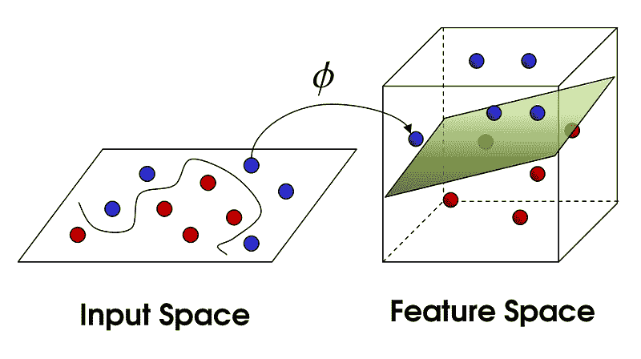
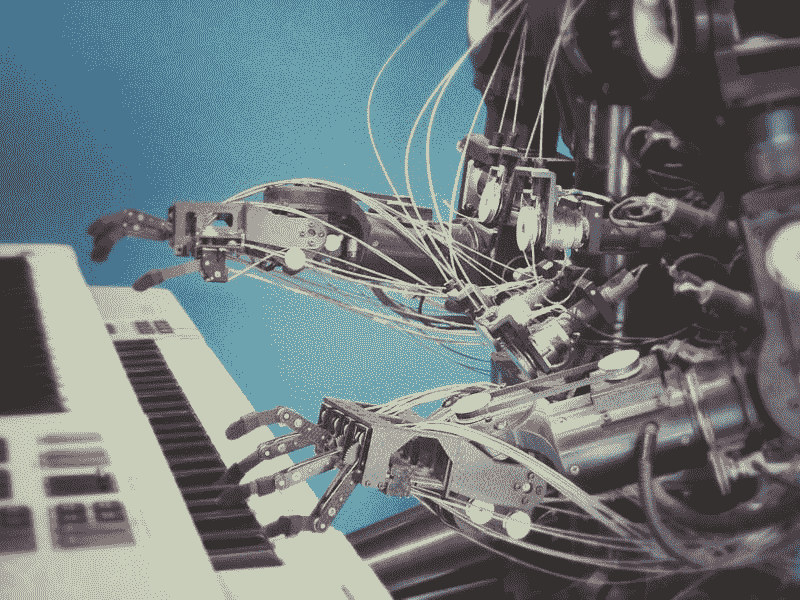
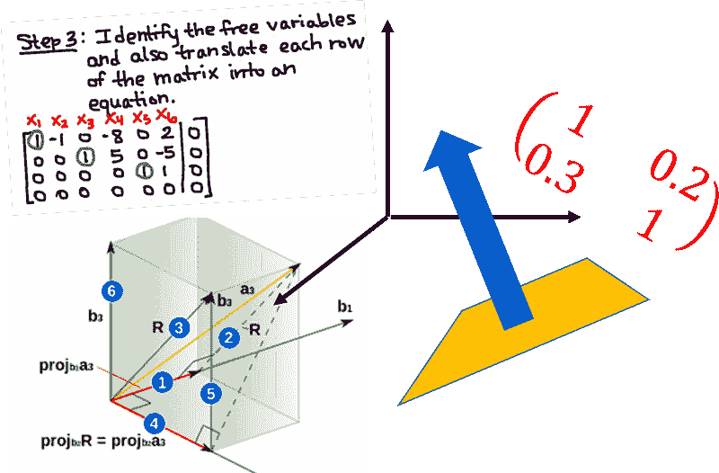

# 有哪些“高级”AI 和机器学习在线课程？

> 原文：[`www.kdnuggets.com/2019/02/some-advanced-ai-machine-learning-online-courses.html`](https://www.kdnuggets.com/2019/02/some-advanced-ai-machine-learning-online-courses.html)

 评论

### 为什么写这篇文章？

许多刚开始数据科学和机器学习之旅的年轻专业人士面临一个共同问题——他们完成了一两个基础在线课程，做了一些编程练习，上传了几个项目到 Github，然后……然后呢？

> **学习什么？在哪里找到集中资源？**

在我之前的一篇文章中（由[TDS Team](https://medium.com/@TDSteam)发布），我详细讨论了**你可以在哪里找到 MOOC（大规模开放在线课程）以启动你的数据科学和机器学习之旅**。那篇文章假定读者为初学者，涵盖了优化的基本和中级学习的 MOOC。你可以在这里查看，

[**如何选择有效的机器学习和数据科学 MOOC？**

*对非计算机科学领域的专业人士的建议，渴望学习并贡献于数据科学/机器学习。来自……*towardsdatascience.com](https://towardsdatascience.com/how-to-choose-effective-moocs-for-machine-learning-and-data-science-8681700ed83f)

我写了另一篇详细的文章，专注于数据科学和机器学习中你需要掌握的数学概念及相关课程。你可以在这里查看，

[**数据科学的基本数学 - '为什么'和'如何'**

*数学是科学的基础。我们讨论了成为更好的数据科学家所需掌握的关键数学主题……*towardsdatascience.com](https://towardsdatascience.com/essential-math-for-data-science-why-and-how-e88271367fbd)

最近，我收到了许多来自聪明年轻专业人士的个人邮件和 LinkedIn 收件箱中的消息，他们询问类似的问题以及对在线课程的建议。

对于这些消息，我大多有现成的答案。我只需发送一份我的文章列表（其中包含了指向 KDnuggets 或[Team AV](https://medium.com/@analytics)的其他高度引用文章的链接和参考）。大多数情况下，我会收到愉快的回复 :-)

然而，自从撰写那些文章以来，我个人参加了更多“高级”AI 和机器学习（ML）课程，看到了一些讨论和评论，自然感觉需要更新这些参考资料。

> 经过一番思考，我决定最好保留原始文章，因为它们确实面向初学者，并且为许多读者很好地服务过，同时尝试编制一个新的在线课程列表。

这就是本文的内容。

### 我所说的“高级”课程是什么意思？

“高级”是一个相对的术语。最好有一个基准来解释这个词在此上下文中的含义。幸运的是，当谈到机器学习在线 MOOC 时，我们几乎有一个黄金标准——Prof. [Andrew Ng](https://medium.com/@andrewng)的[Coursera 课程](https://www.coursera.org/learn/machine-learning)（原始的那个，不是[Deeplearning.ai 专业课程](https://www.deeplearning.ai/deep-learning-specialization/)）。

因此，在本文中提到的“高级”指的是两个特征，这两个特征需要在将要讨论的课程中存在（不一定是同时存在）。

+   比上述课程具有显著更多的广度，即涵盖更多高级和多样化的主题。

+   与 AI 或 ML 相关的高度专业化焦点

我希望我能明确我的意图不是说 Ng 教授的课程是一个初级课程。它仍然是世界上最好的机器学习入门课程——尤其是对于初学者。然而，在你完成这个课程后，进行一些编程，熟悉数学概念，你应该在你的基础上继续学习多样化的主题。

我只希望这篇文章能够通过列出一些**免费的 MOOCs**来帮助你达到这一目标。

### 选择课程的唯一焦点是什么？

AI 和 ML 是热门话题，免费的在线课程层出不穷。然而，我发现真正高质量的 AI 课程数量惊人地少。

是的，我属于那个坚定相信[深度学习不是人工智能](https://subscription.packtpub.com/book/big_data_and_business_intelligence/9781788992893/1/ch01lvl1sec13/some-common-myths-about-deep-learning)的阵营，因此拒绝任何标题中包含“AI”但仅涉及 Python 中的深度学习框架的课程被归类为 AI 课程的观点。

因此，为了将我的列表限制在有限数量的高质量课程中，我制定了一些简单的规则或筛选条件。

+   我倾向于**避免任何明显关注特定编程框架**/工具的课程，即没有名称为“用 Python 进行机器学习……”的课程（一些示例或代码片段是可以的）。

+   按照相同的逻辑，列表中的课程将具有**强烈的理论基础**——这主要偏向大学课程，而不是由个人创业者或公司（例如 fast.ai、Google、Microsoft、IBM 等）提供的课程。

+   类似地，我包括了由**大学教职工或知名研究人员**如 Sebastian Thrun 或 Peter Norvig 教授的 Udacity 课程。我没有包括他们的纳米学位参考，因为我认为这些并不具有知识启发性。

+   我包括了两个在真正的人工智能学习中具有巨大重要性的主题，但通常受到较少关注——[**强化学习**](https://medium.freecodecamp.org/an-introduction-to-reinforcement-learning-4339519de419) 和 [**博弈论**](https://towardsdatascience.com/what-data-scientists-should-know-about-game-theory-types-of-games-2ecc616ea725)。

+   **没有课程专注于数据科学/数据工程/数字分析/应用统计**。这些都是当今世界中极其重要的话题，但为了本文的重点，我更倾向于将它们与纯机器学习和人工智能分开。

我相信这种重点会自动将列表筛选为高质量的人工智能和机器学习基础课程，这对中级到高级学习者有益。

毕竟，你将是裁判。

个人来说，我没有完成所有这些课程，尽管我完成了其中的相当一部分。因此，我试图简明扼要地评论这些课程，并保持事实准确。

### 链接和参考资料

不再耽搁，以下是列表。

**通用机器学习和深度学习**

这些课程涵盖了通用机器学习和深度学习主题。

来源：[`www.jeremyjordan.me/support-vector-machines/`](https://www.jeremyjordan.me/support-vector-machines/)

+   [**乔治亚理工学院的“*机器学习*”课程在 Udacity**](https://in.udacity.com/course/machine-learning--ud262)：这是最全面的机器学习课程之一，涵盖了监督学习、无监督学习、随机优化技术（例如遗传算法）、强化学习，甚至是入门级博弈论概念。

+   [**安德鲁·吴教授的斯坦福课堂版讲座**](http://cs229.stanford.edu/)：这是吴教授在斯坦福的机器学习课程的完整课堂版本。深入覆盖了机器学习的基础主题，而这些在简化版的在线 MOOC 中缺失。

+   [**“*高级机器学习专业化*”由国立研究大学高等经济学院在 Coursera 上提供**](https://www.coursera.org/specializations/aml)：这是由俄罗斯研究人员提供的一组很棒的课程（共 5 门）。涵盖了实际深度学习技术以及基础概念。

+   [**“*大规模机器学习*”由 Yandex 在 Coursera 上提供**](https://www.coursera.org/learn/machine-learning-applications-big-data)：涵盖了使用 MLib/Spark 等进行 ML 模型的部署和扩展。

+   [***“机器学习 Caltech 课程”***](https://work.caltech.edu/telecourse.html#lectures)：之前在 edX 上，现在已移至 Mostafa 教授的主页。链接指向那里。这是一个在机器学习及学习理论的深层数学方面非常基础的课程。

+   [**“*机器学习基础*”由加州大学圣地亚哥分校在 edX 上提供**](https://www.edx.org/course/machine-learning-fundamentals-0): 一门均衡的课程，教授机器学习中的核心理论和实践概念，强调算法问题。

**人工智能与博弈论**

照片由[rawpixel](https://unsplash.com/photos/n25oD0d4oiI?utm_source=unsplash&utm_medium=referral&utm_content=creditCopyText)提供，来自[Unsplash](https://unsplash.com/search/photos/game-theory?utm_source=unsplash&utm_medium=referral&utm_content=creditCopyText)。

这些是与人工智能和博弈论相关的课程。

+   [**Udacity 的“*人工智能导论*”课程**](https://www.udacity.com/course/intro-to-artificial-intelligence--cs271): 目前网络上最全面的核心人工智能课程。由两位著名专家——Sebastian Thrun 和 Peter Norvig 授课。他们涵盖了如 AI 搜索算法、规划、表征逻辑、概率推理、机器学习、马尔可夫过程、隐马尔可夫模型（HMM）及滤波器、计算机视觉、机器人技术和自然语言处理等主题。

+   [**哥伦比亚大学的“*人工智能 (AI)*”课程在 edX 上**](https://www.edx.org/course/artificial-intelligence-ai): 这也是对人工智能关键主题的全面回顾，但水平较低。这是对人工智能广泛领域的良好介绍，涵盖了如智能体的类型和定义、人工智能的历史、搜索、游戏、逻辑、约束满足问题、自然语言处理（NLP）、机器人技术和计算机视觉等主题。

+   [**斯坦福大学的“*博弈论*”课程在 Coursera 上**](https://www.coursera.org/learn/game-theory-1): 这是对博弈论奇妙世界的极佳介绍（且全面），涵盖了所有重要主题，如纳什均衡、混合策略、相关均衡、子博弈完美、扩展形式、重复博弈与民间定理、贝叶斯博弈、联盟博弈。

+   [**“*知识基础的人工智能: 认知系统*”由乔治亚理工学院在 Udacity 上提供**](https://www.udacity.com/course/knowledge-based-ai-cognitive-systems--ud409): 一门关于传统人工智能（或称 GOFAI）的全面课程，涵盖了如语义网络、手段与目标分析、案例推理、增量概念学习、逻辑与规划、类比推理、约束传播和元推理等主题。

**强化学习**

照片由[Franck V.](https://unsplash.com/photos/U3sOwViXhkY?utm_source=unsplash&utm_medium=referral&utm_content=creditCopyText)提供，来自[Unsplash](https://unsplash.com/search/photos/robot?utm_source=unsplash&utm_medium=referral&utm_content=creditCopyText)。

这些是与强化学习相关的课程。

+   [**乔治亚理工学院的“*强化学习*”课程在 Udacity 上**](https://www.udacity.com/course/reinforcement-learning--ud600)：这可能是目前最全面的 RL 课程。两位讲师对该主题都非常了解且充满热情。授课模式为对话式且有趣。它涵盖了 MDP 基础、时间差分（TD）学习、价值和策略迭代、Q 学习、收敛性质、奖励塑造、Bandit 问题、Rmax 分析、一般随机 MDP、状态泛化、POMDP、选项、目标抽象技术、机制设计、蒙特卡罗树搜索、DEC-POMDP、策略评论概念等所有相关主题。

+   [**“*实用强化学习*”，由国家研究型大学高等经济学院在 Coursera 上提供**](https://www.coursera.org/learn/practical-rl)：这是另一门非常全面的课程，涵盖了强化学习的核心主题。与乔治亚理工学院的课程不同的是，它不包括博弈论讨论，而是更多地讨论深度 Q 学习。它是一门更加实用的课程，教你一些实际技巧（但不一定包括完整的代码）来构建 RL 代理。

**其他相关主题**

+   [**Udacity 的“*机器人学中的人工智能*”**](https://udacity.com/course/artificial-intelligence-for-robotics--cs373)：这是一个很棒的小课程，专注于人工智能在机器人领域的应用，由 Sebastian Thrun 教授。他讲授了本地化、卡尔曼滤波器、粒子滤波器、先进的 AI 搜索技术、PID 控制、SLAM（同时定位与地图构建）等主题。

+   [**“*机器学习数学基础专项*”由伦敦帝国学院在 Coursera 上提供**](https://www.coursera.org/specializations/mathematics-machine-learning)：这是一个由四门课程组成的优秀专项，专注于构建机器学习的数学基础。它涵盖了多变量微积分、线性代数和主成分分析（还有一个完整的短课程）。

### 总结

我希望给你提供一些关于免费在线课程的建议，这些课程涵盖了机器学习和人工智能的相对高级主题。本文中，我专门列出了 MOOC，并未考虑自由形式的视频讲座（斯坦福 CS229 课程为例外）。你当然可以在各大学的在线平台上搜索这些视频讲座，通常它们的质量非常高。

祝你在学习这些激动人心的主题的旅程中取得巨大成功！

如果你有任何问题或想法，请通过 [**tirthajyoti[AT]gmail.com**](mailto:tirthajyoti@gmail.com) 联系作者。此外，你可以查看作者的 [**GitHub 库**](https://github.com/tirthajyoti?tab=repositories)，以获取其他有趣的 Python、R 或 MATLAB 代码片段和机器学习资源。如果你和我一样，对机器学习/数据科学充满热情，请随时 [在 LinkedIn 上添加我](https://www.linkedin.com/in/tirthajyoti-sarkar-2127aa7/) 或 [在 Twitter 上关注我](https://twitter.com/tirthajyotiS)。

[**Tirthajyoti Sarkar - 高级首席工程师 - 半导体、人工智能、机器学习 - ON…**]

*查看 Tirthajyoti Sarkar 在 LinkedIn 上的个人资料，这是全球最大的专业社区。Tirthajyoti 有 8 个职位…* [www.linkedin.com](https://www.linkedin.com/in/tirthajyoti-sarkar-2127aa7/)

**简介: [Tirthajyoti Sarkar](https://www.linkedin.com/in/tirthajyoti-sarkar-2127aa7/)** 是一位半导体技术专家、机器学习/数据科学爱好者、电气工程博士、博主和作家。

[原文](https://towardsdatascience.com/what-are-some-advanced-ai-and-machine-learning-online-courses-8609ab281450)。已获授权转载。

**相关:**

+   数据科学必备数学: ‘为什么’和‘如何’

+   合成数据生成：新数据科学家必备技能

+   IT 工程师需要学习多少数学才能进入数据科学领域？

* * *

## 我们的前三名课程推荐

 1\. [Google 网络安全证书](https://www.kdnuggets.com/google-cybersecurity) - 快速进入网络安全职业。

 2\. [Google 数据分析专业证书](https://www.kdnuggets.com/google-data-analytics) - 提升你的数据分析技能

 3\. [Google IT 支持专业证书](https://www.kdnuggets.com/google-itsupport) - 支持你的组织的 IT

* * *

### 更多相关话题

+   [它活了！用 Python 和一些便宜的基础组件构建你的第一个机器人…](https://www.kdnuggets.com/2023/06/manning-build-first-robots-python-cheap-basic-components.html)

+   [事物并不总是正常的：一些“其他”分布](https://www.kdnuggets.com/2023/01/things-arent-always-normal-distributions.html)

+   [我使用了 ChatGPT（每天）5 个月。这里是一些隐藏的宝石…](https://www.kdnuggets.com/2023/07/used-chatgpt-every-day-5-months-hidden-gems-change-life.html)

+   [一些顶尖的提示工程技巧，提升我们的 LLM 模型](https://www.kdnuggets.com/some-kick-ass-prompt-engineering-techniques-to-boost-our-llm-models)

+   [5 门免费的高级 Python 编程课程](https://www.kdnuggets.com/5-free-advanced-python-programming-courses)

+   [6 个最佳免费在线课程来学习 Python 并提升你的职业生涯](https://www.kdnuggets.com/2022/11/corise-6-best-free-online-courses-python-boost-career.html)
