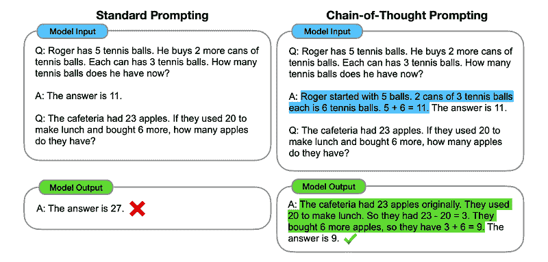
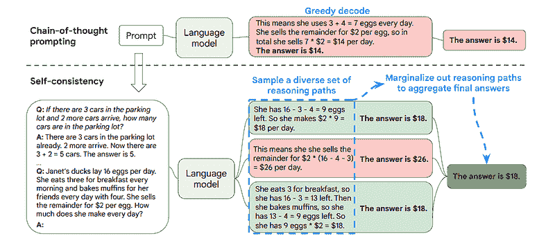
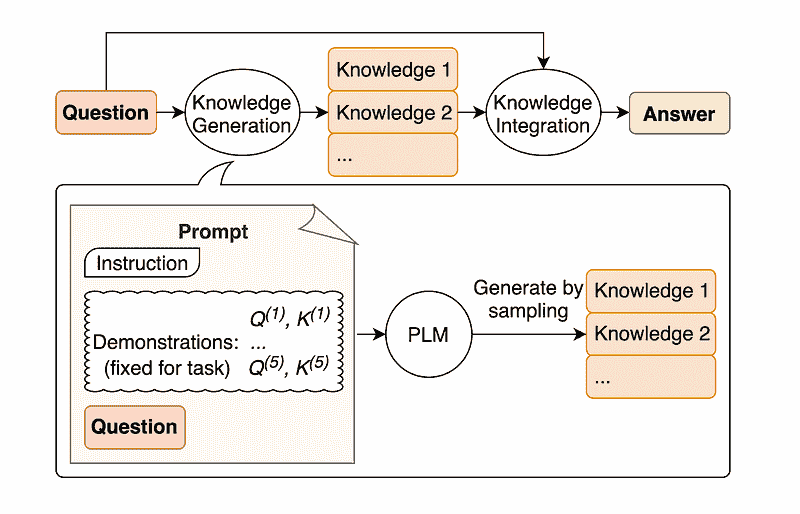
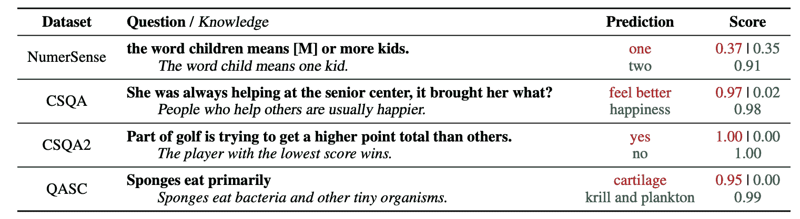

# 一些提升 LLM 模型的强大提示工程技术

> 原文：[`www.kdnuggets.com/some-kick-ass-prompt-engineering-techniques-to-boost-our-llm-models`](https://www.kdnuggets.com/some-kick-ass-prompt-engineering-techniques-to-boost-our-llm-models)

使用 DALL-E3 创建的图像

人工智能在科技领域带来了彻底的革命。

* * *

## 我们的前三大课程推荐

 1\. [谷歌网络安全证书](https://www.kdnuggets.com/google-cybersecurity) - 快速进入网络安全职业生涯。

 2\. [谷歌数据分析专业证书](https://www.kdnuggets.com/google-data-analytics) - 提升你的数据分析技能

 3\. [谷歌 IT 支持专业证书](https://www.kdnuggets.com/google-itsupport) - 支持你组织的 IT 需求

* * *

其模仿人类智慧并执行曾被认为仅为人类领域的任务的能力仍然让我们大多数人感到惊讶。

然而，无论这些最近的 AI 进展有多么出色，仍然有改进的空间。

正是提示工程发挥作用的地方！

进入这个可以显著提升 AI 模型生产力的领域。

让我们一起发现这一切吧！

# 提示工程的本质

提示工程是一个快速增长的领域，专注于提高语言模型的效率和有效性。其核心在于设计完美的提示，以指导 AI 模型产生我们期望的输出。

将其视为学习如何给出更好的指示，以确保对方理解并正确执行任务。

## 为什么提示工程很重要

+   **提高生产力：** 通过使用高质量的提示，AI 模型可以生成更准确和相关的响应。这意味着减少了修正的时间，增加了利用 AI 能力的时间。

+   **成本效率：** 训练 AI 模型是资源密集型的。提示工程可以通过更好的提示优化模型性能，从而减少重新训练的需求。

+   **多样性：** 一个精心设计的提示可以使 AI 模型更加多样化，使它们能够处理更广泛的任务和挑战。

在深入了解最先进的技术之前，让我们回顾两种最有用（也最基础）的提示工程技术。

# 基本提示工程方法的初步了解

## 使用“让我们一步一步思考”进行顺序思考

今天大家都知道，添加“让我们一步一步思考”这个词序列，可以显著提高 LLM 模型的准确性。

为什么……你可能会问？

这是因为我们强迫模型将任何任务分解为多个步骤，从而确保模型有足够的时间处理每一个步骤。

例如，我可以用以下提示挑战 GPT3.5：

> 如果约翰有 5 个梨，然后吃了 2 个，买了 5 个，再给朋友 3 个，他现在有多少个梨？

模型会立刻给我答案。然而，如果我加上最后的“让我们一步一步来思考”，我就是在强迫模型生成一个多步骤的思维过程。

## 少样本提示

虽然零样本提示指的是在没有提供任何上下文或先前知识的情况下要求模型执行任务，但少样本提示技术则意味着我们向 LLM 提供一些我们期望的输出示例以及一些具体问题。

比如说，如果我们想创建一个用诗意的语调定义任何术语的模型，这可能会很难解释。对吧？

不过，我们可以使用以下少样本提示来引导模型朝着我们想要的方向。

> 你的任务是以一致的风格回答，符合以下风格。
> 
> **<user>**: 教我关于韧性的问题。
> 
> **<system>**: 韧性就像一棵随风摇摆却永不折断的树。
> 
> 这是一种从逆境中反弹并不断前进的能力。
> 
> **<user>**: 你的输入在这里。

如果你还没试过，你可以去挑战 GPT。

不过，由于我很确定你们中的大多数人已经了解这些基本技巧，我将尝试用一些高级技巧来挑战你们。

# 高级提示工程技术

## 1\. 思维链 (CoT) 提示

由[谷歌于 2022 年](https://arxiv.org/abs/2201.11903)介绍，这种方法包括指示模型在给出最终回答之前经历几个推理阶段。

听起来很熟悉，对吧？如果是这样，你完全正确。

这就像将顺序思维和少样本提示合并在一起。

怎么做？

实质上，CoT 提示引导 LLM 顺序处理信息。这意味着我们展示如何通过多个步骤解决第一个问题，然后将实际任务发送给模型，期望它在回答实际查询时模仿类似的思维链。

图片取自[论文](https://arxiv.org/abs/2201.11903)。

所以，按照第一个示例，我们可以提供一个包含第一个问题和顺序解释的提示。然后，我们可以发送我们的输入，看看魔法是如何发生的！

> **<user>** 如果约翰有 5 个梨，然后吃了 2 个，买了 5 个，再给朋友 3 个，他现在有多少个梨？让我们一步一步来思考。
> 
> **<agent>** 让我们一步一步来。约翰开始时有 5 个梨。他吃了 2 个梨，所以剩下 5–2 = 3 个梨。然后，他又买了 5 个梨。所以，他现在有 3 + 5 = 8 个梨。最后，他给了朋友 3 个梨。因此，他剩下 8–3 = 5 个梨。所以，经过所有这些步骤，约翰有 5 个梨。
> 
> **<user>** 你的输入在这里。

然而，你们大多数人可能会想… 每次我想在 ChatGPT 上问问题时，都必须想到一种逐步解决问题的方法吗？

嗯… 你不是第一个这样想的人！这就引出了…

## 2\. 自动化思维链（Auto-CoT）

在 2022 年，[张](https://arxiv.org/abs/2210.03493)和同事们引入了一种避免这种手动过程的方法。避免任何手动任务的主要原因有两个：

+   这可能会很无聊。

+   这可能会导致糟糕的结果——例如，当我们的思维过程错误时。

他们建议结合使用 LLMs 和“让我们一步步思考”提示来逐步生成每个演示的推理链。

这意味着询问 ChatGPT 如何逐步解决任何问题，然后使用这个例子来训练它如何解决其他问题。

## 3\. 自我一致性

自我一致性是另一种有趣的提示技术，旨在改善更复杂推理问题的思维链提示。

所以… 主要区别是什么？

自我一致性的主要思想是意识到我们可以用错误的例子来训练模型。试想一下我用错误的思维过程解决了之前的问题：

> **<User>** 如果约翰有 5 个梨子，然后吃掉 2 个，再买 5 个，然后给朋友 3 个，他还有多少个梨子？让我们一步步思考。
> 
> **<Agent>** 从 5 个梨子开始。约翰吃了 2 个梨子。然后，他给了朋友 3 个梨子。这些操作可以组合在一起：2（吃掉的）+ 3（给出的）= 总共 5 个受影响的梨子。现在，从最初的 5 个梨子中减去受影响的梨子：5（初始） - 5（受影响） = 剩下 0 个梨子。
> 
> 然后，我发送给模型的任何其他任务都会是错误的。

这就是为什么自我一致性涉及从各种推理路径中采样，每条路径包含一链思路，然后让 LLM 选择最佳和最一致的路径来解决问题。

图片摘自[论文](https://arxiv.org/abs/2203.11171?ref=mlq.ai)

在这种情况下，并且再次按照最初的例子，我们可以向模型展示不同的解决问题的方法。

> **<User>** 如果约翰有 5 个梨子，然后吃掉 2 个，再买 5 个，然后给朋友 3 个，他还有多少个梨子？
> 
> **<Agent>** 从 5 个梨子开始。约翰吃了 2 个梨子，剩下 5–2 = 3 个梨子。他再买了 5 个梨子，总数变为 3 + 5 = 8 个梨子。最后，他给了朋友 3 个梨子，所以他剩下 8–3 = 5 个梨子。
> 
> **<User>** 如果约翰有 5 个梨子，然后吃掉 2 个，再买 5 个，然后给朋友 3 个，他还有多少个梨子？
> 
> **<Agent>** 从 5 个梨子开始。然后他再买 5 个梨子。约翰现在吃了 2 个梨子。这些操作可以组合在一起：2（吃掉的）+ 5（买的）= 总共 7 个梨子。从总数中减去约翰吃掉的梨子，7（总数） - 2（吃掉的）= 剩下 5 个梨子。
> 
> **<User>** 你的输入在这里。

最后的技巧来了。

## 4\. 一般知识提示

提示工程的一个常见做法是，在发送最终的 API 调用到 GPT-3 或 GPT-4 之前，使用额外的知识来增强查询。

根据[Jiacheng Liu 和其他人](https://arxiv.org/pdf/2110.08387.pdf?ref=mlq.ai)的说法，我们可以在任何请求中添加一些知识，以便 LLM 更好地了解问题。

图片取自[论文](https://arxiv.org/pdf/2110.08387.pdf?ref=mlq.ai)。

例如，当询问 ChatGPT 高尔夫的一部分是否是试图获得比其他人更高的分数时，它会验证我们。但高尔夫的主要目标正好相反。这就是为什么我们可以添加一些先前的知识告诉它“得分较低的玩家获胜”。

那么，如果我们准确地告诉模型答案，有什么有趣的部分呢？

在这种情况下，这种技术用于改善 LLM 与我们的互动方式。

所以，与其从外部数据库中提取补充背景，论文的作者建议让 LLM 生成自己的知识。然后将这些自生成的知识整合到提示中，以增强常识推理并提供更好的输出。

这就是如何在不增加训练数据集的情况下改进 LLM！

# 结论

提示工程已成为增强 LLM 能力的关键技术。通过迭代和改进提示，我们可以更直接地与 AI 模型沟通，从而获得更准确和上下文相关的输出，节省时间和资源。

对于技术爱好者、数据科学家和内容创作者而言，理解和掌握提示工程可以在充分利用 AI 的潜力方面成为一种宝贵的资产。

通过将精心设计的输入提示与这些更先进的技术相结合，掌握提示工程的技能无疑将在未来几年为你提供优势。

****[Josep Ferrer](https://www.linkedin.com/in/josep-ferrer-sanchez)**** 是一位来自巴塞罗那的分析工程师。他毕业于物理工程专业，目前从事应用于人类流动的数据科学工作。他还是一位兼职内容创作者，专注于数据科学和技术。Josep 写作涉及所有 AI 相关的内容，涵盖了该领域正在爆炸性增长的应用。

### 更多相关话题

+   [顶级 Midjourney 提示与 Poe](https://www.kdnuggets.com/kick-ass-midjourney-prompts-with-poe)

+   [提示工程 101：掌握有效的 LLM 沟通](https://www.kdnuggets.com/prompt-engineering-101-mastering-effective-llm-communication)

+   [事情不总是正常的：一些“其他”分布](https://www.kdnuggets.com/2023/01/things-arent-always-normal-distributions.html)

+   [它活了！使用 Python 和一些便宜的组件构建你的第一个机器人…](https://www.kdnuggets.com/2023/06/manning-build-first-robots-python-cheap-basic-components.html)

+   [我每天使用 ChatGPT 达 5 个月。这里有一些隐藏的宝石…](https://www.kdnuggets.com/2023/07/used-chatgpt-every-day-5-months-hidden-gems-change-life.html)

+   [RAG 与微调：哪种工具最能提升你的 LLM 应用？](https://www.kdnuggets.com/rag-vs-finetuning-which-is-the-best-tool-to-boost-your-llm-application)
