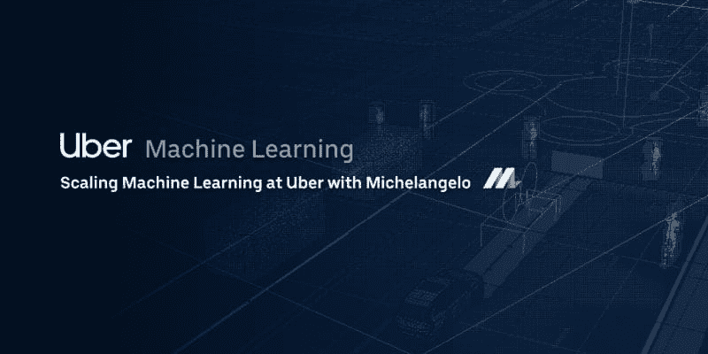
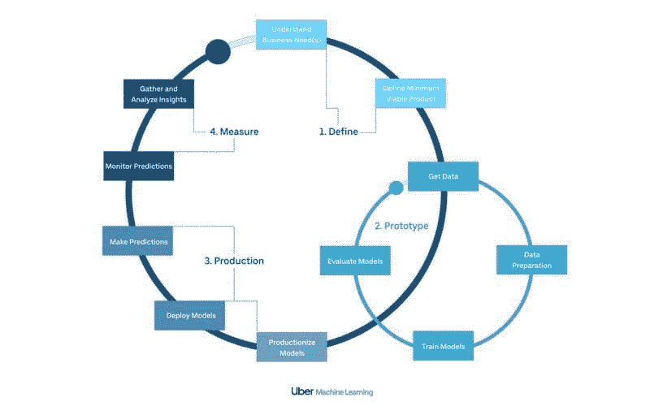
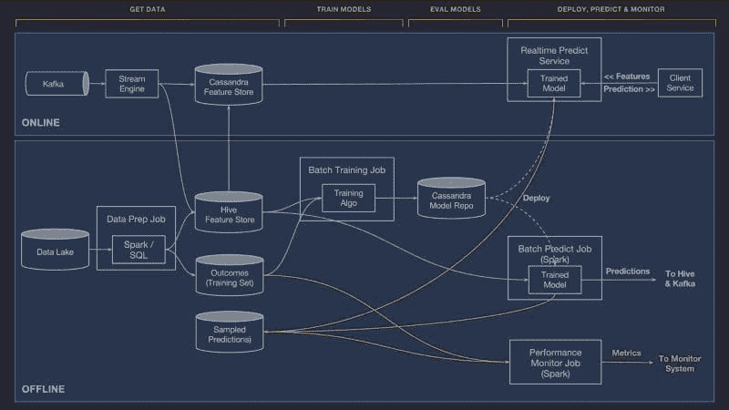

# 优步在大规模运行机器学习中学到的一些东西

> 原文：[`www.kdnuggets.com/2020/07/some-things-uber-learned-machine-learning-scale.html`](https://www.kdnuggets.com/2020/07/some-things-uber-learned-machine-learning-scale.html)

评论

来源: [`eng.uber.com/scaling-michelangelo/`](https://eng.uber.com/scaling-michelangelo/)

在过去几年中，优步一直是开源机器学习技术最活跃的贡献者之一。虽然像谷歌或脸书这样的公司将贡献重点放在了新的深度学习技术栈如 TensorFlow、Caffe2 或 PyTorch 上，但优步工程团队确实专注于在现实世界中大规模构建机器学习的工具和最佳实践。像[米开朗基罗](https://eng.uber.com/michelangelo/)、[Horovod](https://github.com/uber/horovod)、[PyML](https://towardsdatascience.com/uber-introduces-pyml-their-secret-weapon-for-rapid-machine-learning-development-c0f40009a617)、[Pyro](http://pyro.ai/)等技术是优步对机器学习生态系统贡献的一些例子。由于只有少数公司开发大规模机器学习解决方案，优步的经验和指导对机器学习从业者来说变得更加宝贵（我确实学到了很多，并且经常写关于优步努力的文章）。

最近，[优步工程团队发布了米开朗基罗平台前三年的运营评估](https://eng.uber.com/scaling-michelangelo/)。如果我们去除所有米开朗基罗的具体细节，优步的帖子包含了对开始机器学习之旅的组织者来说几条非显而易见的宝贵经验。我将尝试以更通用的方式总结一些关键收获，以适用于任何主流的机器学习场景。

### 米开朗基罗是什么？

[米开朗基罗](https://eng.uber.com/michelangelo/)是优步机器学习技术栈的核心部分。从概念上看，米开朗基罗可以视作一个针对优步内部机器学习工作负载的机器学习即服务平台。从功能角度讲，米开朗基罗自动化了机器学习模型生命周期的不同方面，使得优步的各个工程团队能够在规模上构建、部署、监控和操作机器学习模型。具体而言，米开朗基罗在一个非常复杂的工作流中抽象了机器学习模型的生命周期：

米开朗基罗的架构使用了现代但复杂的技术栈，基于如[HDFS](http://hadoop.apache.org/)、[Spark](https://spark.apache.org/)、[Samza](http://samza.apache.org/)、[Cassandra](http://cassandra.apache.org/)、[MLLib](https://spark.apache.org/mllib/)、[XGBoost](https://github.com/dmlc/xgboost)和[TensorFlow](https://www.tensorflow.org/)等技术。

Michelangelo 支持 Uber 不同部门中的数百种机器学习场景。例如，Uber Eats 使用在 Michelangelo 上运行的机器学习模型来排名餐馆推荐。类似地，Uber 应用中的精确到达时间（ETA）是通过在 Michelangelo 上运行的非常复杂的机器学习模型计算的，这些模型逐段估算 ETA。

为了在数十个数据科学团队和数百个模型之间实现这种级别的可扩展性，Michelangelo 需要提供一个非常灵活和可扩展的架构以及相应的工程流程。Michelangelo 的第一个版本于 2015 年部署，在三年和数百个机器学习模型之后，Uber 发现了一些重要的经验教训。

### 1-训练需要独立的基础设施

如果你正在构建一个模型，你可能会倾向于利用相同的基础设施和工具进行训练和开发。如果你在构建一百个模型，这种方法就不适用了。Uber 的 Michelangelo 使用了一种名为 [Data Science Workbench (DSW)](https://eng.uber.com/dsw/) 的专有工具集，在大规模 GPU 集群和不同的机器学习工具包上训练模型。除了统一的基础设施外，Michelangelo 的 DSW 抽象了机器学习训练过程中常见的任务，如数据转换、模型组合等。

### 2-模型需要监控

用我在这一领域的一位导师的话来说：“做出愚蠢预测的模型比完全不预测的模型更糟糕。” 即使是对训练和评估数据表现完美的模型，在面对新的数据集时也可能开始做出愚蠢的预测。从这个角度来看，模型监控和仪器化是实际机器学习解决方案的关键组成部分。Uber Michelangelo 配置机器学习模型以记录生产中的预测，然后将其与实际结果进行比较。这个过程生成一系列准确性指标，可用于评估模型的性能。

### 3-数据是最难正确处理的

在机器学习解决方案中，数据工程师花费相当一部分时间在数据集上运行提取和转换例程，以选择特征，然后这些特征被用于训练和生产模型。Michelangelo 精简这一过程的方法是构建一个公共特征库，允许不同团队在其模型中共享高质量的特征。类似地，Michelangelo 提供监控工具，以随时间评估特定特征。

### 4-机器学习应被视为软件工程过程来衡量

我知道这听起来很简单，但事实远非如此。大多数组织将他们的机器学习工作与其他软件工程任务分开处理。虽然确实很难将传统的敏捷或瀑布流程适应于机器学习解决方案，但有很多软件工程实践在机器学习领域依然适用。Uber 强调机器学习是一个软件工程过程，并为 Michelangelo 配备了一系列工具，以确保机器学习模型的正确生命周期。

版本控制、测试或部署是 Uber 的 Michelangelo 在软件工程方面严格执行的一些方面。例如，一旦 Michelangelo 认为模型就像一个已编译的软件库，它就会以严格、版本控制的系统跟踪模型的训练配置，就像你对库的源代码进行版本控制一样。类似地，Michelangelo 运行全面的测试套件，在将模型部署到生产环境之前，对其进行对比数据集评估，以验证其正确性。

### 5-自动化优化

微调和优化超参数是机器学习解决方案中永无止境的任务。许多时候，数据科学工程师花费在寻找正确的超参数配置上的时间，比实际构建模型的时间还要多。为了解决这个问题，Uber 的 Michelangelo 推出了一个名为 AutoTune 的优化即服务工具，它使用最先进的黑箱贝叶斯优化算法，更高效地搜索最佳的超参数集合。Michelangelo 的 AutoTune 的理念是利用机器学习来优化机器学习模型，使数据科学工程师能更多地集中精力于模型的实现，而不是优化工作。

从机器学习的角度来看，Uber 可以被认为是世界上最富有的实验室环境之一。Uber 数据科学家所处理的任务的规模和复杂性在业内无与伦比。Michelangelo 运行的前三年无疑表明，实施大规模的机器学习解决方案仍然是一个极其复杂的工作。Michelangelo 的经验教训为那些踏上机器学习之旅的组织提供了宝贵的见解。

[原文](https://medium.com/@jrodthoughts/some-things-uber-learned-from-running-machine-learning-at-scale-70dccdfb944d)。经许可转载。

**相关：**

+   Uber 的 Ludwig 是一个开源的低代码机器学习框架

+   遗忘学习：深度神经网络与詹妮弗·安妮斯顿神经元

+   谷歌发布 TAPAS，一种基于 BERT 的神经网络，用于通过自然语言查询表格

* * *

## 我们的前三大课程推荐

 1\. [谷歌网络安全证书](https://www.kdnuggets.com/google-cybersecurity) - 快速进入网络安全职业生涯。

 2\. [谷歌数据分析专业证书](https://www.kdnuggets.com/google-data-analytics) - 提升您的数据分析技能

 3\. [谷歌 IT 支持专业证书](https://www.kdnuggets.com/google-itsupport) - 支持您的组织 IT 需求

* * *

### 更多相关内容

+   [事情并非总是正常的：一些“其他”分布](https://www.kdnuggets.com/2023/01/things-arent-always-normal-distributions.html)

+   [它活过来了！用 Python 和一些便宜的组件构建您的第一个机器人](https://www.kdnuggets.com/2023/06/manning-build-first-robots-python-cheap-basic-components.html)

+   [我使用 ChatGPT（每天）五个月了。这里有一些隐藏的宝藏……](https://www.kdnuggets.com/2023/07/used-chatgpt-every-day-5-months-hidden-gems-change-life.html)

+   [一些提升我们 LLM 模型的绝佳提示工程技术](https://www.kdnuggets.com/some-kick-ass-prompt-engineering-techniques-to-boost-our-llm-models)

+   [我从使用 ChatGPT 进行数据科学中学到了什么](https://www.kdnuggets.com/what-i-learned-from-using-chatgpt-for-data-science)

+   [如何利用云计算高效扩展数据科学项目](https://www.kdnuggets.com/2023/05/efficiently-scale-data-science-projects-cloud-computing.html)
