# Python 中的垃圾邮件过滤器：从零开始的朴素贝叶斯

> 原文：[`www.kdnuggets.com/2020/07/spam-filter-python-naive-bayes-scratch.html`](https://www.kdnuggets.com/2020/07/spam-filter-python-naive-bayes-scratch.html)

评论

**由 [Alex Olteanu](https://www.linkedin.com/in/alex-olteanu-92b174116/)，[Dataquest](https://www.dataquest.io/) 数据科学家**

在这篇博客文章中，我们将使用 Python 和多项式 [朴素贝叶斯](https://www.kdnuggets.com/2020/06/naive-bayes-algorithm-everything.html) 算法构建一个垃圾邮件过滤器。我们的目标是从头开始编写一个垃圾邮件过滤器，使其对消息的分类准确率超过 80%。

* * *

## 我们的三大课程推荐

 1\. [Google 网络安全证书](https://www.kdnuggets.com/google-cybersecurity) - 快速进入网络安全职业

 2\. [Google 数据分析专业证书](https://www.kdnuggets.com/google-data-analytics) - 提升你的数据分析技能

 3\. [Google IT 支持专业证书](https://www.kdnuggets.com/google-itsupport) - 支持你的组织 IT

* * *

为了构建我们的垃圾邮件过滤器，我们将使用一个包含 5,572 条短信的数据集。数据集由 Tiago A. Almeida 和 José María Gómez Hidalgo 编制，你可以从 [UCI 机器学习库](https://archive.ics.uci.edu/ml/datasets/sms+spam+collection) 下载。

在整个文章中，我们将专注于 Python 实现，因此我们假设你已经对多项式朴素贝叶斯和条件概率有所了解。

如果你需要在继续之前填补任何知识空白，Dataquest 提供了一个涵盖 [条件概率和多项式朴素贝叶斯](https://www.dataquest.io/course/conditional-probability/) 的课程，此外还有许多其他课程可以帮助你填补知识空白，并获得 [数据科学证书](https://www.dataquest.io/blog/data-science-certificate/)。

### 探索数据集

首先，我们通过 `pandas` 包中的 `read_csv()` 函数打开 `SMSSpamCollection` 文件。我们将使用：

+   `sep='\t'` 因为数据点是以制表符分隔的

+   `header=None` 因为数据集没有标题行

+   `names=['Label', 'SMS']` 用于命名列

```py
import pandas as pd

sms_spam = pd.read_csv('SMSSpamCollection', sep='\t',
header=None, names=['Label', 'SMS'])

print(sms_spam.shape)
sms_spam.head()
```

`(5572, 2)`

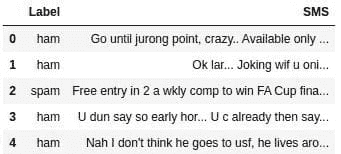

下图显示，大约 87% 的消息是正常邮件（非垃圾邮件），其余 13% 是垃圾邮件。这个样本看起来具有代表性，因为在实际情况中，大多数人收到的消息都是正常邮件。

```py
sms_spam['Label'].value_counts(normalize=True)
```

`ham 0.865937 spam 0.134063 Name: Label, dtype: float64`

### 训练集和测试集

现在我们将把数据集拆分为训练集和测试集。我们将使用 80% 的数据用于训练，剩余的 20% 用于测试。

我们将在拆分数据集之前随机化整个数据集，以确保垃圾邮件和正常邮件在数据集中均匀分布。

```py
# Randomize the dataset
data_randomized = sms_spam.sample(frac=1, random_state=1)

# Calculate index for split
training_test_index = round(len(data_randomized) * 0.8)

# Split into training and test sets
training_set = data_randomized[:training_test_index].reset_index(drop=True)
test_set = data_randomized[training_test_index:].reset_index(drop=True)

print(training_set.shape)
print(test_set.shape)
```

`(4458, 2) (1114, 2)`

我们现在将分析训练集和测试集中垃圾邮件和正常邮件的百分比。我们期望这些百分比接近于我们在完整数据集中看到的情况，其中大约 87%的消息是正常邮件，剩余的 13%是垃圾邮件。

```py
training_set['Label'].value_counts(normalize=True)
```

`ham 0.86541 spam 0.13459 Name: Label, dtype: float64`

```py
test_set['Label'].value_counts(normalize=True)
```

`ham 0.868043 spam 0.131957 Name: Label, dtype: float64`

结果看起来很棒！我们现在将继续清理数据集。

### 数据清理

当有新消息到达时，我们的多项式朴素贝叶斯算法将根据其对以下两个方程的结果进行分类，其中“w[1]”是第一个单词，w[1],w[2], ..., w[n]是整个消息：

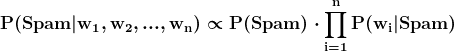

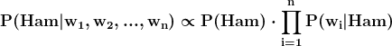

如果 P(Spam | w[1],w[2], ..., w[n]) 大于 P(Ham | w[1],w[2], ..., w[n])，则该消息是垃圾邮件。

要计算 P(w[i]|Spam) 和 P(w[i]|Ham)，我们需要使用单独的方程：

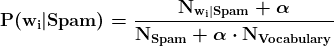

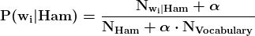

让我们澄清这些方程中的一些术语：

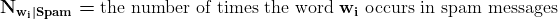

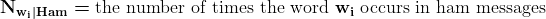

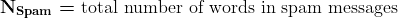

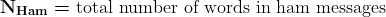

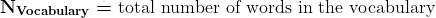

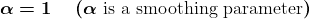

为了计算所有这些概率，我们首先需要进行一些数据清理，将数据转换为一种格式，以便我们可以轻松提取所需的所有信息。目前，我们的训练集和测试集具有以下格式（下面的消息是虚构的，以便示例更易于理解）：

为了简化计算，我们希望将数据转换为这种格式（下表是您上面看到的表格的转换）：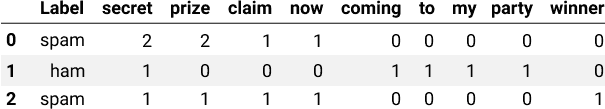在上述转换中注意到：

+   `SMS`列被一系列表示词汇表中唯一单词的新列替代——词汇表是我们所有句子中唯一单词的集合。

+   每一行描述了一个单独的消息。第一行的值是`spam, 2, 2, 1, 1, 0, 0, 0, 0, 0`，这告诉我们：

    +   该消息是垃圾邮件。

    +   单词“secret”在消息中出现了两次。

    +   单词“prize”在消息中出现了两次。

    +   单词“claim”在消息中出现了一次。

    +   单词“now”在消息中出现了一次。

    +   单词“coming”，“to”，“my”，“party”和“winner”在消息中出现了零次。

+   词汇表中的所有单词都是小写的，因此“SECRET”和“secret”被视为同一个单词。

+   原始句子中的单词顺序丢失了。

+   标点符号不再被考虑（例如，我们不能通过查看表格得出第一条消息最初有两个感叹号）。

### 字母大小写和标点符号

让我们通过去除标点符号并将所有单词转换为小写来开始数据清理过程。

```py
# Before cleaning
training_set.head(3)
```

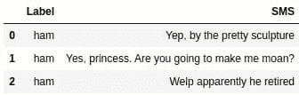

```py
# After cleaning
training_set['SMS'] = training_set['SMS'].str.replace(
   '\W', ' ') # Removes punctuation
training_set['SMS'] = training_set['SMS'].str.lower()
training_set.head(3)
```

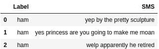

### 创建词汇表

现在让我们创建词汇表，在这个上下文中，词汇表是指包含训练集中所有唯一单词的列表。在下面的代码中：

+   我们通过在空格字符处拆分字符串，将`SMS`列中的每条消息转换为列表 — 我们使用[`Series.str.split()` 方法](https://pandas.pydata.org/pandas-docs/stable/reference/api/pandas.Series.str.split.html)。

+   我们初始化一个名为`vocabulary`的空列表。

+   我们遍历转换后的`SMS`列。

    +   使用嵌套循环，我们遍历`SMS`列中的每条消息，并将每个字符串（单词）追加到`vocabulary`列表中。

+   我们使用[`set()` 函数](https://docs.python.org/3/library/functions.html#func-set)将`vocabulary`列表转换为集合。这将从`vocabulary`列表中去除重复项。

+   我们使用[`list()` 函数](https://docs.python.org/3/library/functions.html#func-list)将`vocabulary`集合转换回列表。

```py
training_set['SMS'] = training_set['SMS'].str.split()

vocabulary = []
for sms in training_set['SMS']:
   for word in sms:
      vocabulary.append(word)

vocabulary = list(set(vocabulary))
```

看起来我们的训练集中的所有消息共有 7,783 个唯一的单词。

```py
len(vocabulary)
```

`7783`

### 最终的训练集

现在我们将使用刚刚创建的词汇表进行我们想要的数据转换。

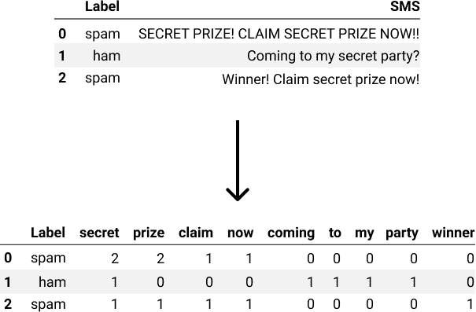最终，我们将创建一个新的 DataFrame。我们首先构建一个字典，然后将其转换为所需的 DataFrame。

例如，要创建我们上面看到的表格，我们可以使用这个字典：

```py
word_counts_per_sms = {'secret': [2,1,1],
                       'prize': [2,0,1],
                       'claim': [1,0,1],
                       'now': [1,0,1],
                       'coming': [0,1,0],
                       'to': [0,1,0],
                       'my': [0,1,0],
                       'party': [0,1,0],
                       'winner': [0,0,1]
                      }

word_counts = pd.DataFrame(word_counts_per_sms)
word_counts.head()
```

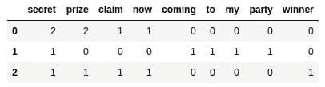

要为我们的训练集创建所需的字典，我们可以使用以下代码：

+   我们首先初始化一个名为`word_counts_per_sms`的字典，其中每个键是词汇表中的唯一单词（字符串），每个值是一个长度与训练集相同的列表，其中列表中的每个元素都是`0`。

    +   代码`[0] * 5`输出`[0, 0, 0, 0, 0]`。因此，代码`[0] * len(training_set['SMS'])`输出一个长度为`training_set['SMS']`的列表。

+   我们使用[`enumerate()` 函数](https://docs.python.org/3/library/functions.html#enumerate)遍历`training_set['SMS']`，以获取索引和短信消息（`index`和`sms`）。

    +   使用嵌套循环，我们遍历`sms`（其中`sms`是一个字符串列表，每个字符串代表消息中的一个单词）。

        +   我们将`word_counts_per_sms[word][index]`的值增加`1`。

```py
word_counts_per_sms = {unique_word: [0] * len(training_set['SMS']) for unique_word in vocabulary}

for index, sms in enumerate(training_set['SMS']):
   for word in sms:
      word_counts_per_sms[word][index] += 1
```

现在我们有了所需的字典，让我们对训练集进行最终的转换。

```py
word_counts = pd.DataFrame(word_counts_per_sms)
word_counts.head()
```

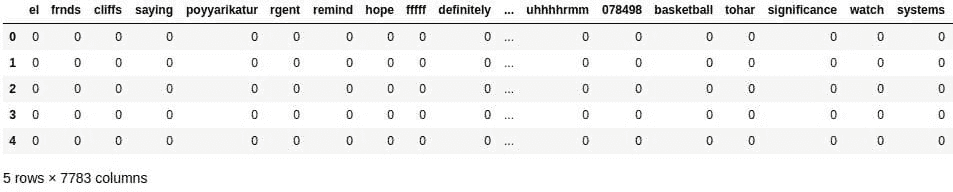

`Label` 列缺失，因此我们将使用 [`pd.concat()` 函数](https://pandas.pydata.org/pandas-docs/stable/reference/api/pandas.concat.html) 将刚构建的 DataFrame 与包含训练集的 DataFrame 连接起来。这样，我们也将拥有 `Label` 和 `SMS` 列。

```py
training_set_clean = pd.concat([training_set, word_counts], axis=1)
training_set_clean.head()
```

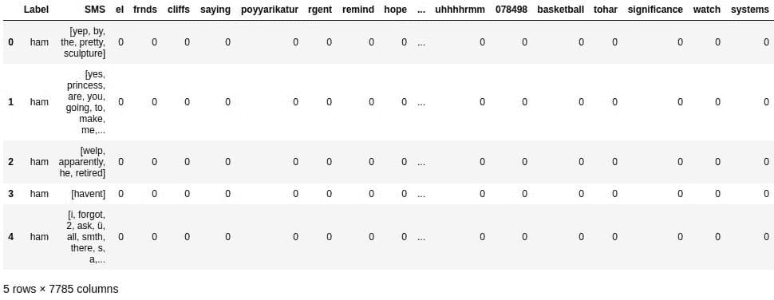

### 首先计算常数

现在我们已经完成了训练集的清理，我们可以开始编码垃圾邮件过滤器。多项式朴素贝叶斯算法需要回答这两个概率问题，以便能够对新消息进行分类：


同样，要在上述公式中计算 P(w[i]|Spam) 和 P(w[i]|Ham)，我们需要使用以下方程：


上述四个方程中的一些项在每个新消息中将具有相同的值。我们可以一次性计算这些项的值，并避免在新消息到来时重新计算。作为开始，我们首先计算：

+   P(Spam) 和 P(Ham)

+   N[Spam]，N[Ham]，N[Vocabulary]

需要注意的是：

+   N[Spam] 等于所有垃圾邮件中的单词总数 —— 它 *不是* 等于垃圾邮件的数量，也 *不是* 等于垃圾邮件中的 *唯一* 单词的总数。

+   N[Ham] 等于所有非垃圾邮件中的单词总数 —— 它 *不是* 等于非垃圾邮件的数量，也 *不是* 等于非垃圾邮件中的 *唯一* 单词的总数。

我们还将使用拉普拉斯平滑，并设置 。

```py
# Isolating spam and ham messages first
spam_messages = training_set_clean[training_set_clean['Label'] == 'spam']
ham_messages = training_set_clean[training_set_clean['Label'] == 'ham']

# P(Spam) and P(Ham)
p_spam = len(spam_messages) / len(training_set_clean)
p_ham = len(ham_messages) / len(training_set_clean)

# N_Spam
n_words_per_spam_message = spam_messages['SMS'].apply(len)
n_spam = n_words_per_spam_message.sum()

# N_Ham
n_words_per_ham_message = ham_messages['SMS'].apply(len)
n_ham = n_words_per_ham_message.sum()

# N_Vocabulary
n_vocabulary = len(vocabulary)

# Laplace smoothing
alpha = 1
```

### 计算参数

现在我们已经计算了常数项，我们可以继续计算参数 P(w[i]|Spam)和 P(w[i]|Ham)。

P(w[i]|Spam) 和 P(w[i]|Ham) 会根据具体的单词而变化。例如，P("secret"|Spam) 会有一个特定的概率值，而 P("cousin"|Spam) 或 P("lovely"|Spam) 可能会有其他值。

因此，每个参数将是与词汇表中每个单词相关的条件概率值。

参数是使用以下两个方程计算的：


```py
# Initiate parameters
parameters_spam = {unique_word:0 for unique_word in vocabulary}
parameters_ham = {unique_word:0 for unique_word in vocabulary}

# Calculate parameters
for word in vocabulary:
   n_word_given_spam = spam_messages[word].sum() # spam_messages already defined
   p_word_given_spam = (n_word_given_spam + alpha) / (n_spam + alpha*n_vocabulary)
   parameters_spam[word] = p_word_given_spam

   n_word_given_ham = ham_messages[word].sum() # ham_messages already defined
   p_word_given_ham = (n_word_given_ham + alpha) / (n_ham + alpha*n_vocabulary)
   parameters_ham[word] = p_word_given_ham
```

### 分类新消息

现在我们已经计算了所有参数，可以开始创建垃圾邮件过滤器。垃圾邮件过滤器被理解为一个函数，它：

+   输入一个新消息 (w[1], w[2], ..., w[n])。

+   计算 P(Spam|w[1], w[2], ..., w[n]) 和 P(Ham|w[1], w[2], ..., w[n])。

+   比较 P(Spam|w[1], w[2], ..., w[n]) 和 P(Ham|w[1], w[2], ..., w[n]) 的值，并且：

    +   如果 P(Ham|w[1], w[2], ..., w[n]) > P(Spam|w[1], w[2], ..., w[n])，则该消息被分类为 ham。

    +   如果 P(Ham|w[1], w[2], ..., w[n]) < P(Spam|w[1], w[2], ..., w[n])，则将消息分类为垃圾邮件。

    +   如果 P(Ham|w[1], w[2], ..., w[n]) = P(Spam|w[1], w[2], ..., w[n])，则算法可能会请求人工帮助。

请注意，一些新消息将包含不在词汇表中的词汇。我们在计算概率时将简单地忽略这些词汇。

让我们开始编写该函数的第一个版本。对于下面的`classify()`函数，请注意：

+   输入变量`message`需要是一个字符串。

+   我们对字符串`message`进行一些数据清理：

    +   我们使用[`re.sub()`函数](https://docs.python.org/3/library/re.html#re.sub)去除标点符号。

    +   我们使用[`str.lower()`方法](https://docs.python.org/3/library/stdtypes.html#str.lower)将所有字母转换为小写。

    +   我们在空格字符处分割字符串，并使用[`str.split()`方法](https://docs.python.org/3/library/stdtypes.html#str.split)将其转换为 Python 列表。

+   我们计算`p_spam_given_message`和`p_ham_given_message`。

+   我们将`p_spam_given_message`与`p_ham_given_message`进行比较，然后打印分类标签。

```py
import re

def classify(message):
   '''
   message: a string
   '''

   message = re.sub('\W', ' ', message)
   message = message.lower().split()

   p_spam_given_message = p_spam
   p_ham_given_message = p_ham

   for word in message:
      if word in parameters_spam:
         p_spam_given_message *= parameters_spam[word]

      if word in parameters_ham: 
         p_ham_given_message *= parameters_ham[word]

   print('P(Spam|message):', p_spam_given_message)
   print('P(Ham|message):', p_ham_given_message)

   if p_ham_given_message > p_spam_given_message:
      print('Label: Ham')
   elif p_ham_given_message < p_spam_given_message:
      print('Label: Spam')
   else:
      print('Equal proabilities, have a human classify this!')
```

我们现在将测试垃圾邮件过滤器在两个新消息上的效果。一个消息显然是垃圾邮件，另一个则显然是正常邮件。

```py
classify('WINNER!! This is the secret code to unlock the money: C3421.')
```

`P(Spam|message): 1.3481290211300841e-25 P(Ham|message): 1.9368049028589875e-27 Label: Spam`

```py
classify("Sounds good, Tom, then see u there")
```

`P(Spam|message): 2.4372375665888117e-25 P(Ham|message): 3.687530435009238e-21 Label: Ham`

### 测量垃圾邮件过滤器的准确性

这两个结果看起来很有前景，但让我们看看过滤器在我们的测试集上的表现如何，该测试集包含 1,114 条消息。

我们将从编写一个返回分类标签而不是打印它们的函数开始。

```py
def classify_test_set(message):
   '''
   message: a string
   '''

   message = re.sub('\W', ' ', message)
   message = message.lower().split()

   p_spam_given_message = p_spam
   p_ham_given_message = p_ham

   for word in message:
      if word in parameters_spam:
         p_spam_given_message *= parameters_spam[word]

      if word in parameters_ham:
         p_ham_given_message *= parameters_ham[word]

   if p_ham_given_message > p_spam_given_message:
      return 'ham'
   elif p_spam_given_message > p_ham_given_message:
      return 'spam'
   else:
      return 'needs human classification'
```

现在我们有一个返回标签的函数而不是打印它们，我们可以用它来在测试集上创建一个新列。

```py
test_set['predicted'] = test_set['SMS'].apply(classify_test_set)
test_set.head()
```

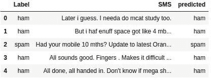

我们可以将预测值与实际值进行比较，以测量我们的垃圾邮件过滤器对新消息的分类效果。为了进行测量，我们将使用**准确率**作为指标：

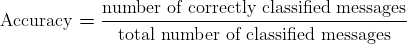

```py
correct = 0
total = test_set.shape[0]

for row in test_set.iterrows():
   row = row[1]
   if row['Label'] == row['predicted']:
      correct += 1

print('Correct:', correct)
print('Incorrect:', total - correct)
print('Accuracy:', correct/total)
```

`Correct: 1100 Incorrect: 14 Accuracy: 0.9874326750448833`

准确率接近 98.74%，这非常好。我们的垃圾邮件过滤器对 1,114 条在训练中未见过的消息进行了分类，其中 1,100 条分类正确。

### 下一步

在这篇博客文章中，我们成功地用多项式朴素贝叶斯算法编写了一个短信垃圾邮件过滤器。该过滤器在我们使用的测试集上的准确率为 98.74%，这是一个很有前景的结果。我们的初步目标是超过 80%的准确率，并且我们成功实现了这一点。

接下来的步骤包括：

+   分析 14 条被错误分类的消息，并尝试找出算法为何将其错误分类的原因

+   通过使算法对字母大小写敏感来使过滤过程更复杂

**个人简介: [亚历克斯·奥尔特亚努](https://www.linkedin.com/in/alex-olteanu-92b174116/)** 是 Dataquest 的数据科学家。

**相关内容:**

+   概率学习：贝叶斯定理

+   朴素贝叶斯算法：你需要知道的一切

+   概率学习：朴素贝叶斯

### 更多相关主题

+   [KDnuggets 新闻，4 月 13 日：数据科学家应该了解的 Python 库…](https://www.kdnuggets.com/2022/n15.html)

+   [高斯朴素贝叶斯，解析](https://www.kdnuggets.com/2023/03/gaussian-naive-bayes-explained.html)

+   [朴素贝叶斯算法：你需要知道的一切](https://www.kdnuggets.com/2020/06/naive-bayes-algorithm-everything.html)

+   [如何使用 Python 筛选数据](https://www.kdnuggets.com/2022/02/filter-data-python.html)

+   [你可能不知道的 4 个 Python Itertools 筛选函数](https://www.kdnuggets.com/2023/08/4-python-itertools-filter-functions-probably-didnt-know.html)

+   [理解贝叶斯定理的 3 种方法将提升你的数据科学技能](https://www.kdnuggets.com/2022/06/3-ways-understanding-bayes-theorem-improve-data-science.html)
