# 如何使用 Modin 加速 Pandas

> 原文：[`www.kdnuggets.com/2021/03/speed-up-pandas-modin.html`](https://www.kdnuggets.com/2021/03/speed-up-pandas-modin.html)

评论

**由[Michael Galarnyk](https://www.linkedin.com/in/michaelgalarnyk/)提供，Anyscale 的开发者关系**

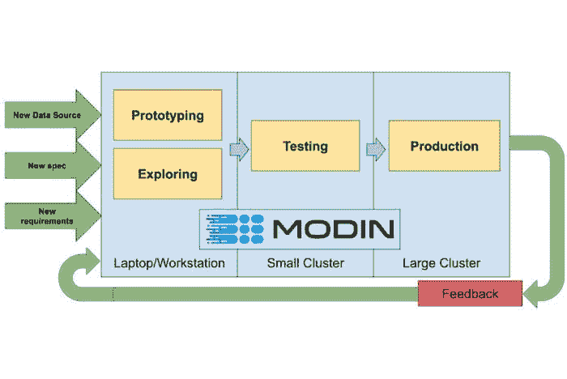

Modin 的一个目标是让数据科学家可以对小型（千字节）和大型数据集（泰字节）使用相同的代码。图片由[Devin Petersohn](https://towardsdatascience.com/the-modin-view-of-scaling-pandas-825215533122)提供。

* * *

## 我们的前 3 个课程推荐

 1. [Google 网络安全证书](https://www.kdnuggets.com/google-cybersecurity) - 快速进入网络安全职业。

 2. [Google 数据分析专业证书](https://www.kdnuggets.com/google-data-analytics) - 提升你的数据分析水平

 3. [Google IT 支持专业证书](https://www.kdnuggets.com/google-itsupport) - 支持你的组织的 IT

* * *

pandas 库提供了易于使用的数据结构，如 pandas DataFrames 以及数据分析工具。pandas 的一个问题是，它在处理大量数据时可能较慢。它[并非设计用于分析 100 GB 或 1 TB 的数据集](https://wesmckinney.com/blog/apache-arrow-pandas-internals/)。幸运的是，存在[Modin](https://github.com/modin-project/modin)库，它具备了通过更改一行代码来扩展 pandas 工作流程的能力，并与 Python 生态系统和[Ray](https://github.com/ray-project/ray)集群集成。此教程介绍了如何开始使用 Modin 以及它如何加速你的 pandas 工作流程。

### 如何开始使用 Modin

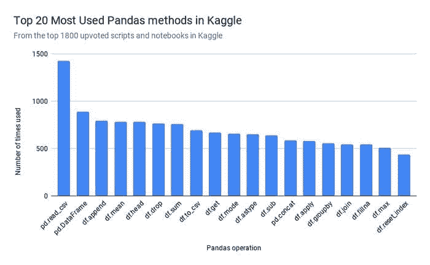

为了确定优先在 Modin 中实现哪些 Pandas 方法，Modin 的开发者抓取了 1800 个最受欢迎的 Python Kaggle Kernels（[代码](https://github.com/adgirish/kaggleScape)）。

Modin 对 pandas API 的覆盖率超过 90%，重点关注最常用的 pandas 方法，如 pd.read_csv、pd.DataFrame、df.fillna 和 df.groupby。这意味着如果你有大量数据，你可以更快地执行大多数与 pandas 库相同的操作。本节重点介绍一些常用的操作。

要开始使用，你需要安装 modin。

```py
pip install “modin[all]” # Install Modin dependencies and modin’s execution engines
```

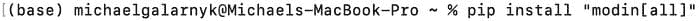

pip 安装时别忘了“”

### 导入 Modin

Modin 的一个主要优势是它不需要你学习新的 API。你只需更改你的导入语句。

```py
import modin.pandas as pd
```


你只需更改你的导入语句以使用 Modin。

### 加载数据（read_csv）

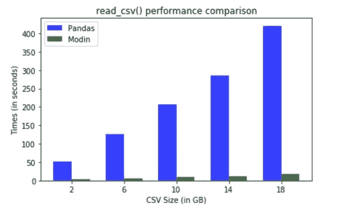

Modin 在处理较大的数据集时表现尤为出色 ([图像来源](https://github.com/devin-petersohn/presentations/tree/master/pydata_ny_2018))

本教程使用的数据集来自于 [健康保险市场](https://www.kaggle.com/hhs/health-insurance-marketplace?select=Rate.csv) 数据集，约 2GB。下面的代码将数据读取到 Modin DataFrame 中。

```py
modin_df = pd.read_csv("Rate.csv”)
```

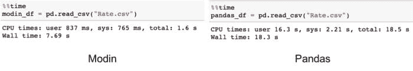

在这种情况下，由于 Modin 将工作转移到主线程之外以实现异步处理，因此速度更快。文件是并行读取的。性能提升的很大一部分来自于异步构建 DataFrame 组件。

**head**

下面的代码使用了 head 命令。

```py
# Select top N number of records (default = 5)
modin_df.head()
```

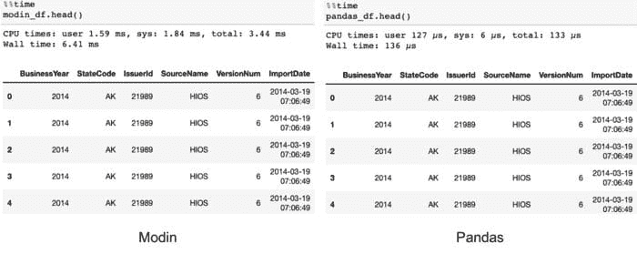

在这种情况下，Modin 的速度较慢，因为它需要将数据汇总在一起。然而，用户在交互式工作流中不应能察觉到这种差异。

**groupby**

类似于 Pandas，Modin 也具有 groupby 操作。

```py
df.groupby(['StateCode’]).count()
```

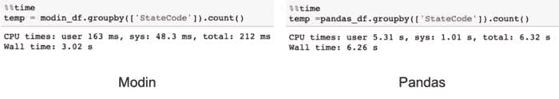

请注意，计划进一步优化 Modin 中 groupby 操作的性能。

**fillna**

使用 fillna 方法填充缺失值在 Modin 中可以更快。

```py
modin_df.fillna({‘IndividualTobaccoRate’: ‘Unknown’})
```

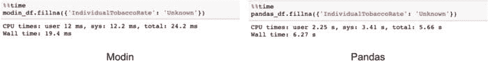

### 默认使用 Pandas 实现

如前所述，Modin 的 API 涵盖了 Pandas API 的大约 90%。对于尚未覆盖的方法，Modin 将默认使用 Pandas 实现，如下面的代码所示。

```py
modin_df.corr(method = ‘kendall’)
```


当 Modin 默认使用 Pandas 时，你会看到一个警告。

尽管默认使用 Pandas 会有性能损失，但无论命令是否在 Modin 中实现，Modin 都会完成所有操作。

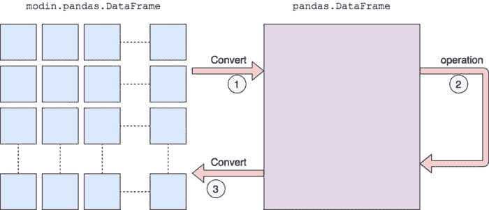

如果某个方法未实现，它将默认使用 Pandas。

[Modin 的文档](https://modin.readthedocs.io/en/latest/supported_apis/index.html) 解释了这一过程的工作原理。

*我们首先将其转换为 Pandas DataFrame，然后执行操作。从分区的 Modin DataFrame 转换到 Pandas 会有性能损失，因为涉及通信成本和 Pandas 的单线程特性。一旦 Pandas 操作完成，我们会将 DataFrame 转换回分区的 Modin DataFrame。这样，默认使用 Pandas 之后执行的操作将会得到 Modin 的优化。*

### Modin 如何加速你的 Pandas 工作流

Modin 使 Pandas 工作流更快的三种主要方式是通过其多核/多节点支持、系统架构和易用性。

### 多核/多节点支持


Pandas 只能利用单核，而 Modin 能够有效地利用所有可用的硬件。图像展示了 Modin 可以利用的资源（深蓝色），这些资源具有多个核心（B）和可用的多个节点（C）。

pandas 库只能利用一个核心。由于今天几乎所有计算机都有多个核心，因此通过让 Modin 利用计算机上的所有核心，可以大大加快你的 pandas 工作流程。


在本文中，你可以将上面的 MacBook 视为一个具有 4 个核心的单节点。

如果你希望将代码扩展到超过 1 个节点，[Modin 提供了一个用于在本地和云提供商/集群之间切换的 API](https://towardsdatascience.com/the-modin-view-of-scaling-pandas-825215533122)。

### 系统架构

Modin 比 pandas 更快的另一个原因是 pandas 自身的实现方式。pandas 的创造者 Wes McKinney 发表了一个著名的演讲“[10 Things I Hate about Pandas](https://www.slideshare.net/wesm/practical-medium-data-analytics-with-python)”，讨论了 pandas 的一些灵活性和性能问题。

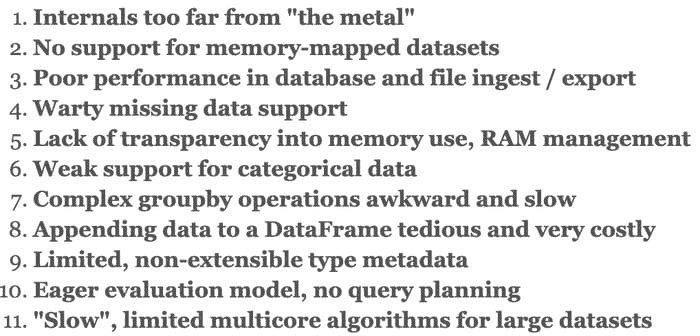

Wes McKinney 对 pandas 的一些问题与性能有关。

Modin 努力解决这些问题。要了解其方法，重要的是理解一些[系统架构](https://modin.readthedocs.io/en/latest/developer/architecture.html#query-compiler)。下图概述了 Modin 组件的一般分层视图及每个主要部分的简要描述。

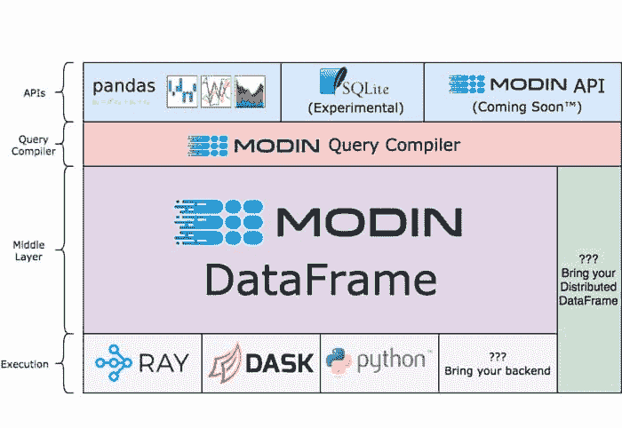

Modin 的系统架构

[API 层](https://modin.readthedocs.io/en/latest/developer/architecture.html#api)：这是面向用户的层，主要是 Modin 对 pandas API 的覆盖。SQLite API 处于实验阶段，Modin API 仍在设计中。

Modin 查询编译器：[除了其他职责](https://modin.readthedocs.io/en/latest/developer/architecture.html#query-compiler)，查询编译器层紧密遵循 pandas API，但去除了大多数重复。

[Modin DataFrame 层](https://modin.readthedocs.io/en/latest/developer/architecture.html#modin-dataframe)：这是 Modin 优化的数据帧代数发生的地方。

执行：虽然 Modin 也支持像 Dask 这样的其他执行引擎，但最常用的执行引擎是 [Ray](https://github.com/ray-project/ray)，你可以在下一节中了解更多。

### 什么是 Ray


Ray 使并行和分布式处理的工作更接近你的期望（[图片来源](https://www.reddit.com/r/aww/comments/2oagj8/multithreaded_programming_theory_and_practice/)）。

Ray 是 Modin 的默认执行引擎。本节简要介绍了 Ray 是什么以及它如何作为不止是执行引擎来使用。

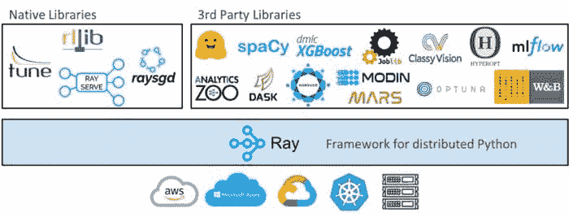

上面的图表显示，从高层次来看，Ray 生态系统由核心 Ray 系统和用于数据科学的可扩展库组成，如 [Modin](https://github.com/modin-project/modin)。它是一个用于 [扩展 Python 应用程序](https://towardsdatascience.com/modern-parallel-and-distributed-python-a-quick-tutorial-on-ray-99f8d70369b8) 的库，能够在多个核心或机器上运行。它有几个主要优势，包括：

+   简单性：你可以在不重写代码的情况下扩展你的 Python 应用程序，并且相同的代码可以在一台机器上或多台机器上运行。

+   鲁棒性：应用程序能够优雅地处理机器故障和抢占。

+   [性能](https://towardsdatascience.com/10x-faster-parallel-python-without-python-multiprocessing-e5017c93cce1)：任务以毫秒级延迟运行，扩展到数万个核心，并且以最小的序列化开销处理数值数据。

由于 Ray 是一个通用框架，社区在其基础上构建了许多库和框架，以完成不同的任务，如 [Ray Tune](https://docs.ray.io/en/master/tune/index.html) 用于各种规模的超参数调优，[Ray Serve](https://docs.ray.io/en/master/serve/) 用于易于使用的可扩展模型服务，以及 [RLlib](https://docs.ray.io/en/master/rllib.html) 用于强化学习。它还具有 [与 scikit-learn 等机器学习库的集成](https://medium.com/distributed-computing-with-ray/how-to-speed-up-scikit-learn-model-training-aaf17e2d1e1) 以及对 [数据处理库如 PySpark 和 Dask 的支持](https://medium.com/distributed-computing-with-ray/data-processing-support-in-ray-ae8da34dce7e)。

虽然你不需要学习如何使用 Ray 来使用 Modin，但下面的图像显示，通常只需添加几行代码就能将一个简单的 Python 程序转换为在计算集群上运行的分布式程序。

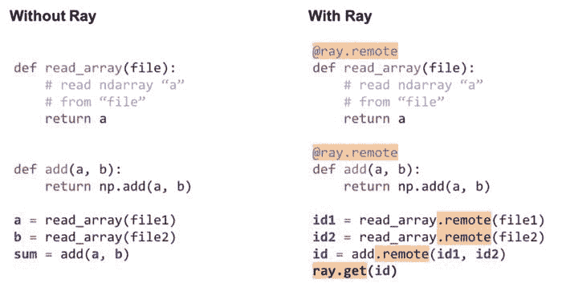

如何使用 Ray 将一个简单的程序转换为分布式程序的示例（[代码说明](https://youtu.be/zRaWCFJcagI?t=754)）。

### 结论

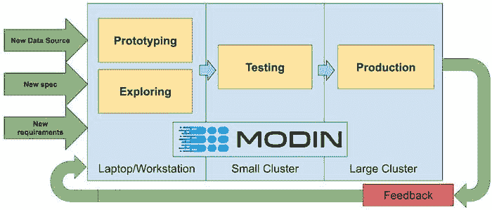

Modin 的一个目标是允许数据科学家使用相同的代码来处理小（千字节）和大（千兆字节）数据集。图片来自 [Devin Petersohn](https://towardsdatascience.com/the-modin-view-of-scaling-pandas-825215533122)。

Modin 允许你使用相同的 Pandas 脚本来处理笔记本电脑上的 10KB 数据集以及集群上的 10TB 数据集。这得益于 Modin 易于使用的 API 和系统架构。这一架构能够利用 Ray 作为执行引擎，使得扩展 Modin 更加简单。如果你对 Ray 有任何问题或想法，请随时通过 [Discourse](https://discuss.ray.io/) 或 [Slack](https://docs.google.com/forms/d/e/1FAIpQLSfAcoiLCHOguOm8e7Jnn-JJdZaCxPGjgVCvFijHB5PLaQLeig/viewform) 加入我们的社区。

**简介：[Michael Galarnyk](https://www.linkedin.com/in/michaelgalarnyk/)** 在 Anyscale 从事开发者关系工作，Anyscale 是 [Ray 项目](https://github.com/ray-project/ray) 的背后公司。你可以在 [Twitter](https://twitter.com/GalarnykMichael)、[Medium](https://medium.com/@GalarnykMichael) 和 [GitHub](https://github.com/mGalarnyk) 找到他。

[原文](https://www.anyscale.com/blog/how-to-speed-up-pandas-with-modin)。经许可转载。

**相关：**

+   使用 PyTorch 和 Ray 开始分布式机器学习

+   将 sklearn 训练速度提高 100 倍

+   如何加速 Scikit-Learn 模型训练

### 更多相关内容

+   [如何将 Python Pandas 的速度提升超过 300 倍](https://www.kdnuggets.com/how-to-speed-up-python-pandas-by-over-300x)

+   [如何加速 XGBoost 模型训练](https://www.kdnuggets.com/2021/12/speed-xgboost-model-training.html)

+   [使用快速克里金法（FKR）加速机器学习](https://www.kdnuggets.com/2022/06/vmc-speed-machine-learning-fast-kriging.html)

+   [加速你的 Python 代码的 3 种简单方法](https://www.kdnuggets.com/2022/10/3-simple-ways-speed-python-code.html)

+   [如何使用索引加速 SQL 查询 [Python 版]](https://www.kdnuggets.com/2023/08/speed-sql-queries-indexes-python-edition.html)

+   [3 种基于研究的高级提示技术提高 LLM 效率…](https://www.kdnuggets.com/3-research-driven-advanced-prompting-techniques-for-llm-efficiency-and-speed-optimization)
