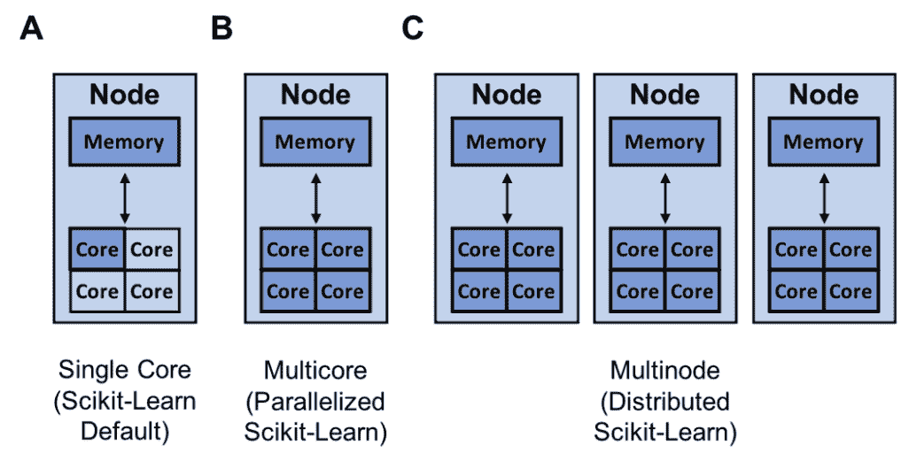
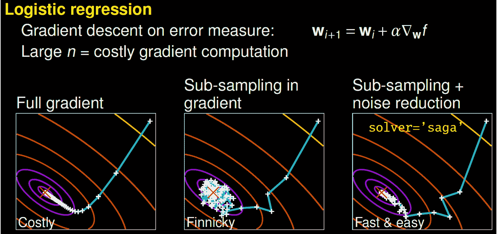
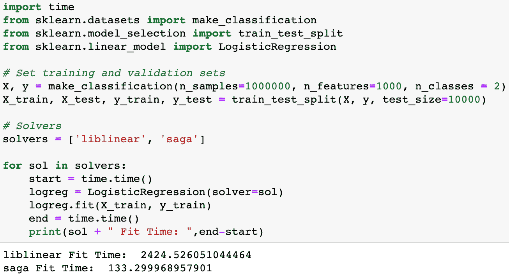
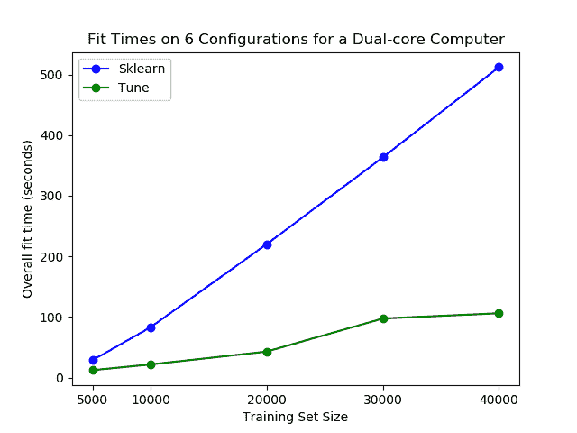
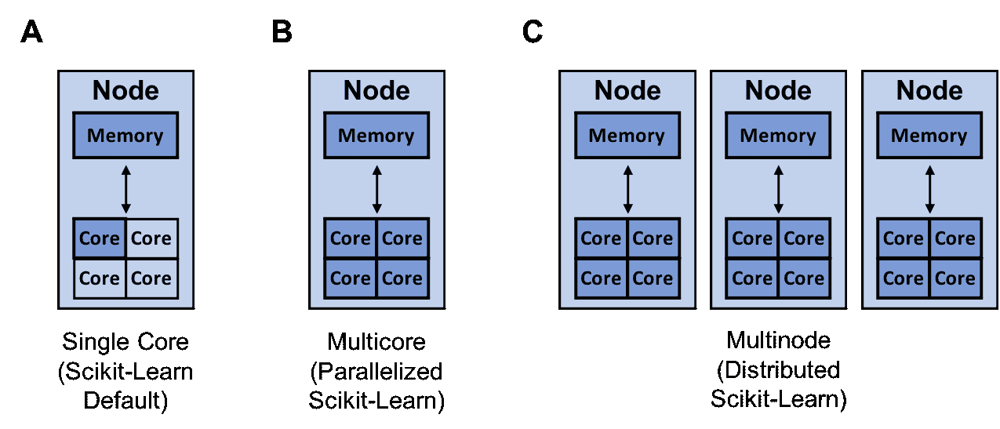
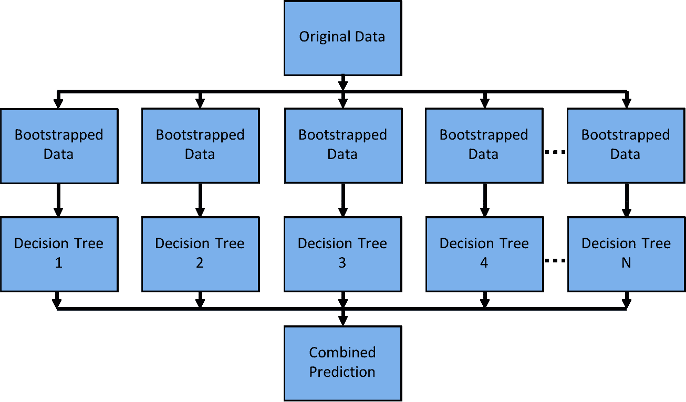
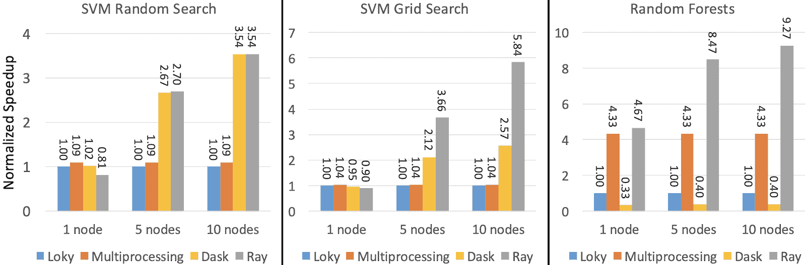

# 如何加速 Scikit-Learn 模型训练

> 原文：[`www.kdnuggets.com/2021/02/speed-up-scikit-learn-model-training.html`](https://www.kdnuggets.com/2021/02/speed-up-scikit-learn-model-training.html)

评论

**作者：[Michael Galarnyk](https://www.linkedin.com/in/michaelgalarnyk/)，Anyscale 的开发者关系**

scikit-learn 可以利用的资源（深蓝色），用于单核（A），多核（B）和多节点训练（C）

Scikit-Learn 是一个易于使用的 Python 机器学习库。然而，有时候 scikit-learn 模型的训练可能需要很长时间。问题是，如何在最短时间内创建最佳的 scikit-learn 模型？解决这个问题的方法有很多，比如：

+   更换你的优化函数（求解器）

+   使用不同的超参数优化技术（网格搜索，随机搜索，早停）

+   使用[joblib](https://joblib.readthedocs.io/en/latest/)和[Ray](https://docs.ray.io/en/master/index.html)并行或分布你的训练

这篇文章概述了每种方法，讨论了一些局限性，并提供了加速机器学习工作流程的资源！

### 更换你的优化算法（求解器）

一些求解器可能需要更长的时间来收敛。图片来源于[Gaël Varoquaux 的演讲](https://youtu.be/1s8RzWwMdqg?t=671)。

更好的算法让你能更好地利用相同的硬件。通过更高效的算法，你可以更快地产生最优模型。一种方法是更换你的优化算法（求解器）。例如，[scikit-learn 的逻辑回归](https://scikit-learn.org/stable/modules/generated/sklearn.linear_model.LogisticRegression.html)允许你选择‘newton-cg’，‘lbfgs’，‘liblinear’，‘sag’，和‘saga’等求解器。

为了理解不同求解器的工作原理，我建议你观看由 scikit-learn 核心贡献者[Gaël Varoquaux](https://youtu.be/1s8RzWwMdqg?t=671)的演讲。用他的话来说，一个完整的梯度算法（liblinear）收敛速度快，但每次迭代（以白色+表示）可能非常昂贵，因为它需要使用所有的数据。在一个子采样的方法中，每次迭代计算便宜，但收敛速度可能会慢得多。一些算法如‘saga’实现了两者的最佳结合。每次迭代计算便宜，而且由于方差减少技术，算法收敛迅速。重要的是要注意，[快速收敛在实践中并不总是重要](https://leon.bottou.org/publications/pdf/nips-2007.pdf)，不同的求解器适用于不同的问题。

为问题选择合适的求解器可以节省大量时间（[代码示例](https://gist.github.com/mGalarnyk/f42f434fc162be108a3bb5bc36464a59)）。

要确定哪个求解器适合你的问题，你可以查看 [文档](https://scikit-learn.org/stable/modules/linear_model.html) 以了解更多信息！

### 不同的超参数优化技术（网格搜索、随机搜索、早停）

为了实现大多数 scikit-learn 算法的高性能，你需要调整模型的超参数。超参数是模型的参数，在训练过程中不会更新。它们可以用于配置模型或训练函数。Scikit-Learn 本身包含了一些 [超参数调整技术](https://scikit-learn.org/stable/modules/grid_search.html)，如网格搜索（[GridSearchCV](https://scikit-learn.org/stable/modules/generated/sklearn.model_selection.GridSearchCV.html#sklearn.model_selection.GridSearchCV)），它详尽地考虑了所有参数组合，以及 [随机搜索](https://www.jmlr.org/papers/volume13/bergstra12a/bergstra12a.pdf)（[RandomizedSearchCV](https://scikit-learn.org/stable/modules/generated/sklearn.model_selection.RandomizedSearchCV.html#sklearn.model_selection.RandomizedSearchCV)），它从具有指定分布的参数空间中抽取给定数量的候选。最近，scikit-learn 增加了实验性的超参数搜索估计器：缩减网格搜索（[HalvingGridSearchCV](https://scikit-learn.org/stable/modules/generated/sklearn.model_selection.HalvingGridSearchCV.html#sklearn.model_selection.HalvingGridSearchCV)）和缩减随机搜索（[HalvingRandomSearch](https://scikit-learn.org/stable/modules/generated/sklearn.model_selection.HalvingRandomSearchCV.html#sklearn.model_selection.HalvingRandomSearchCV)）。

逐步缩减是 scikit-learn 版本 0.24.1（2021 年 1 月）中的一个实验性新功能。图像来自 [文档](https://scikit-learn.org/stable/modules/grid_search.html#searching-for-optimal-parameters-with-successive-halving)。

这些技术可以用于通过 [逐步缩减](https://scikit-learn.org/stable/modules/grid_search.html#searching-for-optimal-parameters-with-successive-halving) 来搜索参数空间。上面的图像显示了所有超参数候选在第一次迭代时用少量资源进行评估，之后更有前景的候选被选择，并在每次迭代中分配更多资源。

虽然这些新技术很令人兴奋，但有一个名为 [Tune-sklearn](https://github.com/ray-project/tune-sklearn) 的库提供了前沿的超参数调整技术（贝叶斯优化、早停和分布式执行），这些技术相比网格搜索和随机搜索能够显著提高速度。

早停法的实际应用。超参数集 2 是一组不太有前景的超参数，它们会被 Tune-sklearn 的早停机制检测到，并提前停止以避免浪费时间和资源。图片来自 [GridSearchCV 2.0](https://medium.com/distributed-computing-with-ray/gridsearchcv-2-0-new-and-improved-ee56644cbabf)。

[Tune-sklearn](https://github.com/ray-project/tune-sklearn) 的特性包括：

+   与 scikit-learn API 的一致性：通常只需修改几行代码即可使用 Tune-sklearn ([示例](https://github.com/ray-project/tune-sklearn/blob/master/examples/random_forest.py))。

+   现代超参数调优技术的可访问性：可以轻松修改代码以利用诸如贝叶斯优化、早停法和分布式执行等技术

+   框架支持：不仅支持 scikit-learn 模型，还支持其他 scikit-learn 包装器，如 [Skorch (PyTorch)](https://github.com/ray-project/tune-sklearn/blob/master/examples/torch_nn.py)、[KerasClassifiers (Keras)](https://github.com/ray-project/tune-sklearn/blob/master/examples/keras_example.py) 和 [XGBoostClassifiers (XGBoost)](https://github.com/ray-project/tune-sklearn/blob/master/examples/xgbclassifier.py)。

+   可扩展性：该库利用了 [Ray Tune](https://docs.ray.io/en/master/tune/index.html)——一个用于分布式超参数调优的库，以高效且透明的方式在多个核心甚至多台机器上并行化交叉验证。

也许最重要的是，`tune-sklearn` 的速度如下面的图片所示。

你可以在普通笔记本电脑上看到使用 tune-sklearn 的显著性能差异。图片来自 [GridSearchCV 2.0](https://medium.com/distributed-computing-with-ray/gridsearchcv-2-0-new-and-improved-ee56644cbabf)。

如果你想了解更多关于 tune-sklearn 的信息，可以查看这篇 [博客文章](https://medium.com/distributed-computing-with-ray/gridsearchcv-2-0-new-and-improved-ee56644cbabf)。

### 使用 `joblib` 和 `Ray` 进行训练的并行化或分布式处理

scikit-learn 可以利用的资源（深蓝色）用于单核心（A）、多核心（B）和多节点训练（C）

另一种提高模型构建速度的方法是通过 [joblib](https://joblib.readthedocs.io/en/latest/) 和 [Ray](https://docs.ray.io/en/master/index.html) 实现训练的并行化或分布式处理。默认情况下，scikit-learn 使用单个核心训练模型。需要注意的是，今天几乎所有的计算机都有多个核心。

就本博客而言，你可以将上面的 MacBook 视为一个具有 4 个核心的单节点。

因此，通过利用计算机上的所有核心，你可以大大加速模型的训练。如果你的模型具有较高的并行度，如随机森林®，这尤其适用。

随机森林® 是一个容易并行化的模型，因为每棵决策树相互独立。

Scikit-Learn 可以通过[joblib，默认使用‘loky’后端](https://joblib.readthedocs.io/en/latest/parallel.html)来并行化单节点上的训练。Joblib 允许你在‘loky’、‘multiprocessing’、‘dask’和‘ray’等后端之间进行选择。这是一个很好的功能，因为‘loky’后端是[为单节点优化的，而不是为运行分布式（多节点）应用程序优化的](https://scikit-learn.org/stable/modules/generated/sklearn.utils.parallel_backend.html)。运行分布式应用程序可能引入许多复杂性，例如：

+   在多台机器上调度任务

+   高效地转移数据

+   从机器故障中恢复

幸运的是，[‘ray’后端](https://docs.ray.io/en/master/joblib.html)可以为你处理这些细节，保持简单，并提供更好的性能。下图显示了 Ray、Multiprocessing 和 Dask 相对于默认‘loky’后端的规范化加速。

性能在每个 32 核心的一个、五个和十个 m5.8xlarge 节点上进行测量。Loky 和 Multiprocessing 的性能不依赖于机器数量，因为它们在单台机器上运行。[图片来源](https://medium.com/distributed-computing-with-ray/easy-distributed-scikit-learn-training-with-ray-54ff8b643b33)。

如果你想了解如何快速并行化或分布式你的 scikit-learn 训练，你可以查看这篇[博客文章](https://medium.com/distributed-computing-with-ray/easy-distributed-scikit-learn-training-with-ray-54ff8b643b33)。

### 结论

本文介绍了几种方法，你可以在最短时间内构建出最佳的 scikit-learn 模型。其中一些方法是 scikit-learn 本身提供的，比如更改优化函数（求解器），或使用实验性的超参数优化技术，如 [HalvingGridSearchCV](https://scikit-learn.org/stable/modules/generated/sklearn.model_selection.HalvingGridSearchCV.html#sklearn.model_selection.HalvingGridSearchCV) 或 [HalvingRandomSearch](https://scikit-learn.org/stable/modules/generated/sklearn.model_selection.HalvingRandomSearchCV.html#sklearn.model_selection.HalvingRandomSearchCV)。你还可以使用如 [Tune-sklearn](https://github.com/ray-project/tune-sklearn) 和 [Ray](https://github.com/ray-project/ray) 的库作为插件，进一步加快模型构建速度。如果你对 Tune-sklearn 和 Ray 有任何问题或想法，请随时通过 [Discourse](https://discuss.ray.io/) 或 [Slack](https://docs.google.com/forms/d/e/1FAIpQLSfAcoiLCHOguOm8e7Jnn-JJdZaCxPGjgVCvFijHB5PLaQLeig/viewform) 加入我们的社区。

**个人简介：[Michael Galarnyk](https://www.linkedin.com/in/michaelgalarnyk/)** 在 Anyscale 担任开发者关系职位，该公司是 [Ray 项目](https://github.com/ray-project/ray) 的背后团队。你可以在 [Twitter](https://twitter.com/GalarnykMichael)、[Medium](https://medium.com/@GalarnykMichael) 和 [GitHub](https://github.com/mGalarnyk) 上找到他。

[原文](https://medium.com/distributed-computing-with-ray/how-to-speed-up-scikit-learn-model-training-aaf17e2d1e1)。经授权转载。

**相关内容：**

+   终极 Scikit-Learn 机器学习备忘单

+   Python 列表和列表操作

+   K-Means 比 Scikit-learn 快 8 倍，误差低 27 倍，仅需 25 行代码

* * *

## 我们的前三课程推荐

 1\. [Google 网络安全证书](https://www.kdnuggets.com/google-cybersecurity) - 快速进入网络安全职业道路

 2\. [Google 数据分析专业证书](https://www.kdnuggets.com/google-data-analytics) - 提升你的数据分析技能

 3\. [Google IT 支持专业证书](https://www.kdnuggets.com/google-itsupport) - 支持你的组织进行 IT 工作

* * *

### 更多相关内容

+   [如何加速 XGBoost 模型训练](https://www.kdnuggets.com/2021/12/speed-xgboost-model-training.html)

+   [如何使用合成数据克服机器学习模型训练中的数据短缺](https://www.kdnuggets.com/2022/03/synthetic-data-overcome-data-shortages-machine-learning-model-training.html)

+   [通过快速克里金插值（FKR）加速机器学习](https://www.kdnuggets.com/2022/06/vmc-speed-machine-learning-fast-kriging.html)

+   [加速你的 Python 代码的 3 种简单方法](https://www.kdnuggets.com/2022/10/3-simple-ways-speed-python-code.html)

+   [如何通过索引加速 SQL 查询 [Python 版]](https://www.kdnuggets.com/2023/08/speed-sql-queries-indexes-python-edition.html)

+   [3 种基于研究的高级提示技巧，提高 LLM 效率…](https://www.kdnuggets.com/3-research-driven-advanced-prompting-techniques-for-llm-efficiency-and-speed-optimization)
