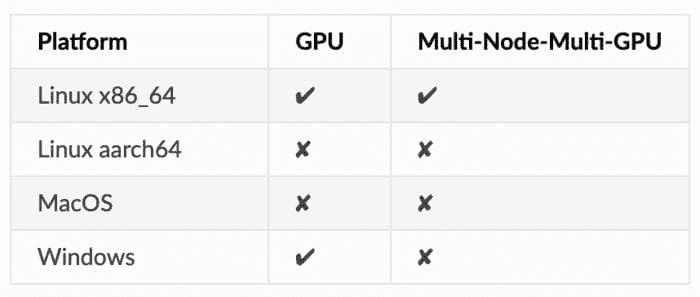
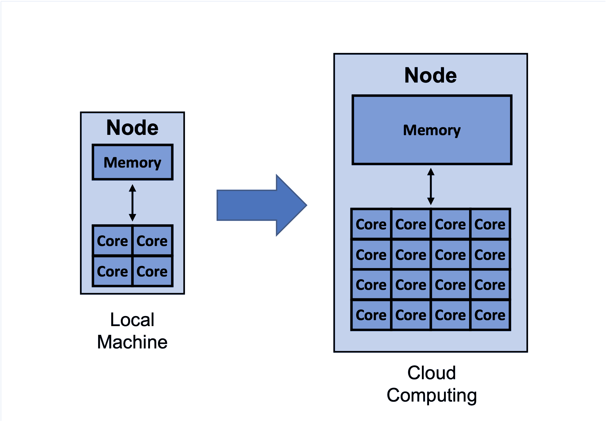
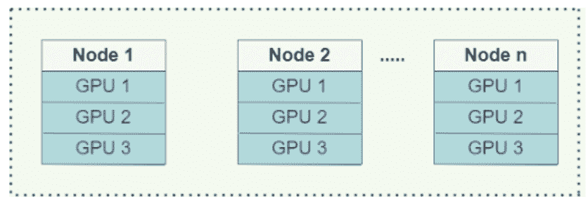
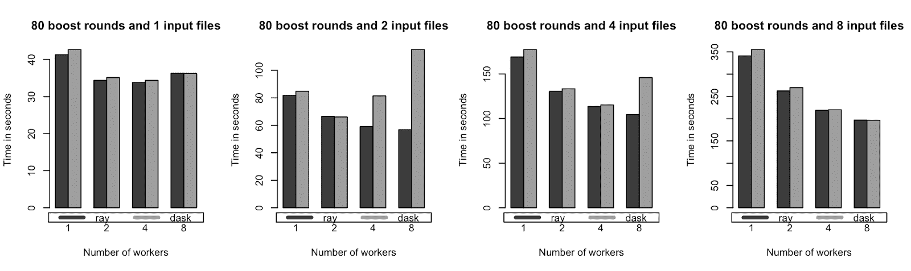
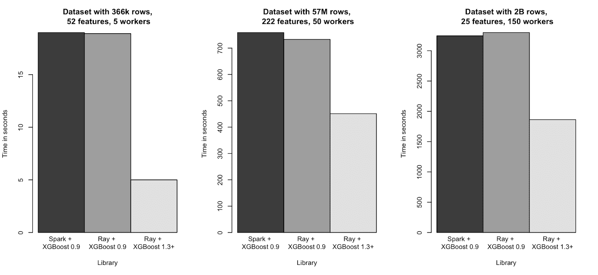

# 如何加速 XGBoost 模型训练

> 原文：[`www.kdnuggets.com/2021/12/speed-xgboost-model-training.html`](https://www.kdnuggets.com/2021/12/speed-xgboost-model-training.html)

**作者：[Michael Galarnyk](https://www.linkedin.com/in/michaelgalarnyk/)，数据科学专业人士**

梯度提升算法广泛应用于监督学习。虽然它们功能强大，但训练时间可能很长。极端梯度提升，或称 [XGBoost](https://xgboost.readthedocs.io/en/latest/)，是一个开源的梯度提升实现，旨在提升速度和性能。然而，即使是 XGBoost 的训练有时也会很慢。

* * *

## 我们的三大课程推荐

 1\. [Google 网络安全证书](https://www.kdnuggets.com/google-cybersecurity) - 快速进入网络安全职业领域。

 2\. [Google 数据分析专业证书](https://www.kdnuggets.com/google-data-analytics) - 提升你的数据分析技能

 3\. [Google IT 支持专业证书](https://www.kdnuggets.com/google-itsupport) - 支持你所在组织的 IT

* * *

有很多方法可以加速这个过程，例如：

+   更改树构建方法

+   利用云计算

+   [在 Ray 上的分布式 XGBoost](https://docs.ray.io/en/latest/xgboost-ray.html#:~:text=XGBoost%2DRay%20integrates%20with%20Ray,training%20run%20parallelized%20by%20itself.)

本文将回顾每种方法的优缺点，并介绍如何入门。

## 更改你的树构建算法

XGBoost 的 `tree_method` 参数允许你指定要使用的树构建算法。为你的问题选择合适的树构建算法（`exact`、`approx`、`hist`、`gpu_hist`、`auto`）可以帮助你更快地生成优化模型。现在让我们来回顾这些算法。

[**exact**](https://xgboost.readthedocs.io/en/latest/treemethod.html#exact-solution)

这是一个准确的算法，但在每次分裂查找过程中，它会遍历所有输入数据条目，因此不具有很好的扩展性。在实际应用中，这意味着较长的训练时间。它也不支持分布式训练。你可以在原始的 [XGBoost 论文](https://arxiv.org/abs/1603.02754) 中了解更多关于该算法的信息。

[**approx**](https://xgboost.readthedocs.io/en/stable/treemethod.html#approximated-solutions)

尽管准确算法是准确的，但当数据不完全适合内存时，它的效率较低。原始 [XGBoost 论文](https://arxiv.org/abs/1603.02754) 中的近似树方法使用分位数草图和梯度直方图。

[**hist**](https://xgboost.readthedocs.io/en/stable/treemethod.html#approximated-solutions)

在 [LightGBM](https://lightgbm.readthedocs.io/en/latest/) 中使用的近似树方法，与 `approx` 的实现有些许不同（例如使用一些性能改进，如 bins 缓存）。这通常比 `approx` 更快。

[**gpu_hist**](https://xgboost.readthedocs.io/en/stable/treemethod.html#approximated-solutions)

由于 GPU 在许多机器学习应用中至关重要，XGBoost 提供了一个支持外部内存的 GPU 实现的 hist 算法`gpu_hist`。 [它比 hist 快得多，并且使用的内存明显更少](https://xgboost.readthedocs.io/en/latest/gpu/index.html)。请注意，XGBoost 在某些操作系统上没有**原生支持**GPU。



[XGBoost 文档](https://xgboost.readthedocs.io/en/latest/install.html#python)

[**auto**](https://xgboost.readthedocs.io/en/stable/treemethod.html#approximated-solutions)

这是参数的默认值。根据数据集的大小，XGBoost 将选择“最快的方法”。对于小数据集，将使用 exact。对于大数据集，将使用 approx。请注意，尽管 hist 和 gpu_hist 通常更快，但在这种启发式方法中，它们并未被考虑。

如果你运行这个 [代码](https://gist.github.com/mGalarnyk/16d15183f691594bc2c256505a4c42b1)，你将看到使用 gpu_hist 运行模型可以节省大量时间。在我的计算机上，处理一个相对较小的数据集（100,000 行，1000 个特征），将 hist 更改为 gpu_hist 将训练时间减少了约一半。

## 利用云计算



云计算不仅允许你使用比本地计算机更多的核心和内存，还可以让你访问像 GPU 这样的专业资源。

最后一部分主要讨论了选择更高效的算法，以更好地利用可用的计算资源。然而，有时可用的计算资源不够，你可能需要更多。例如，下面图片中的 MacBook 只有 4 个核心和 16GB 内存。此外，它运行在 MacOS 上，而在写作时，XGBoost 尚未对其提供 GPU 支持。


对于本文的目的，你可以将上面的 MacBook 视为一个具有 4 个核心的单节点。

解决这个问题的一种方法是利用更多的云资源。使用云服务提供商不是免费的，但它们通常允许你使用比本地计算机更多的核心和内存。此外，如果 XGBoost 不支持你的本地计算机，选择一个 XGBoost 支持 GPU 的实例类型也是很简单的。

如果你想尝试加速云端训练，以下是来自 [Jason Brownlee 的文章](https://machinelearningmastery.com/train-xgboost-models-cloud-amazon-web-services/) 的步骤概览，介绍如何在 AWS EC2 实例上训练 XGBoost 模型：

1\. 设置 AWS 账户（如有需要）

2\. 启动 AWS 实例

3\. 登录并运行代码

4\. 训练 XGBoost 模型

5\. 关闭 AWS 实例（仅在使用时支付实例费用）

如果您选择比本地更强大的实例，您会发现云端训练速度更快。**请注意，使用 XGBoost 进行多 GPU 训练实际上需要分布式训练，这意味着您需要多个节点/实例来完成此任务**。

## 使用 Ray 进行分布式 XGBoost 训练

到目前为止，本教程已介绍通过更改树构建算法和通过云计算增加计算资源来加快训练速度。另一种解决方案是通过[XGBoost-Ray](https://docs.ray.io/en/latest/xgboost-ray.html)分布式训练 XGBoost 模型，它利用了 Ray。

### 什么是 Ray？

[Ray](https://www.ray.io/) 是一个快速、简单的分布式执行框架，使得扩展应用程序和利用先进的机器学习库变得容易。使用 Ray，您可以将顺序运行的 Python 代码通过最小的代码更改转换为分布式应用程序。如果您想了解 Ray 和 [actor 模型](https://en.wikipedia.org/wiki/Actor_model)，可以在[这里](https://www.anyscale.com/blog/writing-your-first-distributed-python-application-with-ray)了解更多。


虽然本教程探讨了 Ray 如何简化 XGBoost 代码的并行化和分布式处理，但需要注意的是，Ray 及其生态系统还简化了普通 Python 代码以及现有库的分布式处理，例如[scikit-learn](https://www.anyscale.com/blog/how-to-speed-up-scikit-learn-model-training)、[LightGBM](https://www.anyscale.com/blog/introducing-distributed-lightgbm-training-with-ray)、[PyTorch](https://medium.com/pytorch/getting-started-with-distributed-machine-learning-with-pytorch-and-ray-fd83c98fdead)等。

### 如何开始使用 XGBoost-Ray

要开始使用 XGBoost-Ray，[您首先需要安装它](https://docs.ray.io/en/latest/xgboost-ray.html#installation)。

`pip install "xgboost_ray"`

由于与核心 XGBoost API 完全兼容，您只需进行少量代码更改即可将 XGBoost 训练从单台机器扩展到拥有数百个节点的集群。



XGBoost-Ray 支持多节点/多 GPU 训练。在单台机器上，GPU 通过 NCCL 进行梯度通信。在节点之间，它们使用 Rabit 代替 ([了解更多](https://www.anyscale.com/blog/distributed-xgboost-training-with-ray))。

如下代码所示，API 与 XGBoost 非常相似。高亮部分显示了与普通 XGBoost API 不同的代码部分。

```py
from xgboost_ray import RayXGBClassifier, RayParams
from sklearn.datasets import load_breast_cancer
from sklearn.model_selection import train_test_split

seed = 42

X, y = load_breast_cancer(return_X_y=True)
X_train, X_test, y_train, y_test = train_test_split(
    X, y, train_size=0.25, random_state=42
)

clf = RayXGBClassifier(
    n_jobs=4,  # In XGBoost-Ray, n_jobs sets the number of actors
    random_state=seed)

# scikit-learn API will automatically convert the data
# to RayDMatrix format as needed.
# You can also pass X as a RayDMatrix, in which case
# y will be ignored.

clf.fit(X_train, y_train)

pred_ray = clf.predict(X_test)
print(pred_ray)

pred_proba_ray = clf.predict_proba(X_test)
print(pred_proba_ray)
```

上述代码展示了使用 XGBoost-Ray 你需要对代码进行多小的修改。虽然你不需要 XGBoost-Ray 来训练乳腺癌数据集， [之前的一篇文章](https://www.anyscale.com/blog/distributed-xgboost-training-with-ray) 在不同数量的工作节点（1 到 8）上对几个数据集大小（约 1.5M 到 12M 行）进行了基准测试，以展示它在单节点上处理更大数据集的表现。



单节点基准测试的训练时间（时间越少越好）。XGBoost-Ray 和 XGBoost-Dask 在单个 AWS m5.4xlarge 实例（具有 16 核心和 64 GB 内存）上表现相似。

XGBoost-Ray 在多节点（分布式）设置下也表现出色，如下图所示。



在几个合成数据集大小范围（约 400k 到 2B 行）上的多节点训练时间（时间越少越好）。XGBoost-Ray 和 XGBoost-Spark 表现相似。

如果你想了解更多关于 XGBoost-Ray 的内容， [可以查看这篇关于 XGBoost-Ray 的文章](https://www.anyscale.com/blog/distributed-xgboost-training-with-ray)。

## 结论

本文介绍了几种加速 XGBoost 模型训练的方法，比如更改树构建方法、利用云计算以及在 Ray 上分布式 XGBoost。如果你对 Ray 上的 XGBoost 有任何问题或想法，请随时通过 [Discourse](https://discuss.ray.io/) 或 [Slack](https://docs.google.com/forms/d/e/1FAIpQLSfAcoiLCHOguOm8e7Jnn-JJdZaCxPGjgVCvFijHB5PLaQLeig/viewform) 加入我们的社区。如果你想了解 Ray 的最新动态， [可以关注 @raydistributed 在 Twitter 上](https://twitter.com/raydistributed) 并 [订阅 Ray 通讯](https://anyscale.us5.list-manage.com/subscribe?u=524b25758d03ad7ec4f64105f&id=d94e960a03)。

**简介: [Michael Galarnyk](https://www.linkedin.com/in/michaelgalarnyk/)** 是一名数据科学专家，并在 Anyscale 从事开发者关系工作。

[原文](https://www.anyscale.com/blog/how-to-speed-up-xgboost-model-training). 经许可转载。

### 更多相关话题

+   [XGBoost 的假设是什么？](https://www.kdnuggets.com/2022/08/assumptions-xgboost.html)

+   [调优 XGBoost 超参数](https://www.kdnuggets.com/2022/08/tuning-xgboost-hyperparameters.html)

+   [利用 XGBoost 进行时间序列预测](https://www.kdnuggets.com/2023/08/leveraging-xgboost-timeseries-forecasting.html)

+   [GBM 和 XGBoost 有什么区别？](https://www.kdnuggets.com/wtf-is-the-difference-between-gbm-and-xgboost)

+   [如何使用合成数据克服机器学习模型训练中的数据短缺](https://www.kdnuggets.com/2022/03/synthetic-data-overcome-data-shortages-machine-learning-model-training.html)

+   [加速你的 Python 代码的 3 种简单方法](https://www.kdnuggets.com/2022/10/3-simple-ways-speed-python-code.html)
