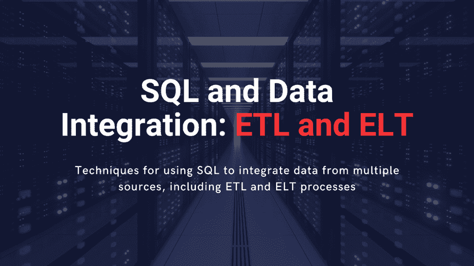

# SQL 和数据集成：ETL 和 ELT

> 原文：[`www.kdnuggets.com/2023/01/sql-data-integration-etl-elt.html`](https://www.kdnuggets.com/2023/01/sql-data-integration-etl-elt.html)



作者图片

# 介绍

* * *

## 我们的前三大课程推荐

 1\. [Google 网络安全证书](https://www.kdnuggets.com/google-cybersecurity) - 快速进入网络安全职业生涯

 2\. [Google 数据分析专业证书](https://www.kdnuggets.com/google-data-analytics) - 提升你的数据分析水平

 3\. [Google IT 支持专业证书](https://www.kdnuggets.com/google-itsupport) - 支持你的组织 IT

* * *

SQL 是一种标准化的编程语言和强大的工具，用于管理和分析存储在关系数据库中的数据，并执行各种数据操作，**SQL（结构化查询语言）**。它是数据分析师、数据科学家和数据仓库专业人员的必备技能，因为它允许用户创建、修改和查询这些数据库中的数据。

随着数据在体积、种类和复杂性上的不断增长，数据集成的重要性只会增加。能够有效地使用 SQL 从多个来源集成数据的企业将更有能力做出明智的决策，并获得竞争优势。ETL 和 ELT 是从多个来源提取数据、转换为分析准备好的格式，并加载到数据库或数据仓库中的常见方法，我们将在本文中讨论这些方法。

# ETL 与 ELT：哪种更适合你的使用案例？

ETL（提取、转换、加载）和 ELT（提取、加载、转换）是两种常见的数据集成方法，将数据从多个来源集成到目标数据库或数据仓库中。这两种方法的主要区别在于数据转换和加载步骤的执行顺序。

在**ETL**中，数据从源系统中提取，转换为适合分析的格式，然后加载到目标数据库中。这是传统的数据集成方法，适用于源系统相对简单且转换过程相对直接的情况。

在**ELT**中，数据首先从源系统中提取并加载到目标数据库中，然后转换为适合分析的格式。由于现代数据存储能够处理大量数据以及数据转换过程的复杂性增加，这种方法在现代数据基础设施中越来越受欢迎。

在决定使用 ETL 还是 ELT 时，需要考虑几个因素，包括：

## 转换过程的复杂性

ETL 更适合简单的转换过程，而 ELT 更适合复杂的转换。

## 源系统的规模和复杂性

ETL 可能更适合处理能力或存储有限的目标系统，而 ELT 更适合处理能力较强的系统。

## 目标数据库或数据仓库的能力

ETL 可能更适合处理能力或存储有限的目标系统，而 ELT 更适合处理能力较强的系统。

## 组织的数据处理和分析需求

ETL 可能更适用于数据处理和分析需求较为传统的组织，而 ELT 可能更适合数据处理和分析需求较复杂或实时的组织。

## 可用资源

ETL 需要更多的前期设置和维护，而 ELT 可能在转换和加载过程中需要更多资源。

## 安全性和合规性要求

ETL 允许对转换过程进行更多控制，这在安全性和合规性是问题时可能很重要。

# 使用 SQL 的数据集成基本技术

## 从多个来源提取数据

要从关系数据库中的表提取数据，你可以使用 **‘SELECT’** 语句，配合 **‘FROM’** 和 **‘WHERE’** 子句：

```py
SELECT * FROM customers WHERE country = 'USA';
```

*该语句将提取* ***customers’*** *表中所有国家列等于* ***USA*** *的行。*

要从平面文件中提取数据，例如 CSV 或 TXT 文件，你可以使用 **‘LOAD DATA INFILE’** 命令：

```py
LOAD DATA INFILE '/path/to/file.csv'
INTO TABLE customers
FIELDS TERMINATED BY ',' ENCLOSED BY '"'
LINES TERMINATED BY '\n';
```

*该命令将使用* ***‘, ‘*** *字符作为字段分隔符，* ***‘ " ‘*** *字符作为字段包围符，将数据从 CSV 文件加载到* ***‘customers’*** *表中。*

要从 API 提取数据，你可以使用 Python 或 Java 等编程语言进行 HTTP 请求并解析响应数据。例如，在 Python 中，你可以使用 **‘requests’** 库向 API 端点发出 GET 请求，然后使用 **‘JSON ()’** 方法将响应数据解析为字典：

```py
IMPORT REQUESTS
RESPONSE = REQUESTS.GET('https://api.example.com/endpoint')
DATA = RESPONSE.JSON()
PRINT(DATA)
```

## 使用 SQL 查询转换数据

要对数据列应用函数，你可以在 **‘SELECT’** 子句中使用函数名后跟列名：

```py
SELECT LOWER(name) AS lower_name FROM customers;
```

*该语句将通过对每个值应用* ***‘LOWER()’*** *函数来转换* ***‘name column’***，*并将结果别名为* ***‘lower_name’***。

要重命名列，你可以在 **‘SELECT’** 子句中使用 **‘AS’** 关键字：

```py
SELECT name AS full_name FROM customers;
```

*该语句将把* ***‘name’*** *列重命名为* ***‘full_name’***。

要从多个来源合并数据，你可以使用 UNION 操作符：

```py
SELECT * FROM customers
UNION ALL
SELECT * FROM orders;
```

*该语句将合并* ***‘customers’*** *和* ***‘orders’*** *表中的数据，消除重复项。*

## 将数据加载到目标数据库或数据仓库

要向表中插入新行，你可以使用 **‘INSERT INTO’** 语句：

```py
INSERT INTO customers (name, email, country)
VALUES ('John Doe', 'johndoe@example.com', 'USA');
```

*这条语句将会在 customers 表中插入一行新数据，并为* ***‘name’***、***‘email’*** 和 ***‘country’*** *列指定值。*

要更新表中的现有行，你可以使用**‘UPDATE’**语句，并结合**‘SET’**和**‘WHERE’**子句：

```py
UPDATE customers
SET email = 'john.smith@example.com'
WHERE name = 'John Smith';
```

*这条语句将更新行中* ***‘name’*** *列等于* ***'John Smith'*** *的邮件列，将其值设置为* ***'john.smith@example.com'***

# 结论

我希望你喜欢阅读这篇文章。请随时在评论区分享你的想法或反馈。我将用一些最终的想法结束我的讨论。数据集成的未来可能涉及机器学习算法的集成、与大数据技术的更大整合，以及更复杂的 ETL 和 ELT 过程。通过了解最新的数据集成方式和技术，企业可以确保自己能够充分利用数据驱动经济中的机遇和挑战。

**[Kanwal Mehreen](https://www.linkedin.com/in/kanwal-mehreen1)** 是一名有抱负的软件开发者，对数据科学和人工智能在医学中的应用充满兴趣。Kanwal 被选为 2022 年 APAC 区域的 Google Generation Scholar。Kanwal 喜欢通过撰写关于热门话题的文章分享技术知识，并对提升女性在技术行业中的代表性充满热情。

### 更多相关话题

+   [ETL 与 ELT：数据集成对决](https://www.kdnuggets.com/2022/08/etl-elt-data-integration-showdown.html)

+   [ETL 与 ELT：哪个更适合你的数据管道？](https://www.kdnuggets.com/2023/03/etl-elt-one-right-data-pipeline.html)

+   [使用 SQL + Python 构建可扩展的 ETL](https://www.kdnuggets.com/2022/04/building-scalable-etl-sql-python.html)

+   [人工智能如何改变数据集成](https://www.kdnuggets.com/2022/04/artificial-intelligence-transform-data-integration.html)

+   [AI/ML 技术集成将如何帮助业务实现…](https://www.kdnuggets.com/2021/12/aiml-technology-integration-help-business-achieving-goals-2022.html)

+   [数据仓储和 ETL 最佳实践](https://www.kdnuggets.com/2023/02/data-warehousing-etl-best-practices.html)
