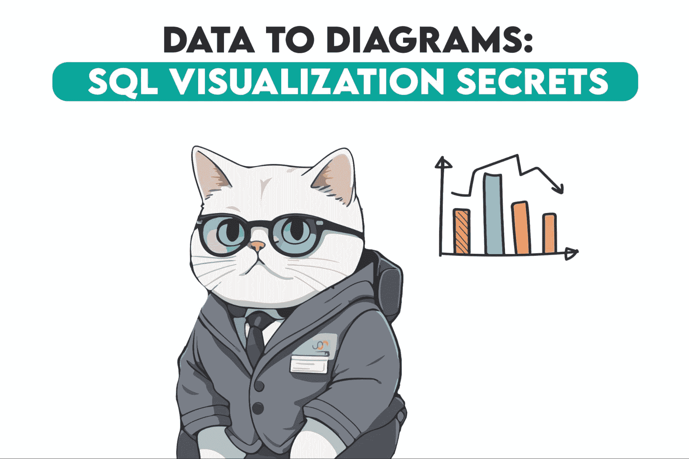
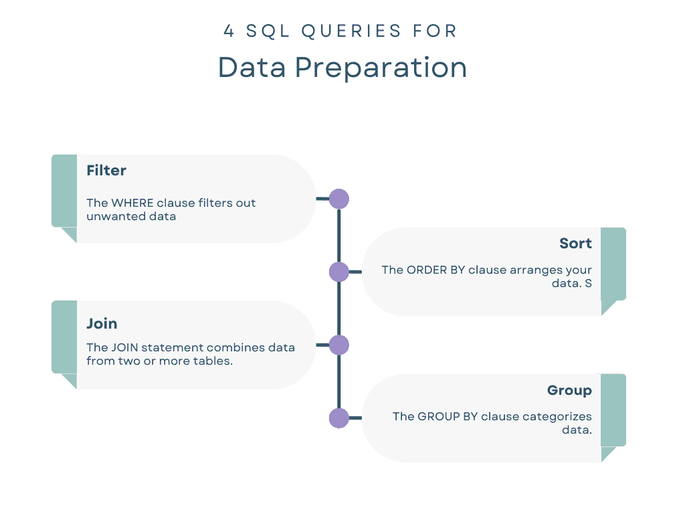
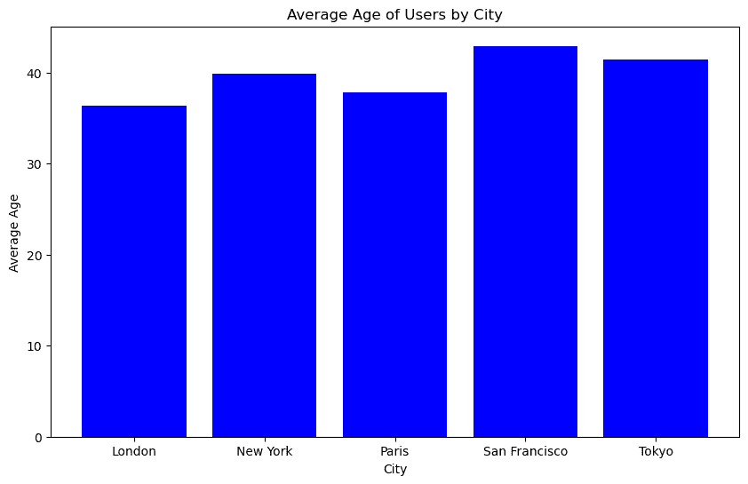
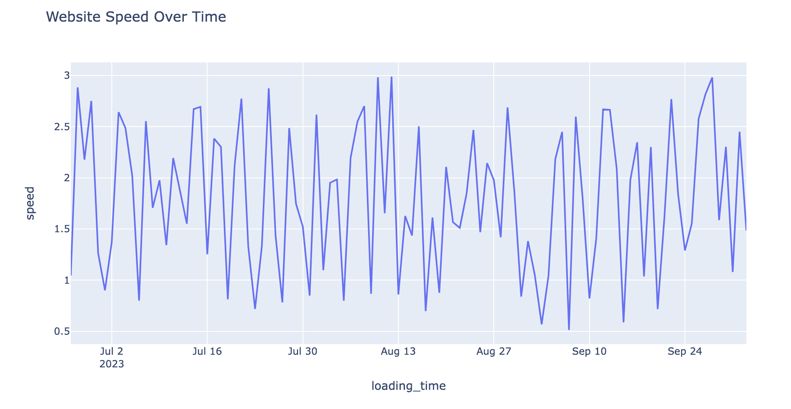

# 数据可视化中的 SQL：如何准备图表和图形的数据

> 原文：[`www.kdnuggets.com/sql-for-data-visualization-how-to-prepare-data-for-charts-and-graphs`](https://www.kdnuggets.com/sql-for-data-visualization-how-to-prepare-data-for-charts-and-graphs)



你可能已经注意到，创建视觉惊艳的图表和图形不仅仅是选择正确的颜色或形状。真正的魔力发生在幕后，即那些为这些视觉效果提供数据的地方。

* * *

## 我们的前三名课程推荐

 1\. [谷歌网络安全证书](https://www.kdnuggets.com/google-cybersecurity) - 快速进入网络安全职业的快车道

 2\. [谷歌数据分析专业证书](https://www.kdnuggets.com/google-data-analytics) - 提升你的数据分析技能

 3\. [谷歌 IT 支持专业证书](https://www.kdnuggets.com/google-itsupport) - 在 IT 方面支持你的组织

* * *

但是，如何让数据完美呢？SQL 将在这里成为我们进入数据可视化领域的关键。SQL 帮助你切割、处理和准备数据，使其在你使用的任何可视化工具中都能出色地呈现。

那么，这篇文章为你准备了什么呢？我们将首先展示 SQL 如何用于准备数据以进行数据可视化。接着，我们将引导你了解不同类型的可视化以及如何为每种类型准备数据，其中一些还会有最终的成品。所有这些旨在为你提供创建引人入胜的视觉故事的钥匙。所以，拿上你的咖啡吧，这将会是一段精彩的旅程！

# SQL 查询用于数据准备

在深入探讨可视化类型之前，让我们看看 SQL 如何准备你将要可视化的数据。SQL 就像是你视觉“电影”的编剧，微调你想讲述的故事。



## 筛选

WHERE 子句用于筛选不需要的数据。例如，如果你只对 18-25 岁的用户感兴趣，你可以使用 SQL 进行筛选。

想象一下你正在分析客户反馈。使用 SQL，你可以筛选出反馈评分低于 3 的记录，突出改进的领域。

```py
SELECT * FROM feedbacks WHERE rating < 3;
```

## 排序

ORDER BY 子句对数据进行排列。排序对于时间序列图表尤为重要，因为数据必须按时间顺序显示。

在绘制产品的月度销售线图时，SQL 可以按月份对数据进行排序。

```py
SELECT month, sales FROM products ORDER BY month;
```

## 连接

JOIN 语句将来自两个或更多表的数据合并。这使得数据集更加丰富，从而实现更全面的可视化。

你可能有一张用户数据表和另一张购买数据表。SQL 可以将这些数据连接起来，显示每个用户的总支出。

```py
SELECT users.id, SUM(purchases.amount) FROM users
JOIN purchases ON users.id = purchases.user_id
GROUP BY users.id; 
```

## 分组

GROUP BY 子句用于对数据进行分类。它通常与 COUNT()、SUM()和 AVG()等聚合函数一起使用，以对每个分组进行计算。

如果你想了解网站不同部分的平均停留时间，SQL 可以按部分对数据进行分组，然后计算平均值。

```py
SELECT section, AVG(time_spent) FROM website_data
GROUP BY section; 
```

# 数据可视化的类型

在深入了解不同类型的可视化工具之前，理解它们为什么重要是很重要的。把每个图表或图形视作一个不同的“透镜”来查看你的数据。你选择的类型可以帮助你捕捉趋势、识别异常值，甚至讲述一个故事。

## 图表

在数据科学中，图表用于理解数据集的初步步骤。例如，你可能使用直方图来了解移动应用中用户年龄的分布。像 Python 中的 Matplotlib 或 Seaborn 这样的工具通常用于绘制这些图表。

你可以运行 SQL 查询来获取计数、平均值或你感兴趣的任何指标，并将这些数据直接输入到你的图表工具中，创建如柱状图、饼图或直方图等可视化效果。

以下 SQL 查询帮助我们按城市汇总用户年龄。这对于准备数据以便我们可以可视化年龄在不同城市间的差异至关重要。

```py
# SQL code to find the average age of users in each city
SELECT city, AVG(age)
FROM users
GROUP BY city; 
```

让我们使用 Matplotlib 来创建一个柱状图。以下代码片段假设 grouped_df 包含了上述 SQL 查询的平均年龄数据，并创建了按城市显示用户平均年龄的柱状图。

```py
import matplotlib.pyplot as plt

# Assuming grouped_df contains the average age data
plt.figure(figsize=(10, 6))
plt.bar(grouped_df['city'], grouped_df['age'], color='blue')
plt.xlabel('City')
plt.ylabel('Average Age')
plt.title('Average Age of Users by City')
plt.show() 
```

这是柱状图。



## 图形

假设你正在跟踪一个网站的速度变化。折线图可以展示数据中的趋势、峰值和谷底，突出显示网站表现最佳和最差的时间。

像 Plotly 或 Bokeh 这样的工具可以帮助你创建这些更复杂的可视化效果。你可以使用 SQL 来准备时间序列数据，可能需要运行计算每日平均加载时间的查询，然后将数据发送到你的图形工具中。

以下 SQL 查询计算了每天的网站平均速度。这样的查询可以更方便地绘制时间序列折线图，展示性能随时间的变化。

```py
-- SQL code to find the daily average loading time
SELECT DATE(loading_time), AVG(speed)
FROM website_speed
GROUP BY DATE(loading_time); 
```

在这里，假设我们选择 Plotly 来创建一个折线图，显示网站速度随时间的变化。SQL 查询为我们准备了时间序列数据，显示了网站速度的变化。

```py
import plotly.express as px

fig = px.line(time_series_df, x='loading_time', y='speed', title='Website Speed Over Time')
fig 
```

这是折线图。



## 仪表板

仪表板对于需要实时监控的项目至关重要。想象一下一个仪表板跟踪在线平台的实时用户参与度指标。

像 PowerBI、Google Data Studio 或 Tableau 这样的工具可以从 SQL 数据库中提取数据，以填充这些仪表板。SQL 可以汇总和更新你的数据，这样你就可以在仪表板上始终获得最新的见解。

```py
-- SQL code to find the current number of active users and average session time
SELECT COUNT(DISTINCT user_id) as active_users, AVG(session_time)
FROM user_sessions
WHERE session_end IS NULL; 
```

在 PowerBI 中，你通常会导入你的 SQL 数据库，并运行类似的查询来创建仪表板的可视化效果。使用像 PowerBI 这样的工具的好处是能够创建实时仪表板。你可以设置多个图块来显示平均年龄和其他关键绩效指标，所有这些都会实时更新。

# 最后的想法

数据可视化不仅仅是关于漂亮的图表和图形；它是通过数据讲述一个引人入胜的故事。SQL 在编写这个故事中扮演了关键角色，帮助你在幕后准备、过滤和组织数据。就像精密机器中的齿轮一样，SQL 查询作为看不见的机械部分，使你的可视化不仅成为可能，还充满洞察力。

如果你渴望更多的实践经验，访问 [StrataScratch 平台](https://platform.stratascratch.com/coding?code_type=2&utm_source=Blog&utm_medium=click&utm_campaign=KDN+sql+for+data+visualization)，这个平台提供了丰富的资源来帮助你成长。从 [数据科学面试问题](https://www.stratascratch.com/blog/40-data-science-interview-questions-from-top-companies/?utm_source=Blog&utm_medium=click&utm_campaign=KDN+sql+for+data+visualization) 到实用的数据项目，StrataScratch 旨在提升你的技能，帮助你获得梦想工作。

[](https://twitter.com/StrataScratch)****[Nate Rosidi](https://twitter.com/StrataScratch)**** 是一位数据科学家和产品策略专家。他还是一名兼职教授，教授分析学，并且是 StrataScratch 的创始人，这个平台帮助数据科学家通过顶级公司的真实面试问题为面试做准备。Nate 写作关于职业市场的最新趋势，提供面试建议，分享数据科学项目，并涵盖所有 SQL 相关内容。

### 了解更多相关主题

+   [生成 AI 如何帮助你改善数据可视化图表](https://www.kdnuggets.com/how-generative-ai-can-help-you-improve-your-data-visualization-charts)

+   [SQL 中的数据清理：如何准备混乱的数据以进行分析](https://www.kdnuggets.com/data-cleaning-in-sql-how-to-prepare-messy-data-for-analysis)

+   [使用 AI 和分析引擎更快地准备时间序列数据](https://www.kdnuggets.com/2021/12/piexchange-faster-way-prepare-timeseries-data-ai-analytics-engine.html)

+   [为有效的 Tableau 和 Power BI 仪表板准备数据](https://www.kdnuggets.com/2022/06/prepare-data-effective-tableau-power-bi-dashboards.html)

+   [如何为数据科学面试做准备](https://www.kdnuggets.com/2022/12/prepare-data-science-interview.html)

+   [图表：理解数据的自然方式](https://www.kdnuggets.com/2022/10/manning-graphs-natural-way-understand-data.html)
