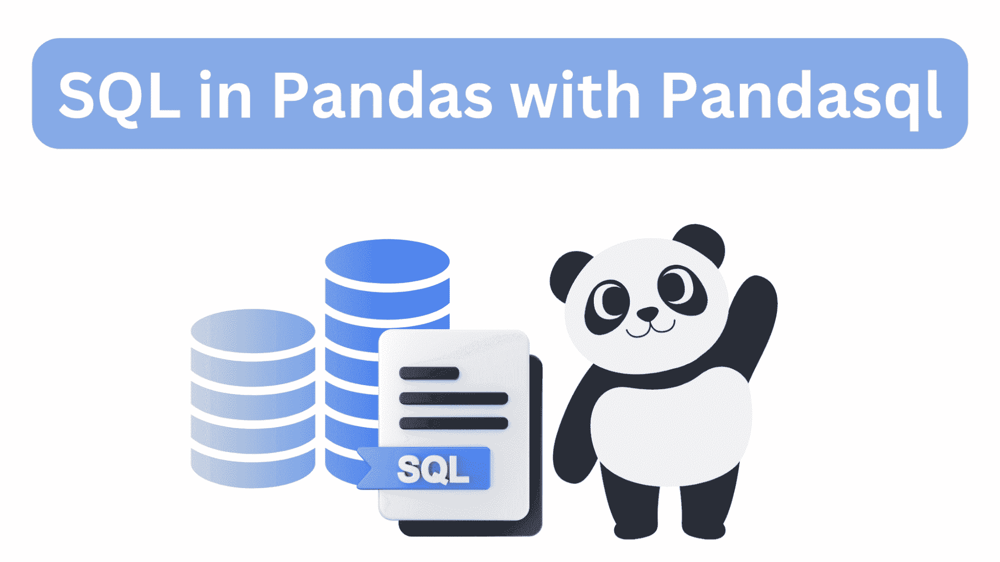
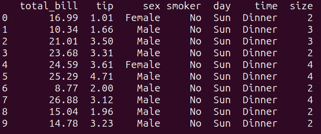
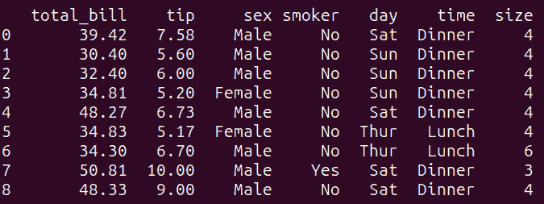
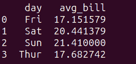
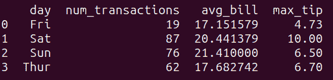
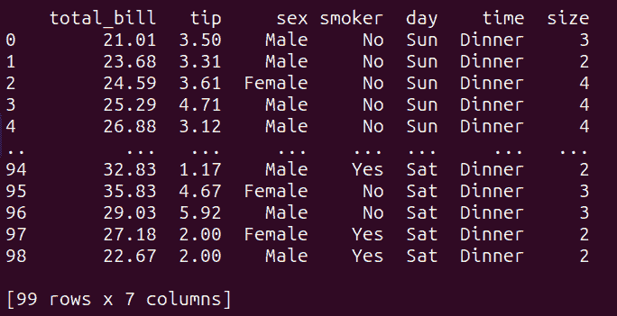
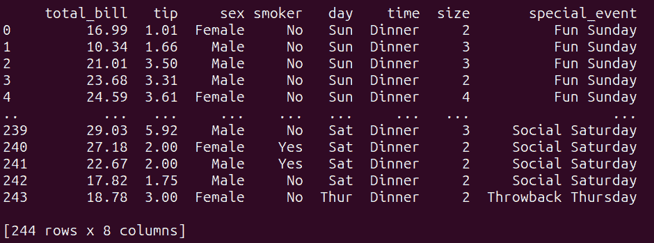

# Pandas 中的 SQL 与 Pandasql

> 原文：[`www.kdnuggets.com/sql-in-pandas-with-pandasql`](https://www.kdnuggets.com/sql-in-pandas-with-pandasql)



作者提供的图片

如果你只能添加*一个技能*——并且无可争辩地是最重要的——到你的数据科学工具箱中，那就是**SQL**。然而，在 Python 数据分析生态系统中，[pandas](https://pandas.pydata.org/)是一个强大且流行的库。

* * *

## 我们的前三大课程推荐

 1\. [谷歌网络安全证书](https://www.kdnuggets.com/google-cybersecurity) - 快速进入网络安全职业生涯。

 2\. [谷歌数据分析专业证书](https://www.kdnuggets.com/google-data-analytics) - 提升你的数据分析技能

 3\. [谷歌 IT 支持专业证书](https://www.kdnuggets.com/google-itsupport) - 支持你所在的组织进行 IT 管理

* * *

但是，如果你对 pandas 不熟悉，学习 pandas 函数——如分组、聚合、连接等——可能会感到不知所措。用 SQL 查询数据框会更容易一些。[pandasql](https://pypi.org/project/pandasql/)库可以让你做到这一点！

所以，让我们学习如何使用 pandasql 库在样本数据集上的 pandas 数据框中运行 SQL 查询。

# 使用 Pandasql 的第一步

在我们进一步讨论之前，让我们设置我们的工作环境。

## 安装 pandasql

如果你使用 Google Colab，可以使用`pip`安装 pandasql 并跟着代码操作：

```py
pip install pandasql
```

如果你在本地机器上使用 Python，请确保在此项目的专用虚拟环境中安装了[pandas](https://pandas.pydata.org/)和[Seaborn](http://seaborn.pydata.org/)。你可以使用内置的[venv](https://docs.python.org/3/library/venv.html)包来创建和管理虚拟环境。

我在 Ubuntu LTS 22.04 上运行 Python 3.11。以下指令适用于 Ubuntu（也应该适用于 Mac）。如果你使用的是 Windows 机器，请参考[这些创建和激活虚拟环境的说明](https://docs.python.org/3/library/venv.html#how-venvs-work)。

要创建虚拟环境（这里是 v1），请在项目目录中运行以下命令：

```py
python3 -m venv v1
```

然后激活虚拟环境：

```py
source v1/bin/activate
```

现在安装 pandas、seaborn 和 pandasql：

```py
pip3 install pandas seaborn pandasql
```

**注意**：如果你尚未安装`pip`，可以通过运行以下命令更新系统包并安装：`apt install python3-pip`。

## `sqldf`函数

要在 pandas 数据框上运行 SQL 查询，你可以导入并使用`sqldf`，其语法如下：

```py
from pandasql import sqldf
sqldf(query, globals())
```

这里，

+   `query`代表你想在 pandas 数据框上执行的 SQL 查询。它应该是一个包含有效 SQL 查询的字符串。

+   `globals()`指定了查询中使用的数据框所定义的全局命名空间。

# 使用 Pandasql 查询 Pandas 数据框

让我们首先导入所需的包和来自 pandasql 的`sqldf`函数：

```py
import pandas as pd
import seaborn as sns
from pandasql import sqldf
```

由于我们将对数据框运行几个查询，我们可以定义一个函数，以便通过传递查询作为参数来调用它：

```py
# Define a reusable function for running SQL queries
run_query = lambda query: sqldf(query, globals())
```

对于以下所有示例，我们将运行`run_query`函数（底层使用`sqldf()`）来在`tips_df`数据框上执行 SQL 查询。然后我们将打印出返回的结果。

## 加载数据集

对于本教程，我们将使用内置于[Seaborn](http://seaborn.pydata.org/)库中的“tips”数据集。“tips”数据集包含有关餐厅小费的信息，包括总账单、小费金额、付款者的性别、星期几等。

将“tip”数据集加载到数据框`tips_df`中：

```py
# Load the "tips" dataset into a pandas dataframe
tips_df = sns.load_dataset("tips")
```

## 示例 1 – 选择数据

这是我们的第一个查询——一个简单的 SELECT 语句：

```py
# Simple select query
query_1 = """
SELECT *
FROM tips_df
LIMIT 10;
"""
result_1 = run_query(query_1)
print(result_1)
```

如上所示，此查询选择`tips_df`数据框中的*所有*列，并使用`LIMIT`关键字将输出限制为前 10 行。这等同于在 pandas 中执行`tips_df.head(10)`：



`query_1`的输出

## 示例 2 – 基于条件筛选

接下来，让我们编写一个查询来根据条件筛选结果：

```py
# filtering based on a condition
query_2 = """
SELECT *
FROM tips_df
WHERE total_bill > 30 AND tip > 5;
"""

result_2 = run_query(query_2)
print(result_2)
```

此查询根据 WHERE 子句中指定的条件筛选`tips_df`数据框。它选择`tips_df`数据框中所有列，其中‘total_bill’大于 30 *且*‘tip’金额大于 5。

运行`query_2`给出以下结果：



`query_2`的输出

## 示例 3 – 分组和聚合

让我们运行以下查询以获取按天分组的平均账单金额：

```py
# grouping and aggregation
query_3 = """
SELECT day, AVG(total_bill) as avg_bill
FROM tips_df
GROUP BY day;
"""

result_3 = run_query(query_3)
print(result_3)
```

以下是输出结果：



`query_3`的输出

我们看到周末的平均账单金额略高。

让我们再看一个分组和聚合的示例。考虑以下查询：

```py
query_4 = """
SELECT day, COUNT(*) as num_transactions, AVG(total_bill) as avg_bill, MAX(tip) as max_tip
FROM tips_df
GROUP BY day;
"""

result_4 = run_query(query_4)
print(result_4)
```

查询`query_4`按‘day’列对`tips_df`数据框中的数据进行分组，并计算每组的以下聚合函数：

+   `num_transactions`：交易的计数，

+   `avg_bill`：‘total_bill’列的平均值，以及

+   `max_tip`：‘tip’列的最大值。

如上所示，我们按天对上述数量进行了分组：



`query_4`的输出

## 示例 4 – 子查询

让我们添加一个使用子查询的示例查询：

```py
# subqueries
query_5 = """
SELECT *
FROM tips_df
WHERE total_bill > (SELECT AVG(total_bill) FROM tips_df);
"""

result_5 = run_query(query_5)
print(result_5)
```

这里，

+   内部子查询计算`tips_df`数据框中‘total_bill’列的平均值。

+   外部查询然后从`tips_df`数据框中选择所有列，其中‘total_bill’大于计算出的平均值。

运行`query_5`给出如下结果：



`query_5`的输出

## 示例 5 – 连接两个数据框

我们只有一个数据框。为了进行简单的连接，我们可以像这样创建另一个数据框：

```py
# Create another DataFrame to join with tips_df
other_data = pd.DataFrame({
    'day': ['Thur','Fri', 'Sat', 'Sun'],
    'special_event': ['Throwback Thursday', 'Feel Good Friday', 'Social Saturday','Fun Sunday', ]
})
```

`other_data`数据框将每一天与特殊事件关联起来。

现在我们在`tips_df`和`other_data`数据框之间的公共‘day’列上执行 LEFT JOIN：

```py
query_6 = """
SELECT t.*, o.special_event
FROM tips_df t
LEFT JOIN other_data o ON t.day = o.day;
"""

result_6 = run_query(query_6)
print(result_6)
```

这是连接操作的结果：



query_6 的输出

# 总结和下一步

在本教程中，我们讨论了如何使用 pandasql 在 pandas 数据框上运行 SQL 查询。虽然 pandasql 使得用 SQL 查询数据框变得非常简单，但也存在一些限制。

关键限制是 pandasql 可能比原生 pandas 慢几个数量级。那么你应该怎么做呢？如果你需要用 pandas 进行数据分析，你可以在*学习*pandas 时使用 pandasql 来查询数据框，并迅速提升。然后，你可以在对 pandas 感到舒适后，切换到 pandas 或其他库，如[Polars](https://www.pola.rs/)。

为了迈出这一步，尝试编写并运行到目前为止我们执行的 SQL 查询的 pandas 等效代码。本教程中使用的所有代码示例都[在 GitHub 上](https://github.com/balapriyac/python-data-analysis/tree/main/pandasql-tutorial)。继续编码！

**[Bala Priya C](https://www.linkedin.com/in/bala-priya/)** 是来自印度的开发者和技术作家。她喜欢在数学、编程、数据科学和内容创作的交汇点上工作。她的兴趣和专长领域包括 DevOps、数据科学和自然语言处理。她喜欢阅读、写作、编程和咖啡！目前，她正在通过撰写教程、操作指南、评论文章等来学习和分享她的知识。

### 相关主题

+   [用 SQL 查询你的 Pandas 数据框](https://www.kdnuggets.com/2021/10/query-pandas-dataframes-sql.html)

+   [使用 Python 的 SQL：SQLAlchemy 和 Pandas](https://www.kdnuggets.com/using-sql-with-python-sqlalchemy-and-pandas)

+   [如何使用[ ], .loc, iloc, .at…在 Pandas 中选择行和列](https://www.kdnuggets.com/2019/06/select-rows-columns-pandas.html)

+   [数据科学中的 Pandas 入门](https://www.kdnuggets.com/2020/06/introduction-pandas-data-science.html)

+   [使用 Pandas 制作漂亮的交互式可视化的最简单方法](https://www.kdnuggets.com/2021/12/easiest-way-make-beautiful-interactive-visualizations-pandas.html)

+   [入门 Pandas 教程](https://www.kdnuggets.com/2022/03/introductory-pandas-tutorial.html)
