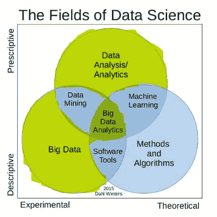

# SQL 是否需要成为数据科学家？

> 原文：[`www.kdnuggets.com/2019/07/sql-needed-data-scientist.html`](https://www.kdnuggets.com/2019/07/sql-needed-data-scientist.html)

 评论

**作者：[Saurabh Hooda](https://www.linkedin.com/in/hoodasaurabh/)，Hackr.io**

* * *

## 我们的三大课程推荐

 1\. [Google 网络安全证书](https://www.kdnuggets.com/google-cybersecurity) - 快速进入网络安全职业的快车道。

 2\. [Google 数据分析专业证书](https://www.kdnuggets.com/google-data-analytics) - 提升你的数据分析技能

 3\. [Google IT 支持专业证书](https://www.kdnuggets.com/google-itsupport) - 支持你的组织的 IT 部门

* * *

**SQL 是否需要成为数据科学家？**

简短的回答是“是的”。只要数据科学家这个称谓里包含“数据”，结构化查询语言（或者我们称之为 see-quel）就会继续是其中的重要部分。在这篇博客中，让我们深入探讨数据科学及其与 SQL 的关系，包括 5W1H——如何、为什么、哪里、何时、谁和什么。我们还将学习数据库管理系统（DBMS）的基础知识，并了解成为数据科学家可能是你职业生涯的最佳选择。

**什么是数据科学？**

数据科学的视角很广泛，成为一名[数据科学家](https://hackr.io/blog/how-to-become-a-data-scientist)需要深入了解数学、机器学习、计算机科学、统计研究、数据处理以及领域知识中的一种或多种流派。这些流派中的每一个都需要大量的数据工作，不论是收集、分析还是处理。如果你正在准备数据科学面试，可以查看这些必备的[数据科学面试问题](https://hackr.io/blog/data-science-interview-questions)。

**为什么数据科学如此受欢迎？**

数字世界正处于巅峰状态，随着需求的增长和广泛的营销策略，数据已成为所有营销目的的关键。例如，如果我想买一部新手机，我会去像 Amazon 或 Flipkart 这样的在线商店，浏览不同的品牌，把几款放入购物车，但决定在进一步研究后再购买。在内部，在线商店会保存我的购物车和浏览历史，并在我稍后回来时向我推荐更多手机。即使我不购买，公司也会发邮件提醒我我的购物车“还在等待我”。因此，数据在创建买卖双方关系中扮演着最重要的角色。客户提供的数据越多，提供给买家的信息流就越定制。这不仅仅适用于电子商务，数据科学在医疗保健、制造、银行、金融和运输等许多其他领域也证明了其极大的价值。

**如何？**

**收集** – 假设你在宜家检查一个床单。你购买了这个产品然后离开。后来你意识到你需要更多相同的产品，于是回来购买。你告诉你的朋友这个产品有多么有用且便宜，他们也被说服购买。制造商利用这些数据来了解客户的喜好，并更新他们的库存以拥有更多受欢迎的产品。此外，持续的反馈帮助他们对现有产品进行改进。

**处理** – 收集到的用户数据在建模和规划阶段被考虑进来，以便得出可操作的见解。例如，更多的客户寻找特定颜色的床单或特定面料的窗帘。

**分析** – 想象一下你买了一张蓝色的床单，但意识到对于你房间的氛围，绿色会是更好的选择，而目前没有绿色的床单。绿色是一种常见的、受欢迎的颜色。通过对人类输入和数据管理工具的分析，可以确定是否引入绿色床单是一个好主意，是否会满足更多客户的需求，并带来更多的利润。

对于需求预测和库存管理，我们需要将所有用户信息，包括他们的购买、喜好和不喜欢、反馈等，存储在某个地方。

**在哪里？**

是的，你明白了 – 一切都存储在数据库中。因此，SQL 对于处理需要定期处理的大量数据至关重要。它也作为数据科学所意图进行的正确营销和反馈的重要工具。例如，如果你不喜欢 Facebook 向你推荐的视频 – 你会说‘隐藏这个’，然后 Facebook 会立即询问你原因。这些用户偏好也需要存储在某个地方。

通过像 SQL 这样的关系型数据库，数据科学提供了一个持续的系统来处理和改进数据的呈现和处理方式。

**SQL 的作用是什么？**

SQL 是整个数据科学宇宙的重要组成部分。但它到底适合什么位置？如果你想成为数据分析师、数据工程师或数据架构师，你需要 [学习 SQL](https://techsherlock.com/sql-full-form/) 以及编程语言如 C、R 和 Python。以下是一个简单的图示，展示了 SQL 使用的阶段：

要查看原始图片来源，请点击 [这里](https://dimensionless.in/understanding-different-components-roles-in-data-science/)。

高亮的部分是我们需要 SQL 知识的地方：大数据、大数据分析和数据分析。

**为什么选择 SQL？**

尽管有提供高性能和速度的 [NoSQL](https://hackr.io/blog/nosql-vs-sql) 数据库，SQL 数据库仍然是实际应用中最广泛使用的。了解 SQL 技术的开发者更多，因此支持和文档也更为丰富。此外，数据完整性是 SQL 相比任何 NoSQL 数据库的一个关键因素，它能够保证系统中不会出现重复或未经授权的数据。此外，对于复杂的查询和联接，结构良好的关系型数据库效果更佳。

**什么是 SQL？**

SQL 是一种关系型数据库管理系统，用于存储、检索、更新和读取数据库中的数据。如果你从基础知识开始通过 [这个精心设计的课程](https://hackr.io/tutorial/sql-for-newbies-data-analysis-for-beginners) 接触 SQL，你将终生热爱 SQL。

在这篇博客中，我们将重点讨论 SQL 对数据科学的影响。让我们通过一个简单的例子来探讨你作为数据科学家如何使用 SQL 来收集和分析数据。

假设你想了解一本名为《数据科学手册》的书籍的受欢迎程度，通过检查有多少用户订购了该书。由于 SQL 是一种结构良好的语言，具有适当的模式，你可以拥有如下结构：

+   `customer 表 – customer_id、customer_name、order_id 等`

+   `order_details 表 – order_id、order_desc、order_date 等`

+   `book 表 – book_id、book_name、author、order_id 等`

要获取这些数据，我们需要 *联接* 三个表，使用一些共同的列或键。在这种情况下，`order_id` 是三个表共有的字段，利用这些数据，我们可以编写查询来获取所需的详细信息。

在现实场景中，这种系统可以存在于多个层次，需要分析和处理大量数据。来自数百万用户的日常数据被存储和分析以实现各种目的。

想象一下如果没有 SQL 做这一切，这是否能想象？

虽然有些人希望相信 SQL 在数据科学家工作中的作用正在减少，但事实并非如此。SQL 是不会消失的。

这是数据科学家应该知道的一些关键 SQL 概念：

**关系型数据库模型**

在关系型数据库模型中，所有的数据点相互关联或连接。在创建这种数据库时，各个表和列之间的关系必须在设计阶段就定义好。在我们上述的例子中，这三个表是相关的。客户表的[主键](https://en.wikipedia.org/wiki/Primary_key)（“一组最小属性（列）的特定选择，能够唯一地指定关系（表）中的一个元组（行）”）将是`customer_id`，而`order_id`将是[外键](https://en.wikipedia.org/wiki/Foreign_key)（“一组属性，受某种包含依赖约束的影响，具体来说是外键属性所组成的元组必须在某个其他（不一定是不同的）关系 S 中也存在”）。同样，`book_id`和`order_id`的组合可以作为书籍表的复合键。这些关系必须在创建阶段就定义好。

**DBMS 规范化**

规范化是一个设计过程，其中数据库中的表被组织成以避免数据的冗余和依赖。通过不同形式的规范化，我们可以将数据划分为更小的结构，并建立它们之间的链接，从而使数据得到最佳存储。[这篇很好的文章](https://hackr.io/blog/dbms-normalization)以非常简单易懂的方式介绍了规范化的信息。

**数据库模式**

数据库模式是数据库的逻辑视图。所有应用于数据的关系，如约束、表、视图、触发器等，形成了模式。

**基本 SQL 命令**

SQL 可以执行以下类型的语句：

+   DML（数据操作语言）语句 – `select, insert, delete, update`

+   DDL（数据定义语言）语句 – `create, drop, alter`

+   DCL（数据控制语言）语句 – `grant, revoke`

+   TCL（事务控制语言）语句 – `begin, commit, rollback`

查看这份精简的[SQL 面试问题](https://hackr.io/blog/top-sql-interview-questions)列表，可以帮助你快速复习概念。

**谁应该学习 SQL？**

到现在为止，你应该明白，如果你对数据狂热且喜欢玩弄数据，并希望将数据科学作为职业选择，你肯定应该学习 SQL。

**数据科学家作为职业选择**

每天都会生成大量数据，这些数据需要被转化为新的商业解决方案、设计和产品，而这些只有数据科学家的创造性思维才能实现。未来几十年，这种需求只会逐日增加。除了行业提供的丰厚薪资，挑战性和不断扩大的角色也吸引着专业人士从事这一工作。从数据管理员、数据架构师、数据分析师、业务分析师到数据经理或商业智能经理，数据科学领域有很多机会可供选择。掌握 SQL、R 和 Python 等编程语言、统计学和应用数学，并具备批判性思维和行业知识，将使你比想象的更早实现目标。

**个人简介：[Saurabh Hooda](https://www.linkedin.com/in/hoodasaurabh/)** 曾在全球电信和金融巨头公司担任各种职务。在 Infosys 和 Sapient 工作了十年后，他创办了自己的第一个初创公司 Leno，旨在解决超本地的书籍共享问题。他对产品营销和分析充满兴趣。他的最新创业项目 [Hackr.io](https://hackr.io/) 推荐了每种编程语言的最佳 [数据科学教程](https://hackr.io/tutorials/learn-data-science) 和在线编程课程。所有教程均由编程社区提交和投票。

原创，已获许可转载。

**相关内容：**

+   掌握 SQL 的 7 个步骤 — 2019 版

+   Python 数据科学入门

+   SQL 备忘单

### 更多相关话题

+   [成为优秀数据科学家所需的 5 项关键技能](https://www.kdnuggets.com/2021/12/5-key-skills-needed-become-great-data-scientist.html)

+   [在生成 AI 时代，数据科学家仍然需要吗？](https://www.kdnuggets.com/2023/06/data-scientists-still-needed-age-generative-ai.html)

+   [低代码：开发者还需要吗？](https://www.kdnuggets.com/2022/04/low-code-developers-still-needed.html)

+   [KDnuggets™ 新闻 22:n03, 1 月 19: 深入探讨 13 个数据…](https://www.kdnuggets.com/2022/n03.html)

+   [为什么 SQL 将继续成为数据科学家的最佳伙伴](https://www.kdnuggets.com/2022/07/sql-remain-data-scientist-best-friend.html)

+   [SQL、Python、数据清理、数据处理和探索性数据分析的指南合集](https://www.kdnuggets.com/collection-of-guides-on-mastering-sql-python-data-cleaning-data-wrangling-and-exploratory-data-analysis)
