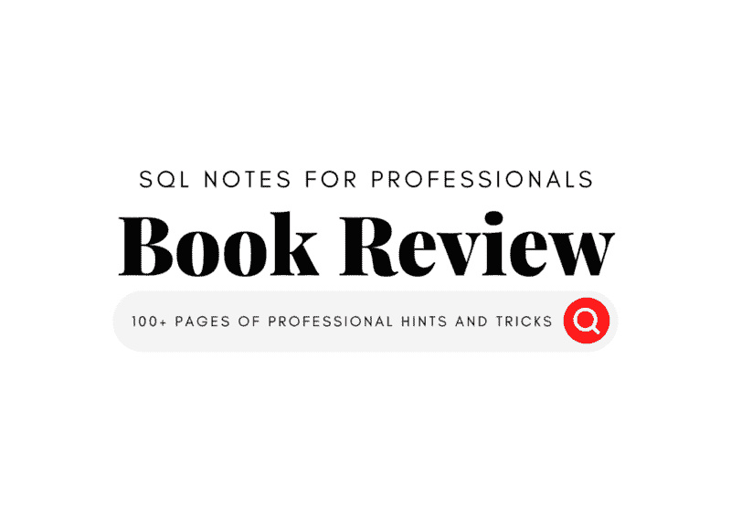
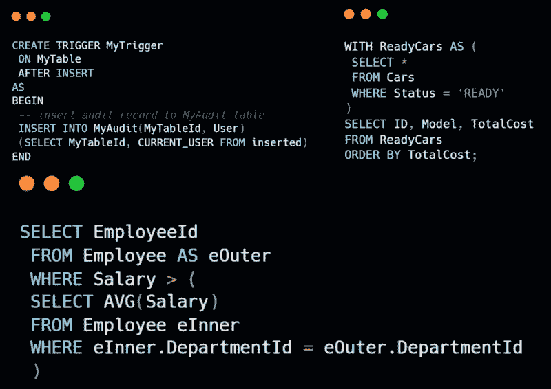

# SQL 专业笔记：免费电子书评论

> 原文：[`www.kdnuggets.com/2022/05/sql-notes-professionals-free-ebook-review.html`](https://www.kdnuggets.com/2022/05/sql-notes-professionals-free-ebook-review.html)



图片来源于作者

SQL 专业笔记 [书籍](https://goalkicker.com/SQLBook) 是基于 [Stack Overflow 文档数据转储](https://archive.org/details/documentation-dump.7z) 编纂的。这是由 [GoalKicker](https://goalkicker.com/) 创建的非官方免费书籍，旨在教育目的。简而言之，内容是 Stack Overflow 上各种人的集合。结构化查询语言（SQL）是一种用于管理关系型数据库的编程语言。你可以根据需要创建、修改和优化数据库表。核心数据库修改操作包括 INSERT、SELECT、MERGE、UPDATE 和 DELETE。

SQL 是信息技术各个领域中使用最广泛的语言。即使是网页开发者也会说，他们 80%的时间在存储数据和获取信息。我们的世界围绕数据驱动的产品展开，管理这些数据已经成为一个相当有利可图的职业。即使你申请的是机器学习工程师，技术面试中也会包含几个与 SQL 相关的问题。为了在职业生涯中脱颖而出并通过招聘过程中的技术面试，复习所有概念是必要的。**免费的 SQL 书籍**帮助你复习所有数据库管理相关的主题，并引入可以优化你当前流程的新概念。

# 主要特征

本书涵盖了 SQL 查询语言使用的所有概念，如数据类型、排序、分组、Like、case 运算符、in 子句、条件操作、连接和更新。就像我一样，你会对那些用于维护数据库和运行高效 SQL 查询的未知术语感到惊讶。

在这一部分，我们将讨论这本书为何特别以及如何利用这些特性提升你的 SQL 知识。

**首先，**每个 SQL 概念都附有实际示例，你可以运行查询进行练习或仅观察输出。SQL 查询是一个 **IIF** 函数，用于创建一个新列，包含类别 **Bonus** 和 **No Bonus**。

每一部分都有一个问答。并且有详细的输出解释和查询如何执行的说明。

```py
SELECT BusinessEntityID, SalesYTD,
IIF(SalesYTD > 200000, 'Bonus', 'No Bonus') AS 'Bonus?'
FROM Sales.SalesPerson
GO
```

| **BusinessEntityID** | **SalesYTD** | **奖金？** |
| --- | --- | --- |
| 274  | 559697.5639 | 奖金 |
| 275 | 3763178.1787 | 奖金 |
| 285  | 172524.4512 | 无奖金 |

**其次，**本书从简单的概念开始，如数据类型和 SELECT 关键字。随着每一部分的增加，复杂性逐渐提高。

**第三**，这本书深入覆盖了所有概念。例如，在**SELECT**章节中，子主题包括使用列别名的 SELECT、带有条件和情况的选择以及带有聚合函数的选择。这本书从各个角度详细讲解了 SELECT，然后再进入其他章节。



作者提供的图片

**第四**，这本书是 SQL 备忘单。就像备忘单一样，这本书对每个函数都有明确的描述和代码。这种学习方式帮助专业人士为演讲或面试做准备。

**第五**，这本书包含了一个高质量的图表，解释了复杂的概念。

**第六**，长 SQL 脚本附带*注释*，解释了子查询。这些注释帮助开发人员理解为什么使用了嵌套查询。

**最后**，这本书是免费的，内容质量很高。你可以找到一页的备忘单或在网上搜索特定的术语，但你不会在一个地方找到所有的 SQL 函数，并将其汇编成一本书。

# 结论

在书的最后，你可以看到所有对本书作出贡献的人的名字。这本书来自于社区，并且是免费的。在这本书的评论中，我们了解了它与其他书籍的不同之处，并讨论了其关键特性。如果你问我，我肯定会利用这本书为下一次面试做准备，甚至使用其中的一些功能来改善我现有的项目。公司愿意花钱进行数据库优化和减少查询时间。提升你被录用的机会，并提高你在数据工作流管理方面的能力。

**我强烈推荐这本书给数据领域的专业人士和找工作的人。**

+   [下载电子书的免费副本](https://goalkicker.com/SQLBook)

+   [浏览 goalkicker 提供的其他免费书籍](https://goalkicker.com/)

**[Abid Ali Awan](https://www.polywork.com/kingabzpro)** ([@1abidaliawan](https://twitter.com/1abidaliawan)) 是一位认证的数据科学专家，热衷于构建机器学习模型。目前，他专注于内容创作和撰写有关机器学习和数据科学技术的技术博客。Abid 拥有技术管理硕士学位和电信工程学士学位。他的愿景是为面临心理健康问题的学生构建一个基于图神经网络的人工智能产品。

* * *

## 我们的前 3 个课程推荐

 1\. [Google 网络安全证书](https://www.kdnuggets.com/google-cybersecurity) - 快速进入网络安全职业生涯。

 2\. [Google 数据分析专业证书](https://www.kdnuggets.com/google-data-analytics) - 提升你的数据分析能力

 3\. [Google IT 支持专业证书](https://www.kdnuggets.com/google-itsupport) - 支持你的组织的 IT 需求

* * *

### 更多相关话题

+   [KDnuggets 新闻，5 月 11 日：面向专业人士的 SQL 笔记；如何…](https://www.kdnuggets.com/2022/n19.html)

+   [面向经验丰富专业人士的 SQL 面试问题](https://www.kdnuggets.com/2022/01/sql-interview-questions-experienced-professionals.html)

+   [Python 机器学习：电子书评测](https://www.kdnuggets.com/2022/06/python-machine-learning-ebook-review.html)

+   [Burtch Works 2023 数据科学与人工智能专业人员薪资报告…](https://www.kdnuggets.com/2023/08/burtch-works-2023-data-science-ai-professionals-salary-report.html)

+   [机器学习数学：免费电子书](https://www.kdnuggets.com/2020/04/mathematics-machine-learning-book.html)

+   [命令行中的数据科学：免费电子书](https://www.kdnuggets.com/2022/03/data-science-command-line-free-ebook.html)
