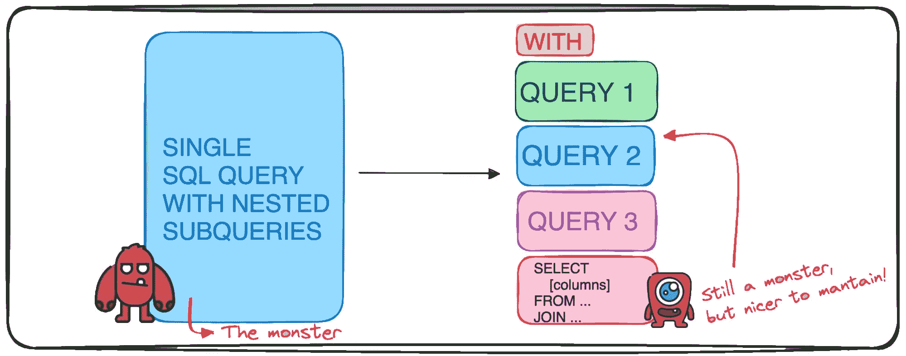
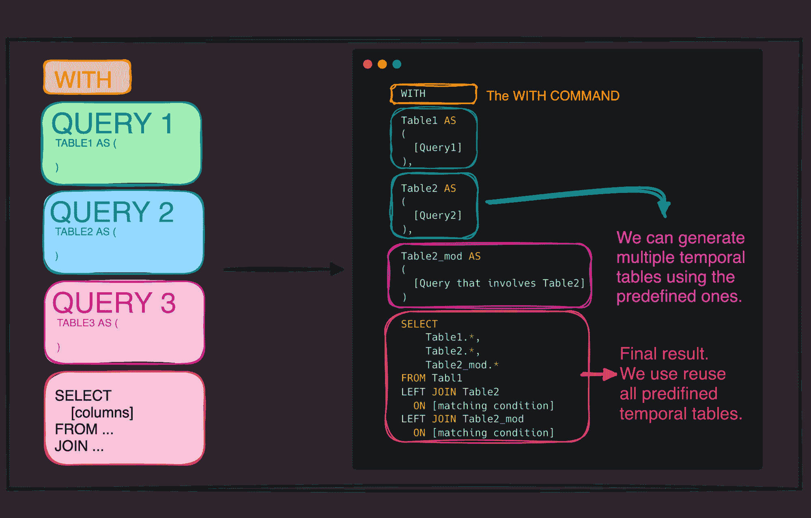
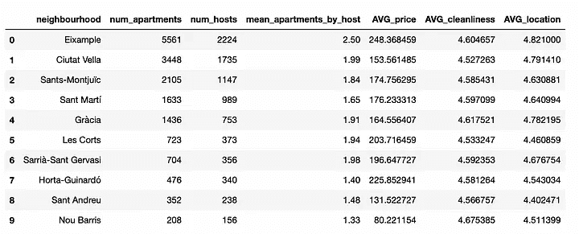
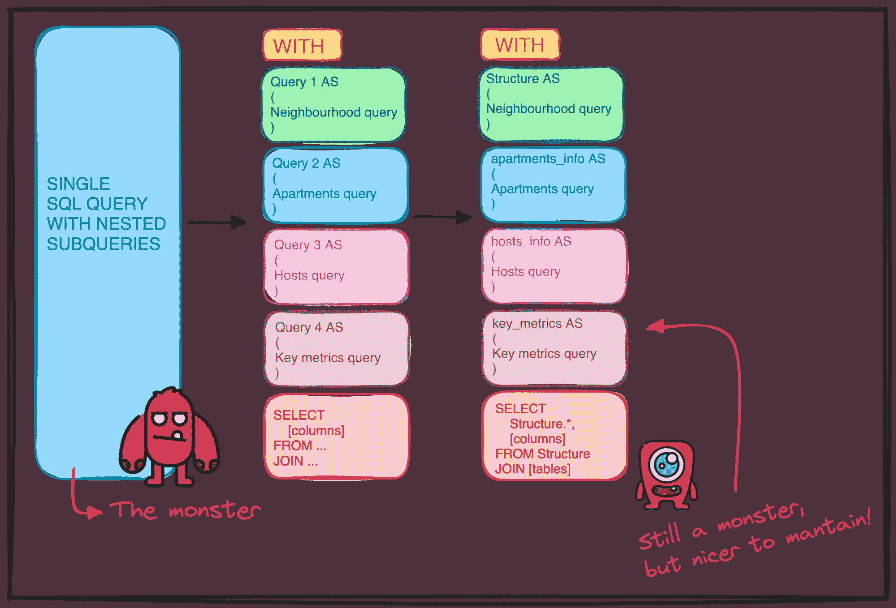

# SQL 简化：使用 CTE 创建模块化和易于理解的查询

> 原文：[`www.kdnuggets.com/sql-simplified-crafting-modular-and-understandable-queries-with-ctes`](https://www.kdnuggets.com/sql-simplified-crafting-modular-and-understandable-queries-with-ctes)

图片由作者提供

在数据的世界里，SQL 仍然是与数据库交互的通用语言。

* * *

## 我们的三大课程推荐

 1\. [谷歌网络安全证书](https://www.kdnuggets.com/google-cybersecurity) - 快速进入网络安全职业轨道

 2\. [谷歌数据分析专业证书](https://www.kdnuggets.com/google-data-analytics) - 提升你的数据分析能力

 3\. [谷歌 IT 支持专业证书](https://www.kdnuggets.com/google-itsupport) - 支持你的组织的 IT

* * *

直到今天，它仍然是处理数据时最常用的语言之一，仍被视为任何优秀数据专业人士的必备技能。

然而，任何处理复杂 SQL 查询的人都知道，它们很快会变成难以读懂、维护或重用的庞然大物。

这就是为什么今天仅仅了解 SQL 不够，我们需要擅长编写查询，而这实际上是一种艺术。

这就是通用表表达式（CTE）发挥作用的地方，将查询编写的艺术转变为更结构化和易于处理的技艺。

让我们一起探讨如何编写可读且可重用的查询。

# 1\. CTE 的基础知识

如果你想知道什么是 CTE，你来对地方了。

> 通用表表达式（CTE）是一个临时结果集，它在单个 SQL 语句的执行范围内定义。

它们是可以在单个查询中多次引用的临时表，通常用于简化复杂的联接和子查询，最终目的是提高 SQL 代码的可读性和组织性。

因此，它们是将复杂查询分解为简单部分的强大工具。

这是你应该考虑使用 CTE 的原因：

+   **模块化：** 你可以将复杂的逻辑分解为可读的块。

+   **可读性：** 使理解 SQL 查询的流程变得更容易。

+   **重用性：** CTE 可以在单个查询中多次引用，避免重复。

# 2\. 使用 WITH 子句生成模块化查询

魔法始于 WITH 子句，它在主查询之前定义了不同的临时表（CTE）及其别名。

因此，我们总是需要从“WITH”命令开始我们的查询，以开始定义我们自己的 CTE。通过使用 CTE，我们可以将任何复杂的 SQL 查询拆分为：

- 计算相关变量的小型临时表。

- 一个最终的表格，只包含我们想要作为输出的变量。

这正是我们希望在任何代码中实现的模块化方法！

作者提供的图像

因此，使用 CTE 在我们的查询中允许我们：

- 执行一次时间表并多次引用它。

- 提高可读性，简化复杂逻辑。

- 促进代码的可重用性和模块化设计。

# 3\. 案例研究 - 分析 Airbnb 数据

为了更好地理解这一点，我们可以以巴塞罗那的 Airbnb 房源为实际例子。

想象一下，我们想要分析按社区划分的房源表现，并将其与城市整体表现进行比较。你需要汇总关于社区、单个公寓、房东和定价的信息。

为了说明这一点，我们将使用[InsideAirbnb](http://insideairbnb.com/barcelona) 巴塞罗那的数据表，其结构如下：

一种天真的方法可能会导致你创建嵌套的子查询，这些子查询很快变成维护的噩梦，如下所示：

作者提供的代码

相反，我们可以利用 CTE 将查询分解为逻辑部分——每部分定义一个拼图块。

+   **社区数据：** 创建一个 CTE 以按社区汇总数据。

+   **公寓和房东信息：** 定义 CTE 以获取关于公寓和房东的详细信息。

+   **城市级指标：** 另一个 CTE 用于收集城市级别的统计数据以进行比较。

+   **最终汇总：** 在最终的 SELECT 语句中组合 CTE 以连贯地展示数据。

作者提供的图像

最终我们将得到以下查询：

作者提供的代码

# 4\. 模块化方法的优势

通过使用 CTE，我们将一个潜在的庞大单一查询转变为一个有组织的数据模块集。这种模块化的方法使 SQL 代码更具直观性，并且更适应变化。

如果有新的需求出现，你可以调整或添加 CTE，而无需彻底改造整个查询。

# 5\. 复用 CTE 进行比较分析

一旦你建立了 CTE，你可以重用它们来进行比较分析。例如，如果你想将社区数据与城市级指标进行比较，你可以在一系列 JOIN 操作中引用你的 CTE。

这不仅节省时间，而且使你的代码更加高效，因为你不需要重复相同的查询！

# 最后的思考

CTE 证明了一个结构化的方法在编程中有多么重要。通过采用 CTE，你可以编写更清晰、可维护和可重用的 SQL 查询。

这简化了查询开发过程，并使得与他人沟通复杂的数据检索逻辑变得更加容易。

记住，下次你要开始编写一个多连接、嵌套子查询的复杂查询时，可以考虑使用 CTE 来分解它。

你未来的自己——以及可能阅读你代码的任何人——都会感谢你。

****[Josep Ferrer](https://www.linkedin.com/in/josep-ferrer-sanchez)**** 是一位来自巴塞罗那的分析工程师。他毕业于物理工程专业，目前在应用于人类移动性的领域从事数据科学工作。他还是一名兼职内容创作者，专注于数据科学和技术。Josep 涉猎人工智能的各个方面，涵盖了这一领域持续爆炸性的应用。

### 更多相关主题

+   [弹性机器学习栈是模块化的](https://www.kdnuggets.com/2022/06/comet-resilient-ml-stack-modular.html)

+   [欧洲人工智能法案：简化版解读](https://www.kdnuggets.com/2022/06/european-ai-act-simplified-breakdown.html)

+   [超越天网：打造人工智能进化的下一前沿](https://www.kdnuggets.com/beyond-skynet-crafting-the-next-frontier-in-ai-evolution)

+   [逐步指南：阅读和理解 SQL 查询](https://www.kdnuggets.com/a-step-by-step-guide-to-reading-and-understanding-sql-queries)

+   [4 个有用的中级 SQL 查询用于数据科学](https://www.kdnuggets.com/2022/12/4-useful-intermediate-sql-queries-data-science.html)

+   [5 个棘手的 SQL 查询解决方案](https://www.kdnuggets.com/2020/11/5-tricky-sql-queries-solved.html)
