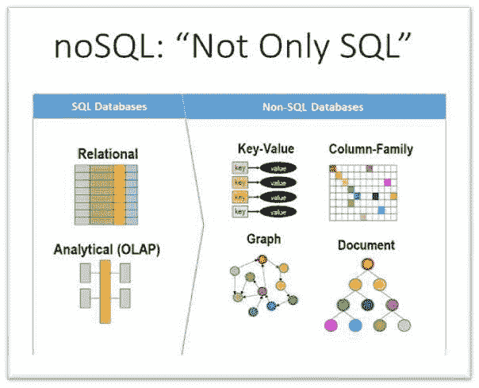
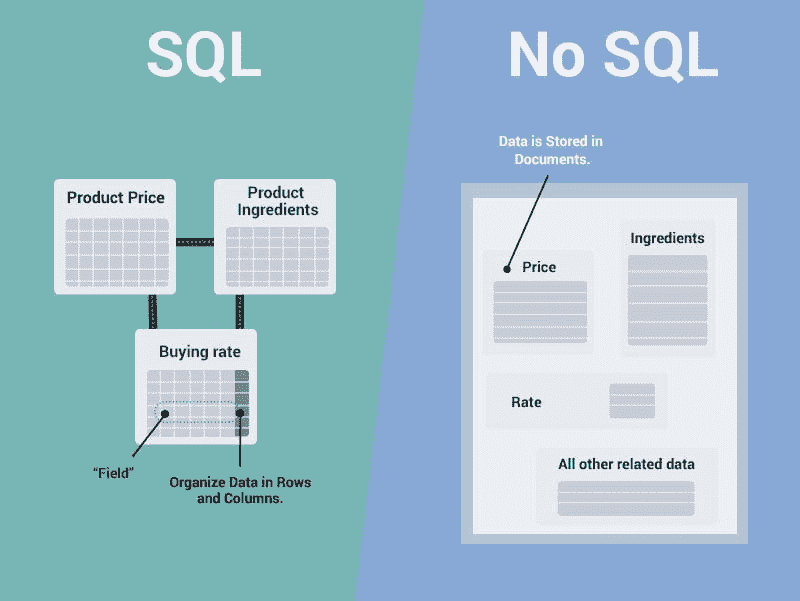
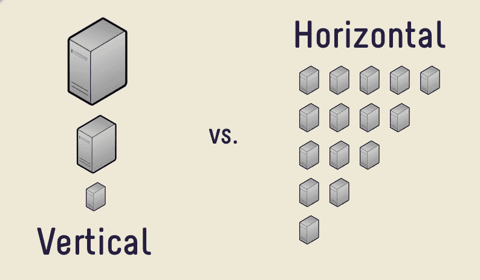

# SQL 与 NoSQL：7 个关键要点

> 原文：[`www.kdnuggets.com/2020/12/sql-vs-nosql-7-key-takeaways.html`](https://www.kdnuggets.com/2020/12/sql-vs-nosql-7-key-takeaways.html)

开发者非常清楚继续教育的重要性。无论是学习新框架还是新服务，创新和适应都是开发的基本要素。今天最热门的话题之一是决定选择标准的 SQL 数据库还是转向 [NoSQL 数据库](https://hostingdata.co.uk/nosql-database/)。

NoSQL 数据库已经存在了几十年，这要归功于 Carlo Strozzi 的创新。然而，直到 2000 年代初，这些数据库才开始受到关注。此时，像 Google 和 Amazon 这样的公司开始加大对 NoSQL 数据库的开发投入。尽管它们最近很受欢迎，但许多开发者、架构师和设计师可能对 NoSQL 数据库提供的功能还不够了解。

因此，关于这两种数据库之间差异的详细信息，请查看每个开发者都应了解的 7 个关键要点。

# 1\. 结构化查询语言的使用

SQL 数据库因其使用 SQL 语言而被分类。任何可以通过 SQL 进行交互的数据库都是 SQL 数据库。作为一种强大且被广泛使用的语言，它被用于众多数据库，如 Microsoft SQL Server、MySQL、PostgreSQL 等。查询语言允许用户编写复杂的查询，从多个表中提取数据等等。这种通用性使其成为任何需要可靠性的人的安全选择。

另一方面，尽管分类相当广泛，但不使用 SQL 的数据库是 NoSQL 数据库。正如我们很快将看到的那样，NoSQL 数据库的交互方式可能因模式设计的不同而大相径庭。

# 2\. 关系型与非关系型

两种数据库的其他常见名称是关系型和非关系型数据库。

SQL 或关系型数据库以预定义的模型存储数据，这使得它们使用起来简单且可靠。这种模型允许数据高效地插入、更新和提取。此外，独特的标识符—键，可以将不同的数据集关联起来。简而言之，关系型数据库对所有人都容易理解。

相反，非关系型数据库，即 NoSQL 数据库，在数据存储方面要灵活得多。虽然这可能看起来很方便，但经验丰富的开发者会理解其潜在的影响。随着时间的推移，随着数据越来越多地存储在非关系型数据库中，保持数据整洁可能会变得困难，因为没有标准模型可供遵循。

# 3\. 预定义模式与动态模式

从关系型和非关系型数据库的角度来看，这两种风格的数据存储差异非常明显。

[SQL 数据库利用模式](https://insidebigdata.com/2020/11/28/do-nosql-databases-need-schemas/)和表格，这些都是预定义的，并且对所有用户易于访问。你有你的主键、字段和值。从这里开始，你可以创建任意数量的表。你可以在表格中插入副键，并在几个表之间创建复杂的关系。这种数据存储方式使得快速分析大量数据变得简单和快捷。

另一方面，非关系型数据库允许你创建具有动态模式的数据库。你不需要提前创建数据库模型。随着数据库的扩展，你可以无缝地添加新的模型和混合数据类型。

# 4\. 基于表格与基于字段

SQL 数据库使用表格，而 NoSQL 数据库则使用几乎任何其他形式。基于表格的方法与严格的模式相辅相成。你可以根据项目需要创建任意数量的表，并将它们相互关联。因此，你完全知道当需要检查尚未看到的数据时，一个表格会是什么样的。

在这方面，NoSQL 数据库相当模糊，因为它们的数据结构是流动的。NoSQL 数据库没有一个确切的基础。一些流行的 NoSQL 数据库使用[图形存储](https://www.infoworld.com/article/3263764/what-is-a-graph-database-a-better-way-to-store-connected-data.html)、[键值对](https://www.mongodb.com/key-value-database)、[宽列存储](https://blog.logrocket.com/nosql-wide-column-stores-demystified/)或[文档导向存储](https://blog.smartcat.io/2016/intro-to-document-oriented-nosql-databases/)。使用 NoSQL 数据库的优势在于你有无限的灵活性。你可以选择任何你想要的数据库引擎。

# 5\. 垂直扩展与水平扩展

NoSQL 数据库受欢迎的主要原因之一是它们的水平可扩展性。SQL 数据库需要垂直扩展——你必须增加更多的处理能力以提高性能和容量。从理论上讲，SQL 数据库有一个上限，当无法进行更多的硬件改进时，这个上限可能会被达到。这可能导致长时间的停机和调整模型时的更高费用。

你不再需要投资更昂贵的组件和高端 CPU 来支持 SQL 数据库的扩展。当你使用非关系型数据库时，你只需增加更多的机器即可。此外，水平扩展本质上提供了冗余，因为你有多台机器，而不是一个故障点。

# 6\. 使用案例

如果你对项目和需要存储的数据有一个清晰的了解，那么在 SQL 和 NoSQL 数据库之间的选择就是直接的。

当你的数据看起来本质上是相对的时，使用 SQL 数据库。它们可靠，通过 SQL 轻松访问，并且是经过验证的数据存储。

另一方面，如果你的数据具有灵活性且没有固定的关系，可以尝试使用 NoSQL 数据库。你可以从多个流行的提供商中进行选择。你会发现能够随时定义新的模式非常具有吸引力。此外，如果你担心未来的扩展性，NoSQL 数据库非常适合你。

# 7\. 支持或缺乏支持

最后一个要点是关于两种类型数据库的支持。SQL 数据库是巨头——它们在全球范围内有大量用户。它们已经建立良好，并且配有详尽的文档。如果你遇到 SQL 数据库的问题，你将获得大量帮助。此外，还有许多操作指南和 SQL 备忘单来帮助新手。

尽管 NoSQL 数据库已经获得了追随者和流行度，但与 SQL 数据库相比，它们仍然缺乏相同的支持。你可能会发现难以找到优质的教育材料、支持文档等。

简而言之，如果你知道你的数据是什么样的，以及你的数据库未来的发展趋势，那么选择一种数据库类型是很简单的。SQL 数据库提供经过验证的结果、强大的查询语言和一致性。NoSQL 数据库是创新的、适应性强的、强大的数据库，将随着时间的推移不断发展。

**[亚历克斯·威廉姆斯](https://hostingdata.co.uk/author/alex-williams/)** 是一位经验丰富的全栈开发人员，也是 [Hosting Data UK](https://hostingdata.co.uk/) 的所有者。在伦敦大学获得 IT 学位后，亚历克斯在过去近 10 年里作为开发人员领导了来自全球的多个项目。最近，亚历克斯转型成为独立 IT 顾问，并开设了自己的博客。在博客中，他探讨了网页开发、数据管理、数字营销以及为刚起步的在线企业主提供解决方案。

* * *

## 我们的前 3 个课程推荐

 1\. [谷歌网络安全证书](https://www.kdnuggets.com/google-cybersecurity) - 快速开启网络安全职业生涯

 2\. [谷歌数据分析专业证书](https://www.kdnuggets.com/google-data-analytics) - 提升你的数据分析能力

 3\. [谷歌 IT 支持专业证书](https://www.kdnuggets.com/google-itsupport) - 支持你的 IT 组织

* * *

### 更多相关内容

+   [BigData 伦敦大会与展览的关键要点](https://www.kdnuggets.com/2022/10/key-takeaways-bigdata-london-conference-exhibition.html)

+   [NoSQL 数据库及其应用场景](https://www.kdnuggets.com/2023/03/nosql-databases-cases.html)

+   [数据库关键术语解析](https://www.kdnuggets.com/2016/07/database-key-terms-explained.html)

+   [描述性统计学关键术语解释](https://www.kdnuggets.com/2017/05/descriptive-statistics-key-terms-explained.html)

+   [键值数据库解释](https://www.kdnuggets.com/2021/04/nosql-explained-understanding-key-value-databases.html)

+   [人工智能、分析、机器学习、数据科学、深度学习……](https://www.kdnuggets.com/2021/12/developments-predictions-ai-machine-learning-data-science-research.html)
