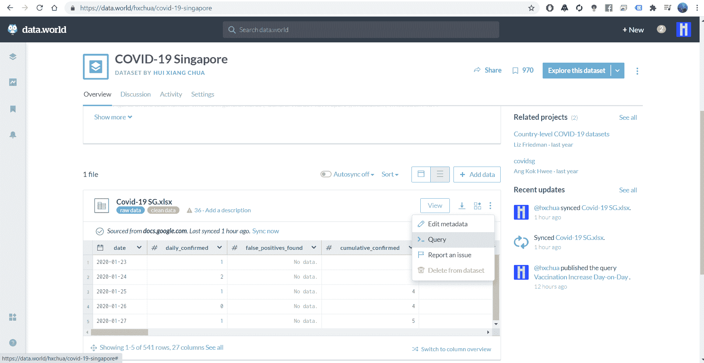
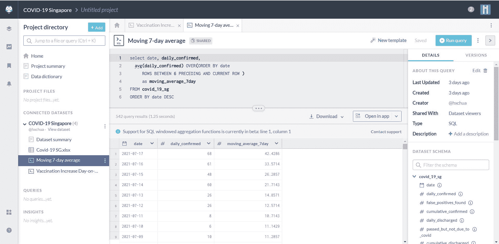
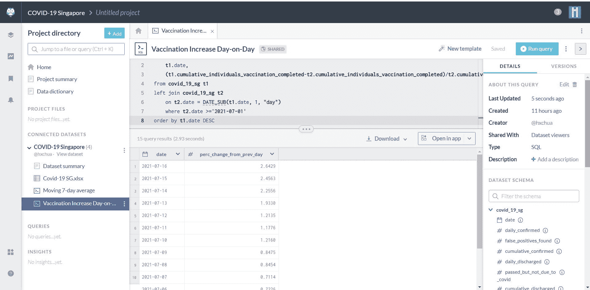

# 在没有自己数据库的情况下练习 SQL

> 原文：[`www.kdnuggets.com/2021/08/sql-without-own-database.html`](https://www.kdnuggets.com/2021/08/sql-without-own-database.html)

评论

**由 [Hui XiangChua](https://www.linkedin.com/in/hui-xiang-chua/), 数据科学家**。

许多组织将数据存储在数据库中，SQL 是一种常用的查询语言，用于从这些数据库中提取数据。实际上，许多大型组织如 Facebook 和 Amazon 已将 SQL 作为其技术技能测试的一部分。这是因为在进行任何必要的数据分析之前，能够整理出相关数据是非常重要的。

实践 SQL 的一个挑战是我们需要数据库，而这正是我们通常没有的。然而，[data.world](https://data.world/) 允许我们在没有自己数据库的情况下做到这一点。我们可以直接在 data.world 上对公开的数据集执行 SQL 查询。创建 data.world 账户是免费的，而且你在执行 SQL 查询时不会产生任何费用！

对于不熟悉的人，data.world 是一个提供大量涉及不同领域和行业的开放数据的平台（你也可以上传自己的数据集）。他们的使命是：

+   在全球范围内建立最有意义、最具协作性和最丰富的数据资源，以最大限度地发挥数据在解决社会问题中的效用；

+   公开倡导改善开放数据和关联数据的采纳、可用性和普及；

+   作为全球数据的可访问历史存储库。

在这里，我用一个关于新加坡 Covid-19 趋势的 [数据集](https://data.world/hxchua/covid-19-singapore) 举例说明。查询功能有时隐藏在三个点的下拉菜单中，或者可能会出现在数据集的右上角，标有 *a >_* 符号。

以下 SQL 计算了确认病例数量的 7 天移动平均值，输出按降序排列。查询的链接可以在 [这里](https://data.world/hxchua/covid-19-singapore/workspace/query?queryid=ccf5e890-f95c-4200-ab43-898f1bc6ebb5) 找到。

另一方面，下面的 SQL 计算了每日累计完成疫苗接种的人员百分比增长，输出按降序排列。这需要自联接，即将一个表与自身联接。我使用了 DATE_SUB 函数作为自联接的一部分，从而获取前一天的数据与当天的数据进行比较。点击 DATE_SUB 文字也会返回有关该函数和必要参数的更多信息。查询的链接可以在 [这里](https://data.world/hxchua/covid-19-singapore/workspace/query?queryid=3d605e2f-9f24-4fdd-b5a4-c519ce46e224) 找到。

在 data.world 上还有一个[SQL 教程](https://docs.data.world/documentation/sql/concepts/basic/intro.html)，涵盖基础、中级和高级 SQL 概念。因此，它是一个学习和实践 SQL 的良好开源平台。

另外，如果你在招聘岗位上并探索如何进行 SQL 测试的替代方法，这可能也是一个值得考虑的平台。

**相关：**

+   [数据背景及如何开始理解 COVID-19 数据](https://www.kdnuggets.com/2020/04/data-understanding-covid-19-data.html)

+   [如何获得实际的数据科学经验以为职业做好准备](https://www.kdnuggets.com/2021/07/practical-data-science-experience-career-ready.html)

+   [Pandas 与 SQL：数据科学家应何时使用每种工具](https://www.kdnuggets.com/2021/06/pandas-vs-sql.html)

* * *

## 我们的三大课程推荐

 1\. [谷歌网络安全证书](https://www.kdnuggets.com/google-cybersecurity) - 快速进入网络安全职业轨道

 2\. [谷歌数据分析专业证书](https://www.kdnuggets.com/google-data-analytics) - 提升你的数据分析能力

 3\. [谷歌 IT 支持专业证书](https://www.kdnuggets.com/google-itsupport) - 支持你的组织 IT

* * *

### 更多相关内容

+   [停止学习数据科学以寻找目标，并寻找目标来…](https://www.kdnuggets.com/2021/12/stop-learning-data-science-find-purpose.html)

+   [90 亿美元的 AI 失败，分析](https://www.kdnuggets.com/2021/12/9b-ai-failure-examined.html)

+   [数据科学学习统计的最佳资源](https://www.kdnuggets.com/2021/12/springboard-top-resources-learn-data-science-statistics.html)

+   [成功数据科学家的 5 个特征](https://www.kdnuggets.com/2021/12/5-characteristics-successful-data-scientist.html)

+   [是什么让 Python 成为初创公司的理想编程语言](https://www.kdnuggets.com/2021/12/makes-python-ideal-programming-language-startups.html)

+   [每个数据科学家都应该了解的三个 R 库（即使你使用 Python）](https://www.kdnuggets.com/2021/12/three-r-libraries-every-data-scientist-know-even-python.html)
